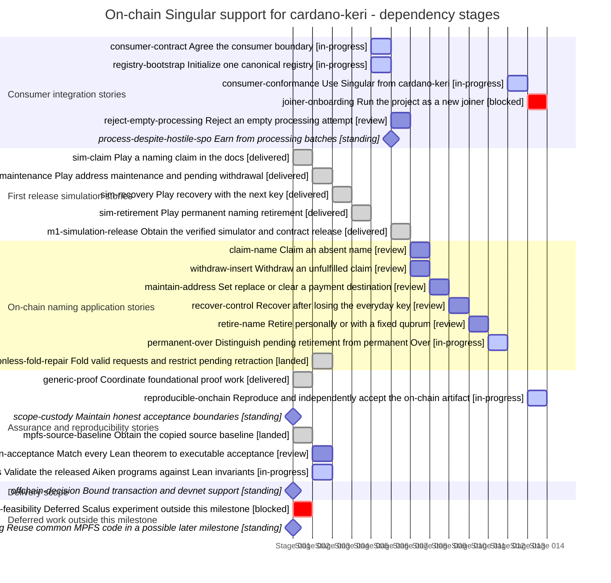

# On-chain Singular support for cardano-keri

Last reconciled: **2026-09-13T05:30:00.000Z**. Team: **RUNNING**. [Milestone](https://github.com/lambdasistemi/singular/milestone/1).

M1 is running and incomplete. The milestone contains 36 GitHub issues: 26 are closed and 10 remain open (#17, #18, #68, #71, #74, #77, #78, #80, #81 and #87). Epics #15 and #16 are closed; #17 and #18 are the final two M1 epics. Grok owns #17 and GPT Sol owns #18. Work stops after both are accepted, with no further epic commissioned. Story states below describe user outcomes, not the open or closed state of every ticket mapped to them.

Users can turn real requests into Active names in the draft ledger demonstration. Claim, withdrawal, maintenance, recovery and authorized retirement-into-custody evidence now exists on intermediate candidates and is under review. A connected ledger journey also reaches permanent Over, observes the completed state and refuses reuse. It is not yet safe to accept: an executed five-test control shows the current state, request, consumer and custody handlers accept a lookalike representative under a foreign policy, allowing Over without burning the authentic representative. E17 is repairing the complete policy, name and quantity binding while preserving legitimate rejected, mixed and zero-net processing.

Cardano-keri registration still needs execution with its real programs, authentic proof token, correct payments and refusal cases. The first authorized three-variant rival-registry run stopped during setup before any target transaction. Offline repairs now bind the configured seed to the production token derivation and retain full signed transaction and UTxO evidence, but two round-trip controls, the rebuilt wrapper identity and a complete frozen command packet remain unfinished. No registry-substitution result or second ledger run is accepted.

The rejected-fold candidate now has a general arbitrary-list two-way correspondence proof, reachable histories for mixed, zero-net and funded-custody cases, and an orphan-custody discriminator killed by erasing its association guard. This is candidate-internal formal evidence under review. It does not yet prove either actual implementation layer, adopt a new accepted model, or settle retirement completion against the repaired E17 producer.

The source inventory checker has passed its bounded review. The 192 baseline obligations still require full invariant and production-built compiled-program acceptance. Final integrated artifacts and new-operator onboarding remain unfinished.

SPO selection is an accepted operating assumption, with existing batch earnings as the incentive. Expanded starvation assessment is outside M1 acceptance. Correct processing, promised payments, refunds and recovery remain required.

> Stories describe outcomes; tickets are delivery containers. The mapping is many-to-many. Unticketed work, decisions and standing obligations are named explicitly. A landed enabler does not mean the product outcome is delivered.

## Delivery map

**Dependency-stage Gantt — not a calendar forecast.** Each equal-width bar occupies one dependency stage; positions are calculated from the prerequisites below. Synthetic dates are rendering coordinates only. Widths are not effort, duration or completion percentages. Standing obligations are checkpoints. Same-stage rows may be independent, but this chart grants no dispatch authority.

Labels report delivery state; only in-progress rows use active colouring.

State key: **landed/delivered** = evidence linked; **review/ready** = not landed; **blocked/decision** = unresolved prerequisite; **planned** = not commissioned; **standing** = continuing obligation.

## Consumer integration stories

| Story | Kind | Tracking | State | Owner |
|---|---|---|---|---|
| [consumer-contract Agree the consumer boundary](#consumer-contract) | enabler | Ticketed — [#15](https://github.com/lambdasistemi/singular/issues/15), [#18](https://github.com/lambdasistemi/singular/issues/18), [#24](https://github.com/lambdasistemi/singular/issues/24), [#70](https://github.com/lambdasistemi/singular/issues/70), [#71](https://github.com/lambdasistemi/singular/issues/71) | in-progress | Epic #18 owner (GPT Sol), coordinated with epic #17 |
| [registry-bootstrap Initialize one canonical registry](#registry-bootstrap) | enabler | Ticketed — [#15](https://github.com/lambdasistemi/singular/issues/15), [#16](https://github.com/lambdasistemi/singular/issues/16), [#24](https://github.com/lambdasistemi/singular/issues/24), [#69](https://github.com/lambdasistemi/singular/issues/69), [#80 registry conformance slice](https://github.com/lambdasistemi/singular/issues/80) | in-progress | Epic #18 owner (GPT Sol); Epic #17 owns implementation repair |
| [consumer-conformance Use Singular from cardano-keri](#consumer-conformance) | outcome | Ticketed — [#16](https://github.com/lambdasistemi/singular/issues/16), [#18](https://github.com/lambdasistemi/singular/issues/18), [#63](https://github.com/lambdasistemi/singular/issues/63), [#68](https://github.com/lambdasistemi/singular/issues/68), [#69](https://github.com/lambdasistemi/singular/issues/69), [#70](https://github.com/lambdasistemi/singular/issues/70), [#71](https://github.com/lambdasistemi/singular/issues/71), [#81](https://github.com/lambdasistemi/singular/issues/81), [#80](https://github.com/lambdasistemi/singular/issues/80) | in-progress | Epic #18 owner (GPT Sol) |
| [joiner-onboarding Run the project as a new joiner](#joiner-onboarding) | enabler | Ticketed — [#78](https://github.com/lambdasistemi/singular/issues/78) | blocked | Epic #18 owner (GPT Sol) |
| [reject-empty-processing Reject an empty processing attempt](#reject-empty-processing) | outcome | Ticketed — [#17 on-chain implementation](https://github.com/lambdasistemi/singular/issues/17), [#18 consumer conformance](https://github.com/lambdasistemi/singular/issues/18) | review | Epic #17 owner (Grok), with epic #18 owner (GPT Sol) verifying conformance |
| [process-despite-hostile-spo Earn from processing batches](#process-despite-hostile-spo) | outcome | Standing obligation | standing | Milestone owner; existing batching and payment requirements in epics #17 and #18 |

### consumer-contract

**As a cardano-keri maintainer, I want an exact Singular on-chain interface and required transaction shapes, so that consumer readiness has an executable shared contract.**

**Tracking:** Ticketed. Preserves the full user outcome across original delivery tickets and subsequent conformance repairs; a merged component does not establish the connected journey. [#15](https://github.com/lambdasistemi/singular/issues/15), [#18](https://github.com/lambdasistemi/singular/issues/18), [#24](https://github.com/lambdasistemi/singular/issues/24), [#70](https://github.com/lambdasistemi/singular/issues/70), [#71](https://github.com/lambdasistemi/singular/issues/71).

**Now — in-progress:** The interface pins the consumer program in registry state and requires it for every nonempty batch, including batches with no net token change. Draft ledger controls show valid claims succeeding and omitted, substituted or changed consumer checks refusing. The corrected incorrect-request control now fails at the actual consumer without budget exhaustion and leaves the registry unchanged. Final shared encodings and script identities remain under integration.

**Acceptance:** Bind script/policy identities, datum and redeemer encodings, inputs/outputs, executing witnesses, generic operations actually required by cardano-keri, and rejection cases to a coordinated versioned consumer contract. Missing details remain named decisions. Epic release obligation: a versioned, installable executable contract/model scenario package with the agreed consumer interface, canonical construction and encoding specifications, positive/negative scenarios, proof and gate evidence and replay instructions. An integrator obtains this release, runs its contract/scenario entry point and observes accepted transaction shapes and rejected substitutions against the frozen interface. Each release has its own version identity, retrieval/install/replay path, CI checks, owner acceptance under the current no-auditor instruction and explicit limits. The successor consumes its exact accepted artifact; packaging is not deferred wholesale to final integration.

**Dependencies:** [sim-retirement: Play permanent naming retirement](#sim-retirement)

**Next:** Preserve these positive and refusal results through integration, then publish the exact encodings and script identities for verification with the real cardano-keri consumer.

**Evidence:** [Accepted v0.2.0 release and downloadable replay package](https://github.com/lambdasistemi/singular/releases/tag/v0.2.0)

### registry-bootstrap

**As an application operator, I want one canonical registry for my application, so that uniqueness has a concrete ledger boundary.**

**Tracking:** Ticketed. Preserves the full canonical-registry outcome across the original delivery tickets and the ongoing #80 conformance slice. Closed component tickets do not establish authentic registry association. [#15](https://github.com/lambdasistemi/singular/issues/15), [#16](https://github.com/lambdasistemi/singular/issues/16), [#24](https://github.com/lambdasistemi/singular/issues/24), [#69](https://github.com/lambdasistemi/singular/issues/69), [#80 registry conformance slice](https://github.com/lambdasistemi/singular/issues/80).

**Now — in-progress:** A name must be tied to its authentic registry. A finite application-script check exposed retirement using another registry that copied the expected representative policy. The first authorized three-variant ledger run completed with three setup failures and no target transaction. Offline repairs now use the production seed-to-token derivation, construct a script-free mintless body, and retain complete signed boot/target plus detailed UTxO evidence. Meaningful signed-transaction and TxOut round-trip loss controls, the changed-source Nix rebind, and a fresh frozen command packet remain unfinished. These results still establish neither acceptance nor refusal of registry substitution.

**Acceptance:** Executable evidence establishes canonical bootstrap and one initialization, not merely deterministic policy identity; script bindings, authentic root and representative NFT custody are specified and later implemented.

**Dependencies:** [sim-retirement: Play permanent naming retirement](#sim-retirement)

**Next:** Finish and review the signed-transaction, TxOut and actual boot-input controls; rebuild and bind the exact offline executable and command. Only then decide whether to release one further rival-registry ledger run, demonstrate the real outcome, and verify the final implementation rejects substitution.

**Evidence:** [Accepted v0.2.0 release and downloadable replay package](https://github.com/lambdasistemi/singular/releases/tag/v0.2.0)

### consumer-conformance

**As a cardano-keri maintainer, I want implemented on-chain policies and contracts matching the agreed consumer boundary, so that my application can rely on Singular.**

**Tracking:** Ticketed. Preserves the full user outcome across original delivery tickets and subsequent conformance repairs; a merged component does not establish the connected journey. [#16](https://github.com/lambdasistemi/singular/issues/16), [#18](https://github.com/lambdasistemi/singular/issues/18), [#63](https://github.com/lambdasistemi/singular/issues/63), [#68](https://github.com/lambdasistemi/singular/issues/68), [#69](https://github.com/lambdasistemi/singular/issues/69), [#70](https://github.com/lambdasistemi/singular/issues/70), [#71](https://github.com/lambdasistemi/singular/issues/71), [#81](https://github.com/lambdasistemi/singular/issues/81), [#80](https://github.com/lambdasistemi/singular/issues/80).

**Now — in-progress:** The producer permits the agreed checkpoint funding and refunds, and its draft naming consumer no longer appoints a privileged processor. Real cardano-keri registration remains unfinished: authentic proof-token acquisition and burn must execute with the correct lifecycle and checkpoint programs, payments and refusals. The rejected-fold candidate now has general two-way correspondence plus reachable mixed, zero-net and funded-custody histories and an orphan-custody kill control. That proof is candidate-internal and does not yet cover the two actual implementation layers. E17's current completion also accepts a foreign-policy lookalike representative; retirement correspondence and final producer binding remain open until the complete asset identity is repaired. Checkpoint-removal receipts, dormant revival and conviction remain required.

**Acceptance:** Reproducible compiled on-chain evidence exercises the exact agreed consumer transaction shapes and attributable negative controls; an independent review confirms compatibility. A naming demo or model simulation alone is insufficient.

**Dependencies:** [consumer-contract: Agree the consumer boundary](#consumer-contract); [registry-bootstrap: Initialize one canonical registry](#registry-bootstrap); [permanent-over: Distinguish pending retirement from permanent Over](#permanent-over)

**Next:** Finish the offline rival evidence packet and production-proof tranche while E17 repairs authentic retirement. Then execute real registration with the final E17 tuple, verify successful processing and refusals for missing checks, invalid evidence and incorrect payments, and complete the remaining receipt, revival and conviction requirements.

**Evidence:** [Merged PR #64](https://github.com/lambdasistemi/singular/pull/64), [Merged PR #72](https://github.com/lambdasistemi/singular/pull/72), [Merged PR #75](https://github.com/lambdasistemi/singular/pull/75), [Merged Fork investigation instruments; absence repair remains open](https://github.com/lambdasistemi/singular/pull/82), [Merged PR88: bounded consumer execution/reporting; full conformance still open](https://github.com/lambdasistemi/singular/pull/88), [Merged PR89: corrected correspondence dispositions](https://github.com/lambdasistemi/singular/pull/89)

### joiner-onboarding

**As a new project contributor, I want to obtain the release and follow a working node and wallet runbook, so that joining requires reproducible commands and functioning journeys.**

**Tracking:** Ticketed. Required M1 outcome; remains open until the stated acceptance evidence exists. [#78](https://github.com/lambdasistemi/singular/issues/78).

**Now — blocked:** Blocker: connected lifecycle and consumer acceptance remain unfinished. External-node mode and onboarding are planned; no preprod deployment is claimed.

**Acceptance:** A joiner obtains the exact artifact and follows documented transaction, wallet and node instructions through the real required journey; any public-network use follows explicit operational scope.

**Dependencies:** [consumer-conformance: Use Singular from cardano-keri](#consumer-conformance); [lean-acceptance: Match every Lean theorem to executable acceptance](#lean-acceptance)

**Next:** Prepare and verify the runbook after the conformance and lifecycle prerequisites.

**Evidence:** No completion evidence claimed.

### reject-empty-processing

**As an application user, I want empty processing attempts rejected, so that success requires processing at least one request.**

**Tracking:** Ticketed. Approved by the stakeholder on 2026-09-12; tracked through the existing epics and CG11. [#17 on-chain implementation](https://github.com/lambdasistemi/singular/issues/17), [#18 consumer conformance](https://github.com/lambdasistemi/singular/issues/18).

**Now — review:** The current producer candidate rejects zero consumed requests and leftover declared actions. The formal candidate now provides a general two-way correspondence proof plus reachable mixed, zero-net and funded-custody histories, rather than relying on the earlier hand-seeded fixtures. The exact empty refusal and legitimate nonempty cases remain under review because agreement with both actual implementation layers and final compiled behavior is still open.

**Acceptance:** Given a valid registry, when a fold processes no requests, it is refused and the registry remains unchanged. Valid nonempty processing still works, including a legitimate zero token net. Verify the revised Lean statement, both implementation layers, and compiled behavior with discriminating controls.

**Dependencies:** [consumer-contract: Agree the consumer boundary](#consumer-contract)

**Next:** Verify empty and unmatched-action refusals alongside legitimate all-rejected, mixed and zero-net cases at both actual implementation layers and on the final production-built programs, preserving the formal candidate's general proof and reachable histories.

**Evidence:** No completion evidence claimed.

### process-despite-hostile-spo

**As an SPO, I want earn from processing useful batches, so that processing requests has an economic incentive.**

**Tracking:** Standing obligation. Stakeholder accepted the SPO selection assumption. Expanded starvation and takeover verification is outside M1 acceptance.

**Now — standing:** SPOs retain selection and inclusion power. The stakeholder accepts reliance on existing batch earnings as an incentive; fairness and eventual inclusion are not claimed. The expanded starvation assessment is no longer required for M1. Existing timing, payment, refund and recovery correctness still apply.

**Acceptance:** Preserve the existing batch payment requirements and the accepted selection assumption. Expanded starvation assessment and universal profitability are not M1 acceptance criteria.

**Dependencies:** [consumer-contract: Agree the consumer boundary](#consumer-contract)

**Next:** Focus delivery on correct processing, authentic registry association and promised payments; preserve any diagnostic evidence without expanding the starvation campaign.

**Evidence:** No completion evidence claimed.

## First release simulation stories

| Story | Kind | Tracking | State | Owner |
|---|---|---|---|---|
| [sim-claim Play a naming claim in the docs](#sim-claim) | product | Ticketed — [#15](https://github.com/lambdasistemi/singular/issues/15), [#20](https://github.com/lambdasistemi/singular/issues/20), [PR #27](https://github.com/lambdasistemi/singular/pull/27) | delivered | Epic #15 owner; accepted by milestone owner |
| [sim-maintenance Play address maintenance and pending withdrawal](#sim-maintenance) | product | Ticketed — [#15](https://github.com/lambdasistemi/singular/issues/15), [#21](https://github.com/lambdasistemi/singular/issues/21) | delivered | Epic #15 owner; accepted by milestone owner |
| [sim-recovery Play recovery with the next key](#sim-recovery) | product | Ticketed — [#15](https://github.com/lambdasistemi/singular/issues/15), [#22](https://github.com/lambdasistemi/singular/issues/22) | delivered | Epic #15 owner; accepted by milestone owner |
| [sim-retirement Play permanent naming retirement](#sim-retirement) | product | Ticketed — [#15](https://github.com/lambdasistemi/singular/issues/15), [#23](https://github.com/lambdasistemi/singular/issues/23) | delivered | Epic #15 owner; accepted by milestone owner |
| [m1-simulation-release Obtain the verified simulator and contract release](#m1-simulation-release) | product | Ticketed — [#15](https://github.com/lambdasistemi/singular/issues/15), [#25](https://github.com/lambdasistemi/singular/issues/25) | delivered | Epic #15 owner; accepted by milestone owner |

### sim-claim

**As a Singular developer or reviewer, I want to submit and fold a naming claim, so that the first release has an observable, reproducible result.**

**Tracking:** Ticketed. Delivered and verified in the accepted v0.2.0 design/simulator release. [#15](https://github.com/lambdasistemi/singular/issues/15), [#20](https://github.com/lambdasistemi/singular/issues/20), [PR #27](https://github.com/lambdasistemi/singular/pull/27).

**Now — delivered:** Delivered in v0.2.0. The released simulator and artifact-only replay cover this journey and its refusal cases; 44 lifecycle cases execute. This is design evidence, not compiled naming-ledger acceptance.

**Acceptance:** Show pending versus registered state, claim uniqueness at fold and duplicate refusal. Enforce naming Delete/reuse refusal in transitions. Distinguish the generic simulator. Publish a candidate-bound docs preview.

**Dependencies:** No prerequisite story recorded; this is not dispatch authority.

**Next:** Preserve this journey when successor epics extend the implementation.

**Evidence:** [Accepted v0.2.0 release and downloadable replay package](https://github.com/lambdasistemi/singular/releases/tag/v0.2.0), [Play the released naming lifecycle](https://lambdasistemi.github.io/singular/simulator/lifecycle-view.html)

### sim-maintenance

**As a Singular developer or reviewer, I want to change a payment destination and withdraw an unfulfilled claim, so that the first release has an observable, reproducible result.**

**Tracking:** Ticketed. Delivered and verified in the accepted v0.2.0 design/simulator release. [#15](https://github.com/lambdasistemi/singular/issues/15), [#21](https://github.com/lambdasistemi/singular/issues/21).

**Now — delivered:** Delivered in v0.2.0. The released simulator and artifact-only replay cover this journey and its refusal cases; 44 lifecycle cases execute. This is design evidence, not compiled naming-ledger acceptance.

**Acceptance:** Set, replace and clear the optional destination without changing control or registry membership. Model exact authorized withdrawal and settled refund rules; reject unauthorized actions.

**Dependencies:** [sim-claim: Play a naming claim in the docs](#sim-claim)

**Next:** Preserve this journey when successor epics extend the implementation.

**Evidence:** [Accepted v0.2.0 release and downloadable replay package](https://github.com/lambdasistemi/singular/releases/tag/v0.2.0), [Play the released naming lifecycle](https://lambdasistemi.github.io/singular/simulator/lifecycle-view.html)

### sim-recovery

**As a Singular developer or reviewer, I want to recover control using the precommitted next address, so that the first release has an observable, reproducible result.**

**Tracking:** Ticketed. Delivered and verified in the accepted v0.2.0 design/simulator release. [#15](https://github.com/lambdasistemi/singular/issues/15), [#22](https://github.com/lambdasistemi/singular/issues/22).

**Now — delivered:** Delivered in v0.2.0. The released simulator and artifact-only replay cover this journey and its refusal cases; 44 lifecycle cases execute. This is design evidence, not compiled naming-ledger acceptance.

**Acceptance:** Require the revealed committed next address and its payment key, preserve the NFT and install a fresh commitment. Reject wrong keys and replay.

**Dependencies:** [sim-maintenance: Play address maintenance and pending withdrawal](#sim-maintenance)

**Next:** Preserve this journey when successor epics extend the implementation.

**Evidence:** [Accepted v0.2.0 release and downloadable replay package](https://github.com/lambdasistemi/singular/releases/tag/v0.2.0), [Play the released naming lifecycle](https://lambdasistemi.github.io/singular/simulator/lifecycle-view.html)

### sim-retirement

**As a Singular developer or reviewer, I want to retire with the current controller or fixed quorum, so that the first release has an observable, reproducible result.**

**Tracking:** Ticketed. Delivered and verified in the accepted v0.2.0 design/simulator release. [#15](https://github.com/lambdasistemi/singular/issues/15), [#23](https://github.com/lambdasistemi/singular/issues/23).

**Now — delivered:** Delivered in v0.2.0. The released simulator and artifact-only replay cover this journey and its refusal cases; 44 lifecycle cases execute. This is design evidence, not compiled naming-ledger acceptance.

**Acceptance:** Show irreversible pending retirement and completed Over. Reject withdrawal, insufficient quorum, quorum redirection and name reuse.

**Dependencies:** [sim-recovery: Play recovery with the next key](#sim-recovery)

**Next:** Preserve this journey when successor epics extend the implementation.

**Evidence:** [Accepted v0.2.0 release and downloadable replay package](https://github.com/lambdasistemi/singular/releases/tag/v0.2.0), [Play the released naming lifecycle](https://lambdasistemi.github.io/singular/simulator/lifecycle-view.html)

### m1-simulation-release

**As a Singular developer or reviewer, I want one retrievable first release containing playable naming and consumer scenarios with frozen model/contracts, so that the first release has an observable, reproducible result.**

**Tracking:** Ticketed. Delivered and verified in the accepted v0.2.0 design/simulator release. [#15](https://github.com/lambdasistemi/singular/issues/15), [#25](https://github.com/lambdasistemi/singular/issues/25).

**Now — delivered:** Delivered in v0.2.0. The released simulator and artifact-only replay cover this journey and its refusal cases; 44 lifecycle cases execute. This is design evidence, not compiled naming-ledger acceptance.

**Acceptance:** Publish the actual naming-specific simulator in docs, with frozen model/contracts, gate evidence, replay instructions, identities and resolved operator play findings. A browser model is not ledger implementation acceptance.

**Dependencies:** [sim-retirement: Play permanent naming retirement](#sim-retirement); [consumer-contract: Agree the consumer boundary](#consumer-contract); [registry-bootstrap: Initialize one canonical registry](#registry-bootstrap); [generic-proof: Coordinate foundational proof work](#generic-proof)

**Next:** Preserve this journey when successor epics extend the implementation.

**Evidence:** [Accepted v0.2.0 release and downloadable replay package](https://github.com/lambdasistemi/singular/releases/tag/v0.2.0), [Play the released naming lifecycle](https://lambdasistemi.github.io/singular/simulator/lifecycle-view.html)

## On-chain naming application stories

| Story | Kind | Tracking | State | Owner |
|---|---|---|---|---|
| [claim-name Claim an absent name](#claim-name) | product | Ticketed — [#16](https://github.com/lambdasistemi/singular/issues/16), [#17](https://github.com/lambdasistemi/singular/issues/17), [#77](https://github.com/lambdasistemi/singular/issues/77), [#79](https://github.com/lambdasistemi/singular/issues/79) | review | Epic #17 owner (Grok) |
| [withdraw-insert Withdraw an unfulfilled claim](#withdraw-insert) | product | Ticketed — [#15](https://github.com/lambdasistemi/singular/issues/15), [#16](https://github.com/lambdasistemi/singular/issues/16), [#17](https://github.com/lambdasistemi/singular/issues/17), [#79](https://github.com/lambdasistemi/singular/issues/79) | review | Epic #17 owner (Grok) |
| [maintain-address Set replace or clear a payment destination](#maintain-address) | product | Ticketed — [#16](https://github.com/lambdasistemi/singular/issues/16), [#17](https://github.com/lambdasistemi/singular/issues/17), [#77](https://github.com/lambdasistemi/singular/issues/77), [#80](https://github.com/lambdasistemi/singular/issues/80) | review | Epic #17 owner (Grok) |
| [recover-control Recover after losing the everyday key](#recover-control) | product | Ticketed — [#15](https://github.com/lambdasistemi/singular/issues/15), [#17](https://github.com/lambdasistemi/singular/issues/17), [#62](https://github.com/lambdasistemi/singular/issues/62), [#77](https://github.com/lambdasistemi/singular/issues/77), [#80](https://github.com/lambdasistemi/singular/issues/80) | review | Epic #17 owner (Grok) |
| [retire-name Retire personally or with a fixed quorum](#retire-name) | product | Ticketed — [#17](https://github.com/lambdasistemi/singular/issues/17), [#66](https://github.com/lambdasistemi/singular/issues/66), [#74](https://github.com/lambdasistemi/singular/issues/74), [#77](https://github.com/lambdasistemi/singular/issues/77), [#79](https://github.com/lambdasistemi/singular/issues/79) | review | Epic #17 owner (Grok) |
| [permanent-over Distinguish pending retirement from permanent Over](#permanent-over) | product | Ticketed — [#17](https://github.com/lambdasistemi/singular/issues/17), [#18](https://github.com/lambdasistemi/singular/issues/18), [#74](https://github.com/lambdasistemi/singular/issues/74), [#77](https://github.com/lambdasistemi/singular/issues/77), [#79](https://github.com/lambdasistemi/singular/issues/79), [#71](https://github.com/lambdasistemi/singular/issues/71) | in-progress | Epic #17 owner (Grok) with epic #18 consumer checks |
| [permissionless-fold-repair Fold valid requests and restrict pending retraction](#permissionless-fold-repair) | enabler | Ticketed — [#79](https://github.com/lambdasistemi/singular/issues/79) | landed | Epic #17 owner (Grok) |

### claim-name

**As a naming test user, I want to claim alice when Insert folds and the name is absent, so that the registry grants one unique representative.**

**Tracking:** Ticketed. Preserves the full user outcome across original delivery tickets and subsequent conformance repairs; a merged component does not establish the connected journey. [#16](https://github.com/lambdasistemi/singular/issues/16), [#17](https://github.com/lambdasistemi/singular/issues/17), [#77](https://github.com/lambdasistemi/singular/issues/77), [#79](https://github.com/lambdasistemi/singular/issues/79).

**Now — review:** Real requests become Active names with their expected representatives in the draft ledger demonstration. Supported base payment-key addresses work in focused consumer checks. The corrected incorrect-request control refuses at the actual consumer while valid claims succeed. The integrated claim, recovery and retirement-into-custody demonstrations are recorded in an intermediate local commit. A separate repair removes stale dependency staging that caused the absent-key proof regression to fail; integration and its required checks remain owed. Final connected claim acceptance remains open.

**Acceptance:** Certified permitted construction, exact initial application checkpoint and representative NFT output, permissionless fold and duplicate rejection are exercised on-chain. Certification attests neither identity nor spelling entitlement nor payment destination ownership. Approval reserves no name. Epic release obligation: a versioned on-chain script/policy and contract bundle with test-only transaction construction and replay support for certified claim, permissionless fold, authenticated application state, authorized unfulfilled Insert withdrawal and optional address set/replace/clear. An integrator obtains this release and runs the bounded claim/maintenance journey: claim an absent name, reject a duplicate, observe the exact NFT/checkpoint, maintain its optional destination and exercise the settled withdrawal/refund behavior. Each release has its own version identity, retrieval/install/replay path, CI checks, owner acceptance under the current no-auditor instruction and explicit limits. The successor consumes its exact accepted artifact; packaging is not deferred wholesale to final integration.

**Dependencies:** [consumer-contract: Agree the consumer boundary](#consumer-contract); [registry-bootstrap: Initialize one canonical registry](#registry-bootstrap); [m1-simulation-release: Obtain the verified simulator and contract release](#m1-simulation-release); [mpfs-source-baseline: Obtain the copied source baseline](#mpfs-source-baseline)

**Next:** Preserve the demonstrated valid claims and precise refusal evidence, integrate the dependency-staging repair at a coherent boundary, and verify the final connected lifecycle.

**Evidence:** No completion evidence claimed.

### withdraw-insert

**As a naming test user, I want an authorized withdrawal of an unfulfilled Insert, so that the settled refund contract is enforced.**

**Tracking:** Ticketed. Preserves the full user outcome across original delivery tickets and subsequent conformance repairs; a merged component does not establish the connected journey. [#15](https://github.com/lambdasistemi/singular/issues/15), [#16](https://github.com/lambdasistemi/singular/issues/16), [#17](https://github.com/lambdasistemi/singular/issues/17), [#79](https://github.com/lambdasistemi/singular/issues/79).

**Now — review:** The cancellation design and model are released, and the #79 validator repair is landed: only an unfulfilled Insert can retract while Update and Delete remain non-withdrawable. Candidate ledger evidence covers the authorized withdrawal/refund route and retirement-withdrawal refusal. Final combined-artifact review remains open.

**Acceptance:** Settle refund recipients, values and fees before implementation; observe authorized withdrawal and rejection of unauthorized withdrawal. Completion-only retirement requests remain non-withdrawable.

**Dependencies:** [consumer-contract: Agree the consumer boundary](#consumer-contract); [m1-simulation-release: Obtain the verified simulator and contract release](#m1-simulation-release)

**Next:** Preserve the accepted Insert withdrawal, Update/Delete refusal and refund evidence through the final E17 artifact and its connected lifecycle review.

**Evidence:** [Accepted v0.2.0 release and downloadable replay package](https://github.com/lambdasistemi/singular/releases/tag/v0.2.0)

### maintain-address

**As a current controller, I want zero or one payment destination in the application checkpoint, so that payment association stays separate from control.**

**Tracking:** Ticketed. Preserves the full user outcome across original delivery tickets and subsequent conformance repairs; a merged component does not establish the connected journey. [#16](https://github.com/lambdasistemi/singular/issues/16), [#17](https://github.com/lambdasistemi/singular/issues/17), [#77](https://github.com/lambdasistemi/singular/issues/77), [#80](https://github.com/lambdasistemi/singular/issues/80).

**Now — review:** The latest integrated draft ledger run confirms maintenance using the recovered controller and refusal of the old controller, alongside recovery and retirement-into-custody results. These are bounded results on an intermediate candidate. Final integrated claim, maintenance and recovery acceptance remains open.

**Acceptance:** Set, replace and clear require current-controller authorization; NFT and recovery fields are preserved; registry is not mutated. A test harness authenticates checkpoint/NFT/registry bindings. No resolver service or wallet product is promised.

**Dependencies:** [claim-name: Claim an absent name](#claim-name)

**Next:** Preserve the successful recovered-key maintenance and old-key refusal when replaying the connected journey on the completed registry revision.

**Evidence:** No completion evidence claimed.

### recover-control

**As a naming test user, I want to reveal the next committed control address and authorize with its payment key, so that I rotate control without the old controller signature.**

**Tracking:** Ticketed. Preserves the full user outcome across original delivery tickets and subsequent conformance repairs; a merged component does not establish the connected journey. [#15](https://github.com/lambdasistemi/singular/issues/15), [#17](https://github.com/lambdasistemi/singular/issues/17), [#62](https://github.com/lambdasistemi/singular/issues/62), [#77](https://github.com/lambdasistemi/singular/issues/77), [#80](https://github.com/lambdasistemi/singular/issues/80).

**Now — review:** The latest draft ledger demonstration connects a real claim to recovery without the old controller signing, observes the successor and consumed old record, and then retires through either the recovered controller or the fixed quorum. Earlier bounded controls confirm recovered-key maintenance and refusal of the old key, replay and invalid evidence. Final integrated lifecycle acceptance remains open.

**Acceptance:** Settle hash and canonical encoding; reveal committed key-controlled address, verify its payment-key authorization, preserve representative NFT and install a fresh next commitment. Wrong key, replay and unauthorized changes fail. Public master xpub plus index is not adopted.

**Dependencies:** [maintain-address: Set replace or clear a payment destination](#maintain-address)

**Next:** Review the complete integrated recovery evidence, preserve both retirement routes and public creation-material retrieval, and complete permanent retirement on the final registry revision.

**Evidence:** [Merged PR #65](https://github.com/lambdasistemi/singular/pull/65)

### retire-name

**As a current controller or fixed retirement quorum, I want permanent retirement authorized by either route, so that a name can cease permanently without takeover power.**

**Tracking:** Ticketed. Preserves the full user outcome across original delivery tickets and subsequent conformance repairs; a merged component does not establish the connected journey. [#17](https://github.com/lambdasistemi/singular/issues/17), [#66](https://github.com/lambdasistemi/singular/issues/66), [#74](https://github.com/lambdasistemi/singular/issues/74), [#77](https://github.com/lambdasistemi/singular/issues/77), [#79](https://github.com/lambdasistemi/singular/issues/79).

**Now — review:** The latest draft ledger demonstration connects claims to recovery and retirement into separate custody through both the recovered controller and fixed quorum. A separate reader checks four retirement units using retained public transaction evidence, deriving the original creation identity and binding the full representative asset and retirement witnesses. Those authorization and pending-custody routes are under review. Permanent completion remains unaccepted because the executing custody path still accepts a same-name token under the wrong policy.

**Acceptance:** Current controller OR fixed-at-registration threshold of public keys authorizes irrevocable representative custody in a completion-only Singular request. Subsequent permissionless fold burns the NFT and marks Over. Insufficient quorum and quorum-only redirection fail. No receiving-script execution is presumed when creating an output. Epic release obligation: a versioned extension of the claim/maintenance on-chain bundle and test-only fixtures covering precommitted control rotation, current-controller OR fixed-quorum permanent retirement, pending custody and completed Over. An integrator starts with a claimed name from the previous release, recovers after losing the everyday key, retires through either authorized route, and observes the permanent refusal of resolution/re-registration after Over. Each release has its own version identity, retrieval/install/replay path, CI checks, owner acceptance under the current no-auditor instruction and explicit limits. The successor consumes its exact accepted artifact; packaging is not deferred wholesale to final integration.

**Dependencies:** [recover-control: Recover after losing the everyday key](#recover-control)

**Next:** Preserve the recovered-controller and quorum custody routes and public creation evidence while completing the associated unsigned registry transition, representative burn, withdrawal refusal and reuse refusal on the final coherent artifact.

**Evidence:** [Merged PR #73](https://github.com/lambdasistemi/singular/pull/73)

### permanent-over

**As a naming test observer, I want authenticated absent active pending and Over states, so that retired names never resolve or become registrable again.**

**Tracking:** Ticketed. Preserves the full user outcome across original delivery tickets and subsequent conformance repairs; a merged component does not establish the connected journey. [#17](https://github.com/lambdasistemi/singular/issues/17), [#18](https://github.com/lambdasistemi/singular/issues/18), [#74](https://github.com/lambdasistemi/singular/issues/74), [#77](https://github.com/lambdasistemi/singular/issues/77), [#79](https://github.com/lambdasistemi/singular/issues/79), [#71](https://github.com/lambdasistemi/singular/issues/71).

**Now — in-progress:** The latest connected ledger journey reaches Over, reads the completed state, consumes custody, burns a representative, refuses withdrawal and reuse, and allows a fresh name. This remains unaccepted. A separate executed control of the current actual handlers proves that a foreign-policy token with the authentic representative name can satisfy completion and move the registry to Over while the authentic representative remains live. Legitimate rejected, mixed and zero-net processing must remain possible while the full policy, name and quantity binding is repaired.

**Acceptance:** Executable on-chain scenarios reject retirement withdrawal, release, reuse, replay and forbidden redirection; distinguish pending custody from completed Over. Naming excludes Delete without removing generic consumer-required behavior. The protocol verifies authorization, not death or inactivity, and cannot stop payment to a separately saved raw address.

**Dependencies:** [retire-name: Retire personally or with a fixed quorum](#retire-name)

**Next:** Bind the custody-held and burned asset's policy, name and quantity to the spent state's configured representative policy. Kill the exact foreign-policy witness, preserve the authentic-policy positive, rerun the affected connected Over journey and retain the pending/completed reads, withdrawal refusal, reuse refusal and fresh-name positive.

**Evidence:** No completion evidence claimed.

### permissionless-fold-repair

**As a registry participant, I want to fold valid requests without any registry-owner authorization and retract only eligible pending Inserts, so that the implementation honors the five Lean fold conditions.**

**Tracking:** Ticketed. #79 closed after the bounded Modify/retraction repair; residual registry ownership is separately outstanding under active epics #17 and #18. [#79](https://github.com/lambdasistemi/singular/issues/79).

**Now — landed:** Landed in PR #85; #79 is closed. The bounded acceptance checks and CI passed, and three mutations of the repaired behavior were rejected. Valid processing no longer needs the registry owner, and only Insert requests can retract. A later real-node control also passed. This landing does not establish that every registry path is ownerless; remaining authority and final integration checks stay required.

**Acceptance:** Valid owner-unsigned Modify succeeds; all other modeled conditions remain enforced; Insert retraction succeeds and Update/Delete retraction refuses; provenance and compiled identities match.

**Dependencies:** [mpfs-source-baseline: Obtain the copied source baseline](#mpfs-source-baseline)

**Next:** Preserve the accepted fold/retraction checks while removing residual registry-owner authority and updating affected interfaces. Complete connected naming and consumer conformance against the repaired schema.

**Evidence:** [Merged PR #85, validator repair](https://github.com/lambdasistemi/singular/pull/85)

## Assurance and reproducibility stories

| Story | Kind | Tracking | State | Owner |
|---|---|---|---|---|
| [generic-proof Coordinate foundational proof work](#generic-proof) | enabler | Ticketed — [#15](https://github.com/lambdasistemi/singular/issues/15), [#10 existing operator-owned foundation](https://github.com/lambdasistemi/singular/issues/10), [#24](https://github.com/lambdasistemi/singular/issues/24) | delivered | paolino, existing operator-owned issue10 |
| [reproducible-onchain Reproduce and independently accept the on-chain artifact](#reproducible-onchain) | outcome | Ticketed — [#18](https://github.com/lambdasistemi/singular/issues/18), [#17](https://github.com/lambdasistemi/singular/issues/17), [#68](https://github.com/lambdasistemi/singular/issues/68), [#70](https://github.com/lambdasistemi/singular/issues/70), [#71](https://github.com/lambdasistemi/singular/issues/71), [#78](https://github.com/lambdasistemi/singular/issues/78), [#80](https://github.com/lambdasistemi/singular/issues/80), [#81](https://github.com/lambdasistemi/singular/issues/81), [#87](https://github.com/lambdasistemi/singular/issues/87) | in-progress | Epic #18 owner (GPT Sol) with epic #17 artifact producer |
| [scope-custody Maintain honest acceptance boundaries](#scope-custody) | operation | Standing obligation | standing | Singular milestone owner |
| [mpfs-source-baseline Obtain the copied source baseline](#mpfs-source-baseline) | enabler | Ticketed — [#16](https://github.com/lambdasistemi/singular/issues/16), [#19](https://github.com/lambdasistemi/singular/issues/19), [#31](https://github.com/lambdasistemi/singular/issues/31), [#34](https://github.com/lambdasistemi/singular/issues/34), [#37](https://github.com/lambdasistemi/singular/issues/37), [#39](https://github.com/lambdasistemi/singular/issues/39), [#41](https://github.com/lambdasistemi/singular/issues/41), [#43](https://github.com/lambdasistemi/singular/issues/43), [#79](https://github.com/lambdasistemi/singular/issues/79) | landed | Epic #16 retired; epic #17 owns local conformance repairs |
| [lean-acceptance Match every Lean theorem to executable acceptance](#lean-acceptance) | enabler | Ticketed — [#80](https://github.com/lambdasistemi/singular/issues/80), [#87](https://github.com/lambdasistemi/singular/issues/87) | review | Epic #18 owner (GPT Sol) |
| [compiled-invariants Validate the released Aiken programs against Lean invariants](#compiled-invariants) | enabler | Ticketed — [#87](https://github.com/lambdasistemi/singular/issues/87), [#80](https://github.com/lambdasistemi/singular/issues/80), [#18](https://github.com/lambdasistemi/singular/issues/18) | in-progress | Epic #18 owner (GPT Sol); epic #17 supplies repaired artifacts; milestone owner reviews gates |

### generic-proof

**As the operator owning existing Lean work, I want existing generic proofs to retain their scope and owner, so that new naming and consumer proof obligations stay distinct.**

**Tracking:** Ticketed. Existing operator-owned #10 remains separate; #24 coordinates concrete scope without taking it over. [#15](https://github.com/lambdasistemi/singular/issues/15), [#10 existing operator-owned foundation](https://github.com/lambdasistemi/singular/issues/10), [#24](https://github.com/lambdasistemi/singular/issues/24).

**Now — delivered:** The preserved generic foundation has 41 exact proved identities in the published pinned replay, separate from the 17 naming, 43 lifecycle and 8 wire identities.

**Acceptance:** Refresh issue10 metadata and coordinate new model/theorem scope explicitly; issue closure and merged statements do not establish accepted proof. No duplicate proof lane is commissioned.

**Dependencies:** No prerequisite story recorded; this is not dispatch authority.

**Next:** Preserve these existing proofs without reopening operator-owned #10.

**Evidence:** [Accepted v0.2.0 release and downloadable replay package](https://github.com/lambdasistemi/singular/releases/tag/v0.2.0)

### reproducible-onchain

**As an on-chain integrator, I want installable scripts policies contract material and test fixtures, so that I can reproduce the consumer and naming checks.**

**Tracking:** Ticketed. Preserves the full user outcome across original delivery tickets and subsequent conformance repairs; a merged component does not establish the connected journey. The new packaging repair is unticketed within epic17 acceptance; epic17 owns the two assembly/checking files temporarily and integrates the fix. [#18](https://github.com/lambdasistemi/singular/issues/18), [#17](https://github.com/lambdasistemi/singular/issues/17), [#68](https://github.com/lambdasistemi/singular/issues/68), [#70](https://github.com/lambdasistemi/singular/issues/70), [#71](https://github.com/lambdasistemi/singular/issues/71), [#78](https://github.com/lambdasistemi/singular/issues/78), [#80](https://github.com/lambdasistemi/singular/issues/80), [#81](https://github.com/lambdasistemi/singular/issues/81), [#87](https://github.com/lambdasistemi/singular/issues/87).

**Now — in-progress:** The earlier local package has bounded acceptance for declared source inputs, identical packaged contents despite stray build files, corruption rejection and execution without caller-provided tools. The verification route rebuilds through the actual production dependency assembly, including its pinned local patch. A new staging repair prevents an old unpatched library copy from surviving regeneration; it is committed separately and still needs integration and the required regression checks. The final integrated on-chain release and joiner journey are owed.

**Acceptance:** Publish reproducible on-chain artifacts through an explicit usable CI/release path; bind exact candidate, commands and measured resource limits; independent outcome review covers consumer compatibility and naming negative cases. Test-only transaction fixtures are verification support. Browser/model simulation is illustrative only. No release or implementation is claimed by setup. Epic release obligation: the consolidated, installable on-chain release with exact cardano-keri consumer-contract bindings, reproducible conformance fixtures, the bounded naming journey, measured limits and independent outcome-review evidence. A cardano-keri integrator obtains the release and reproduces the exact agreed consumer transaction shapes and rejection cases, plus the complete bounded naming contract demonstration, from its published commands and artifacts. Each release has its own version identity, retrieval/install/replay path, CI checks, owner acceptance under the current no-auditor instruction and explicit limits. The successor consumes its exact accepted artifact; packaging is not deferred wholesale to final integration. M1 acceptance and integrated release additionally require #87 compiled Aiken invariant validation with no unresolved required debt.

**Dependencies:** [consumer-conformance: Use Singular from cardano-keri](#consumer-conformance); [permanent-over: Distinguish pending retirement from permanent Over](#permanent-over); [generic-proof: Coordinate foundational proof work](#generic-proof); [compiled-invariants: Validate the released Aiken programs against Lean invariants](#compiled-invariants)

**Next:** Preserve the accepted packaging and dependency-assembly checks, then verify the final obtainable artifact and joiner journey after consumer and lifecycle integration.

**Evidence:** [Published bootstrap v0.3.0](https://github.com/lambdasistemi/singular/releases/tag/v0.3.0), [Merged PR #83](https://github.com/lambdasistemi/singular/pull/83)

### scope-custody

**As an integrator reviewing progress, I want published stories and evidence to remain reconciled, so that a planning status cannot be mistaken for delivery.**

**Tracking:** Standing obligation. Preserves the full user outcome across original delivery tickets and subsequent conformance repairs; a merged component does not establish the connected journey.

**Now — standing:** Grok owns epic #17 and GPT Sol owns epic #18. Both remain incomplete. The wiki separates delivered simulator outcomes, draft ledger journeys, focused proof checks and unaccepted results. All ten open M1 issues are mapped to user stories. Work stops after both epics are fully accepted; no later epic starts.

**Acceptance:** Map every open milestone issue or explain its exclusion; preserve scope rulings and operator-owned work; independently assess the product outcome before closing the milestone.

**Dependencies:** No prerequisite story recorded; this is not dispatch authority.

**Next:** Keep the user-story wiki and recovery record reconciled during milestone sweeps, recording verified progress and remaining acceptance. Stop after the two remaining epics are accepted.

**Evidence:** [Merged PR #76](https://github.com/lambdasistemi/singular/pull/76), [Merged PR #83](https://github.com/lambdasistemi/singular/pull/83)

### mpfs-source-baseline

**As a Singular developer or reviewer, I want the existing MPFS validators and Haskell transaction/devnet support in two directories, so that the first release has an observable, reproducible result.**

**Tracking:** Ticketed. Preserves the full user outcome across original delivery tickets and subsequent conformance repairs; a merged component does not establish the connected journey. [#16](https://github.com/lambdasistemi/singular/issues/16), [#19](https://github.com/lambdasistemi/singular/issues/19), [#31](https://github.com/lambdasistemi/singular/issues/31), [#34](https://github.com/lambdasistemi/singular/issues/34), [#37](https://github.com/lambdasistemi/singular/issues/37), [#39](https://github.com/lambdasistemi/singular/issues/39), [#41](https://github.com/lambdasistemi/singular/issues/41), [#43](https://github.com/lambdasistemi/singular/issues/43), [#79](https://github.com/lambdasistemi/singular/issues/79).

**Now — landed:** Copied sources, locks and recorded adaptations shipped in v0.3.0. The copy remains the provenance baseline; explicit local patches repair semantic mismatches without changing Lean or refreshing dependencies.

**Acceptance:** Copy one frozen committed source revision from cardano-mpfs-onchain, preserving licenses, existing locks and file provenance. Exclude the separate service and indexer. No compilation, test execution, factoring, path repair or dependency updates. Record inherited relative paths for later adaptation.

**Dependencies:** No prerequisite story recorded; this is not dispatch authority.

**Next:** Preserve baseline-plus-patch reconstruction and generated script identity through #79.

**Evidence:** [Published bootstrap v0.3.0](https://github.com/lambdasistemi/singular/releases/tag/v0.3.0)

### lean-acceptance

**As a human reviewer, I want to read the same domain claims in Lean and Given/When/Then acceptance, so that implementation cannot silently substitute a different design.**

**Tracking:** Ticketed. Required M1 outcome; remains open until the stated acceptance evidence exists. [#80](https://github.com/lambdasistemi/singular/issues/80), [#87](https://github.com/lambdasistemi/singular/issues/87).

**Now — review:** A candidate now proves an arbitrary-list two-way FullCorr relation for processed and rejected batches with explicit timing, funding, refund, custody and post-state hypotheses. Reachable histories from the accepted initial state cover mixed, zero-net and funded-custody cases. A separate orphan-custody negative has every other premise, and erasing only its association guard makes it accept. This is strong candidate-internal formal evidence under review; it does not yet prove either actual implementation layer or authorize adoption into the accepted model.

**Acceptance:** Every project declaration accounted; exact clauses and vocabulary mapped; two distinct executable implementation layers per invariant; effective controls and fresh non-vacuous evidence; strict completion debt zero. Mandatory #87 compiled-invariant validation is an additional debt category and M1 blocker.

**Dependencies:** [generic-proof: Coordinate foundational proof work](#generic-proof)

**Next:** Consolidate the reviewed formal tranche without changing the accepted model, then bind every applicable statement to both actual implementation layers and the exact production-built programs. Retain the E17 retirement disagreement as open until its authentic-asset repair is verified.

**Evidence:** [Merged PR #83](https://github.com/lambdasistemi/singular/pull/83), [Merged historical correspondence; predates the approved nonempty revision](https://github.com/lambdasistemi/singular/blob/c8000231afc32510fe9851c6727f3e0fe8961c96/conformance/coverage/correspondence/fold_iff.md), [Accepted Lean declaration underlying the candidate reading](https://github.com/lambdasistemi/singular/blob/13231f58833b8feb57f4b0f9b1117bfcfba0c07d/lean/Singular/Statements.lean#L66), [Merged PR #84: bounded cleanup and correspondence slice](https://github.com/lambdasistemi/singular/pull/84), [Merged PR #86: verified publication-boundary preparation; activation outstanding](https://github.com/lambdasistemi/singular/pull/86)

### compiled-invariants

**As a Singular integrator, I want traceable Blaster validation of each applicable invariant against the exact compiled release programs, so that implementation or compilation divergence prevents M1 acceptance.**

**Tracking:** Ticketed. Operator-added mandatory M1 blocker on 2026-09-12; additional to both existing implementation acceptance layers. [#87](https://github.com/lambdasistemi/singular/issues/87), [#80](https://github.com/lambdasistemi/singular/issues/80), [#18](https://github.com/lambdasistemi/singular/issues/18).

**Now — in-progress:** The baseline register lists 192 source-derived obligations. Its source and clause checker passed review with three positive controls and seventeen discriminating failures; this accepts the checker only. All four composed script purposes use the same transaction context. The rejected-fold candidate now has a general relation, reachable mixed/zero-net/funded-custody histories, and a discriminating orphan-custody mutant. Actual Aiken correspondence, authentic KERI instantiation, production-built Blaster execution and the remaining obligation denominator are still open. E17's foreign-policy completion witness also keeps authentic custody and completion accounting open.

**Acceptance:** Validate actual production-built UPLC with pinned source/compiler/blueprint/parameters and explicit builtin semantics. Preserve Lean quantifiers and clauses with readable story correspondence. Retain reproducible ESTABLISHED/REFUTED/COULD-NOT-EVALUATE outcomes and rebuilt-source discrimination controls. Keep finite TESTED results distinct from quantified claims. Missing, unknown, unsupported, stale, vacuous or failing checks remain debt. Strict M1 completion and integrated publication require zero required compiled-invariant debt alongside all existing acceptance categories.

**Dependencies:** [generic-proof: Coordinate foundational proof work](#generic-proof); [mpfs-source-baseline: Obtain the copied source baseline](#mpfs-source-baseline)

**Next:** Preserve the reviewed general relation and reachable histories, then establish their correspondence to both actual implementation layers. Execute every required invariant against the exact final production artifacts and close the 192-row debt with honest established, refuted or unevaluated dispositions.

**Evidence:** [Operator-authorized acceptance contract](https://github.com/lambdasistemi/singular/issues/87), [Primary protocol-aware V3 evaluator mapping](https://github.com/IntersectMBO/plutus/blob/e5bec6ae0caa8de4c2d33d518ce2cfd4bdc34cbf/plutus-ledger-api/src/PlutusLedgerApi/V3/EvaluationContext.hs#L45), [Source-only crypto support candidate, compatibility unverified](https://github.com/input-output-hk/PlutusCoreBlaster/blob/ed3126b6a2f5cc32bd151fdefb26e66dcf514888/PlutusCore/UPLC/BuiltinFunctions/Evaluate.lean)

## Delivery scope

| Story | Kind | Tracking | State | Owner |
|---|---|---|---|---|
| [offchain-decision Bound transaction and devnet support](#offchain-decision) | operation | Standing obligation — [#19](https://github.com/lambdasistemi/singular/issues/19), [#31](https://github.com/lambdasistemi/singular/issues/31) | standing | Operator through Singular project owner |

### offchain-decision

**As the product owner, I want existing transaction builders and devnet support without an indexer, so that planning does not silently promise a product SDK or service.**

**Tracking:** Standing obligation. Settled operator scope, maintained during implementation. [#19](https://github.com/lambdasistemi/singular/issues/19), [#31](https://github.com/lambdasistemi/singular/issues/31).

**Now — standing:** Settled scope: reuse existing Haskell transaction-building and devnet support only; no indexer or separate service.

**Acceptance:** Reuse the Haskell support in cardano-mpfs-onchain. The separate service and indexer are excluded. No production SDK, wallet integration or resolver service is adopted. Copy source and locks first without compilation; later transaction and devnet execution belongs to the relevant ledger slices.

**Dependencies:** No prerequisite story recorded; this is not dispatch authority.

**Next:** Enforce this boundary in active import and functional work.

**Evidence:** No completion evidence claimed.

## Deferred work outside this milestone

| Story | Kind | Tracking | State | Owner |
|---|---|---|---|---|
| [scalus-feasibility Deferred Scalus experiment outside this milestone](#scalus-feasibility) | enabler | Ticketed — [#14 Scalus feasibility spike](https://github.com/lambdasistemi/singular/issues/14) | blocked | paolino; deferred, no execution owner commissioned |
| [possible-factoring Reuse common MPFS code in a possible later milestone](#possible-factoring) | operation | Standing obligation | standing | Operator through Singular project owner |

### scalus-feasibility

**As a Singular on-chain developer, I want a bounded Scala/Scalus feasibility experiment, so that toolchain selection follows measured registry compatibility and turnaround.**

**Tracking:** Ticketed. Open deferred backlog experiment #14, deliberately excluded from this milestone and its critical path. No date or future milestone assigned; bounded Haskell interoperability criteria retained. [#14 Scalus feasibility spike](https://github.com/lambdasistemi/singular/issues/14).

**Now — blocked:** Deferred by operator ruling outside this milestone. Blocker: a new explicit decision is required before reconsideration. The experiment remains open and unexecuted; no technical disproof or permanent rejection is claimed.

**Acceptance:** FIRST GATE: inspect the actual Haskell cardano-keri consumer contract, then consume a small Scalus-produced script through a Haskell transaction/serialization harness aligned with that consumer. Match datum, redeemer and parameter encodings and demonstrate positive and negative compiled execution. A Scala-only emulator does not pass. Reuse existing Haskell tooling where possible; measure adapter and duplicated encoder/builder/type burden. Do not invent a full final registry ABI for this spike. Isolate a pinned Scala/Scalus module in Singular with Nix reproduction; compile a representative validator/policy path to actual Plutus V3/UPLC; test positive and negative request/NFT coupling with an actual MPF proof compatibility probe. Measure cold and incremental edit-compile-test turnaround, script size and execution budget. Distinguish source execution, compiled UPLC, emulator and real-ledger observations. Use frozen semantics/vectors; report bounded MPF blockers and effort estimates instead of rewriting a library. Return reproducible evidence and proceed/change/stop recommendation, without production adoption or benchmarking superiority claims. Judge end-to-end delivery effort, Haskell integration and future common-code reuse alongside Scala turnaround; stop or recommend Haskell if duplication is substantial or consumer requirements fail.

**Dependencies:** No prerequisite story recorded; this is not dispatch authority.

**Next:** Remain deferred outside M1. Reconsider only under a later explicit instruction; do not start it when epics #17 and #18 finish.

**Evidence:** No completion evidence claimed.

### possible-factoring

**As a maintainer, I want shared MPFS code that can be maintained in one place, so that future applications can reuse fixes consistently.**

**Tracking:** Standing obligation. Deferred possible future work; no active delivery or pending M1 decision.

**Now — standing:** A possible later milestone only, outside M1. No extraction work or next epic is commissioned.

**Acceptance:** Any future extraction requires separately approved scope and compatibility evidence. It is not a prerequisite for M1.

**Dependencies:** No prerequisite story recorded; this is not dispatch authority.

**Next:** Remain deferred when epics #17 and #18 finish; stop without starting extraction.

**Evidence:** No completion evidence claimed.

## Maintenance

This page and its Gantt are generated from the adjacent story register. The milestone owner must reconcile it on material state changes and before handoff. Updating the timestamp alone is not reconciliation. A normal debrief reads this page; an authorised state sweep updates and publishes it. If publication is blocked, the desk must name the stale publication and pending changes.

Register schema: `milestone-stories/v1`. Parsed-register SHA-256: `c49c2225a3ae1c09197df86a7c36e71445270260bb963ae477b46adee5495de5`.

<!-- Generated by debrief/scripts/render-milestone.mjs; edit the JSON register, then regenerate. -->
