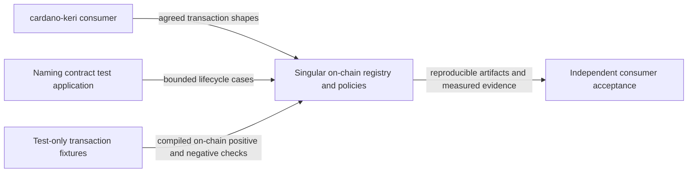
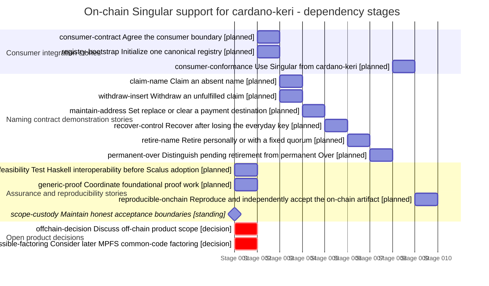

# On-chain Singular support for cardano-keri

Last reconciled: **2026-09-09T15:35:55.401Z**. Team: **PAUSED**. [Milestone](https://github.com/lambdasistemi/singular/milestone/1).

As a cardano-keri integrator, I want a reproducible, verified Singular on-chain registry and consumer contract so that my application can rely on its uniqueness and lifecycle rules. Planning is founded; execution awaits commissioning. The naming lifecycle is a concrete on-chain test application, not evidence of consumer readiness by itself. Off-chain product scope remains open. The Scalus spike is the next bounded experiment. Shared MPFS code factoring is a possible later milestone only.

> Stories describe outcomes; tickets are delivery containers. The mapping is many-to-many. Unticketed work, decisions and standing obligations are named explicitly. A landed enabler does not mean the product outcome is delivered.

## Delivery map

**Dependency-stage Gantt — not a calendar forecast.** Each equal-width bar occupies one dependency stage; positions are calculated from the prerequisites below. Synthetic dates are rendering coordinates only. Widths are not effort, duration or completion percentages. Standing obligations are checkpoints. Same-stage rows may be independent, but this chart grants no dispatch authority.

**PAUSED:** labels retain the last delivery state; no bar denotes currently authorised execution.

State key: **landed/delivered** = evidence linked; **review/ready** = not landed; **blocked/decision** = unresolved prerequisite; **planned** = not commissioned; **standing** = continuing obligation.

## Consumer integration stories

| Story | Kind | Tracking | State | Owner |
|---|---|---|---|---|
| [consumer-contract Agree the consumer boundary](#consumer-contract) | enabler | Ticketed — [#15](https://github.com/lambdasistemi/singular/issues/15), [#18](https://github.com/lambdasistemi/singular/issues/18) | planned | paolino; future epic owner not commissioned |
| [registry-bootstrap Initialize one canonical registry](#registry-bootstrap) | enabler | Ticketed — [#15](https://github.com/lambdasistemi/singular/issues/15), [#16](https://github.com/lambdasistemi/singular/issues/16) | planned | paolino; future epic owner not commissioned |
| [consumer-conformance Use Singular from cardano-keri](#consumer-conformance) | outcome | Ticketed — [#16](https://github.com/lambdasistemi/singular/issues/16), [#18](https://github.com/lambdasistemi/singular/issues/18) | planned | paolino; future epic owner not commissioned |

### consumer-contract

**As a cardano-keri maintainer, I want an exact Singular on-chain interface and required transaction shapes, so that consumer readiness has an executable shared contract.**

**Tracking:** Ticketed. Mapped to scoped epics; detailed implementation tickets belong to future epic owners. [#15](https://github.com/lambdasistemi/singular/issues/15), [#18](https://github.com/lambdasistemi/singular/issues/18).

**Now — planned:** Planned scope; no implementation or acceptance claimed by founding setup.

**Acceptance:** Bind script/policy identities, datum and redeemer encodings, inputs/outputs, executing witnesses, generic operations actually required by cardano-keri, and rejection cases to a coordinated versioned consumer contract. Missing details remain named decisions.

**Dependencies:** [scalus-feasibility: Test Haskell interoperability before Scalus adoption](#scalus-feasibility)

**Next:** Commission the owning epic after its prerequisites are settled.

**Evidence:** No completion evidence claimed.

### registry-bootstrap

**As an application operator, I want one canonical registry for my application, so that uniqueness has a concrete ledger boundary.**

**Tracking:** Ticketed. Mapped to scoped epics; detailed implementation tickets belong to future epic owners. [#15](https://github.com/lambdasistemi/singular/issues/15), [#16](https://github.com/lambdasistemi/singular/issues/16).

**Now — planned:** Planned scope; no implementation or acceptance claimed by founding setup.

**Acceptance:** Executable evidence establishes canonical bootstrap and one initialization, not merely deterministic policy identity; script bindings, authentic root and representative NFT custody are specified and later implemented.

**Dependencies:** [scalus-feasibility: Test Haskell interoperability before Scalus adoption](#scalus-feasibility)

**Next:** Commission the owning epic after its prerequisites are settled.

**Evidence:** No completion evidence claimed.

### consumer-conformance

**As a cardano-keri maintainer, I want implemented on-chain policies and contracts matching the agreed consumer boundary, so that my application can rely on Singular.**

**Tracking:** Ticketed. Mapped to scoped epics; detailed implementation tickets belong to future epic owners. [#16](https://github.com/lambdasistemi/singular/issues/16), [#18](https://github.com/lambdasistemi/singular/issues/18).

**Now — planned:** Planned scope; no implementation or acceptance claimed by founding setup.

**Acceptance:** Reproducible compiled on-chain evidence exercises the exact agreed consumer transaction shapes and attributable negative controls; an independent review confirms compatibility. A naming demo or model simulation alone is insufficient.

**Dependencies:** [consumer-contract: Agree the consumer boundary](#consumer-contract); [registry-bootstrap: Initialize one canonical registry](#registry-bootstrap); [scalus-feasibility: Test Haskell interoperability before Scalus adoption](#scalus-feasibility); [permanent-over: Distinguish pending retirement from permanent Over](#permanent-over)

**Next:** Commission the owning epic after its prerequisites are settled.

**Evidence:** No completion evidence claimed.

## Naming contract demonstration stories

| Story | Kind | Tracking | State | Owner |
|---|---|---|---|---|
| [claim-name Claim an absent name](#claim-name) | product | Ticketed — [#16](https://github.com/lambdasistemi/singular/issues/16) | planned | paolino; future epic owner not commissioned |
| [withdraw-insert Withdraw an unfulfilled claim](#withdraw-insert) | product | Ticketed — [#15](https://github.com/lambdasistemi/singular/issues/15), [#16](https://github.com/lambdasistemi/singular/issues/16) | planned | paolino; future epic owner not commissioned |
| [maintain-address Set replace or clear a payment destination](#maintain-address) | product | Ticketed — [#16](https://github.com/lambdasistemi/singular/issues/16) | planned | paolino; future epic owner not commissioned |
| [recover-control Recover after losing the everyday key](#recover-control) | product | Ticketed — [#15](https://github.com/lambdasistemi/singular/issues/15), [#17](https://github.com/lambdasistemi/singular/issues/17) | planned | paolino; future epic owner not commissioned |
| [retire-name Retire personally or with a fixed quorum](#retire-name) | product | Ticketed — [#17](https://github.com/lambdasistemi/singular/issues/17) | planned | paolino; future epic owner not commissioned |
| [permanent-over Distinguish pending retirement from permanent Over](#permanent-over) | product | Ticketed — [#17](https://github.com/lambdasistemi/singular/issues/17), [#18](https://github.com/lambdasistemi/singular/issues/18) | planned | paolino; future epic owner not commissioned |

### claim-name

**As a naming test user, I want to claim alice when Insert folds and the name is absent, so that the registry grants one unique representative.**

**Tracking:** Ticketed. Mapped to scoped epics; detailed implementation tickets belong to future epic owners. [#16](https://github.com/lambdasistemi/singular/issues/16).

**Now — planned:** Planned scope; no implementation or acceptance claimed by founding setup.

**Acceptance:** Certified permitted construction, exact initial application checkpoint and representative NFT output, permissionless fold and duplicate rejection are exercised on-chain. Certification attests neither identity nor spelling entitlement nor payment destination ownership. Approval reserves no name.

**Dependencies:** [consumer-contract: Agree the consumer boundary](#consumer-contract); [registry-bootstrap: Initialize one canonical registry](#registry-bootstrap); [scalus-feasibility: Test Haskell interoperability before Scalus adoption](#scalus-feasibility)

**Next:** Commission the owning epic after its prerequisites are settled.

**Evidence:** No completion evidence claimed.

### withdraw-insert

**As a naming test user, I want an authorized withdrawal of an unfulfilled Insert, so that the settled refund contract is enforced.**

**Tracking:** Ticketed. Mapped to scoped epics; detailed implementation tickets belong to future epic owners. [#15](https://github.com/lambdasistemi/singular/issues/15), [#16](https://github.com/lambdasistemi/singular/issues/16).

**Now — planned:** Planned scope; no implementation or acceptance claimed by founding setup.

**Acceptance:** Settle refund recipients, values and fees before implementation; observe authorized withdrawal and rejection of unauthorized withdrawal. Completion-only retirement requests remain non-withdrawable.

**Dependencies:** [consumer-contract: Agree the consumer boundary](#consumer-contract)

**Next:** Commission the owning epic after its prerequisites are settled.

**Evidence:** No completion evidence claimed.

### maintain-address

**As a current controller, I want zero or one payment destination in the application checkpoint, so that payment association stays separate from control.**

**Tracking:** Ticketed. Mapped to scoped epics; detailed implementation tickets belong to future epic owners. [#16](https://github.com/lambdasistemi/singular/issues/16).

**Now — planned:** Planned scope; no implementation or acceptance claimed by founding setup.

**Acceptance:** Set, replace and clear require current-controller authorization; NFT and recovery fields are preserved; registry is not mutated. A test harness authenticates checkpoint/NFT/registry bindings. No resolver service or wallet product is promised.

**Dependencies:** [claim-name: Claim an absent name](#claim-name)

**Next:** Commission the owning epic after its prerequisites are settled.

**Evidence:** No completion evidence claimed.

### recover-control

**As a naming test user, I want to reveal the next committed control address and authorize with its payment key, so that I rotate control without the old controller signature.**

**Tracking:** Ticketed. Mapped to scoped epics; detailed implementation tickets belong to future epic owners. [#15](https://github.com/lambdasistemi/singular/issues/15), [#17](https://github.com/lambdasistemi/singular/issues/17).

**Now — planned:** Planned scope; no implementation or acceptance claimed by founding setup.

**Acceptance:** Settle hash and canonical encoding; reveal committed key-controlled address, verify its payment-key authorization, preserve representative NFT and install a fresh next commitment. Wrong key, replay and unauthorized changes fail. Public master xpub plus index is not adopted.

**Dependencies:** [maintain-address: Set replace or clear a payment destination](#maintain-address)

**Next:** Commission the owning epic after its prerequisites are settled.

**Evidence:** No completion evidence claimed.

### retire-name

**As a current controller or fixed retirement quorum, I want permanent retirement authorized by either route, so that a name can cease permanently without takeover power.**

**Tracking:** Ticketed. Mapped to scoped epics; detailed implementation tickets belong to future epic owners. [#17](https://github.com/lambdasistemi/singular/issues/17).

**Now — planned:** Planned scope; no implementation or acceptance claimed by founding setup.

**Acceptance:** Current controller OR fixed-at-registration threshold of public keys authorizes irrevocable representative custody in a completion-only Singular request. Subsequent permissionless fold burns the NFT and marks Over. Insufficient quorum and quorum-only redirection fail. No receiving-script execution is presumed when creating an output.

**Dependencies:** [recover-control: Recover after losing the everyday key](#recover-control)

**Next:** Commission the owning epic after its prerequisites are settled.

**Evidence:** No completion evidence claimed.

### permanent-over

**As a naming test observer, I want authenticated absent active pending and Over states, so that retired names never resolve or become registrable again.**

**Tracking:** Ticketed. Mapped to scoped epics; detailed implementation tickets belong to future epic owners. [#17](https://github.com/lambdasistemi/singular/issues/17), [#18](https://github.com/lambdasistemi/singular/issues/18).

**Now — planned:** Planned scope; no implementation or acceptance claimed by founding setup.

**Acceptance:** Executable on-chain scenarios reject retirement withdrawal, release, reuse, replay and forbidden redirection; distinguish pending custody from completed Over. Naming excludes Delete without removing generic consumer-required behavior. The protocol verifies authorization, not death or inactivity, and cannot stop payment to a separately saved raw address.

**Dependencies:** [retire-name: Retire personally or with a fixed quorum](#retire-name)

**Next:** Commission the owning epic after its prerequisites are settled.

**Evidence:** No completion evidence claimed.

## Assurance and reproducibility stories

| Story | Kind | Tracking | State | Owner |
|---|---|---|---|---|
| [scalus-feasibility Test Haskell interoperability before Scalus adoption](#scalus-feasibility) | enabler | Ticketed — [#14 Scalus feasibility spike](https://github.com/lambdasistemi/singular/issues/14) | planned | paolino; ticket owner not yet commissioned |
| [generic-proof Coordinate foundational proof work](#generic-proof) | enabler | Ticketed — [#15](https://github.com/lambdasistemi/singular/issues/15), [#10 existing operator-owned foundation](https://github.com/lambdasistemi/singular/issues/10) | planned | paolino, existing operator-owned issue10 |
| [reproducible-onchain Reproduce and independently accept the on-chain artifact](#reproducible-onchain) | outcome | Ticketed — [#18](https://github.com/lambdasistemi/singular/issues/18) | planned | paolino; future epic owner not commissioned |
| [scope-custody Maintain honest acceptance boundaries](#scope-custody) | operation | Standing obligation | standing | Singular milestone owner |

### scalus-feasibility

**As a Singular on-chain developer, I want a bounded Scala/Scalus feasibility experiment, so that toolchain selection follows measured registry compatibility and turnaround.**

**Tracking:** Ticketed. Standalone first spike; metadata filed, execution not commissioned. [#14 Scalus feasibility spike](https://github.com/lambdasistemi/singular/issues/14).

**Now — planned:** Concrete next executable task after setup; Haskell interoperability is the first gate. No Scala adoption, migration or implementation lane started.

**Acceptance:** FIRST GATE: inspect the actual Haskell cardano-keri consumer contract, then consume a small Scalus-produced script through a Haskell transaction/serialization harness aligned with that consumer. Match datum, redeemer and parameter encodings and demonstrate positive and negative compiled execution. A Scala-only emulator does not pass. Reuse existing Haskell tooling where possible; measure adapter and duplicated encoder/builder/type burden. Do not invent a full final registry ABI for this spike. Isolate a pinned Scala/Scalus module in Singular with Nix reproduction; compile a representative validator/policy path to actual Plutus V3/UPLC; test positive and negative request/NFT coupling with an actual MPF proof compatibility probe. Measure cold and incremental edit-compile-test turnaround, script size and execution budget. Distinguish source execution, compiled UPLC, emulator and real-ledger observations. Use frozen semantics/vectors; report bounded MPF blockers and effort estimates instead of rewriting a library. Return reproducible evidence and proceed/change/stop recommendation, without production adoption or benchmarking superiority claims. Judge end-to-end delivery effort, Haskell integration and future common-code reuse alongside Scala turnaround; stop or recommend Haskell if duplication is substantial or consumer requirements fail.

**Dependencies:** No prerequisite story recorded; this is not dispatch authority.

**Next:** Project owner commissions the standalone spike under a fixed bounded contract.

**Evidence:** No completion evidence claimed.

### generic-proof

**As the operator owning existing Lean work, I want existing generic proofs to retain their scope and owner, so that new naming and consumer proof obligations stay distinct.**

**Tracking:** Ticketed. Existing operator-owned foundation plus distinct new contract coordination; no proof acceptance inferred from issue closure. [#15](https://github.com/lambdasistemi/singular/issues/15), [#10 existing operator-owned foundation](https://github.com/lambdasistemi/singular/issues/10).

**Now — planned:** Planned scope; no implementation or acceptance claimed by founding setup.

**Acceptance:** Refresh issue10 metadata and coordinate new model/theorem scope explicitly; issue closure and merged statements do not establish accepted proof. No duplicate proof lane is commissioned.

**Dependencies:** No prerequisite story recorded; this is not dispatch authority.

**Next:** Commission the owning epic after its prerequisites are settled.

**Evidence:** No completion evidence claimed.

### reproducible-onchain

**As an on-chain integrator, I want installable scripts policies contract material and test fixtures, so that I can reproduce the consumer and naming checks.**

**Tracking:** Ticketed. Mapped to scoped epics; detailed implementation tickets belong to future epic owners. [#18](https://github.com/lambdasistemi/singular/issues/18).

**Now — planned:** Planned scope; no implementation or acceptance claimed by founding setup.

**Acceptance:** Publish reproducible on-chain artifacts through an explicit usable CI/release path; bind exact candidate, commands and measured resource limits; independent outcome review covers consumer compatibility and naming negative cases. Test-only transaction fixtures are verification support. Browser/model simulation is illustrative only. No release or implementation is claimed by setup.

**Dependencies:** [consumer-conformance: Use Singular from cardano-keri](#consumer-conformance); [permanent-over: Distinguish pending retirement from permanent Over](#permanent-over); [generic-proof: Coordinate foundational proof work](#generic-proof)

**Next:** Commission the owning epic after its prerequisites are settled.

**Evidence:** No completion evidence claimed.

### scope-custody

**As an integrator reviewing progress, I want published stories and evidence to remain reconciled, so that a planning status cannot be mistaken for delivery.**

**Tracking:** Standing obligation. Milestone governance obligation, not an implementation ticket.

**Now — standing:** Planning setup only; implementation is uncommissioned.

**Acceptance:** Map every open milestone issue or explain its exclusion; preserve scope rulings and operator-owned work; independently assess the product outcome before closing the milestone.

**Dependencies:** No prerequisite story recorded; this is not dispatch authority.

**Next:** Maintain at the next authorized state transition; no recurring monitor.

**Evidence:** No completion evidence claimed.

## Open product decisions

| Story | Kind | Tracking | State | Owner |
|---|---|---|---|---|
| [offchain-decision Discuss off-chain product scope](#offchain-decision) | operation | Decision | decision | Operator through Singular project owner |
| [possible-factoring Consider later MPFS common-code factoring](#possible-factoring) | operation | Decision | decision | Operator through Singular project owner |

### offchain-decision

**As the product owner, I want a separate off-chain scope decision, so that planning does not silently promise a product SDK or service.**

**Tracking:** Decision. Unsettled product decision, deliberately outside the implementation epic commitment.

**Now — decision:** Off-chain product scope remains open for discussion; only test fixtures needed to verify on-chain contracts are included.

**Acceptance:** Explicit operator discussion decides any production SDK, indexer, wallet integration, resolver service, backend or user-facing application. Until then none is an this milestone product obligation.

**Dependencies:** No prerequisite story recorded; this is not dispatch authority.

**Next:** Discuss off-chain scope separately; do not commission it.

**Evidence:** No completion evidence claimed.

### possible-factoring

**As the product owner, I want a future decision on shared code, so that this milestone stays independent of extraction work.**

**Tracking:** Decision. Future candidate, not a founded milestone.

**Now — decision:** Possible future milestone only; no extraction authority.

**Acceptance:** A possible second milestone may factor MPFS common code only after explicit scope approval; it is not founded, active, rejected forever or an this milestone prerequisite.

**Dependencies:** No prerequisite story recorded; this is not dispatch authority.

**Next:** Revisit after this milestone scope and evidence mature.

**Evidence:** No completion evidence claimed.

## Maintenance

This page and its Gantt are generated from the adjacent story register. The milestone owner must reconcile it on material state changes and before handoff. Updating the timestamp alone is not reconciliation. A normal debrief reads this page; an authorised state sweep updates and publishes it. If publication is blocked, the desk must name the stale publication and pending changes.

Register schema: `milestone-stories/v1`. Parsed-register SHA-256: `7e136ee0cef647d1d999a16e1f493e23918cb0052574c65cf292ee33e64e4c2e`.

<!-- Generated by debrief/scripts/render-milestone.mjs; edit the JSON register, then regenerate. -->
