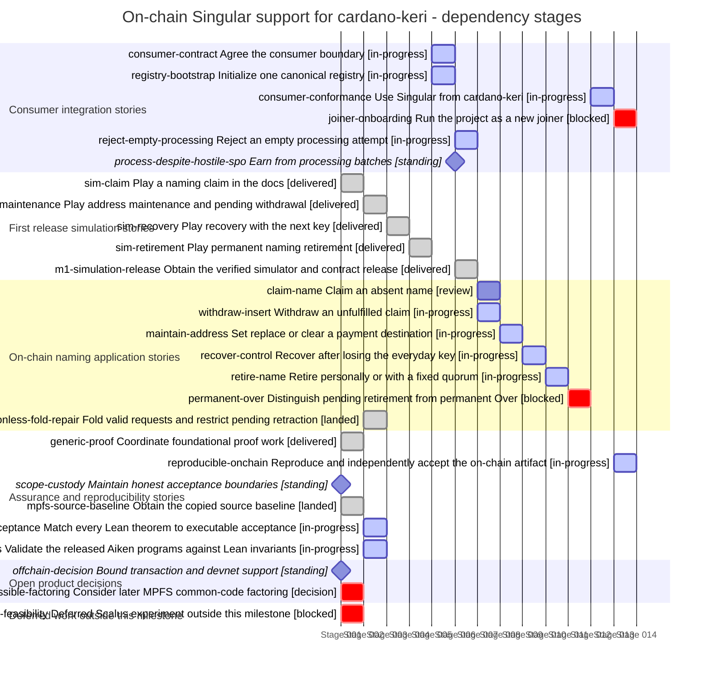

# On-chain Singular support for cardano-keri

Last reconciled: **2026-09-12T20:19:39.342Z**. Team: **RUNNING**. [Milestone](https://github.com/lambdasistemi/singular/milestone/1).

M1 is active and incomplete. A local naming component has bounded acceptance for a real request becoming Active, its representative policy check and reproducible packaging. Full connected retirement, consumer verification and joiner onboarding remain unfinished.

SPO selection is an accepted operating assumption: existing batch earnings are the incentive. Expanded starvation assessment is outside M1 acceptance. Empty-batch rejection, correct processing, promised payments and existing refund and recovery rules remain required.

The retirement revision passes focused validator checks and is being connected to SDK and recovery journeys. The proof-library repair passes focused absent-name checks; real-ledger acceptance is still owed. The mandatory application-validation hook is approved for implementation; payment enforcement remains unaccepted. A corrected finite script test now reproduces the registry-association gap; real-ledger evidence and repair acceptance remain owed. The coverage test suite now runs after a parser repair, and paired checks confirm the alias correction. Acceptance of the full required invariants remains open.

> Stories describe outcomes; tickets are delivery containers. The mapping is many-to-many. Unticketed work, decisions and standing obligations are named explicitly. A landed enabler does not mean the product outcome is delivered.

## Delivery map

**Dependency-stage Gantt — not a calendar forecast.** Each equal-width bar occupies one dependency stage; positions are calculated from the prerequisites below. Synthetic dates are rendering coordinates only. Widths are not effort, duration or completion percentages. Standing obligations are checkpoints. Same-stage rows may be independent, but this chart grants no dispatch authority.

Labels report delivery state; only in-progress rows use active colouring.

State key: **landed/delivered** = evidence linked; **review/ready** = not landed; **blocked/decision** = unresolved prerequisite; **planned** = not commissioned; **standing** = continuing obligation.

## Consumer integration stories

| Story | Kind | Tracking | State | Owner |
|---|---|---|---|---|
| [consumer-contract Agree the consumer boundary](#consumer-contract) | enabler | Ticketed — [#15](https://github.com/lambdasistemi/singular/issues/15), [#18](https://github.com/lambdasistemi/singular/issues/18), [#24](https://github.com/lambdasistemi/singular/issues/24), [#70](https://github.com/lambdasistemi/singular/issues/70), [#71](https://github.com/lambdasistemi/singular/issues/71) | in-progress | Epic #18 owner, coordinated with epic #17 |
| [registry-bootstrap Initialize one canonical registry](#registry-bootstrap) | enabler | Ticketed — [#15](https://github.com/lambdasistemi/singular/issues/15), [#16](https://github.com/lambdasistemi/singular/issues/16), [#24](https://github.com/lambdasistemi/singular/issues/24), [#69](https://github.com/lambdasistemi/singular/issues/69) | in-progress | Epic #18 owner; Epic #17 owns implementation repair |
| [consumer-conformance Use Singular from cardano-keri](#consumer-conformance) | outcome | Ticketed — [#16](https://github.com/lambdasistemi/singular/issues/16), [#18](https://github.com/lambdasistemi/singular/issues/18), [#63](https://github.com/lambdasistemi/singular/issues/63), [#68](https://github.com/lambdasistemi/singular/issues/68), [#69](https://github.com/lambdasistemi/singular/issues/69), [#70](https://github.com/lambdasistemi/singular/issues/70), [#71](https://github.com/lambdasistemi/singular/issues/71), [#81](https://github.com/lambdasistemi/singular/issues/81), [#80](https://github.com/lambdasistemi/singular/issues/80) | in-progress | Epic #18 owner |
| [joiner-onboarding Run the project as a new joiner](#joiner-onboarding) | enabler | Ticketed — [#78](https://github.com/lambdasistemi/singular/issues/78) | blocked | Epic #18 owner |
| [reject-empty-processing Reject an empty processing attempt](#reject-empty-processing) | outcome | Ticketed — [#17 on-chain implementation](https://github.com/lambdasistemi/singular/issues/17), [#18 consumer conformance](https://github.com/lambdasistemi/singular/issues/18) | in-progress | Epic #17 implementation; epic #18 consumer verification |
| [process-despite-hostile-spo Earn from processing batches](#process-despite-hostile-spo) | outcome | Standing obligation | standing | Milestone owner; existing batching and payment requirements in epics #17 and #18 |

### consumer-contract

**As a cardano-keri maintainer, I want an exact Singular on-chain interface and required transaction shapes, so that consumer readiness has an executable shared contract.**

**Tracking:** Ticketed. Preserves the full user outcome across original delivery tickets and subsequent conformance repairs; a merged component does not establish the connected journey. [#15](https://github.com/lambdasistemi/singular/issues/15), [#18](https://github.com/lambdasistemi/singular/issues/18), [#24](https://github.com/lambdasistemi/singular/issues/24), [#70](https://github.com/lambdasistemi/singular/issues/70), [#71](https://github.com/lambdasistemi/singular/issues/71).

**Now — in-progress:** Empty processing attempts must be rejected, and every processed request must receive the treatment specified by the consumer contract. SPO selection and reliance on existing batch earnings are accepted operating assumptions; expanded starvation assessment is outside M1 acceptance.

**Acceptance:** Bind script/policy identities, datum and redeemer encodings, inputs/outputs, executing witnesses, generic operations actually required by cardano-keri, and rejection cases to a coordinated versioned consumer contract. Missing details remain named decisions. Epic release obligation: a versioned, installable executable contract/model scenario package with the agreed consumer interface, canonical construction and encoding specifications, positive/negative scenarios, proof and gate evidence and replay instructions. An integrator obtains this release, runs its contract/scenario entry point and observes accepted transaction shapes and rejected substitutions against the frozen interface. Each release has its own version identity, retrieval/install/replay path, CI checks, owner acceptance under the current no-auditor instruction and explicit limits. The successor consumes its exact accepted artifact; packaging is not deferred wholesale to final integration.

**Dependencies:** [sim-retirement: Play permanent naming retirement](#sim-retirement)

**Next:** Implement the approved mandatory application check and empty-batch rule, publish the exact new state encoding and script identities, and verify nonempty processing and operation-specific payments.

**Evidence:** [Accepted v0.2.0 release and downloadable replay package](https://github.com/lambdasistemi/singular/releases/tag/v0.2.0)

### registry-bootstrap

**As an application operator, I want one canonical registry for my application, so that uniqueness has a concrete ledger boundary.**

**Tracking:** Ticketed. Preserves the full user outcome across original delivery tickets and subsequent conformance repairs; a merged component does not establish the connected journey. [#15](https://github.com/lambdasistemi/singular/issues/15), [#16](https://github.com/lambdasistemi/singular/issues/16), [#24](https://github.com/lambdasistemi/singular/issues/24), [#69](https://github.com/lambdasistemi/singular/issues/69).

**Now — in-progress:** The retirement application must establish that the supplied registry belongs to this name. A corrected finite application-script test accepts retirement with a different registry token when that registry copies the expected representative policy. Bootstrap, state-spending and full ledger validity remain separate obligations; the binding repair is in progress.

**Acceptance:** Executable evidence establishes canonical bootstrap and one initialization, not merely deterministic policy identity; script bindings, authentic root and representative NFT custody are specified and later implemented.

**Dependencies:** [sim-retirement: Play permanent naming retirement](#sim-retirement)

**Next:** Execute retirement using a different authentic registry under the same state policy, including one copying the expected representative policy. Verify the repaired binding and retain actual ledger outcomes.

**Evidence:** [Accepted v0.2.0 release and downloadable replay package](https://github.com/lambdasistemi/singular/releases/tag/v0.2.0)

### consumer-conformance

**As a cardano-keri maintainer, I want implemented on-chain policies and contracts matching the agreed consumer boundary, so that my application can rely on Singular.**

**Tracking:** Ticketed. Preserves the full user outcome across original delivery tickets and subsequent conformance repairs; a merged component does not establish the connected journey. [#16](https://github.com/lambdasistemi/singular/issues/16), [#18](https://github.com/lambdasistemi/singular/issues/18), [#63](https://github.com/lambdasistemi/singular/issues/63), [#68](https://github.com/lambdasistemi/singular/issues/68), [#69](https://github.com/lambdasistemi/singular/issues/69), [#70](https://github.com/lambdasistemi/singular/issues/70), [#71](https://github.com/lambdasistemi/singular/issues/71), [#81](https://github.com/lambdasistemi/singular/issues/81), [#80](https://github.com/lambdasistemi/singular/issues/80).

**Now — in-progress:** The accepted component supplies a coherent state and script identities for consumer checks. Current routing checks destinations but only aggregate amounts, and does not establish the recipient of batch tips. A registry-bound application validator is now approved and must run for every nonempty batch, authenticate consumer operations and enforce their payments or locked funds. Implementation and ledger acceptance remain open.

**Acceptance:** Reproducible compiled on-chain evidence exercises the exact agreed consumer transaction shapes and attributable negative controls; an independent review confirms compatibility. A naming demo or model simulation alone is insufficient.

**Dependencies:** [consumer-contract: Agree the consumer boundary](#consumer-contract); [registry-bootstrap: Initialize one canonical registry](#registry-bootstrap); [permanent-over: Distinguish pending retirement from permanent Over](#permanent-over)

**Next:** Implement the mandatory application check, exercise a valid consumer operation and invalid-operation, omitted-hook and wrong-allocation controls, then complete the corrected registry witness and final producer rebind.

**Evidence:** [Merged PR #64](https://github.com/lambdasistemi/singular/pull/64), [Merged PR #72](https://github.com/lambdasistemi/singular/pull/72), [Merged PR #75](https://github.com/lambdasistemi/singular/pull/75), [Merged Fork investigation instruments; absence repair remains open](https://github.com/lambdasistemi/singular/pull/82), [Merged PR88: bounded consumer execution/reporting; full conformance still open](https://github.com/lambdasistemi/singular/pull/88), [Merged PR89: corrected correspondence dispositions](https://github.com/lambdasistemi/singular/pull/89)

### joiner-onboarding

**As a new project contributor, I want to obtain the release and follow a working node and wallet runbook, so that joining requires reproducible commands and functioning journeys.**

**Tracking:** Ticketed. Required M1 outcome; remains open until the stated acceptance evidence exists. [#78](https://github.com/lambdasistemi/singular/issues/78).

**Now — blocked:** Blocker: connected lifecycle and consumer acceptance remain unfinished. External-node mode and onboarding are planned; no preprod deployment is claimed.

**Acceptance:** A joiner obtains the exact artifact and follows documented transaction, wallet and node instructions through the real required journey; any public-network use follows explicit operational scope.

**Dependencies:** [consumer-conformance: Use Singular from cardano-keri](#consumer-conformance); [lean-acceptance: Match every Lean theorem to executable acceptance](#lean-acceptance)

**Next:** Prepare and verify the runbook after the conformance and lifecycle prerequisites.

**Evidence:** No completion evidence claimed.

### reject-empty-processing

**As an application user, I want empty processing attempts rejected, so that success requires processing at least one request.**

**Tracking:** Ticketed. Approved by the stakeholder on 2026-09-12; tracked through the existing epics and CG11. [#17 on-chain implementation](https://github.com/lambdasistemi/singular/issues/17), [#18 consumer conformance](https://github.com/lambdasistemi/singular/issues/18).

**Now — in-progress:** The approved Lean revision has elaborated locally; the full producer candidate is not yet accepted. On-chain integration must preserve legitimate retirement, native witness precedence and valid nonempty zero-net processing. Rejecting empty batches makes no claim about request selection fairness.

**Acceptance:** Given a valid registry, when a fold processes no requests, it is refused and the registry remains unchanged. Valid nonempty processing still works, including a legitimate zero token net. Verify the revised Lean statement, both implementation layers, and compiled behavior with discriminating controls.

**Dependencies:** [consumer-contract: Agree the consumer boundary](#consumer-contract)

**Next:** Deliver the Lean-first change in the same coherent producer revision as operation-specific value routing, with separate controls and the affected retirement paths reverified.

**Evidence:** No completion evidence claimed.

### process-despite-hostile-spo

**As an SPO, I want earn from processing useful batches, so that processing requests has an economic incentive.**

**Tracking:** Standing obligation. Stakeholder accepted the SPO selection assumption. Expanded starvation and takeover verification is outside M1 acceptance.

**Now — standing:** SPOs retain selection and inclusion power. The stakeholder accepts reliance on existing batch earnings as an incentive; fairness and eventual inclusion are not claimed. The expanded starvation assessment is no longer required for M1. Existing timing, payment, refund and recovery correctness still apply.

**Acceptance:** Preserve the existing batch payment requirements and the accepted selection assumption. Expanded starvation assessment and universal profitability are not M1 acceptance criteria.

**Dependencies:** [consumer-contract: Agree the consumer boundary](#consumer-contract)

**Next:** Focus delivery on correct processing, authentic registry association and promised payments; preserve any diagnostic evidence without expanding the starvation campaign.

**Evidence:** No completion evidence claimed.

## First release simulation stories

| Story | Kind | Tracking | State | Owner |
|---|---|---|---|---|
| [sim-claim Play a naming claim in the docs](#sim-claim) | product | Ticketed — [#15](https://github.com/lambdasistemi/singular/issues/15), [#20](https://github.com/lambdasistemi/singular/issues/20), [PR #27](https://github.com/lambdasistemi/singular/pull/27) | delivered | Epic #15 owner; accepted by milestone owner |
| [sim-maintenance Play address maintenance and pending withdrawal](#sim-maintenance) | product | Ticketed — [#15](https://github.com/lambdasistemi/singular/issues/15), [#21](https://github.com/lambdasistemi/singular/issues/21) | delivered | Epic #15 owner; accepted by milestone owner |
| [sim-recovery Play recovery with the next key](#sim-recovery) | product | Ticketed — [#15](https://github.com/lambdasistemi/singular/issues/15), [#22](https://github.com/lambdasistemi/singular/issues/22) | delivered | Epic #15 owner; accepted by milestone owner |
| [sim-retirement Play permanent naming retirement](#sim-retirement) | product | Ticketed — [#15](https://github.com/lambdasistemi/singular/issues/15), [#23](https://github.com/lambdasistemi/singular/issues/23) | delivered | Epic #15 owner; accepted by milestone owner |
| [m1-simulation-release Obtain the verified simulator and contract release](#m1-simulation-release) | product | Ticketed — [#15](https://github.com/lambdasistemi/singular/issues/15), [#25](https://github.com/lambdasistemi/singular/issues/25) | delivered | Epic #15 owner; accepted by milestone owner |

### sim-claim

**As a Singular developer or reviewer, I want to submit and fold a naming claim, so that the first release has an observable, reproducible result.**

**Tracking:** Ticketed. Delivered and verified in the accepted v0.2.0 design/simulator release. [#15](https://github.com/lambdasistemi/singular/issues/15), [#20](https://github.com/lambdasistemi/singular/issues/20), [PR #27](https://github.com/lambdasistemi/singular/pull/27).

**Now — delivered:** Delivered in v0.2.0. The released simulator and artifact-only replay cover this journey and its refusal cases; 44 lifecycle cases execute. This is design evidence, not compiled naming-ledger acceptance.

**Acceptance:** Show pending versus registered state, claim uniqueness at fold and duplicate refusal. Enforce naming Delete/reuse refusal in transitions. Distinguish the generic simulator. Publish a candidate-bound docs preview.

**Dependencies:** No prerequisite story recorded; this is not dispatch authority.

**Next:** Preserve this journey when successor epics extend the implementation.

**Evidence:** [Accepted v0.2.0 release and downloadable replay package](https://github.com/lambdasistemi/singular/releases/tag/v0.2.0), [Play the released naming lifecycle](https://lambdasistemi.github.io/singular/simulator/lifecycle-view.html)

### sim-maintenance

**As a Singular developer or reviewer, I want to change a payment destination and withdraw an unfulfilled claim, so that the first release has an observable, reproducible result.**

**Tracking:** Ticketed. Delivered and verified in the accepted v0.2.0 design/simulator release. [#15](https://github.com/lambdasistemi/singular/issues/15), [#21](https://github.com/lambdasistemi/singular/issues/21).

**Now — delivered:** Delivered in v0.2.0. The released simulator and artifact-only replay cover this journey and its refusal cases; 44 lifecycle cases execute. This is design evidence, not compiled naming-ledger acceptance.

**Acceptance:** Set, replace and clear the optional destination without changing control or registry membership. Model exact authorized withdrawal and settled refund rules; reject unauthorized actions.

**Dependencies:** [sim-claim: Play a naming claim in the docs](#sim-claim)

**Next:** Preserve this journey when successor epics extend the implementation.

**Evidence:** [Accepted v0.2.0 release and downloadable replay package](https://github.com/lambdasistemi/singular/releases/tag/v0.2.0), [Play the released naming lifecycle](https://lambdasistemi.github.io/singular/simulator/lifecycle-view.html)

### sim-recovery

**As a Singular developer or reviewer, I want to recover control using the precommitted next address, so that the first release has an observable, reproducible result.**

**Tracking:** Ticketed. Delivered and verified in the accepted v0.2.0 design/simulator release. [#15](https://github.com/lambdasistemi/singular/issues/15), [#22](https://github.com/lambdasistemi/singular/issues/22).

**Now — delivered:** Delivered in v0.2.0. The released simulator and artifact-only replay cover this journey and its refusal cases; 44 lifecycle cases execute. This is design evidence, not compiled naming-ledger acceptance.

**Acceptance:** Require the revealed committed next address and its payment key, preserve the NFT and install a fresh commitment. Reject wrong keys and replay.

**Dependencies:** [sim-maintenance: Play address maintenance and pending withdrawal](#sim-maintenance)

**Next:** Preserve this journey when successor epics extend the implementation.

**Evidence:** [Accepted v0.2.0 release and downloadable replay package](https://github.com/lambdasistemi/singular/releases/tag/v0.2.0), [Play the released naming lifecycle](https://lambdasistemi.github.io/singular/simulator/lifecycle-view.html)

### sim-retirement

**As a Singular developer or reviewer, I want to retire with the current controller or fixed quorum, so that the first release has an observable, reproducible result.**

**Tracking:** Ticketed. Delivered and verified in the accepted v0.2.0 design/simulator release. [#15](https://github.com/lambdasistemi/singular/issues/15), [#23](https://github.com/lambdasistemi/singular/issues/23).

**Now — delivered:** Delivered in v0.2.0. The released simulator and artifact-only replay cover this journey and its refusal cases; 44 lifecycle cases execute. This is design evidence, not compiled naming-ledger acceptance.

**Acceptance:** Show irreversible pending retirement and completed Over. Reject withdrawal, insufficient quorum, quorum redirection and name reuse.

**Dependencies:** [sim-recovery: Play recovery with the next key](#sim-recovery)

**Next:** Preserve this journey when successor epics extend the implementation.

**Evidence:** [Accepted v0.2.0 release and downloadable replay package](https://github.com/lambdasistemi/singular/releases/tag/v0.2.0), [Play the released naming lifecycle](https://lambdasistemi.github.io/singular/simulator/lifecycle-view.html)

### m1-simulation-release

**As a Singular developer or reviewer, I want one retrievable first release containing playable naming and consumer scenarios with frozen model/contracts, so that the first release has an observable, reproducible result.**

**Tracking:** Ticketed. Delivered and verified in the accepted v0.2.0 design/simulator release. [#15](https://github.com/lambdasistemi/singular/issues/15), [#25](https://github.com/lambdasistemi/singular/issues/25).

**Now — delivered:** Delivered in v0.2.0. The released simulator and artifact-only replay cover this journey and its refusal cases; 44 lifecycle cases execute. This is design evidence, not compiled naming-ledger acceptance.

**Acceptance:** Publish the actual naming-specific simulator in docs, with frozen model/contracts, gate evidence, replay instructions, identities and resolved operator play findings. A browser model is not ledger implementation acceptance.

**Dependencies:** [sim-retirement: Play permanent naming retirement](#sim-retirement); [consumer-contract: Agree the consumer boundary](#consumer-contract); [registry-bootstrap: Initialize one canonical registry](#registry-bootstrap); [generic-proof: Coordinate foundational proof work](#generic-proof)

**Next:** Preserve this journey when successor epics extend the implementation.

**Evidence:** [Accepted v0.2.0 release and downloadable replay package](https://github.com/lambdasistemi/singular/releases/tag/v0.2.0), [Play the released naming lifecycle](https://lambdasistemi.github.io/singular/simulator/lifecycle-view.html)

## On-chain naming application stories

| Story | Kind | Tracking | State | Owner |
|---|---|---|---|---|
| [claim-name Claim an absent name](#claim-name) | product | Ticketed — [#16](https://github.com/lambdasistemi/singular/issues/16), [#17](https://github.com/lambdasistemi/singular/issues/17), [#77](https://github.com/lambdasistemi/singular/issues/77), [#79](https://github.com/lambdasistemi/singular/issues/79) | review | Epic #17 owner |
| [withdraw-insert Withdraw an unfulfilled claim](#withdraw-insert) | product | Ticketed — [#15](https://github.com/lambdasistemi/singular/issues/15), [#16](https://github.com/lambdasistemi/singular/issues/16), [#17](https://github.com/lambdasistemi/singular/issues/17), [#79](https://github.com/lambdasistemi/singular/issues/79) | in-progress | Epic #17 owner |
| [maintain-address Set replace or clear a payment destination](#maintain-address) | product | Ticketed — [#16](https://github.com/lambdasistemi/singular/issues/16), [#17](https://github.com/lambdasistemi/singular/issues/17), [#77](https://github.com/lambdasistemi/singular/issues/77), [#80](https://github.com/lambdasistemi/singular/issues/80) | in-progress | Epic #17 owner |
| [recover-control Recover after losing the everyday key](#recover-control) | product | Ticketed — [#15](https://github.com/lambdasistemi/singular/issues/15), [#17](https://github.com/lambdasistemi/singular/issues/17), [#62](https://github.com/lambdasistemi/singular/issues/62), [#77](https://github.com/lambdasistemi/singular/issues/77), [#80](https://github.com/lambdasistemi/singular/issues/80) | in-progress | Epic #17 owner |
| [retire-name Retire personally or with a fixed quorum](#retire-name) | product | Ticketed — [#17](https://github.com/lambdasistemi/singular/issues/17), [#66](https://github.com/lambdasistemi/singular/issues/66), [#74](https://github.com/lambdasistemi/singular/issues/74), [#77](https://github.com/lambdasistemi/singular/issues/77), [#79](https://github.com/lambdasistemi/singular/issues/79) | in-progress | Epic #17 owner |
| [permanent-over Distinguish pending retirement from permanent Over](#permanent-over) | product | Ticketed — [#17](https://github.com/lambdasistemi/singular/issues/17), [#18](https://github.com/lambdasistemi/singular/issues/18), [#74](https://github.com/lambdasistemi/singular/issues/74), [#77](https://github.com/lambdasistemi/singular/issues/77), [#79](https://github.com/lambdasistemi/singular/issues/79), [#71](https://github.com/lambdasistemi/singular/issues/71) | blocked | Epic #17 owner with epic #18 consumer checks |
| [permissionless-fold-repair Fold valid requests and restrict pending retraction](#permissionless-fold-repair) | enabler | Ticketed — [#79](https://github.com/lambdasistemi/singular/issues/79) | landed | Epic #17 owner |

### claim-name

**As a naming test user, I want to claim alice when Insert folds and the name is absent, so that the registry grants one unique representative.**

**Tracking:** Ticketed. Preserves the full user outcome across original delivery tickets and subsequent conformance repairs; a merged component does not establish the connected journey. [#16](https://github.com/lambdasistemi/singular/issues/16), [#17](https://github.com/lambdasistemi/singular/issues/17), [#77](https://github.com/lambdasistemi/singular/issues/77), [#79](https://github.com/lambdasistemi/singular/issues/79).

**Now — review:** The local ddfc4e9 component has passed bounded acceptance: a real request is consumed, the registry root changes, the name becomes Active and the representative is minted under the expected applied policy. A foreign-policy substitution is refused and the check has an effective negative control. Final consumer, lifecycle and compiled validation remain open.

**Acceptance:** Certified permitted construction, exact initial application checkpoint and representative NFT output, permissionless fold and duplicate rejection are exercised on-chain. Certification attests neither identity nor spelling entitlement nor payment destination ownership. Approval reserves no name. Epic release obligation: a versioned on-chain script/policy and contract bundle with test-only transaction construction and replay support for certified claim, permissionless fold, authenticated application state, authorized unfulfilled Insert withdrawal and optional address set/replace/clear. An integrator obtains this release and runs the bounded claim/maintenance journey: claim an absent name, reject a duplicate, observe the exact NFT/checkpoint, maintain its optional destination and exercise the settled withdrawal/refund behavior. Each release has its own version identity, retrieval/install/replay path, CI checks, owner acceptance under the current no-auditor instruction and explicit limits. The successor consumes its exact accepted artifact; packaging is not deferred wholesale to final integration.

**Dependencies:** [consumer-contract: Agree the consumer boundary](#consumer-contract); [registry-bootstrap: Initialize one canonical registry](#registry-bootstrap); [m1-simulation-release: Obtain the verified simulator and contract release](#m1-simulation-release); [mpfs-source-baseline: Obtain the copied source baseline](#mpfs-source-baseline)

**Next:** Complete the real-ledger absent-name, occupied-name and patch-removal checks, then preserve the claim journey through the combined producer revision.

**Evidence:** No completion evidence claimed.

### withdraw-insert

**As a naming test user, I want an authorized withdrawal of an unfulfilled Insert, so that the settled refund contract is enforced.**

**Tracking:** Ticketed. Preserves the full user outcome across original delivery tickets and subsequent conformance repairs; a merged component does not establish the connected journey. [#15](https://github.com/lambdasistemi/singular/issues/15), [#16](https://github.com/lambdasistemi/singular/issues/16), [#17](https://github.com/lambdasistemi/singular/issues/17), [#79](https://github.com/lambdasistemi/singular/issues/79).

**Now — in-progress:** The cancellation design and model are released. #79 repairs the imported request validator so only Insert can retract; retirement requests remain irrevocable.

**Acceptance:** Settle refund recipients, values and fees before implementation; observe authorized withdrawal and rejection of unauthorized withdrawal. Completion-only retirement requests remain non-withdrawable.

**Dependencies:** [consumer-contract: Agree the consumer boundary](#consumer-contract); [m1-simulation-release: Obtain the verified simulator and contract release](#m1-simulation-release)

**Next:** Verify the committed repair with Insert acceptance, Update/Delete refusal and the connected lifecycle.

**Evidence:** [Accepted v0.2.0 release and downloadable replay package](https://github.com/lambdasistemi/singular/releases/tag/v0.2.0)

### maintain-address

**As a current controller, I want zero or one payment destination in the application checkpoint, so that payment association stays separate from control.**

**Tracking:** Ticketed. Preserves the full user outcome across original delivery tickets and subsequent conformance repairs; a merged component does not establish the connected journey. [#16](https://github.com/lambdasistemi/singular/issues/16), [#17](https://github.com/lambdasistemi/singular/issues/17), [#77](https://github.com/lambdasistemi/singular/issues/77), [#80](https://github.com/lambdasistemi/singular/issues/80).

**Now — in-progress:** Maintenance components were shipped in the bootstrap release. Their end-to-end use still needs the real representative and registry Active journey; fixture execution alone does not close this outcome.

**Acceptance:** Set, replace and clear require current-controller authorization; NFT and recovery fields are preserved; registry is not mutated. A test harness authenticates checkpoint/NFT/registry bindings. No resolver service or wallet product is promised.

**Dependencies:** [claim-name: Claim an absent name](#claim-name)

**Next:** Replay maintenance from #77 actual Active state with the fixed Lean correspondence.

**Evidence:** No completion evidence claimed.

### recover-control

**As a naming test user, I want to reveal the next committed control address and authorize with its payment key, so that I rotate control without the old controller signature.**

**Tracking:** Ticketed. Preserves the full user outcome across original delivery tickets and subsequent conformance repairs; a merged component does not establish the connected journey. [#15](https://github.com/lambdasistemi/singular/issues/15), [#17](https://github.com/lambdasistemi/singular/issues/17), [#62](https://github.com/lambdasistemi/singular/issues/62), [#77](https://github.com/lambdasistemi/singular/issues/77), [#80](https://github.com/lambdasistemi/singular/issues/80).

**Now — in-progress:** Recovery implementation landed in PR #65. Full lifecycle acceptance remains open until its starting state is produced by the real #77 claim journey and required coverage is established.

**Acceptance:** Settle hash and canonical encoding; reveal committed key-controlled address, verify its payment-key authorization, preserve representative NFT and install a fresh next commitment. Wrong key, replay and unauthorized changes fail. Public master xpub plus index is not adopted.

**Dependencies:** [maintain-address: Set replace or clear a payment destination](#maintain-address)

**Next:** Compose recovery with actual claim and subsequent retirement; preserve wrong-key and replay refusals.

**Evidence:** [Merged PR #65](https://github.com/lambdasistemi/singular/pull/65)

### retire-name

**As a current controller or fixed retirement quorum, I want permanent retirement authorized by either route, so that a name can cease permanently without takeover power.**

**Tracking:** Ticketed. Preserves the full user outcome across original delivery tickets and subsequent conformance repairs; a merged component does not establish the connected journey. [#17](https://github.com/lambdasistemi/singular/issues/17), [#66](https://github.com/lambdasistemi/singular/issues/66), [#74](https://github.com/lambdasistemi/singular/issues/74), [#77](https://github.com/lambdasistemi/singular/issues/77), [#79](https://github.com/lambdasistemi/singular/issues/79).

**Now — in-progress:** The revised validator uses the original public identity to recognize the representative token and authorizes retirement separately through the current controller or fixed quorum. Focused validator checks pass. SDK support and sequential claim, recovery and retirement evidence are still owed; the user must be able to obtain the public creation material without the old signing key.

**Acceptance:** Current controller OR fixed-at-registration threshold of public keys authorizes irrevocable representative custody in a completion-only Singular request. Subsequent permissionless fold burns the NFT and marks Over. Insufficient quorum and quorum-only redirection fail. No receiving-script execution is presumed when creating an output. Epic release obligation: a versioned extension of the claim/maintenance on-chain bundle and test-only fixtures covering precommitted control rotation, current-controller OR fixed-quorum permanent retirement, pending custody and completed Over. An integrator starts with a claimed name from the previous release, recovers after losing the everyday key, retires through either authorized route, and observes the permanent refusal of resolution/re-registration after Over. Each release has its own version identity, retrieval/install/replay path, CI checks, owner acceptance under the current no-auditor instruction and explicit limits. The successor consumes its exact accepted artifact; packaging is not deferred wholesale to final integration.

**Dependencies:** [recover-control: Recover after losing the everyday key](#recover-control)

**Next:** Complete claim, recovery and retirement through both the current controller and fixed quorum, without the old signing key. Verify wrong-registry and forged-identity refusals, then nonempty permanent completion.

**Evidence:** [Merged PR #73](https://github.com/lambdasistemi/singular/pull/73)

### permanent-over

**As a naming test observer, I want authenticated absent active pending and Over states, so that retired names never resolve or become registrable again.**

**Tracking:** Ticketed. Preserves the full user outcome across original delivery tickets and subsequent conformance repairs; a merged component does not establish the connected journey. [#17](https://github.com/lambdasistemi/singular/issues/17), [#18](https://github.com/lambdasistemi/singular/issues/18), [#74](https://github.com/lambdasistemi/singular/issues/74), [#77](https://github.com/lambdasistemi/singular/issues/77), [#79](https://github.com/lambdasistemi/singular/issues/79), [#71](https://github.com/lambdasistemi/singular/issues/71).

**Now — blocked:** Blocker: the connected registry Active-to-Over retirement path is not delivered. Burning a fixture token or seeding Over does not establish permanent retirement.

**Acceptance:** Executable on-chain scenarios reject retirement withdrawal, release, reuse, replay and forbidden redirection; distinguish pending custody from completed Over. Naming excludes Delete without removing generic consumer-required behavior. The protocol verifies authorization, not death or inactivity, and cannot stop payment to a separately saved raw address.

**Dependencies:** [retire-name: Retire personally or with a fixed quorum](#retire-name)

**Next:** Finish #77 and #74 against the ownerless registry implementation; verify withdrawal, reuse and resolution refusals from that same connected journey. #79 has already landed.

**Evidence:** No completion evidence claimed.

### permissionless-fold-repair

**As a registry participant, I want to fold valid requests without any registry-owner authorization and retract only eligible pending Inserts, so that the implementation honors the five Lean fold conditions.**

**Tracking:** Ticketed. #79 closed after the bounded Modify/retraction repair; residual registry ownership is separately outstanding under active epics #17 and #18. [#79](https://github.com/lambdasistemi/singular/issues/79).

**Now — landed:** Landed in PR #85 as56e0fcdbd09cb3326a63e490f6c7ed2511cdc9ef; #79 closed. The integrated candidate passed the independent19-leg gate, executed1413 Aiken checks and full CI; all3 semantic mutants of the repaired behavior were rejected. Valid Modify no longer needs the owner; retraction is Insert-only. Accepted Lean is unchanged. CG20 subsequently passed on a real node at clean748c4a9. Registry End/migration/owner fields remain conformance defects outside this bounded repair; its landing does not establish that the whole registry is ownerless.

**Acceptance:** Valid owner-unsigned Modify succeeds; all other modeled conditions remain enforced; Insert retraction succeeds and Update/Delete retraction refuses; provenance and compiled identities match.

**Dependencies:** [mpfs-source-baseline: Obtain the copied source baseline](#mpfs-source-baseline)

**Next:** Preserve the accepted fold/retraction checks while removing residual registry-owner authority and updating affected interfaces. Complete connected naming and consumer conformance against the repaired schema.

**Evidence:** [Merged PR #85, validator repair](https://github.com/lambdasistemi/singular/pull/85)

## Assurance and reproducibility stories

| Story | Kind | Tracking | State | Owner |
|---|---|---|---|---|
| [generic-proof Coordinate foundational proof work](#generic-proof) | enabler | Ticketed — [#15](https://github.com/lambdasistemi/singular/issues/15), [#10 existing operator-owned foundation](https://github.com/lambdasistemi/singular/issues/10), [#24](https://github.com/lambdasistemi/singular/issues/24) | delivered | paolino, existing operator-owned issue10 |
| [reproducible-onchain Reproduce and independently accept the on-chain artifact](#reproducible-onchain) | outcome | Ticketed — [#18](https://github.com/lambdasistemi/singular/issues/18), [#17](https://github.com/lambdasistemi/singular/issues/17), [#68](https://github.com/lambdasistemi/singular/issues/68), [#70](https://github.com/lambdasistemi/singular/issues/70), [#71](https://github.com/lambdasistemi/singular/issues/71), [#78](https://github.com/lambdasistemi/singular/issues/78), [#80](https://github.com/lambdasistemi/singular/issues/80), [#81](https://github.com/lambdasistemi/singular/issues/81), [#87](https://github.com/lambdasistemi/singular/issues/87) | in-progress | Epic #18 owner with epic #17 artifact producer |
| [scope-custody Maintain honest acceptance boundaries](#scope-custody) | operation | Standing obligation | standing | Singular milestone owner |
| [mpfs-source-baseline Obtain the copied source baseline](#mpfs-source-baseline) | enabler | Ticketed — [#16](https://github.com/lambdasistemi/singular/issues/16), [#19](https://github.com/lambdasistemi/singular/issues/19), [#31](https://github.com/lambdasistemi/singular/issues/31), [#34](https://github.com/lambdasistemi/singular/issues/34), [#37](https://github.com/lambdasistemi/singular/issues/37), [#39](https://github.com/lambdasistemi/singular/issues/39), [#41](https://github.com/lambdasistemi/singular/issues/41), [#43](https://github.com/lambdasistemi/singular/issues/43), [#79](https://github.com/lambdasistemi/singular/issues/79) | landed | Epic #16 retired; epic #17 owns local conformance repairs |
| [lean-acceptance Match every Lean theorem to executable acceptance](#lean-acceptance) | enabler | Ticketed — [#80](https://github.com/lambdasistemi/singular/issues/80), [#87](https://github.com/lambdasistemi/singular/issues/87) | in-progress | Epic #18 owner |
| [compiled-invariants Validate the released Aiken programs against Lean invariants](#compiled-invariants) | enabler | Ticketed — [#87](https://github.com/lambdasistemi/singular/issues/87), [#80](https://github.com/lambdasistemi/singular/issues/80), [#18](https://github.com/lambdasistemi/singular/issues/18) | in-progress | Epic #18 owner; epic #17 supplies repaired artifacts; milestone owner reviews gates |

### generic-proof

**As the operator owning existing Lean work, I want existing generic proofs to retain their scope and owner, so that new naming and consumer proof obligations stay distinct.**

**Tracking:** Ticketed. Existing operator-owned #10 remains separate; #24 coordinates concrete scope without taking it over. [#15](https://github.com/lambdasistemi/singular/issues/15), [#10 existing operator-owned foundation](https://github.com/lambdasistemi/singular/issues/10), [#24](https://github.com/lambdasistemi/singular/issues/24).

**Now — delivered:** The preserved generic foundation has 41 exact proved identities in the published pinned replay, separate from the 17 naming, 43 lifecycle and 8 wire identities.

**Acceptance:** Refresh issue10 metadata and coordinate new model/theorem scope explicitly; issue closure and merged statements do not establish accepted proof. No duplicate proof lane is commissioned.

**Dependencies:** No prerequisite story recorded; this is not dispatch authority.

**Next:** Preserve these existing proofs without reopening operator-owned #10.

**Evidence:** [Accepted v0.2.0 release and downloadable replay package](https://github.com/lambdasistemi/singular/releases/tag/v0.2.0)

### reproducible-onchain

**As an on-chain integrator, I want installable scripts policies contract material and test fixtures, so that I can reproduce the consumer and naming checks.**

**Tracking:** Ticketed. Preserves the full user outcome across original delivery tickets and subsequent conformance repairs; a merged component does not establish the connected journey. The new packaging repair is unticketed within epic17 acceptance; epic17 owns the two assembly/checking files temporarily and integrates the fix. [#18](https://github.com/lambdasistemi/singular/issues/18), [#17](https://github.com/lambdasistemi/singular/issues/17), [#68](https://github.com/lambdasistemi/singular/issues/68), [#70](https://github.com/lambdasistemi/singular/issues/70), [#71](https://github.com/lambdasistemi/singular/issues/71), [#78](https://github.com/lambdasistemi/singular/issues/78), [#80](https://github.com/lambdasistemi/singular/issues/80), [#81](https://github.com/lambdasistemi/singular/issues/81), [#87](https://github.com/lambdasistemi/singular/issues/87).

**Now — in-progress:** The ddfc4e9 local package now passes checks using declared source inputs, identical packaged contents despite stray build files, rejection of corrupted inner files and manifests, and execution without caller-provided tools. This establishes bounded package correctness; the final integrated on-chain release and joiner journey are still owed.

**Acceptance:** Publish reproducible on-chain artifacts through an explicit usable CI/release path; bind exact candidate, commands and measured resource limits; independent outcome review covers consumer compatibility and naming negative cases. Test-only transaction fixtures are verification support. Browser/model simulation is illustrative only. No release or implementation is claimed by setup. Epic release obligation: the consolidated, installable on-chain release with exact cardano-keri consumer-contract bindings, reproducible conformance fixtures, the bounded naming journey, measured limits and independent outcome-review evidence. A cardano-keri integrator obtains the release and reproduces the exact agreed consumer transaction shapes and rejection cases, plus the complete bounded naming contract demonstration, from its published commands and artifacts. Each release has its own version identity, retrieval/install/replay path, CI checks, owner acceptance under the current no-auditor instruction and explicit limits. The successor consumes its exact accepted artifact; packaging is not deferred wholesale to final integration. M1 acceptance and integrated release additionally require #87 compiled Aiken invariant validation with no unresolved required debt.

**Dependencies:** [consumer-conformance: Use Singular from cardano-keri](#consumer-conformance); [permanent-over: Distinguish pending retirement from permanent Over](#permanent-over); [generic-proof: Coordinate foundational proof work](#generic-proof); [compiled-invariants: Validate the released Aiken programs against Lean invariants](#compiled-invariants)

**Next:** Preserve the accepted packaging checks while integrating the remaining consumer and lifecycle changes, then verify the final obtainable artifact.

**Evidence:** [Published bootstrap v0.3.0](https://github.com/lambdasistemi/singular/releases/tag/v0.3.0), [Merged PR #83](https://github.com/lambdasistemi/singular/pull/83)

### scope-custody

**As an integrator reviewing progress, I want published stories and evidence to remain reconciled, so that a planning status cannot be mistaken for delivery.**

**Tracking:** Standing obligation. Preserves the full user outcome across original delivery tickets and subsequent conformance repairs; a merged component does not establish the connected journey.

**Now — standing:** Accepted Lean behavior and vocabulary govern reused and merged code. The registry has no owner role; legitimate application/name controllers, request refunds and funding signatures remain distinct. Local ownerless repair and prepared consumer schema changes exist, but final integrated lifecycle and compiled acceptance are unfinished.

**Acceptance:** Map every open milestone issue or explain its exclusion; preserve scope rulings and operator-owned work; independently assess the product outcome before closing the milestone.

**Dependencies:** No prerequisite story recorded; this is not dispatch authority.

**Next:** Preserve the semantic freeze and require the connected positive and refusal journeys on one coherent candidate. M1 supplies no registry termination, migration or deposit-recovery operation.

**Evidence:** [Merged PR #76](https://github.com/lambdasistemi/singular/pull/76), [Merged PR #83](https://github.com/lambdasistemi/singular/pull/83)

### mpfs-source-baseline

**As a Singular developer or reviewer, I want the existing MPFS validators and Haskell transaction/devnet support in two directories, so that the first release has an observable, reproducible result.**

**Tracking:** Ticketed. Preserves the full user outcome across original delivery tickets and subsequent conformance repairs; a merged component does not establish the connected journey. [#16](https://github.com/lambdasistemi/singular/issues/16), [#19](https://github.com/lambdasistemi/singular/issues/19), [#31](https://github.com/lambdasistemi/singular/issues/31), [#34](https://github.com/lambdasistemi/singular/issues/34), [#37](https://github.com/lambdasistemi/singular/issues/37), [#39](https://github.com/lambdasistemi/singular/issues/39), [#41](https://github.com/lambdasistemi/singular/issues/41), [#43](https://github.com/lambdasistemi/singular/issues/43), [#79](https://github.com/lambdasistemi/singular/issues/79).

**Now — landed:** Copied sources, locks and recorded adaptations shipped in v0.3.0. The copy remains the provenance baseline; explicit local patches repair semantic mismatches without changing Lean or refreshing dependencies.

**Acceptance:** Copy one frozen committed source revision from cardano-mpfs-onchain, preserving licenses, existing locks and file provenance. Exclude the separate service and indexer. No compilation, test execution, factoring, path repair or dependency updates. Record inherited relative paths for later adaptation.

**Dependencies:** No prerequisite story recorded; this is not dispatch authority.

**Next:** Preserve baseline-plus-patch reconstruction and generated script identity through #79.

**Evidence:** [Published bootstrap v0.3.0](https://github.com/lambdasistemi/singular/releases/tag/v0.3.0)

### lean-acceptance

**As a human reviewer, I want to read the same domain claims in Lean and Given/When/Then acceptance, so that implementation cannot silently substitute a different design.**

**Tracking:** Ticketed. Required M1 outcome; remains open until the stated acceptance evidence exists. [#80](https://github.com/lambdasistemi/singular/issues/80), [#87](https://github.com/lambdasistemi/singular/issues/87).

**Now — in-progress:** The frozen coverage suite now runs after two syntax errors were repaired. Independent paired checks confirm that duplicated execution evidence cannot supply missing clauses, while genuinely independent coverage still counts. Targeted wire-reference controls also exist. These bounded repairs do not establish the full required invariants or repay the reported coverage debt.

**Acceptance:** Every project declaration accounted; exact clauses and vocabulary mapped; two distinct executable implementation layers per invariant; effective controls and fresh non-vacuous evidence; strict completion debt zero. Mandatory #87 compiled-invariant validation is an additional debt category and M1 blocker.

**Dependencies:** [generic-proof: Coordinate foundational proof work](#generic-proof)

**Next:** Complete source review of every required clause and both implementation layers, retaining exact positive and negative evidence and the true completion verdict.

**Evidence:** [Merged PR #83](https://github.com/lambdasistemi/singular/pull/83), [Merged historical correspondence; predates the approved nonempty revision](https://github.com/lambdasistemi/singular/blob/c8000231afc32510fe9851c6727f3e0fe8961c96/conformance/coverage/correspondence/fold_iff.md), [Accepted Lean declaration underlying the candidate reading](https://github.com/lambdasistemi/singular/blob/13231f58833b8feb57f4b0f9b1117bfcfba0c07d/lean/Singular/Statements.lean#L66), [Merged PR #84: bounded cleanup and correspondence slice](https://github.com/lambdasistemi/singular/pull/84), [Merged PR #86: verified publication-boundary preparation; activation outstanding](https://github.com/lambdasistemi/singular/pull/86)

### compiled-invariants

**As a Singular integrator, I want traceable Blaster validation of each applicable invariant against the exact compiled release programs, so that implementation or compilation divergence prevents M1 acceptance.**

**Tracking:** Ticketed. Operator-added mandatory M1 blocker on 2026-09-12; additional to both existing implementation acceptance layers. [#87](https://github.com/lambdasistemi/singular/issues/87), [#80](https://github.com/lambdasistemi/singular/issues/80), [#18](https://github.com/lambdasistemi/singular/issues/18).

**Now — in-progress:** The composed script candidate reports passing finite checks after correcting asset-map ordering. The corrected retirement test now reproduces the copied-policy rival association gap at the application-program level. These constructed contexts still assume bootstrap, state-spending and full ledger validity; full invariant acceptance remains open.

**Acceptance:** Validate actual production-built UPLC with pinned source/compiler/blueprint/parameters and explicit builtin semantics. Preserve Lean quantifiers and clauses with readable story correspondence. Retain reproducible ESTABLISHED/REFUTED/COULD-NOT-EVALUATE outcomes and rebuilt-source discrimination controls. Keep finite TESTED results distinct from quantified claims. Missing, unknown, unsupported, stale, vacuous or failing checks remain debt. Strict M1 completion and integrated publication require zero required compiled-invariant debt alongside all existing acceptance categories.

**Dependencies:** [generic-proof: Coordinate foundational proof work](#generic-proof); [mpfs-source-baseline: Obtain the copied source baseline](#mpfs-source-baseline)

**Next:** Execute the corrected retirement scenario with a distinct authentic cage token, preserve the finite-versus-ledger distinction, and complete all remaining compiled obligations on the final producer identities.

**Evidence:** [Operator-authorized acceptance contract](https://github.com/lambdasistemi/singular/issues/87), [Primary protocol-aware V3 evaluator mapping](https://github.com/IntersectMBO/plutus/blob/e5bec6ae0caa8de4c2d33d518ce2cfd4bdc34cbf/plutus-ledger-api/src/PlutusLedgerApi/V3/EvaluationContext.hs#L45), [Source-only crypto support candidate, compatibility unverified](https://github.com/input-output-hk/PlutusCoreBlaster/blob/ed3126b6a2f5cc32bd151fdefb26e66dcf514888/PlutusCore/UPLC/BuiltinFunctions/Evaluate.lean)

## Open product decisions

| Story | Kind | Tracking | State | Owner |
|---|---|---|---|---|
| [offchain-decision Bound transaction and devnet support](#offchain-decision) | operation | Standing obligation — [#19](https://github.com/lambdasistemi/singular/issues/19), [#31](https://github.com/lambdasistemi/singular/issues/31) | standing | Operator through Singular project owner |
| [possible-factoring Consider later MPFS common-code factoring](#possible-factoring) | operation | Decision | decision | Operator through Singular project owner |

### offchain-decision

**As the product owner, I want existing transaction builders and devnet support without an indexer, so that planning does not silently promise a product SDK or service.**

**Tracking:** Standing obligation. Settled operator scope, maintained during implementation. [#19](https://github.com/lambdasistemi/singular/issues/19), [#31](https://github.com/lambdasistemi/singular/issues/31).

**Now — standing:** Settled scope: reuse existing Haskell transaction-building and devnet support only; no indexer or separate service.

**Acceptance:** Reuse the Haskell support in cardano-mpfs-onchain. The separate service and indexer are excluded. No production SDK, wallet integration or resolver service is adopted. Copy source and locks first without compilation; later transaction and devnet execution belongs to the relevant ledger slices.

**Dependencies:** No prerequisite story recorded; this is not dispatch authority.

**Next:** Enforce this boundary in active import and functional work.

**Evidence:** No completion evidence claimed.

### possible-factoring

**As the product owner, I want a future decision on shared code, so that this milestone stays independent of extraction work.**

**Tracking:** Decision. Future candidate, not a founded milestone.

**Now — decision:** Possible future milestone only; no extraction authority.

**Acceptance:** A possible second milestone may factor MPFS common code only after explicit scope approval; it is not founded, active, rejected forever or an this milestone prerequisite.

**Dependencies:** No prerequisite story recorded; this is not dispatch authority.

**Next:** Revisit after this milestone scope and evidence mature.

**Evidence:** No completion evidence claimed.

## Deferred work outside this milestone

| Story | Kind | Tracking | State | Owner |
|---|---|---|---|---|
| [scalus-feasibility Deferred Scalus experiment outside this milestone](#scalus-feasibility) | enabler | Ticketed — [#14 Scalus feasibility spike](https://github.com/lambdasistemi/singular/issues/14) | blocked | paolino; deferred, no execution owner commissioned |

### scalus-feasibility

**As a Singular on-chain developer, I want a bounded Scala/Scalus feasibility experiment, so that toolchain selection follows measured registry compatibility and turnaround.**

**Tracking:** Ticketed. Open deferred backlog experiment #14, deliberately excluded from this milestone and its critical path. No date or future milestone assigned; bounded Haskell interoperability criteria retained. [#14 Scalus feasibility spike](https://github.com/lambdasistemi/singular/issues/14).

**Now — blocked:** Deferred by operator ruling outside this milestone. Blocker: a new explicit decision is required before reconsideration. The experiment remains open and unexecuted; no technical disproof or permanent rejection is claimed.

**Acceptance:** FIRST GATE: inspect the actual Haskell cardano-keri consumer contract, then consume a small Scalus-produced script through a Haskell transaction/serialization harness aligned with that consumer. Match datum, redeemer and parameter encodings and demonstrate positive and negative compiled execution. A Scala-only emulator does not pass. Reuse existing Haskell tooling where possible; measure adapter and duplicated encoder/builder/type burden. Do not invent a full final registry ABI for this spike. Isolate a pinned Scala/Scalus module in Singular with Nix reproduction; compile a representative validator/policy path to actual Plutus V3/UPLC; test positive and negative request/NFT coupling with an actual MPF proof compatibility probe. Measure cold and incremental edit-compile-test turnaround, script size and execution budget. Distinguish source execution, compiled UPLC, emulator and real-ledger observations. Use frozen semantics/vectors; report bounded MPF blockers and effort estimates instead of rewriting a library. Return reproducible evidence and proceed/change/stop recommendation, without production adoption or benchmarking superiority claims. Judge end-to-end delivery effort, Haskell integration and future common-code reuse alongside Scala turnaround; stop or recommend Haskell if duplication is substantial or consumer requirements fail.

**Dependencies:** No prerequisite story recorded; this is not dispatch authority.

**Next:** Await explicit reconsideration; the first epic starts with simulator ticket #20 without this dependency.

**Evidence:** No completion evidence claimed.

## Maintenance

This page and its Gantt are generated from the adjacent story register. The milestone owner must reconcile it on material state changes and before handoff. Updating the timestamp alone is not reconciliation. A normal debrief reads this page; an authorised state sweep updates and publishes it. If publication is blocked, the desk must name the stale publication and pending changes.

Register schema: `milestone-stories/v1`. Parsed-register SHA-256: `1d30f6edb9a2ac5dfb4843e29869711261d1089cb95f65c256f92ee19697a803`.

<!-- Generated by debrief/scripts/render-milestone.mjs; edit the JSON register, then regenerate. -->
