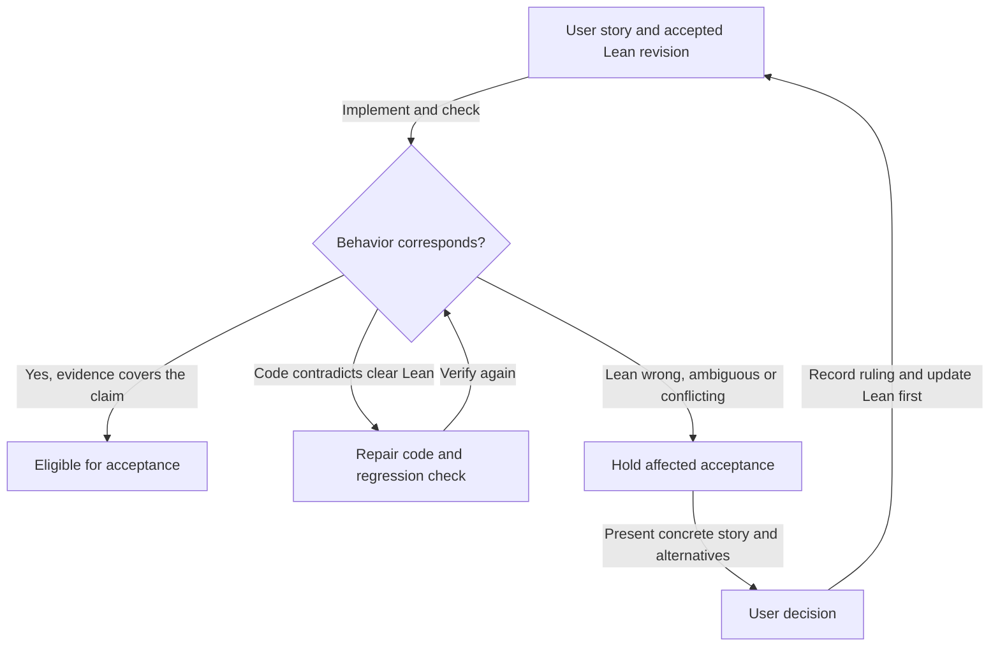

<!--
Sync impact report
Version: 1.0.0 -> 1.1.0 (conformance suite audience and form)
Amended: 2026-09-21
Added principles: VI, the conformance suite is the product's public evidence
statement — published audience, receipt-computed state, published uncovered
rows, every claim said in the description language, total interpretation with a
discovered-extent control, requirement text over internal identifiers, harness
evidence as a marked appendix, and no restructure that moves a row's state.
Modified governance: records the user's 2026-09-21 instruction.
Synchronized: AGENTS.md.
Templates: .github/pull_request_template.md already routes acceptance through
this constitution; no template change required.
Deferred placeholders: none.

Sync impact report
Version: none -> 1.0.0 (first repository constitution)
Ratified and amended: 2026-09-11
Added principles: Lean authority; user-story escalation; behavioral correspondence;
evidence-bound acceptance; retrospective applicability.
Added governance: amendment authority and versioning; acceptance and release rules.
Synchronized: AGENTS.md; .github/pull_request_template.md.
Spec Kit plan/spec/tasks/command templates: absent; no template migration required.
Deferred placeholders: none.
-->

# Singular Constitution

As a Singular user or integrator, I must receive the behavior specified by the
accepted Lean model. As a contributor, I must be able to trace each delivered
behavior to that model and know when a decision belongs to the user.

## Core principles

### I. Lean is the behavioral authority

The accepted, revision-bound Lean model MUST govern the simulator, on-chain
validators, off-chain transaction construction, and conformance expectations.
Implementation MUST preserve its transitions, authorization, accepted and refused
outcomes, state and registry-root effects, token identity and custody, refunds,
and witness obligations. Imported code and pinned dependencies have the same
obligation as code written in this repository.

A passing suite, existing implementation, owner interpretation, or previous merge
MUST NOT replace the model as the behavioral authority. Contributors MUST NOT
change Lean or expected results merely to match an implementation. The user
retains authority to correct the model through the process below.

### II. Model errors and ambiguity require user stories

If Lean appears wrong, contradictory, underspecified for the behavior being
claimed, or ambiguous, the contributor MUST escalate to the user. A conflict
between Singular's model and a bound consumer model MUST take the same path;
an owner MUST NOT silently choose one or weaken the consumer requirement.

The escalation MUST contain:

- The actor, action and intended outcome: “As a ..., I want ..., so that ...”.
- A concrete starting state and action, the Lean result or competing readings,
  and the implementation's observed result.
- Exact model and implementation revisions, definitions, affected tickets or
  releases, evidence, and the limits of that evidence.
- The user-visible consequence, viable alternatives, and the decision needed.

Acceptance, merge, and release of affected behavior and dependent claims MUST
remain blocked until the user decides. Independent, settled work may continue.
No approval is needed to repair code that contradicts clear Lean. Technical
representation choices may proceed when their behavioral correspondence is
explicit and checked; a difference in representation alone is not a model error.

The user's ruling MUST be recorded in the repository with the affected story.
Lean, its statements/proofs and exported corpus MUST be updated as applicable
before dependent implementation is accepted. Simulator, implementation, tests,
documentation and release compatibility MUST then be aligned with that revision.

### III. Verify the whole claimed behavior

Every behavior-changing PR MUST identify its user stories, exact Lean revision
and definitions, implementation entry points, and the executable checks and
observations connecting them. The mapping MUST cover both success and relevant
refusals, including who can supply every signature, witness and required input.
Representation refinements MUST explain and check preservation of observable
effects; matching case names or counts is insufficient.

An end-to-end lifecycle claim MUST exercise the connected transitions that
produce its starting and final states. Directly creating a fixture in the final
state, substituting an asset under another policy, or checking one isolated
validator MUST NOT be presented as evidence for the missing lifecycle. Such
fixtures can support narrower checks if those limits are stated explicitly.

Checks MUST demonstrate that a relevant reachable defect is detected at the
claimed boundary. A source inspection establishes source facts; a Lean proof
establishes its stated proposition; a simulator replay establishes the simulated
cases; a ledger claim requires the corresponding transaction and script
execution evidence. These forms of evidence MUST NOT be substituted for one
another. A helper's base case alone does not establish a complete transition.

### IV. Acceptance must preserve evidence and gaps

Review MUST bind the candidate commit, model revision, commands, actual results,
and remaining coverage gaps. Green CI is necessary for merge but does not alone
establish behavioral correspondence. Reviewers MUST inspect what each gate
actually proves, including positive and relevant negative controls.

An unresolved contradiction or ambiguity MUST NOT be closed as an “expected
gap”, waived by an owner, or converted into a passing conformance row. Missing
evidence MUST remain unverified. An unmet consumer requirement remains unmet
even if the implementation conforms to a different model.

A limited artifact may be described accurately, but changing an already accepted
story's scope requires an explicit user ruling. A release MUST NOT claim completion
of a story whose required effects or evidence are missing. The constitution does
not prescribe extra auditor seats; staffing follows the user's instructions.

### V. Apply the rule to previous work

These principles apply to previously merged code and released artifacts as well
as new work. When a retrospective check finds a discrepancy, contributors MUST
record the affected revisions and stories, preserve the original evidence, and
hold dependent acceptance until resolution. Prior closure or a published release
does not exempt a behavior from correspondence review.

Repairs MUST use forward changes. Historical commits, tags, artifacts and receipts
MUST NOT be rewritten to conceal a mismatch. Resolution requires the implementation
repair and its evidence, or an explicit user ruling followed by the model-first
alignment above. Publishing this constitution does not itself resolve any
existing implementation finding.

### VI. The conformance suite is the product's public evidence statement

The conformance suite is read by people outside this project who are deciding
whether to build on the registry. It is published — `docs/consumer-conformance.md`
— and it MUST be written for that reader, in the product's own words, without
requiring them to learn this project's internal vocabulary first.

Its worth to that reader is that it is honest about what has not been shown.
Row state MUST be computed from run receipts and MUST NOT be typed by hand.
`uncovered` MUST be published rather than hidden. A green step is not a
fulfilled consumer promise, and a passing suite MUST NOT be presented as one.

Every product claim MUST be expressed in the suite's description language, so
that a story cannot describe a case the suite does not run. A case that cannot
be said in that language is a finding to raise; it MUST NOT be written as a raw
assertion outside it. Interpretation of that language — execution and
rendering — MUST be total over the same instruction set, and the control proving
it MUST quantify over the discovered extent of that set rather than a listed
member. A renderer that silently drops an instruction publishes a claim the
suite never executed, which is the same defect as typing `executed` into a row.

Surfaces the reader navigates MUST carry requirement text, not internal
identifiers. Evidence about the project's own harness MUST be marked as an
appendix and MUST NOT occupy the body, whatever its volume.

Because the suite is a product surface rather than an internal test tree, a
change to it is a product change and is held to the same bar. A restructure
MUST NOT move any row's state by one increment and MUST NOT make an uncovered
row look covered.

## Development and review

Contributors MUST read this constitution before specifying, implementing or
accepting behavior. Plans, task lists, PRs and handoffs MUST carry forward the
story, model binding, required evidence and unresolved decisions. Repository and
agent instructions MUST link here rather than maintain competing authority rules.

The PR template is the acceptance record: behavioral changes supply the mapping
and checks; governance-only changes explain why runtime behavior is unchanged.
A reviewer MUST withhold acceptance for an unresolved affected story. When a
change exposes an existing model conflict, the conflict MUST be recorded and
routed to the user rather than silently incorporated into the new expectations.

## Governance

This constitution records the user's 2026-09-11 instruction that implementation
must never diverge from Lean, model errors and ambiguity must be escalated as
user stories, and the rule must apply retroactively. It supersedes conflicting
repository guidance and prior owner interpretations. An explicit later user
ruling may amend it; an agent or reviewer cannot grant itself an exception.

Principle VI records the user's 2026-09-21 instruction that the conformance
suite is the product bible, written for stakeholders rather than for this
project, and that this value is constitutional rather than the scope of the
ticket that first applied it.

Amendments MUST record their authority, rationale, affected principles and
dependent guidance. Use a major version for incompatible principle changes, a
minor version for new or materially expanded principles, and a patch version for
clarifications without changed obligations. Each amendment MUST update the sync
impact report and check the repository's contributor instructions and templates.

**Version**: 1.1.0 | **Ratified**: 2026-09-11 | **Last amended**: 2026-09-21
