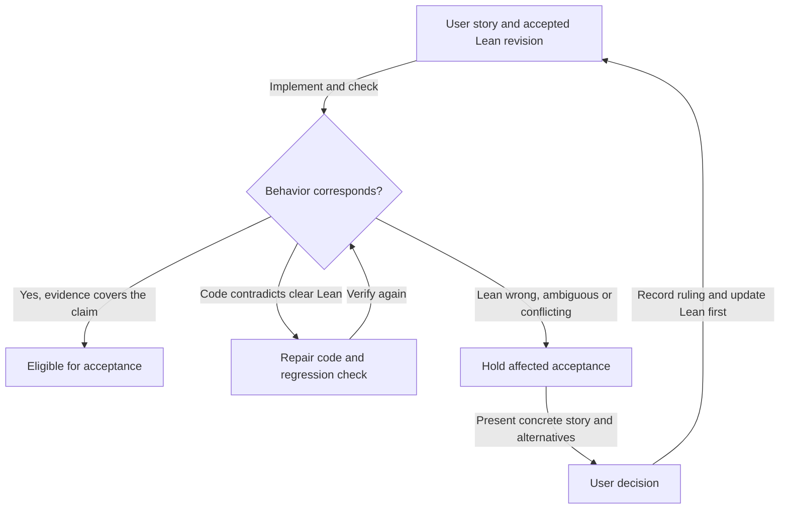

<!--
Sync impact report
Version: 1.8.0 -> 1.9.0 (a retraction's return is bound to its request; the driver judges what a transaction spends)
Amended: 2026-09-24
Authority: issue #258 (parent #209), Amendments 6, 7, 10, 12, 14 and 15, T6.
Changed obligations: a retract owes its owner deposit and tip through one output
bound to the request's own output reference (`Request.reference`), presented as an
inline datum (`TxOutput.reference`); `settle` pays that return only by such an output
and reads the largest one, never fragments. The driver declares a second judgement,
`spend`: a retraction spending an input that holds a state token is refused
`retract-state-spent` before its payments are judged. The retract transaction
requires the owner's signature; a reject refunds with no datum, returning the
approval. An output reference enters the model only as an identity allocated while
acting.
Consumers: the driver corpus surface (protocol 4), `Conformance.Run.Live` (reject and
retract exits, the judged inputs, datum forms and references),
`conformance/lean/DriverTransport.lean`, `Conformance.Observe.Payments`,
`tools/check_model.py` and the simulator mirror.
Checked: declared operations, observations and unobservable names unchanged; the
judgements, surface digest and protocol version move.
Named limit: retraction admission (retractability, the owner's signature refusal)
stays #239's; the chain's refusal reason is not observed (#287).
Templates: no template change required.
Deferred placeholders: none.

Version: 1.7.0 -> 1.8.0 (the driver judges an observed transaction's payments)
Amended: 2026-09-24
Authority: issue #258 (parent #209), Amendments 12 to 14, T5.
Changed obligations: the driver declares one judgement, `settle`: given the
outputs of a transaction a caller observed, translated by the identity rules,
it answers `Singular.settle` over what the scenario's exit owes. The model's
verdict on a submitted fold is the law's, then that judgement: the law accepting
and the outputs unpaid is a refusal for `settle`'s reason. A custody output
present but short is `deposit-returned`, as the chain names it.
Consumers: the driver corpus surface, `Conformance.Run.Live` (the digest pin,
the settlement translation, the verdict), `conformance/lean/DriverTransport.lean`,
`Conformance.Lean.Oracle`, `tools/check_model.py` and the simulator mirror.
Checked: declared operations, observations and unobservable names unchanged; the
surface digest and protocol version move with the judgement.
Named limit: the chain's refusal reason is not observed; the deployed validators
are compiled without traces (#287).
Templates: no template change required.
Deferred placeholders: none.

Sync impact report
Version: 1.6.0 -> 1.7.0 (every exit's payments in paid and tx)
Amended: 2026-09-24
Authority: issue #258 (parent #209), Amendments 8 and 10, T4b.
Changed obligations: `paid` is one definition for every exit — the exit's
obligations at the recipient's address, then its step's custody refunds; a
fold's `tx` carries the deposit in the output that pays it (the destination
output of a delivering fold, one owner output with no datum naming the returned
approval for a fold delivering nothing); refunds are `paid`; every payment value
is compared as a floor, as output lovelace is. The chain observation reads the
owner and destination payments and the owner outputs from the ledger.
Consumers: `Conformance.Observe.Payments`, `Conformance.Run.Live`,
`Conformance.Compare.Registration`, `Conformance.Compare.Perturbation`, the
registration and retirement bindings, the driver corpus and the simulator mirror.
Checked: declared observation and unobservable names unchanged; the surface
digest and protocol version unchanged.
Named limit: the datum form reported for non-owner outputs is written, not read.
Templates: no template change required.
Deferred placeholders: none.

Sync impact report
Version: 1.5.0 -> 1.6.0 (transaction output lovelace floors)
Amended: 2026-09-24
Authority: issue #258 (parent #209), Amendment 8, T4a.
Changed obligations: transaction output lovelace is compared against the
model's per-output floor (`observed >= model`); all other transaction fields
remain equal, and surplus above the floor remains unobservable.
Consumers: `Conformance.Compare.Registration`,
`Conformance.Compare.Perturbation`, its registration comparison tests, and the
live run's reported-difference rendering.
Checked: the declared observation and unobservable names remain unchanged;
`tools/check_model.py` reconciliation is part of the frozen model gate.
Templates: no template change required.
Deferred placeholders: none.

Sync impact report
Version: 1.4.0 -> 1.5.0 (the driver's operations are the exits)
Amended: 2026-09-24
Authority: issue #258 (parent #209), whose ruled rule table states where every
exit's deposit goes; reject and retract carry no admission until #239.
Changed obligations: the driver's declared operations are the nine exits — a
fold of each of the seven edges, still named by the edge, then `reject` and
`retract` — executed through `Singular.exitStep`. Rows added for `reject` and
`retract`; the `paid`, `tx` and `outputMinimumAda` rows say what a reject and a
retract pay and build (one owner output per owner payment, carrying its floor);
the operation-name and outcome-class identity rows name `exitName` and
`exitStep`'s refusal. What folds pay and build is unchanged.
Modified principles: none.
Synchronized: `Singular.Driver.declaredOperations` and the surface's protocol
version in the same change; tools/check_model.py reconciles the two in both
directions, and the driver's surface digest moves with it.
Templates: no template change required.
Deferred placeholders: none.

Sync impact report
Version: 1.3.0 -> 1.4.0 (required signers become an obligation)
Amended: 2026-09-23
Authority: user ruling 2026-09-23 narrowing issue #228 to the fold's required
signers.
Changed obligations: `requiredSigners` is no longer a named unobservable field.
The model proves that no fold requires a signer
(`Singular.Statements.fold_requires_no_signer`), so the `tx` row's `signers`
carries that obligation: a consumer reads the submitted transaction's required
signers and compares them with the model's empty list.
Modified principles: none.
Synchronized: `Singular.Driver.declaredUnobservable` drops the name in the same
change; tools/check_model.py reconciles the two in both directions, and the
driver's surface digest moves with it.
Templates: no template change required.
Deferred placeholders: none.

Sync impact report
Version: 1.2.0 -> 1.3.0 (per-output minimum ada named unobservable)
Amended: 2026-09-22
Added sections: none. The model driver translation names one further
unobservable field, per-output ledger minimum ada, so a consumer compares every
other transaction field and leaves that one alone.

Sync impact report
Version: 1.1.0 -> 1.2.0 (model driver translation)
Amended: 2026-09-22
Added sections: the model driver translation — the concrete realization of each
declared operation and boundary observation, the identity rules binding a
scenario to the model and to its theorems, and the named unobservable fields,
the registry root's abstractness among them.
Modified principles: none; existing obligations are unchanged.
Synchronized: tools/check_model.py reconciles this section against the driver's
declared surface in both directions, in the required CI model job.
Templates: .github/pull_request_template.md already routes acceptance through
this constitution; no template change required.
Deferred placeholders: none.

Sync impact report
Version: 1.0.0 -> 1.1.0 (conformance suite audience and form)
Amended: 2026-09-21
Added principles: VI, the conformance suite is the product's public evidence
statement — published audience, receipt-computed state, published uncovered
rows, every claim said in the description language, total interpretation with a
discovered-extent control, requirement text over internal identifiers, harness
evidence as a marked appendix, and no restructure that moves a row's state.
Modified governance: records the user's 2026-09-21 instruction.
Synchronized: AGENTS.md.
Templates: .github/pull_request_template.md already routes acceptance through
this constitution; no template change required.
Deferred placeholders: none.

Sync impact report
Version: none -> 1.0.0 (first repository constitution)
Ratified and amended: 2026-09-11
Added principles: Lean authority; user-story escalation; behavioral correspondence;
evidence-bound acceptance; retrospective applicability.
Added governance: amendment authority and versioning; acceptance and release rules.
Synchronized: AGENTS.md; .github/pull_request_template.md.
Spec Kit plan/spec/tasks/command templates: absent; no template migration required.
Deferred placeholders: none.
-->

# Singular Constitution

As a Singular user or integrator, I must receive the behavior specified by the
accepted Lean model. As a contributor, I must be able to trace each delivered
behavior to that model and know when a decision belongs to the user.

## Core principles

### I. Lean is the behavioral authority

The accepted, revision-bound Lean model MUST govern the simulator, on-chain
validators, off-chain transaction construction, and conformance expectations.
Implementation MUST preserve its transitions, authorization, accepted and refused
outcomes, state and registry-root effects, token identity and custody, refunds,
and witness obligations. Imported code and pinned dependencies have the same
obligation as code written in this repository.

A passing suite, existing implementation, owner interpretation, or previous merge
MUST NOT replace the model as the behavioral authority. Contributors MUST NOT
change Lean or expected results merely to match an implementation. The user
retains authority to correct the model through the process below.

### II. Model errors and ambiguity require user stories

If Lean appears wrong, contradictory, underspecified for the behavior being
claimed, or ambiguous, the contributor MUST escalate to the user. A conflict
between Singular's model and a bound consumer model MUST take the same path;
an owner MUST NOT silently choose one or weaken the consumer requirement.

The escalation MUST contain:

- The actor, action and intended outcome: “As a ..., I want ..., so that ...”.
- A concrete starting state and action, the Lean result or competing readings,
  and the implementation's observed result.
- Exact model and implementation revisions, definitions, affected tickets or
  releases, evidence, and the limits of that evidence.
- The user-visible consequence, viable alternatives, and the decision needed.

Acceptance, merge, and release of affected behavior and dependent claims MUST
remain blocked until the user decides. Independent, settled work may continue.
No approval is needed to repair code that contradicts clear Lean. Technical
representation choices may proceed when their behavioral correspondence is
explicit and checked; a difference in representation alone is not a model error.

The user's ruling MUST be recorded in the repository with the affected story.
Lean, its statements/proofs and exported corpus MUST be updated as applicable
before dependent implementation is accepted. Simulator, implementation, tests,
documentation and release compatibility MUST then be aligned with that revision.

### III. Verify the whole claimed behavior

Every behavior-changing PR MUST identify its user stories, exact Lean revision
and definitions, implementation entry points, and the executable checks and
observations connecting them. The mapping MUST cover both success and relevant
refusals, including who can supply every signature, witness and required input.
Representation refinements MUST explain and check preservation of observable
effects; matching case names or counts is insufficient.

An end-to-end lifecycle claim MUST exercise the connected transitions that
produce its starting and final states. Directly creating a fixture in the final
state, substituting an asset under another policy, or checking one isolated
validator MUST NOT be presented as evidence for the missing lifecycle. Such
fixtures can support narrower checks if those limits are stated explicitly.

Checks MUST demonstrate that a relevant reachable defect is detected at the
claimed boundary. A source inspection establishes source facts; a Lean proof
establishes its stated proposition; a simulator replay establishes the simulated
cases; a ledger claim requires the corresponding transaction and script
execution evidence. These forms of evidence MUST NOT be substituted for one
another. A helper's base case alone does not establish a complete transition.

### IV. Acceptance must preserve evidence and gaps

Review MUST bind the candidate commit, model revision, commands, actual results,
and remaining coverage gaps. Green CI is necessary for merge but does not alone
establish behavioral correspondence. Reviewers MUST inspect what each gate
actually proves, including positive and relevant negative controls.

An unresolved contradiction or ambiguity MUST NOT be closed as an “expected
gap”, waived by an owner, or converted into a passing conformance row. Missing
evidence MUST remain unverified. An unmet consumer requirement remains unmet
even if the implementation conforms to a different model.

A limited artifact may be described accurately, but changing an already accepted
story's scope requires an explicit user ruling. A release MUST NOT claim completion
of a story whose required effects or evidence are missing. The constitution does
not prescribe extra auditor seats; staffing follows the user's instructions.

### V. Apply the rule to previous work

These principles apply to previously merged code and released artifacts as well
as new work. When a retrospective check finds a discrepancy, contributors MUST
record the affected revisions and stories, preserve the original evidence, and
hold dependent acceptance until resolution. Prior closure or a published release
does not exempt a behavior from correspondence review.

Repairs MUST use forward changes. Historical commits, tags, artifacts and receipts
MUST NOT be rewritten to conceal a mismatch. Resolution requires the implementation
repair and its evidence, or an explicit user ruling followed by the model-first
alignment above. Publishing this constitution does not itself resolve any
existing implementation finding.

### VI. The conformance suite is the product's public evidence statement

The conformance suite is read by people outside this project who are deciding
whether to build on the registry. It is published — `docs/consumer-conformance.md`
— and it MUST be written for that reader, in the product's own words, without
requiring them to learn this project's internal vocabulary first.

Its worth to that reader is that it is honest about what has not been shown.
Row state MUST be computed from run receipts and MUST NOT be typed by hand.
`uncovered` MUST be published rather than hidden. A green step is not a
fulfilled consumer promise, and a passing suite MUST NOT be presented as one.

Every product claim MUST be expressed in the suite's description language, so
that a story cannot describe a case the suite does not run. A case that cannot
be said in that language is a finding to raise; it MUST NOT be written as a raw
assertion outside it. Interpretation of that language — execution and
rendering — MUST be total over the same instruction set, and the control proving
it MUST quantify over the discovered extent of that set rather than a listed
member. A renderer that silently drops an instruction publishes a claim the
suite never executed, which is the same defect as typing `executed` into a row.

Surfaces the reader navigates MUST carry requirement text, not internal
identifiers. Evidence about the project's own harness MUST be marked as an
appendix and MUST NOT occupy the body, whatever its volume.

Because the suite is a product surface rather than an internal test tree, a
change to it is a product change and is held to the same bar. A restructure
MUST NOT move any row's state by one increment and MUST NOT make an uncovered
row look covered.

## The model driver translation

The driver at `Singular.Driver.runSurface` executes the model's law and reports
a declared boundary. This section states what each declared name concretely
means, so a support module cannot invent the correspondence and a missing field
cannot be dropped in silence. The reconciliation is mechanical and runs in both
directions in `tools/check_model.py`: a declared name with no row here fails,
and a row naming something the driver does not declare fails. **That check
establishes that every name is stated — never that a stated realization is
true.** Whether a realization is correct is a review obligation under
Principle III, not something a name-reconciliation can earn.

Each operation is one of the nine exits a request can take, executed through
`Singular.exitStep` at the request the scenario carries: a fold of one of the
seven edges, a reject, or a retract. A fold is `Singular.step` itself, and is
refused `exit-edge-mismatch` when the request names another edge. An operation is
refused when `Singular.refusal` or `Singular.exitStep` returns a reason; the
driver reports that reason verbatim and never manufactures one. The driver also
declares two judgements, `spend` then `settle`, answered about a transaction a
caller observed rather than one the model built.

| declaration | kind | meaning |
|---|---|---|
| `insertAbsent` | realization | `Singular.step` with `Edge.insertAbsent`: books the key as `Known Absent` and records one custody entry holding the deposit and its refund address. |
| `insertActive` | realization | `Singular.step` with `Edge.insertActive`: books the key as `Known Active` and holds one active token routed to the request's output. |
| `updateActive` | realization | `Singular.step` with `Edge.updateActive`: moves a booked absent key to `Known Active`, consumes its custody entry and pays that entry's recorded value to its recorded refund address. |
| `updateTerminal` | realization | `Singular.step` with `Edge.updateTerminal`: retires an active key to `Known Terminal` and releases its active holding. |
| `deleteAbsent` | realization | `Singular.step` with `Edge.deleteAbsent`: returns a booked absent key to `unknown`, consuming its custody entry and paying its refund. |
| `deleteActive` | realization | `Singular.step` with `Edge.deleteActive`: returns an active key to `unknown` and releases its active holding. |
| `witnessTerminal` | realization | `Singular.step` with `Edge.witnessTerminal`: attests an already terminal key, adding a terminal holding and changing no leaf. |
| `reject` | realization | `Singular.exitStep` with `Exit.reject`: a folder turns the request away. It carries no admission, leaves the registry state as it was, mints nothing, and pays the owner the deposit back, as `Singular.obligations` states. |
| `retract` | realization | `Singular.exitStep` with `Exit.retract`: the owner takes the request back. It carries no admission here — which requests are retractable, and the owner's signature, are #239's — leaves the registry state as it was, mints nothing, and pays the owner everything the request held, deposit and tip, through one output bound to the request by its own output reference (`Request.reference`), as `Singular.obligations` states. |
| `config` | realization | the whole eight-field `Singular.Config` of the state the step produced, through the model's own `ToJson Config`. Not the root alone. |
| `custody` | realization | the custody census after the step: every outstanding absent token with its refund address and value. |
| `held` | realization | the held-token census after the step: every active and terminal holding with its key, kind and output. |
| `leaf` | realization | `Singular.trieGet` at the request's key in the produced state, spelled by `Singular.leafJson` as `null`, `absent`, `active` or `terminal`. |
| `mint` | realization | the executed result's own `mint`: the R2 keyed delta of the edge, each entry named by the registry's pinned policy for its kind and the asset name the model derives from the key. |
| `paid` | realization | the executed exit's own `paid` list of (address, value) payments, one definition for every exit: what `Singular.obligations` says the exit owes, each payment recorded by `Singular.paymentPaid` at the address `Singular.settle` reads for its recipient (the cage's address for custody, the named destination, the owner's key), then the custody refunds its step pays (the two fold edges that consume an absent token). A fold of `insertAbsent` pays the deposit to custody; of `insertActive`, `updateActive` and `witnessTerminal` to the named destination; of `updateTerminal`, `deleteAbsent` and `deleteActive` back to the owner; a reject pays the owner the deposit, a retract the deposit and the tip, recorded at the owner's key. Each value is a floor: a consumer requires the observed value to be at least the model's and compares every other field for equality. On chain a delivering fold's payment is the lovelace of the one output carrying the delivered token; a fold delivering nothing credits the owner the summed lovelace of every output at the owner's payment key carrying no delivered token; custody is the lovelace of the custody output the fold locked; a reject credits the owner as a fold delivering nothing does; a retraction's return is the lovelace of the largest output at the owner's key whose inline datum is the retracted request's own output reference, never a sum of fragments; a custody refund credits its refund address the summed lovelace of every output at that address carrying no delivered token. Every amount is read as the chain paid it, never selected by the amount the model expects. |
| `spend` | realization | the driver's first judgement, in `Singular.Driver.judgeSurface`: `Singular.spendRefusal` for the scenario's exit over the inputs of a transaction a caller observed — `retract-state-spent` for a retraction spending any input that holds a state token, as the chain refuses it, before its payments are judged; `none` for every other exit and for a retraction spending none. On chain, each input of the submitted transaction is translated to the state-policy tokens the ledger shows it holding, whatever registry minted them; nothing else of an input is read. |
| `settle` | realization | the driver's second judgement, in `Singular.Driver.judgeSurface` after `spend`: `Singular.settle` over what the scenario's exit owes (`Singular.obligations`), applied to the outputs of a transaction a caller observed — `none` when every recipient receives its floor, else the chain's reason for the first unpaid recipient: `absent-custody` or `destination` when no output reaches it, `deposit-returned` when outputs reach it short and for an owner unpaid. A recipient receives the summed lovelace of the outputs paying it by role and address; a retraction's return is paid only by an owner output whose inline datum presents the request's own reference, and receives the lovelace of the largest such output, so a return short, misdirected, unbound, bound to another request, presented other than as an inline datum, split into fragments or shared by two retractions is `deposit-returned`. On chain, the outputs judged are those through which the ledger settles what the exit owes, each translated to its role, the identity of its address, its lovelace, its datum form and the identity of the output reference its inline datum presents, as the ledger holds them: the one carrier of a delivered token as a destination output at its address, the absent custody at the cage as the cage output, each output crediting the owner's key as an owner output (for a retraction every such output, bound or not); nothing else of an output is read. The model's verdict on a submitted exit is the law's, then these judgements: the law accepting and a judgement refusing is a refusal for that judgement's reason. The ledger's own refusal reason is not observed, since the deployed validators are compiled without traces (#287). |
| `root` | realization | `Singular.rootOf` over the produced trie — FNV-1a over the sorted (key, leaf byte) list. This is the model's own commitment function and is stated as abstract; see the unobservable rows below. |
| `state` | realization | the complete `Singular.RegistryState` after the step, serialized by the model's own instance so the row is a replayable input rather than a picture of an output. |
| `tx` | realization | the transaction `Singular.txOfExit` builds from the same executed exit: its inputs, outputs, mint, signers and refunds, through the encoders in `Singular.Driver`. A fold's, which `Singular.txOf` names, spends the state and the request and the tokens its mint destroys, moves the state, delivers to the named destination — whose output carries the deposit when the fold delivers a token — locks custody for an absent insertion, and, for a fold delivering nothing, pays the owner one output per owner payment carrying the payment's floor, with no datum (`DatumForm.none`) and naming the request's approval asset name as its commitment, because the chain returns the approval in it. A reject's spends the registry's state and the request, returns the state unchanged and refunds the owner as a fold delivering nothing does — one output per owner payment carrying its floor, with no datum and naming the request's approval asset name — and requires no signer. A retract's spends only the request and returns everything it held through one output at the owner's address carrying that floor, whose inline datum presents the request's own reference (`TxOutput.reference`) and which returns no approval; it requires the owner's signature, as the chain does (refusing a retraction without it, and retractability, are admission, #239's). Both mint nothing. Every exit's refunds are its `paid`, and `Singular.Statements.built_transaction_settles` proves every built transaction settles what its exit owes. On chain, each observed owner output's address, lovelace (summed over the outputs crediting the owner's key), datum form and returned approval are read from those ledger outputs — the approval named through the run's binding of each booked approval to its model name, so another request's approval differs and an unbooked one is refused — and the destination output's lovelace from the carrier. Limit: the datum form reported for the state, request, destination, cage and witness outputs is written as `inline`, not read from the chain. The driver builds no transaction of its own. `signers` carries an obligation: `Singular.Statements.fold_requires_no_signer` proves it empty for every fold, and a consumer compares it with the submitted transaction's required signers, each translated to the wallet identity whose payment key it is. On chain a retraction's owner output is read off the one output at the owner's key bound to the request, its reference translated to the identity the run allocated for the request's output reference while booking it. |
| model declaration | identity | a scenario names an operation only through `Singular.Driver.exitName`: a fold by `Singular.Driver.edgeName`, which reads the model's own `ToJson Edge`, and a reject or a retract by its `Singular.Exit` constructor, so the driver holds no second vocabulary for the exits. |
| theorem binding | identity | a scenario carries a theorem's qualified name and the `statementSha256` that `lean/theorem-debt.json` records for it. A statement that moves makes the binding stale and fails; a name alone would not. |
| surface digest | identity | `definitionDigest` is taken over the declared operation, observation and unobservable names together, so a silently widened or narrowed surface changes it. |
| law premise | identity | `Singular.Driver.consistentB`, the decidable finite characterization of `Singular.Consistent` over the keys a state actually mentions. It is checked on the state reached by the setup trace *before* any accepted observation is reported. A key the state mentions nowhere satisfies every conjunct trivially, which is why the finite extent does not weaken the premise. |
| starting state | identity | reached by running the setup trace through the law. A scenario that declares `requiresReachableState` must supply a non-empty trace, so a state typed in with the key already active cannot stand in for a lifecycle nobody executed. |
| outcome class | identity | `accepted`, `refused` and `unsupported` are disjoint. Only `accepted` carries observations; `refused` carries a reason `Singular.refusal` or `Singular.exitStep` can produce; `unsupported` is the driver failing to reach the case and is never reported as a ledger refusal. |
| `concreteTrieHash` | unobservable | the real authenticated-map root a chain would carry. The model commits with FNV-1a and S01 introduces no Cardano byte model, so no byte-level agreement between `root` and a real registry root is claimed anywhere. |
| `outputMinimumAda` | unobservable | The ledger's actual minimum ada remains outside the model. Each transaction output's model `lovelace` is a floor — the cage output's deposit, a delivering fold's destination deposit, an owner output's payment, zero on an output paying no recipient — so a consumer requires observed `lovelace >= model`, reads each payment's value in `paid` and `tx.refunds` by the same rule, and compares every other field for equality. Surplus above the model floor remains unobservable. |
| `registryAddress` | unobservable | the registry's own address. The model has no vocabulary for it and the state output's address is `none` rather than an invented constant. |
| `scriptExecutionUnits` | unobservable | execution budget and fee measurement are ledger facts with no model counterpart. |
| `transactionId` | unobservable | the built transaction has no identity until a ledger accepts it. |
| `utxoReference` | unobservable | inputs are modelled by role, not by concrete output reference. An output reference appears only as an identity a caller allocates while acting — the one a request sits at, which a retraction's return is bound to, or another one a tamper names — never as its bytes. |

## Development and review

Contributors MUST read this constitution before specifying, implementing or
accepting behavior. Plans, task lists, PRs and handoffs MUST carry forward the
story, model binding, required evidence and unresolved decisions. Repository and
agent instructions MUST link here rather than maintain competing authority rules.

The PR template is the acceptance record: behavioral changes supply the mapping
and checks; governance-only changes explain why runtime behavior is unchanged.
A reviewer MUST withhold acceptance for an unresolved affected story. When a
change exposes an existing model conflict, the conflict MUST be recorded and
routed to the user rather than silently incorporated into the new expectations.

## Governance

This constitution records the user's 2026-09-11 instruction that implementation
must never diverge from Lean, model errors and ambiguity must be escalated as
user stories, and the rule must apply retroactively. It supersedes conflicting
repository guidance and prior owner interpretations. An explicit later user
ruling may amend it; an agent or reviewer cannot grant itself an exception.

Principle VI records the user's 2026-09-21 instruction that the conformance
suite is the product bible, written for stakeholders rather than for this
project, and that this value is constitutional rather than the scope of the
ticket that first applied it.

Amendments MUST record their authority, rationale, affected principles and
dependent guidance. Use a major version for incompatible principle changes, a
minor version for new or materially expanded principles, and a patch version for
clarifications without changed obligations. Each amendment MUST update the sync
impact report and check the repository's contributor instructions and templates.

**Version**: 1.9.0 | **Ratified**: 2026-09-11 | **Last amended**: 2026-09-24
