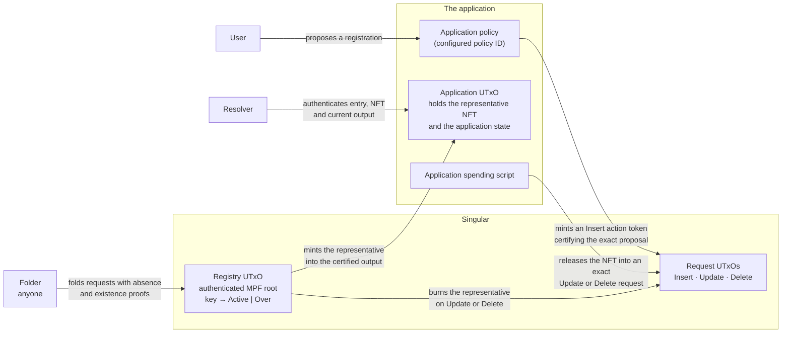

# Singular

A permissionless registry on Cardano for unique identities and independent application state.

<a href="simulator/"><strong>Try the simulation</strong></a> — queue competing registrations, change an application's address, and explore retirement and Delete. The [simulation guide](docs/simulation.md) explains the manual controls and the admitted-model limits.

## Who this is for

**An application developer** wants keys that are unique across everyone using the application — names, identifiers, handles — without running a registrar. They supply one parameter, their application policy ID, and get a registry in which every active key is represented by exactly one NFT sitting in one of their own application outputs. Singular mints that NFT when a certified registration is folded in, burns it when the key is retired or released, and lets a released key be registered again.

**A user of that application** asks it to register a key. The application approves the exact proposal — the key, the initial state, where the NFT will live — and the user's request waits, holding no NFT, until someone folds it into the registry. If the key is already taken by then, the registration fails and the user can withdraw the request; nothing was reserved by asking.

**A folder** — anyone at all — collects pending requests and applies them to the registry in one transaction. There is no owner to sign, no privileged actor, and no way to fold a request that does not satisfy the protocol.

**A resolver** wants to know whether a key is active and where its application state currently lives. It authenticates the registry entry, finds the NFT, and reads the application's own output. A key that is retired or in a pending terminal request yields no live state.

## How the parts fit

The application keeps its state in the UTxO holding the NFT and controls its own local transitions; the registry never sees that state. Singular records only whether a key has an outstanding representative or has been permanently retired, and enforces the coupling between registry transitions and NFT supply.

| Registry request | Before | After | Representative NFT |
| --- | --- | --- | --- |
| Insert | Absent | `Active` | Mint into the certified application output |
| Update | `Active` | `Over` | Burn; permanently reserve the key |
| Delete | `Active` | Absent | Burn; make the key available again |

`Active` and `Over` contain no application payload. Registry **Update** means retirement, not an application-state update. `Over` is terminal.

The configured application policy ID is the authorization anchor. It mints action tokens whose asset names hash the action and its necessary parameters. Insert approval binds the registry/key, initial application datum and destination. Withdraw approval separately binds the exact pending Insert and its refund requirements; Insert approval alone cannot authorize cancellation.

Insert carries no representative NFT, can fail at folding if its key is occupied, and can be withdrawn with the required authorization. Update/Delete carry the existing representative after the application authorizes its exact release, and retain it until completion. The concrete request-token arrangement for Update/Delete remains open.

Read the design in order:

1. [Responsibilities and terminology](docs/overview.md)
2. [Requests, folding and NFT custody](docs/lifecycle.md)
3. [Certification and identity binding](docs/certification.md)
4. [Naming walkthrough: register, resolve, change address](docs/naming-demo.md)
5. [Prior art and reuse candidates](docs/prior-art.md)
6. [Draft protocol specification and acceptance scenarios](specs/protocol/spec.md)

## Design status

These documents record the adopted design and name the decisions still needed for a concrete protocol. The [executable design candidate](docs/design.md) adds a logical Lean model, 41 proved theorem statements and a separately authored [playable simulation](docs/simulation.md). Every statement is proved from the standard axioms and the build refuses a re-admitted one; no independent audit acceptance or production validator is claimed. The [coverage ledger](docs/model-ledger.md) distinguishes finite executable evidence from conditions, abstractions and omissions.

Singular uses MPF as its authenticated registry data structure. Existing MPFS is a separate application with potentially reusable mechanics. The implementation stack and shared-library boundaries remain unselected; extracting a shared library is future work.

[Build and serve the documentation](docs/building.md) with the pinned Nix toolchain.
