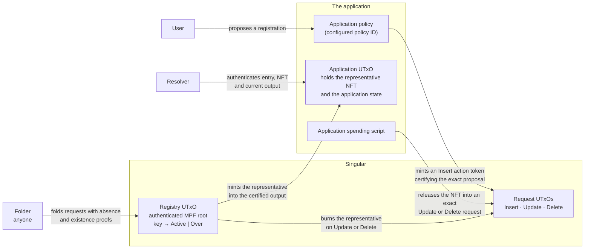

# Singular

A permissionless registry on Cardano for unique identities and independent application state.

<a href="https://lambdasistemi.github.io/singular/simulator/"><strong>Try the simulation</strong></a> — book a name, witness an absence and book it, retire a name and attest it, or drive the seven edges by hand and watch each refusal arrive by name. Switch the profile picker to the naming instance for the Over witness and the lifecycle replay. The [simulation guide](docs/simulation.md) says what the page establishes and what it does not.

## Who this is for

**An application developer** wants keys that are unique across everyone using the application — names, identifiers, handles — without running a registrar. They supply one parameter, their application policy ID, and get a registry in which every active key is represented by exactly one NFT sitting in one of their own application outputs. Singular mints that NFT when a certified registration is folded in, burns it when the key is retired or released, and lets a released key be registered again.

**A user of that application** asks it to register a key. The application approves the exact proposal — including the refund address stored in the request — and the request waits, holding no NFT, until someone folds it into the registry. Before folding, a separately authorized cancellation copies that stored refund address and leaves the name free; redirecting the refund, relying only on Insert certification, cancelling after fold, or replaying cancellation is refused. No fee, deposit, price, or bond rule is inferred.

**A holder of an active name** wants to keep payment routing current, recover through a committed next controller, or retire the name permanently. The [playable naming lifecycle](docs/naming-lifecycle.md) drives claim cancellation, maintenance, recovery, and controller-or-quorum retirement through the integrated transition, while retaining an exact 43-row model/corpus/browser reconciliation. It remains an unaccepted design candidate, not an observed ledger execution.

**A folder** — anyone at all — collects pending requests and applies them to the registry in one transaction. There is no owner to sign, no privileged actor, and no way to fold a request that does not satisfy the protocol.

**A resolver** wants to know whether a key is active and where its application state currently lives. It authenticates the registry entry, finds the NFT, and reads the application's own output. A key that is retired or in a pending terminal request yields no live state.

**An integrator with their own node** wants to run the whole thing on a public test network, funded by a wallet whose key never leaves their machine. [Run against your own preprod node](docs/consumer-onboarding.md) covers the release download, the node and wallet setup, the funding diagnostic and each journey end to end.

## How the parts fit

The application keeps its state in the UTxO holding the NFT and controls its own local transitions; the registry never sees that state. Singular records only whether a key has an outstanding representative or has been permanently retired, and enforces the coupling between registry transitions and NFT supply.

| Registry request | Before | After | Representative NFT |
| --- | --- | --- | --- |
| Insert | Absent | `Active` | Mint into the certified application output |
| Update | `Active` | `Over` | Burn; permanently reserve the key |
| Delete | `Active` | Absent | Burn; make the key available again |

`Active` and `Over` contain no application payload. Registry **Update** means retirement, not an application-state update. `Over` is terminal.

The configured application policy ID is the authorization anchor. It mints action tokens whose asset names hash the action and its necessary parameters. Insert approval binds the registry/key, initial application datum and destination. Withdraw approval separately binds the exact pending Insert and its refund requirements; Insert approval alone cannot authorize cancellation.

Insert carries no representative NFT, can fail at folding if its key is occupied, and can be withdrawn with the required authorization. Update/Delete carry the existing representative after the application authorizes its exact release, and retain it until completion. The concrete request-token arrangement for Update/Delete remains open.

Read the design in order:

1. [Responsibilities and terminology](docs/overview.md)
2. [Requests, folding and NFT custody](docs/lifecycle.md)
3. [Certification and identity binding](docs/certification.md)
4. [Naming walkthrough: register, resolve, change address](docs/naming-demo.md)
5. [Naming lifecycle: maintain, recover, retire](docs/naming-lifecycle.md)
6. [Play and reproduce the simulation](docs/simulation.md)
7. [Prior art and reuse candidates](docs/prior-art.md)
8. [Draft protocol specification and acceptance scenarios](specs/protocol/spec.md)
9. [Run against your own preprod node](docs/consumer-onboarding.md)

## Design status

These documents record the adopted design and name the decisions still needed for a concrete protocol. The [executable design candidate](docs/design.md) has **42** proved declarations — 24 for the registry, 7 for the naming instance, 6 for its lifecycle and 5 for its wire encoding — plus a [playable simulation](docs/simulation.md) transcribed from them. The focused checks replay 38 registry rows, 24 naming rows and 21 lifecycle rows; they test correspondence on those finite inputs rather than proving browser behaviour generally. No independent audit acceptance, compiled Cardano validator, or ledger execution is claimed. The [coverage ledger](docs/model-ledger.md) distinguishes finite executable evidence from conditions, abstractions and omissions, and the [clarity record](docs/LEAN-CLARITY.md) states plainly how much independence that evidence has.

The Nix-built documentation archive is a review bundle, not a released protocol artifact. It contains the rendered site and a runnable, locked workspace with raw model and corpus files, the naming contract, scenarios, simulator and replay sources, checkers, and exact identities. Reproduction starts from a fresh extraction, verifies `artifacts/SHA256SUMS`, and runs the archive's own flake; a checkout pass does not substitute. [Build and release details](docs/building.md) give the exact commands. No tag or publication is authorized by this candidate.

Singular uses MPF as its authenticated registry data structure. The product it was imported from is a separate application with potentially reusable mechanics. The implementation stack and shared-library boundaries remain unselected; extracting a shared library is future work.

[Build and serve the documentation](docs/building.md) with the pinned Nix toolchain.
