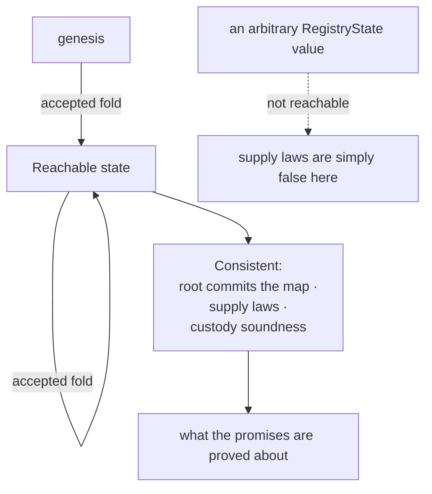

# Lean clarity record

A proof is only worth what its statement says. This page reads the registry-mode
model back in English — what each promise actually quantifies over, what it
assumes, and where the reader should not take it further than it goes — so that
"proved" can be checked against "promised" without reading Lean.

The statements themselves, with their digests, are in the
[theorem manifest](theorems.md). This page is about their **meaning**.

## Who this is for

A reviewer deciding whether the model is the right model. The build already
answers *are these proved* — all forty-two are, from the standard axioms and
nothing else. It cannot answer *do these say what the interface promised*, and
that is the question this page exists to make answerable.

## What is bound

| Artifact | SHA-256 |
| --- | --- |
| `Model.lean` | `c951e4bd7a0037431238affac3e85aa07f3c505d1a7fde4b15c9d86df7669cc8` |
| `Lemmas.lean` | `140304f12064d8865a2e4552f5fb1cb644774671783476a889daf52894505209` |
| `Statements.lean` | `f9a539ef56e9157f2fe6594b9e308eba3548fac2f42896eee6ea4a97f00761bb` |
| `Audit.lean` | `2ef1e8f78746b0c91267729b20633b1deab774ded5c12538a1295f5aa1597e6b` |
| `Main.lean` (corpus generator) | `a4ede59c77e07fb0c1e0e6d341f3bd3b230a35b39bb5220035d88d787b89d567` |
| `corpus.json` | `3e973e08e159cf9d1158a98f473ce27d788285255723f67368f370b3f3e9d073` |

Every one of these ships beside the page under `simulator/formal/`, and
`node simulator/mirror-check.mjs` fails if the shipped copy and the built copy
differ, in either direction. Changing any bound input invalidates this record.

## The shape the promises are made over

Almost every promise is stated **over reachable states** — genesis, closed under
accepted folds — and not over arbitrary values of the state type. This is not a
weakening dressed up as a hypothesis: over an arbitrary state value the supply
laws are false, because nothing stops you writing down a state with three active
tokens for one key. Reachability is what makes them true, and it is exactly the
property a chain enforces by only ever arriving at a state through a fold.

Where a promise does **not** need reachability, it does not assume it. The seven
inversions, the empty-batch refusal, the fold-cons equation and
`read_changes_nothing` are proved over any state at all, because they are
statements about what an accepted edge *did*, not about what the ledger holds.

## Reading the promises back

**No tree change without approval** (`no_tree_change_without_approval`). If a
request is accepted and it is not the read, then an approval was present, it was
minted under the registry's own pinned policy, its asset name is the hash of the
edge, the key, the owner and the destination of *this* request, and the
registry's own pins — its policy, its owner, its recovery commitment — are
unchanged by the fold. The part worth dwelling on: a correct policy is necessary
and **not sufficient**. An approval minted for a different key, or a different
destination, under the very same policy, does not admit the request. A model
that checked only the policy would be wrong in a way no amount of proving would
reveal, which is why the tuple appears in the statement rather than in a comment.

**Booked at most once** (`booked_at_most_once`). A batch is a fold, and the fold
spends each request once, in order. The statement is about the *step function*,
so a request cannot be applied twice within one batch, and a batch that fails
anywhere produces no state at all rather than a partial one.

**Soundness of attestation** (`terminal_attestation_sound`). In a reachable
state, a terminal attestation exists for a key only if that key's leaf really is
terminal. Its companion (`terminal_mint_only_by_read`) supplies the provenance
half: the only edge that can bring a terminal token into existence is the read.
Together they say the witness cannot be forged and cannot be minted by a state
change.

**Permanence** (`terminal_attestation_permanent`). What a terminal attestation
says stays true through any later sequence of accepted folds. A terminal leaf
has no outgoing edge, so nothing downstream can make an already-issued
attestation false. This is the promise that lets a holder keep the witness
rather than re-reading the chain.

**The supply law** (`biconditional_supply_sync`). For every key in a reachable
state, the count of outstanding active tokens is one exactly when the leaf is
active and zero otherwise — a biconditional, both directions, over all keys, not
only the key in hand. The same shape holds for the absent witness. This is the
statement that ties the token supply to the map and makes "the token is the
name" more than a slogan.

**Occupancy and its converse** (`occupancy`, `occupancy_free_key_succeeds`). A
booking edge succeeds only on a key that is not already taken; and on a key that
is free, with a matching approval, it *does* succeed. The converse matters as
much as the rule: a registry that refused everything would satisfy the first
half perfectly.

**Termination** (`termination`). On a terminal key every leaf-moving edge is
refused. Not "should be", not "by convention" — the refusal is the complement of
the edge table, so there is no unlisted case that quietly moves a retired name.

**The four witness laws** (`active_witness_unique`, `absent_witness_unique`,
`terminal_witness_plural`, `witness_kinds_exclude`). At most one active token
per key, and exactly one when the leaf is active. The same for the absent
witness. Terminal attestations, by contrast, are **plural**: any number may
exist, each is true, and minting another changes nothing — which is the
consequence of the attestation being a read. And the kinds exclude one another:
a key cannot have an outstanding active token and an outstanding absent witness
at the same time.

**The seven inversions.** For each edge, a single statement saying what an
accepted application of it did: the leaf before, the leaf after, the new root,
the token deltas, the custody movement, the deposit destination. These are the
statements the simulator is really transcribing, and they are the ones to read
first when asking whether the model matches the interface, because they contain
no reachability hypothesis to hide behind.

**The deposit** (inside `update_active_inversion` and
`delete_absent_inversion`). The two edges that consume an absent witness pay the
deposit back to the **refund address the original request named**, not to the
output of the consuming request and not to whoever folded it. Those two rejected
destinations are the reason the statement pins the address rather than merely
asserting that some payment occurred.

**The read** (`read_changes_nothing`, `witness_terminal_inversion`). An accepted
read leaves the leaf, the root and custody exactly as they were and adds one
terminal token. It needs no approval at all — and, symmetrically, a stray
approval does not make it refuse.

**The fold** (`empty_fold_error`, `fold_batch_cons`). An empty batch is refused
rather than accepted as a no-op. A non-empty batch succeeds exactly when its
head applies and the rest applies to the result, which is what makes a batch
mean the same thing as the sequence of its requests.

## What the model does not say

These are limits of the model, not gaps in the proofs. Each is a place where a
reader could reasonably expect more than is there.

| Point | What the model does | What it does not claim |
| --- | --- | --- |
| Keys and owners | integers, compared for equality | no string encoding, no address codec, no key derivation |
| Approvals | a value carrying a policy and a tuple | no signature is checked; minting authority is assumed, not verified |
| The deposit | a number that must arrive at a named address | not lovelace, no fee model, no minimum-UTxO arithmetic |
| The root | a fold over the map, recomputed | not the MPFS trie's own hashing; collision resistance is assumed |
| Retirement authority | the recovery commitment or a distinct-member quorum | the current control key alone never certifies it, and the model says so, but no signature scheme is modelled |
| Reachability | genesis closed under accepted folds | a chain that arrives at a state by any other route is outside every promise above |
| Validators | nothing | no compiled script, no ledger rule, no transaction is executed here |

The last row is the important one. Everything on this page is about a model.
Whether the deployed validator implements it is a different question with a
different kind of evidence behind it, and this page is not that evidence.

## How much independence this record has

Stated plainly, because a reader cannot see it from the outside: **the model,
the corpus generator, the simulator transcription and this readback all have the
same author.**

That has a concrete consequence. A misunderstanding of the interface made while
writing the model will be made again while transcribing it and again while
reading it back, and none of the three will catch it — they are not independent
measurements, they are one measurement repeated. What the internal machinery
*does* catch is real but narrower: transcription slips (the corpus replay),
statements that do not constrain what they appear to (the
[mutation record](mutants.md)), unproved obligations (the compiled axiom check),
and drift between the shipped Lean and the built Lean (the mirror check).

The check this record cannot perform on itself is the one that matters most —
whether the statements say what the interface promised. That requires someone
who did not write them. Treat this page as the author's best account, written to
be falsifiable, and not as an audit.
