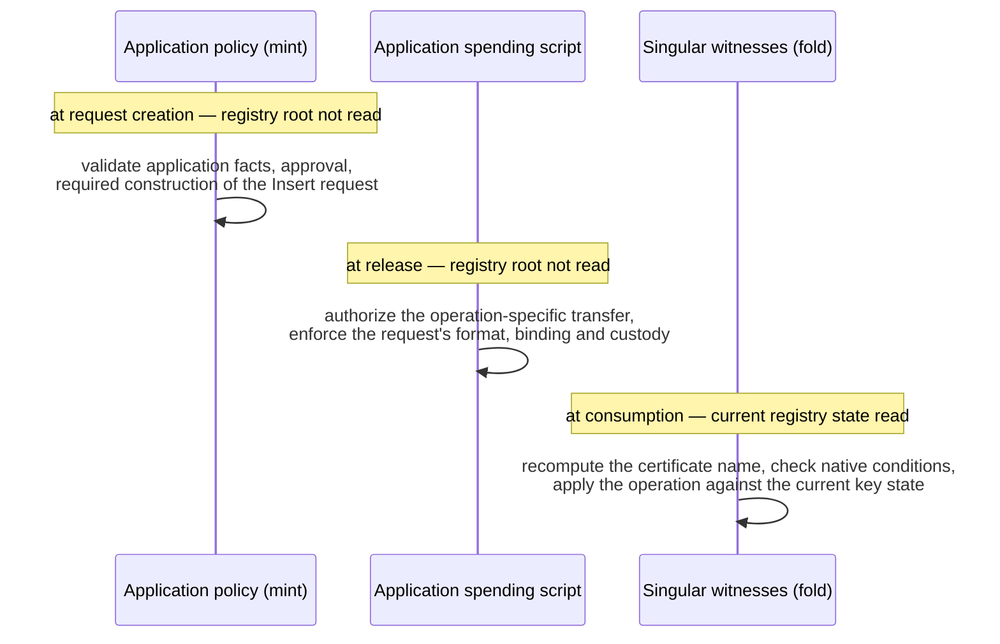

# Certification and identity binding

Singular recognizes native requests. Applications decide whether the requested application behavior is authorized. Insert needs evidence of application approval because there is no existing representative NFT leaving an application UTxO. Update/Delete use the application's authorization of that NFT's transfer into the exact request.

## Policy and script roles

```mermaid
flowchart LR
  REGID["Registry identity<br/>which registry, which rules"]
  REP["Singular representative policy<br/>mints and burns representatives<br/>coupled to registry transitions"]
  APOL["Configured application policy<br/>approves Insert proposals<br/>mints Insert and Withdraw action tokens"]
  ASCR["Application spending script<br/>governs the representative's application UTxO<br/>authorizes exact Update/Delete releases"]
  REGID -->|configured parameter:<br/>the application policy ID| APOL
  APOL -->|action token named by<br/>hash(action, parameters)| REQ["Request UTxO"]
  REQ -->|folded| REP
  REP -->|representative into the<br/>certified application output| ASCR
  ASCR -->|existing NFT into an<br/>exact terminal request| REQ
```

| Identity | What it governs |
| --- | --- |
| Registry identity | Which registry and its rules this request belongs to |
| Singular representative policy | Creation and destruction of representative NFTs coupled to registry transitions |
| Configured application policy | Application authorization, including approval of the particular Insert proposal and the source of cancellation authorization |
| Application action-token issuer | The configured application policy mints Insert and Withdraw tokens; their names commit to distinct actions and parameters |
| Application spending script | Future legal spends of the representative's application UTxO |

The configured application policy ID and an application spending script hash are different roles. One multipurpose script could implement both roles, but sharing a hash is neither required nor forbidden. The same distinction applies to the native policy roles. The eventual implementation must say which roles share code and parameters; this document does not assume separate hashes for all of them.

Writing a policy ID into a request is not enough to make it trusted. The accepted certifier must be authenticated and bound to the registry's rules, so an attacker cannot choose a self-issued certificate. The application policy ID is configured as a Singular parameter; the concrete configuration and binding mechanism remain open. No mandatory global allowlist is selected.

The interface target is **one application-specific parameter: the application policy ID**. Registry identity and native policy settings are separate protocol configuration. Insert initial state and application destination are approved per-request values, not additional fixed application parameters. This target is not yet proved sufficient for a concrete protocol.

Insert and Withdraw use tokens minted directly under this configured application policy. Singular checks the policy ID and recomputes the action-bound asset name. No second mandatory Singular request policy/token is selected for these actions. Update/Delete retain their NFT-based release authorization; any additional request token or issuer for them remains open.

## What Insert exposes and binds

The logical Insert proposal must expose enough information for certification and the native fold to agree on exactly what will be created:

| Logical field | Meaning |
| --- | --- |
| Registry identity | Target registry and associated rules |
| Operation and key | Insert for this exact key |
| Configured application policy identity and evidence | Which configured policy approved this proposal, with evidence bound to its contents |
| Initial application state/datum | The exact initial state required in the representative's output |
| Application destination | The required application spending script and address constraints |
| Representative/output requirements | The representative identity and quantity required by registry rules, plus any other output value constraints that the proposal requires |

The registry target, operation, key, initial state and destination must not be substitutable after certification. Native folding verifies that the created NFT output satisfies the certified requirements. These are explicit native output parameters: NFT identity/quantity, destination, datum and value constraints supported by the eventual schema. 'Required effects' is not an unspecified language of arbitrary transaction predicates. Applications needing fresh observations or additional effects at folding fall outside demonstrated precertification coverage unless the native contract explicitly supports them.

The action-token asset name is a hash of a canonical, domain-separated action and its necessary parameters:

| Action token | Committed content |
| --- | --- |
| Insert | Insert tag, registry, key, initial application datum, application destination, declared required effects |
| Withdraw | Withdraw tag, registry, exact pending Insert UTxO, required refund terms/effects |

The configured application policy approves minting. Singular checks the expected action-bound name. Separate tags prevent treating Insert approval as Withdraw approval. Withdrawal consumes the bound pending Insert without representative minting or a registry update.

Unambiguous canonical encoding and domain separation are required. The specific hash function, binary schema, datum representation, refund economics and token disposal remain open.

## Validation without mutable registry observation



The configured application minting policy validates application facts, approval and the required construction when it mints the Insert asset. Singular checks the resulting certificate and native conditions when it consumes a request. Native format alone cannot authorize Insert; otherwise arbitrary non-application datums could claim keys. It need not read the current registry root or promise that Insert will succeed. Singular checks the current key state when applying the operation.

For Update/Delete, the application spending validator approves the operation-specific transfer of the existing NFT. That spending validator must enforce the resulting request's required format, binding and custody in the release transaction. Singular rechecks its native conditions when consuming the request. Establishing the release need not read the mutable registry UTxO.

Authenticated registry configuration may still be needed. The design must bind the registry, request/representative policies, certifier and application destination without circular script-hash dependencies. No concrete configuration layout or hash-cycle solution has been selected.

## Which script actually executes

Sending an output to a script address does not execute that receiving spending validator. It runs when the output is later consumed. A malformed outsider output can exist at the address without being a valid Singular request. [Cardano validation](https://docs.cardano.org/about-cardano/learn/transaction-costs-determinism#validation)

| Transaction or action | Executing witness and obligation |
| --- | --- |
| Mint Insert action asset | Application minting policy approves the proposal and enforces certified request construction |
| Release NFT into Update/Delete request | Application spending validator authorizes the exact operation and enforces the request output's binding and custody |
| Fold request | Singular request/registry spending validators check consumption, native bindings and map transition; representative mint/burn policy, when invoked, couples NFT supply to the transition |
| Withdraw pending Insert | Application policy approves the Withdraw asset; Singular's spending validator checks the consumed Insert, action binding and refund effects |
| Net mint/burn of an application action asset | Its policy executes for the nonzero mint-field change; moving an existing token alone does not invoke it |

The division among concrete Singular scripts remains an implementation decision; no extra creation-time request policy is assumed. Recognizing the configured issuer proves where approval came from. It does not prove that an arbitrary application's minting/spending scripts correctly implement their claimed semantics. End-to-end application properties are conditional on those contracts.

If folding has a nonzero net burn under an application action policy, that policy executes in the transaction. A cheap burn branch could avoid repeating expensive semantic checks, but disposal and that branch's contract are still open. Certification can move checks earlier; it does not establish zero application-policy execution or a speedup. [Cardano minting policies](https://developers.cardano.org/docs/developers/curriculum/native-tokens/minting-policies/)

The mint field records net quantities per asset, not one ledger action per logical fold operation. If a future construction reuses a representative's asset identity and combines Delete with Insert, their negative/positive quantities could cancel. The fold/request witnesses must still enforce both logical transitions and custody; a mint policy alone cannot be assumed to run when its mint-field entries vanish. This is an inference for Singular's open construction, not a discovered implementation bug. [CIP89 discusses net-zero beacon updates and spending-side enforcement](https://cips.cardano.org/cip/CIP-0089). Moving an existing application action token likewise does not rerun its minting policy; token scope and custody must account for that.

## Decisions still required

| Decision | Constraint already fixed |
| --- | --- |
| Registry and policy configuration | Accepted certification must be authentic; arbitrary self-selected issuers are insufficient |
| Update/Delete request-token construction | Existing NFT release is the authorization path; do not add an attestation solely to repeat it |
| Request/certificate encoding and lifecycle | Bind the exact operation and effects; prevent request acceptance after completion |
| Insert withdrawal and refunds | Separate application-minted Withdraw token binds the exact pending Insert and refund effects; concrete economics, approval conditions and disposal remain open |
| Representative identity across Delete/reinsert | A deleted key may be registered again; old signatures or certificates must not silently authorize a fresh incarnation |
| Batch selection and limits | Operations follow successive MPF states; no arbitrary skip semantics or capacity claim is assumed |
| Implementation and shared libraries | Singular owns these application semantics; old MPFS code or proofs do not automatically establish them |

This is an adopted design with unresolved construction details. There is no implementation, completed proof, universal application language or mandatory general-purpose validation plugin in this repository.
