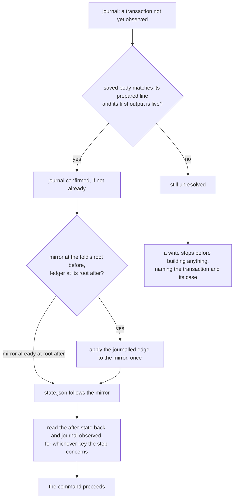

# Recovering a registry command

You run `singular registry create`, `insert`, `update`, `terminate` or
`inspect`, and something goes wrong between your machine and the chain:
the node's answer to a submission never arrives, the process is killed,
the machine stops halfway through saving its files. You want to know
which of those happened, you want the next command to pick up from
where the last one stopped without sending anything twice, and you want
to be told plainly when it cannot.

This page describes what the ordinary commands do in each case and what
you do next. Every write records each transaction it submits in the
registry's journal, `journal.jsonl`, phase by phase, before taking the
next step: `prepared` (the signed body saved beside the journal,
before it is sent), the node's answer, the confirmation, and
`observed` (what the transaction made, read back from the chain). The
journal is only ever appended to; saved bodies are never rewritten.

## The case each submission met

Every write's receipt lists the transactions it prepared under
`submissions`, each with its step, its id, its case and whether its
after-state was observed. The case is read from the journal:

| case | journal phase | what it means | what you do next |
|---|---|---|---|
| `acknowledged` | `submitted` | the node accepted the transaction; it was not yet seen on chain | run your next command; it reconciles the transaction once it is on chain |
| `unknown` | `submit-unknown`, or nothing after `prepared` | no answer arrived: the node may or may not have the transaction | run your next command; if the transaction landed it is reconciled, otherwise the command stops and names it |
| `rejected` | `rejected` | the node refused it; nothing changed on chain | correct the cause the receipt names and run the command again |
| `included` | `confirmed` or `observed` | the transaction is on chain | nothing; a later command finishes the local commit if this one could not |
| `timeout` | `unconfirmed` | accepted, but not seen on chain before the confirmation deadline | run your next command; it reconciles the transaction once it is on chain |

A command that stops after a submission exits `partial` (status 15), or
`timeout` (13) when the confirmation deadline passed, and its receipt
names the case. Nothing is ever sent a second time: a transaction is
prepared once, and the journal shows exactly one `prepared` line for it.

## The next command reconciles

After an inclusion, a write commits locally in a fixed order: the
registry's proof mirror, then `state.json`, then the `observed` line.
Each file is replaced whole or not at all, so an interruption leaves
the previous version or the new one, never a torn file. Wherever the
interruption fell, the next ordinary command — any write, or `inspect` —
finishes the commit from chain evidence before it does anything else,
and submits nothing while doing so.



The edge a fold commits is applied to the mirror only from the root it
was journalled to fold from, and only when the ledger already holds the
root it was journalled to reach — so it is applied at most once. A
mirror that commits to any other root is stale local state: it is
refused, never repaired. The observation is made for the key the
interrupted step concerned, whichever key the current command targets.

A write's receipt carries what the reconciliation did under
`reconciled`: the transactions it found unresolved, the folds whose
edge it applied, whether it brought `state.json` along, and the
transactions it observed. `inspect` reports the same under `recovery`,
`mirrorAdvanced` and `observed`. `inspect` reconciles only while no
other `singular` process is writing to the registry; otherwise it reads
without reconciling and says so.

## When the next command stops

A write that finds a transaction it cannot reconcile stops before it
builds or submits anything. Its outcome is `partial` (status 15), and
its receipt names the transaction under `unresolved` with its step, its
last journalled phase and its case; the journal does not move.

- `acknowledged`, `unknown` or `timeout`: the chain does not yet show
  the transaction. Wait for the network and run the command again; when
  the transaction lands, the next command reconciles it.
- `included`: the transaction is on chain, but its journalled edge does
  not take the mirror to the ledger's root. The outcome is
  `stale-state` (status 14): the local files no longer follow the chain
  and are not repaired.

A transaction that never reached the node stays `unknown`: nothing on
chain will ever show it, and every write stops on it. Recovering from a
transaction the chain shows will never land, and from an inclusion the
chain later rolls back, is not yet supported.

## What the checks show

The recovery controls run each case as separate `singular` processes
against one generated development node, and judge every clause from the
receipts the processes printed, the registry's journal, its saved
bodies and its files:

```sh
nix run --quiet .#cli-recovery-controls
```

| control | what happens | what the next command does |
|---|---|---|
| accepting | an insert completes | both submissions are named `included` and observed once; `state.json` holds the fold's root |
| lost answer | the node accepts an insert's fold but its answer is lost | at the moment of the send the fold's prepared line and saved body are already on disk; the insert stops naming the fold `unknown`, and the next insert applies its edge once, observes it once and proceeds |
| killed before the commit | an insert is killed once its fold is confirmed, before the mirror is saved | the next write, an update of another key, applies the edge once, brings `state.json` along and proceeds |
| killed after the mirror | a terminate is killed once the mirror is saved, before `state.json` | the next insert applies nothing, brings `state.json` to the mirror, observes the fold and proceeds |
| killed before the observation | an insert is killed once `state.json` is written, before its fold is observed | the next insert applies nothing, observes the fold and proceeds |
| never sent | an insert's fold never reaches the node | the next write stops before building anything, naming the fold and the case `unknown`; the journal does not move |

Across every control, each journalled transaction has exactly one
`prepared` line, the journal is only ever appended to, and no saved body
changes. These controls do not establish durability across a power
loss, only across a killed process.
