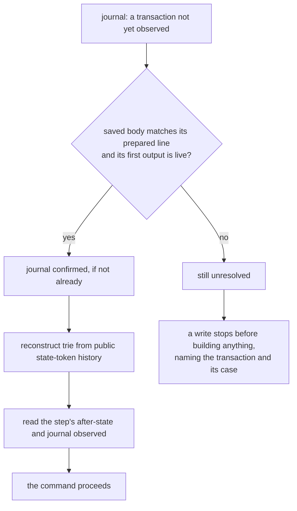
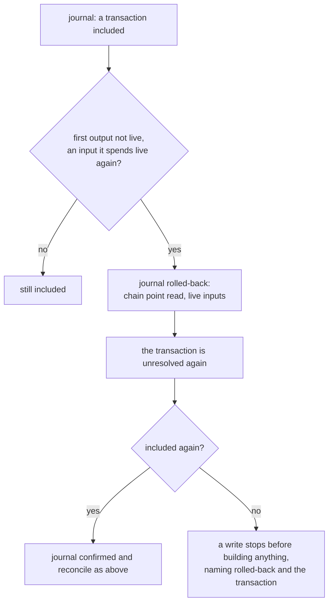

# Recovering a registry command

You run `singular registry create`, `insert`, `update`, `terminate` or
`inspect`, and something goes wrong between your machine and the chain:
the node's answer to a submission never arrives, the process is killed,
the machine stops halfway through saving its files, or a transaction the
chain had included is rolled back. You want to know which of those
happened, you want the next command to pick up from where the last one
stopped without sending anything twice, and you want to be told plainly
when it cannot.

This page describes what the ordinary commands do in each case and what
you do next. Every write records each transaction it submits in the
registry's journal, `journal.jsonl`, phase by phase, before taking the
next step: `prepared` (the signed body saved beside the journal,
before it is sent), the node's answer, the confirmation, and
`observed` (what the transaction made, read back from the chain). The
journal is only ever appended to; saved bodies are never rewritten.

## The request keeps its registry's windows

As a requester recovering after an interruption, you read `processTime` and
`retractTime` from `registry inspect` to see the windows stored in the live
state datum. They were chosen once at `registry create` with `--process-time`
and `--retract-time`, or defaulted to 600 000 and 300 000 milliseconds (ten
and five minutes). Both are fixed for the life of the registry; restarting a
command or reconciling its journal does not restart or extend a request's
windows. A booking's fold deadline remains its submission time plus the
registry's processing window, followed by the owner's retract window.

## The case each submission met

Every write's receipt lists the transactions it prepared under
`submissions`, each with its step, its id, its case and whether its
after-state was observed. The case is read from the latest phase the
journal holds for the transaction:

| case | journal phase | what it means | what you do next |
|---|---|---|---|
| `acknowledged` | `submitted` | the node accepted the transaction; it was not yet seen on chain | run your next command; it reconciles the transaction once it is on chain |
| `unknown` | `submit-unknown`, or nothing after `prepared` | no answer arrived: the node may or may not have the transaction | run your next command; if the transaction landed it is reconciled, otherwise the command stops and names it |
| `rejected` | `rejected` | the node refused it; it changed nothing on chain | correct the cause the receipt names and run the command again — unless it was the fold of an `insert` or `terminate`, whose booking is on chain: that leaves the [same pending request as an excluded fold](#when-a-transaction-can-never-land) |
| `included` | `confirmed` or `observed` | the transaction is on chain | nothing; a later command finishes the local commit if this one could not |
| `timeout` | `unconfirmed` | accepted, but not seen on chain before the confirmation deadline | run your next command; it reconciles the transaction once it is on chain |
| `rolled-back` | `rolled-back` | the chain had included the transaction and no longer does | run your next command; if the transaction is included again it is reconciled, otherwise the command stops and names it |
| `excluded` | `excluded` | the transaction is not on chain and its validity window has closed: it can never be included | for an `update`, run it again; for the fold of an `insert` or `terminate`, see [what an excluded fold leaves on chain](#when-a-transaction-can-never-land) |

A command that stops after a submission exits `partial` (status 15), or
`timeout` (13) when the confirmation deadline passed, and its receipt
names the case. Nothing is ever sent a second time: a transaction is
prepared once, and the journal shows exactly one `prepared` line for it.

## The next command reconciles

After an inclusion, the command selects its proof state from public state-token
history and reads back the step's after-state before appending `observed`.
The next ordinary write or `inspect` reconciles unfinished observations from
public chain evidence before proceeding, without submitting anything. Proof
state is reconstructed afresh; no mirror or saved-root file is read or written.



The journal tracks this actor's submissions. It never supplies a replay edge,
proof or root. Missing history and a root that does not chain are named
refusals; an empty trie cannot substitute for unavailable history. The
observation concerns the interrupted step's key, even when the current command
targets another key.

A write reports reconciliation under `reconciled`: `rolledBack`, `recovery`,
`excluded` and `observed`. Inspect reports the same fields at the receipt's top
level. Inspect reconciles only while no other process holds this directory's
write lock; otherwise it reads without reconciling and says so.

## When the chain rolls back

A transaction journalled `confirmed` or `observed` can leave the chain
again. The next command checks every such transaction against the chain
it reads: when its first output is not live and an input it spends is
live again, it is no longer on the chain, since a transaction on the
chain has consumed every input it spends. The command appends a
`rolled-back` line naming the chain point it read and the inputs it
found live; the `observed` line it supersedes stays where it was.



Proof state follows the public history selected by the current command,
including rollbacks. The journal does not rebuild a private trie. The
rolled-back transaction is never sent again. If the chain includes it again,
the next command journals it confirmed and reconciles its observation;
otherwise writes stop on it, naming the case `rolled-back`.

## When a transaction can never land

A transaction carries a validity window. Once the chain's tip has
reached the end of that window and an input the transaction spends is
still live — so it is not on the chain — it can never be included. The
next command appends an `excluded` line naming the chain point it read
and the live inputs. The transaction is settled in the journal: no
later command stops on it, and its edge was never applied. A write that
excluded a transaction then proceeds, building from the root selected by fresh public replay.

What the excluded transaction leaves on chain depends on the command.
An excluded `update` leaves nothing: run it again. The fold of an
`insert` or a `terminate` is the second of two transactions, and the
first, its booking, is on chain: its request stays pending, holding its
deposit. Use `registry fold` while its processing window allows it, `registry reclaim`
with the owner's wallet in its retract window, or `registry reject` after both
windows expire. An insertion fold still needs the booker's envelope preimage;
folding another actor's insertion remains pending under #419. A termination
fold can use another actor's independent directory and public replay.

A fold carries an upper bound on its validity window. A booking, and the
publications `create` makes, carry none: a booking that never landed,
or one rolled back and not included again, stays unresolved however far
the chain moves on, and every write stops on it. That is a known limit
of these commands, not a judgement about the transaction.

## When the next command stops

A write that finds a transaction it cannot reconcile stops before it
builds or submits anything. Its outcome is `partial` (status 15), and
its receipt names the transaction under `unresolved` with its step, its
last journalled phase and its case; the journal does not move.

- `acknowledged`, `unknown` or `timeout`: the chain does not yet show
  the transaction. Wait for the network and run the command again; when
  the transaction lands, the next command reconciles it, and when its
  validity window closes without it, the next command excludes it —
  for the fold of an insert or a terminate, with the
  [pending request it leaves](#when-a-transaction-can-never-land).
- `rolled-back`: the chain no longer shows a transaction it had
  included. Wait and run the command again; it reconciles the
  transaction if the chain includes it again, and excludes it once its
  validity window closes without it, with the same pending request when
  it is a fold. A booking has no window and stays rolled back.
- `included`: the transaction is on chain, but public history is incomplete
  or its reconstructed root does not chain. The named trie refusal preserves
  its existing outcome and exit status; the journal cannot repair public facts.

`inspect` names the same unresolved transaction and its case, with the
outcome `partial`, alongside the root and chain point it read.

## What the checks show

The recovery controls run each case as separate `singular` processes
against one generated development node, and judge every clause from the
receipts the processes printed, the registry's journal, its saved
bodies and its files, and — for exclusion and rollback — from the
node's own answers, read with `devnet probe` and its block adoption
trace, never through the command under test:

```sh
nix run --quiet .#cli-recovery-controls
```

| control | what happens | what the next command does |
|---|---|---|
| accepting | an insert and fold complete | both submissions are named included and observed once; inspect reconstructs the fold's root from public history |
| lost answer | the node accepts a fold but its answer is lost | the prepared line and saved body predate the send; the next command reconstructs public state, observes the fold once and proceeds |
| killed before the commit | a fold confirms, then its process is killed before fresh replay | the next command reconstructs public state, observes the fold once and proceeds |
| killed before the observation | a fold's replay is checked, then its process is killed before observed | the next command reconstructs public state, observes the fold once and proceeds |
| never sent, past its upper bound | a fold never reaches the node, and the tip passes its upper bound | the next write journals excluded with the chain point and live inputs, then proceeds from fresh public replay |
| never sent, without an upper bound | a booking never reaches the node | the next write stops naming the booking and unknown; it neither resubmits nor invents its inclusion |
| rolled back | the generated node restores a database copy from before an observed booking and fold | public reads show their inputs live again; the journal appends rolled-back, writes stop naming the booking and no transaction is resent |


The rolled-back control is a mechanism of the generated development
node — its database restored to an earlier copy — and not a fork of a
public chain: it shows what the commands do when the chain they read no
longer holds a transaction, not how often or how deeply a public network
rolls back. Across every control, each journalled transaction has
exactly one `prepared` line, the journal is only ever appended to, and
no saved body changes. These controls do not establish durability
across a power loss, only across a killed process.
