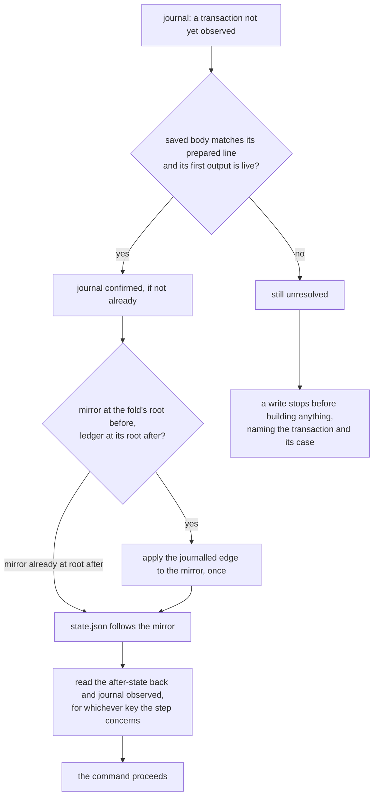
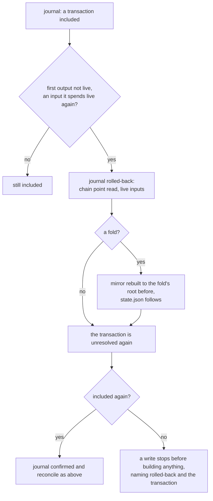

# Recovering a registry command

You run `singular registry create`, `insert`, `update`, `terminate` or
`inspect`, and something goes wrong between your machine and the chain:
the node's answer to a submission never arrives, the process is killed,
the machine stops halfway through saving its files, or a transaction the
chain had included is rolled back. You want to know which of those
happened, you want the next command to pick up from where the last one
stopped without sending anything twice, and you want to be told plainly
when it cannot.

This page describes what the ordinary commands do in each case and what
you do next. Every write records each transaction it submits in the
registry's journal, `journal.jsonl`, phase by phase, before taking the
next step: `prepared` (the signed body saved beside the journal,
before it is sent), the node's answer, the confirmation, and
`observed` (what the transaction made, read back from the chain). The
journal is only ever appended to; saved bodies are never rewritten.

## The request keeps its registry's windows

As a requester recovering after an interruption, you read `processTime` and
`retractTime` from `registry inspect` to see the windows stored in the live
state datum. They were chosen once at `registry create` with `--process-time`
and `--retract-time`, or defaulted to 600 000 and 300 000 milliseconds (ten
and five minutes). Both are fixed for the life of the registry; restarting a
command or reconciling its journal does not restart or extend a request's
windows. A booking's fold deadline remains its submission time plus the
registry's processing window, followed by the owner's retract window.

## The case each submission met

Every write's receipt lists the transactions it prepared under
`submissions`, each with its step, its id, its case and whether its
after-state was observed. The case is read from the latest phase the
journal holds for the transaction:

| case | journal phase | what it means | what you do next |
|---|---|---|---|
| `acknowledged` | `submitted` | the node accepted the transaction; it was not yet seen on chain | run your next command; it reconciles the transaction once it is on chain |
| `unknown` | `submit-unknown`, or nothing after `prepared` | no answer arrived: the node may or may not have the transaction | run your next command; if the transaction landed it is reconciled, otherwise the command stops and names it |
| `rejected` | `rejected` | the node refused it; it changed nothing on chain | correct the cause the receipt names and run the command again — unless it was the fold of an `insert` or `terminate`, whose booking is on chain: that leaves the [same pending request as an excluded fold](#when-a-transaction-can-never-land) |
| `included` | `confirmed` or `observed` | the transaction is on chain | nothing; a later command finishes the local commit if this one could not |
| `timeout` | `unconfirmed` | accepted, but not seen on chain before the confirmation deadline | run your next command; it reconciles the transaction once it is on chain |
| `rolled-back` | `rolled-back` | the chain had included the transaction and no longer does | run your next command; if the transaction is included again it is reconciled, otherwise the command stops and names it |
| `excluded` | `excluded` | the transaction is not on chain and its validity window has closed: it can never be included | for an `update`, run it again; for the fold of an `insert` or `terminate`, see [what an excluded fold leaves on chain](#when-a-transaction-can-never-land) |

A command that stops after a submission exits `partial` (status 15), or
`timeout` (13) when the confirmation deadline passed, and its receipt
names the case. Nothing is ever sent a second time: a transaction is
prepared once, and the journal shows exactly one `prepared` line for it.

## The next command reconciles

After an inclusion, a write commits locally in a fixed order: the
registry's proof mirror, then `state.json`, then the `observed` line.
Each file is replaced whole or not at all, so an interruption leaves
the previous version or the new one, never a torn file. Wherever the
interruption fell, the next ordinary command — any write, or `inspect` —
finishes the commit from chain evidence before it does anything else,
and submits nothing while doing so.



The edge a fold commits is applied to the mirror only from the root it
was journalled to fold from, and only when the ledger already holds the
root it was journalled to reach — so it is applied at most once. A
mirror that commits to any other root is stale local state: it is
refused, never repaired. The observation is made for the key the
interrupted step concerned, whichever key the current command targets.

A write's receipt carries what the reconciliation did under
`reconciled`: the transactions it journalled rolled back, those it found
unresolved, those it excluded, the root it returned the mirror to after
a rollback, the folds whose edge it applied, whether it brought
`state.json` along, and the transactions it observed. `inspect` reports
the same under `rolledBack`, `recovery`, `excluded`, `mirrorRewound`,
`mirrorAdvanced` and `observed`. `inspect` reconciles only while no
other `singular` process is writing to the registry; otherwise it reads
without reconciling and says so.

## When the chain rolls back

A transaction journalled `confirmed` or `observed` can leave the chain
again. The next command checks every such transaction against the chain
it reads: when its first output is not live and an input it spends is
live again, it is no longer on the chain, since a transaction on the
chain has consumed every input it spends. The command appends a
`rolled-back` line naming the chain point it read and the inputs it
found live; the `observed` line it supersedes stays where it was.



For a fold, the `rolled-back` line also names the root the mirror
returns to: the root the fold was journalled to fold from. The mirror is
rebuilt from the empty trie the registry was created with, by applying
in journal order the edges of the folds still on the chain, each from
its journalled root before to its journalled root after; `state.json`
follows it. If that rebuild does not reach the fold's root before, the
local files are stale and the command stops `stale-state`, writing
nothing. The rolled-back transaction is never sent again. If the chain
includes it again — another node still had it — the next command
journals it `confirmed` and reconciles it as above; otherwise every
write stops on it, naming the case `rolled-back`.

## When a transaction can never land

A transaction carries a validity window. Once the chain's tip has
reached the end of that window and an input the transaction spends is
still live — so it is not on the chain — it can never be included. The
next command appends an `excluded` line naming the chain point it read
and the live inputs. The transaction is settled in the journal: no
later command stops on it, and its edge was never applied. A write that
excluded a transaction then proceeds, building from the root the mirror
already holds.

What the excluded transaction leaves on chain depends on the command.
An excluded `update` leaves nothing: run it again. The fold of an
`insert` or a `terminate` is the second of two transactions, and the
first, its booking, is on chain: its request stays pending, holding its
deposit. It blocks nobody: the next `registry fold`, or the next `insert
--fold` or `terminate --fold` by anyone, folds it together with every other
request it can. Once its processing deadline has passed a fold leaves it
out, naming it `window-closed`; its owner may then reclaim it inside its
retract window, and `registry reject` clears it after both windows.

Two folds may race for the registry's one state output: each built from
the same state, the first included spends it, and the node refuses the
other. That fold is refused `stale-state`, naming the state output another
fold spent; its journal line is closed `rejected`, nothing of it is on the
chain, and running it again folds whatever is still pending.

A fold carries an upper bound on its validity window. A booking, and the
publications `create` makes, carry none: a booking that never landed,
or one rolled back and not included again, stays unresolved however far
the chain moves on, and every write stops on it. That is a known limit
of these commands, not a judgement about the transaction.

## When the next command stops

A write that finds a transaction it cannot reconcile stops before it
builds or submits anything. Its outcome is `partial` (status 15), and
its receipt names the transaction under `unresolved` with its step, its
last journalled phase and its case; the journal does not move.

- `acknowledged`, `unknown` or `timeout`: the chain does not yet show
  the transaction. Wait for the network and run the command again; when
  the transaction lands, the next command reconciles it, and when its
  validity window closes without it, the next command excludes it —
  for the fold of an insert or a terminate, with the
  [pending request it leaves](#when-a-transaction-can-never-land).
- `rolled-back`: the chain no longer shows a transaction it had
  included. Wait and run the command again; it reconciles the
  transaction if the chain includes it again, and excludes it once its
  validity window closes without it, with the same pending request when
  it is a fold. A booking has no window and stays rolled back.
- `included`: the transaction is on chain, but its journalled edge does
  not take the mirror to the ledger's root. The outcome is
  `stale-state` (status 14): the local files no longer follow the chain
  and are not repaired.

`inspect` names the same unresolved transaction and its case, with the
outcome `partial`, alongside the root and chain point it read.

## What the checks show

The recovery controls run each case as separate `singular` processes
against one generated development node, and judge every clause from the
receipts the processes printed, the registry's journal, its saved
bodies and its files, and — for exclusion and rollback — from the
node's own answers, read with `devnet probe` and its block adoption
trace, never through the command under test:

```sh
nix run --quiet .#cli-recovery-controls
```

| control | what happens | what the next command does |
|---|---|---|
| accepting | an insert completes | both submissions are named `included` and observed once; `state.json` holds the fold's root |
| lost answer | the node accepts an insert's fold but its answer is lost | at the moment of the send the fold's prepared line and saved body are already on disk; the insert stops naming the fold `unknown`, and the next insert applies its edge once, observes it once and proceeds |
| killed before the commit | an insert is killed once its fold is confirmed, before the mirror is saved | the next write, an update of another key, applies the edge once, brings `state.json` along and proceeds |
| killed after the mirror | a terminate is killed once the mirror is saved, before `state.json` | the next insert applies nothing, brings `state.json` to the mirror, observes the fold and proceeds |
| killed before the observation | an insert is killed once `state.json` is written, before its fold is observed | the next insert applies nothing, observes the fold and proceeds |
| never sent, past its upper bound | an insert's fold never reaches the node, and the tip passes the fold's upper bound | the node reports the fold's inputs unspent; the next write, an update, journals the fold `excluded` with the chain point and those inputs, and proceeds from the root before it |
| never sent, without an upper bound | an insert's booking never reaches the node | the next write stops before building anything, naming the booking and the case `unknown`; the journal does not move |
| rolled back | on a second registry, an insert is observed, then the node is restarted on a copy of its database taken before the insert | the node's reads show the blocks that carried the booking and the fold gone and their inputs unspent; `inspect` journals both `rolled-back`, returns the mirror to its bytes before the insert and `state.json` to the fold's root before, and stops naming the booking; the next write stops the same way; no block the node makes carries either transaction again |

The rolled-back control is a mechanism of the generated development
node — its database restored to an earlier copy — and not a fork of a
public chain: it shows what the commands do when the chain they read no
longer holds a transaction, not how often or how deeply a public network
rolls back. Across every control, each journalled transaction has
exactly one `prepared` line, the journal is only ever appended to, and
no saved body changes. These controls do not establish durability
across a power loss, only across a killed process.
