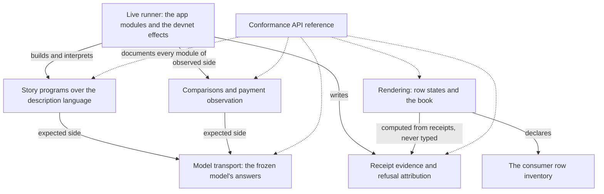
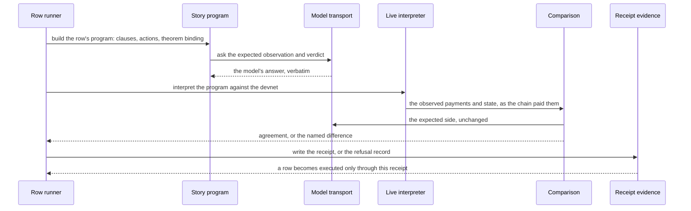

# Who owns the conformance suite

A contributor changing the conformance suite — adding a row's story,
re-binding a theorem, adjusting a comparison, tightening the receipt
record, re-rendering the published evidence — wants to open the one
module that owns that concern and know which way the dependencies run,
before touching a two-thousand-line live interpreter. This page is that
map for the suite's library: what each concern's owner is, where the
live runner's boundary sits, what may never change while the code moves,
where to make a common change, and what the evidence does and does not
show. The library's generated interface is the
[Conformance API reference](conformance-api-reference.md); this page
explains the responsibilities behind it.

## The story this serves

As a contributor, I add or change a conformance row's program, its
model binding or its comparison in one focused module, and the executed
cases, receipts and published evidence stay exactly what they were —
so a reviewer asks one question, and the public record a consuming
project reads does not move under them.

As an integrator reading the
[consumer conformance](consumer-conformance.md) record, I need the
suite's own structure to keep its promise: rows become executed only
through receipts, uncovered rows stay published, and the description
language says what each case asserts — whatever module a change lands
in.

## What the library owns

| Concern | Owner | What it owns |
| --- | --- | --- |
| The description language | <a href="../conformance/lib/Conformance/Story/Specification.hs" data-api="module">Conformance.Story.Specification</a> | reusable theorem and clause structure, independent of registry actions |
| Story programs | <a href="../conformance/lib/Conformance/Story/Live.hs" data-api="module">Conformance.Story.Live</a>, the edge programs <a href="../conformance/lib/Conformance/Edge/Register.hs" data-api="module">Conformance.Edge.Register</a>, <a href="../conformance/lib/Conformance/Edge/Retire.hs" data-api="module">Conformance.Edge.Retire</a>, <a href="../conformance/lib/Conformance/Edge/RetractionWindow.hs" data-api="module">Conformance.Edge.RetractionWindow</a>, <a href="../conformance/lib/Conformance/Edge/Sequence.hs" data-api="module">Conformance.Edge.Sequence</a>, <a href="../conformance/lib/Conformance/Edge/Exit.hs" data-api="module">Conformance.Edge.Exit</a>, <a href="../conformance/lib/Conformance/Edge/EarlyReject.hs" data-api="module">Conformance.Edge.EarlyReject</a>, and <a href="../conformance/lib/Conformance/Fold/KeyedMint.hs" data-api="module">Conformance.Fold.KeyedMint</a> | programs over the nine exits of the model — seven folds, a reject and a retract — expressed as edge requests, tamperings and comparisons |
| Programs outside the model | <a href="../conformance/lib/Conformance/Authentication/Programs.hs" data-api="module">Conformance.Authentication.Programs</a>, <a href="../conformance/lib/Conformance/Wire/Programs.hs" data-api="module">Conformance.Wire.Programs</a>, <a href="../conformance/lib/Conformance/Classification.hs" data-api="module">Conformance.Classification</a> | the registry-identity requirements as programs of an authentication vocabulary and the serialization requirements as programs of a wire round-trip vocabulary, each with why the model cannot express it; every model-facing requirement classified once as an edge composition, a tamper of an edge's transaction, or outside the model |
| Theorem bindings | <a href="../conformance/lib/Conformance/Story/Binding.hs" data-api="module">Conformance.Story.Binding</a> | revision-bound Lean identities and statement anchors |
| Run-scoped identities | <a href="../conformance/lib/Conformance/Story/Identity.hs" data-api="module">Conformance.Story.Identity</a> | identity allocation during actions; observation only looks up |
| Model transport | <a href="../conformance/lib/Conformance/Lean/Oracle.hs" data-api="module">Conformance.Lean.Oracle</a>, <a href="../conformance/lib/Conformance/Lean/Registration.hs" data-api="module">Conformance.Lean.Registration</a>, <a href="../conformance/lib/Conformance/Lean/Retirement.hs" data-api="module">Conformance.Lean.Retirement</a> | the JSON transport for the model's expected observations and verdicts, and the chapter bindings that name them |
| Comparisons | <a href="../conformance/lib/Conformance/Compare/Registration.hs" data-api="module">Conformance.Compare.Registration</a>, <a href="../conformance/lib/Conformance/Compare/Perturbation.hs" data-api="module">Conformance.Compare.Perturbation</a>, <a href="../conformance/lib/Conformance/Observe/Payments.hs" data-api="module">Conformance.Observe.Payments</a> | the expected-side comparison as one named thing; discovered changes to every value the model declares observable; the payments an accepted exit made, read off its transaction as the chain paid them |
| Receipt evidence | <a href="../conformance/lib/Conformance/Receipt.hs" data-api="module">Conformance.Receipt</a>, <a href="../conformance/lib/Conformance/Evidence/Asset.hs" data-api="module">Conformance.Evidence.Asset</a>, <a href="../conformance/lib/Conformance/Refusal.hs" data-api="module">Conformance.Refusal</a>, <a href="../conformance/lib/Conformance/NodeRejection.hs" data-api="module">Conformance.NodeRejection</a> | run receipts — the only way a row becomes executed — their validation and storage; the asset-movement shape of edge evidence; attributable phase-2 refusal matching; bounded node diagnostics |
| Rendering and inventory | <a href="../conformance/lib/Conformance/Rows.hs" data-api="module">Conformance.Rows</a>, <a href="../conformance/lib/Conformance/Book.hs" data-api="module">Conformance.Book</a>, <a href="../conformance/lib/Conformance/Authenticate.hs" data-api="module">Conformance.Authenticate</a>, <a href="../conformance/lib/Conformance/PurposeUnits.hs" data-api="module">Conformance.PurposeUnits</a> | the consumer row inventory and its validation; the book rendered from the same programs the live backend executes; the consumer's canonical-registry authentication; per-purpose evaluation arithmetic that carries errors, never fabricated measurements |

## Which way dependencies run

The library never imports the app: the arrow runs one way, from the
live runner into the library. The app modules — the command router, the
remaining row runners, the wallet, cage and submission owners,
[`Conformance.Run.Live`](https://github.com/lambdasistemi/singular/blob/main/conformance/app/Conformance/Run/Live.hs),
the interpreter that gives the story programs their live effects, and the
two interpreters that execute the authentication and wire round-trip
programs (`Conformance.Run.Authentication`, `Conformance.Run.Wire`) — are
executables, outside the generated reference and documented here only by
their boundary. The runner's own internal division is deferred work
owned by the conformance epic, not delivered by the review this page
came from; what this map promises is the library side of that boundary.

One owner inside the evidence group is new and deliberately small:
`Conformance.Evidence.Asset` owns the asset-movement shape of edge
evidence — one movement named by its policy, asset name and quantity,
with the JSON encoding that carries those three fields. It used to be
the last declaration of `Conformance.Receipt` that is not a receipt
concern. `Conformance.Receipt` re-exports it unchanged, so the one real
caller, the live runner's keyed-mint expectation and observation,
imports it through exactly the path it used before; the runner is not
edited by that move.

## A row's journey, step by step

The expected side and the observed side stay independently derived: the
model transport answers from the frozen model, the comparisons read the
chain's outputs as the chain paid them, and neither consults the other's
assumptions. The rendering then computes every row's state from the
receipts that exist — an uncovered row stays uncovered in the published
record, and no row's state is typed by hand.

## What may not change

These are the suite's public promises, and a structural change that
breaks one of them is not an improvement:

- A row becomes executed only through a receipt written by a run that
  actually executed it; row states are computed from receipts and never
  typed.
- Uncovered rows are published, not hidden; a green step is never
  presented as a fulfilled consumer promise.
- Every product claim is expressed in the suite's description language,
  and execution and rendering of that language are total over the same
  instruction set.
- Surfaces a reader navigates carry requirement text, not internal
  identifiers; harness evidence stays in its marked appendix.
- No case predicate, expected outcome, verdict classification,
  instruction, receipt field, theorem binding or evidence claim moves
  by a restructure.

## Where to make a change

| The change | Where |
| --- | --- |
| a row's story program, its clauses or its tamperings | the owning edge program in `Conformance.Edge.*` or `Conformance.Fold.KeyedMint`, over `Conformance.Story.Specification`'s language |
| a theorem's binding or its statement anchor | `Conformance.Story.Binding`, with the revision-bound identity it carries |
| the model's expected side | `Conformance.Lean.Oracle` and the chapter bindings in `Conformance.Lean.Registration` / `Conformance.Lean.Retirement` |
| what a comparison accepts | `Conformance.Compare.Registration`, `Conformance.Compare.Perturbation`, `Conformance.Observe.Payments` |
| the receipt record's validation or storage | `Conformance.Receipt`; the asset-movement shape lives in `Conformance.Evidence.Asset` and is re-exported unchanged |
| refusal attribution and the negative control | `Conformance.Refusal` |
| the row inventory or its validation | `Conformance.Rows` |
| the published book or row-state rendering | `Conformance.Book` |
| live execution, wallets, submission, chain reads | the app modules under `conformance/app/` — the boundary this page draws; the datum-form observation inside `Conformance.Run.Live` is owned by the paused datum-observation lane, not this structure |
| a new library module | the Cabal library extent, and the generated reference's module list agrees with it or the site check fails |

## Decisions

| Decision | Chosen | Rejected, and why |
| --- | --- | --- |
| where the asset-movement shape lives | one owner, `Conformance.Evidence.Asset`, package-internal | leaving it in `Conformance.Receipt` — it describes what a keyed mint moved, not how a row is validated; exposing the new module publicly — no caller needs a new import path |
| the caller's import path | `Conformance.Receipt` re-exports `AssetEntry` unchanged | editing the live runner's import — the runner is the one real caller and its observation code is owned by another lane |
| the generated reference | one parameterized machinery for both libraries, manifest-bound to this candidate's source | a second generator or checker for the conformance tree — two oracles drift; a hand-written module list — it cannot prove freshness |
| where the reference is generated | the documentation build, from the Conformance input, beside the off-chain one | inside the conformance build — API generation is a distinct build responsibility and cannot change product evidence |

## Evidence and limits

This page is a map, not evidence. The executed evidence for the suite
is the receipts the runs write and the row states computed from them,
published in the [consumer conformance](consumer-conformance.md) record;
the reference's freshness is proven by its manifest digests, not by this
prose. The structural review this page came from preserved behavior by
moving one declaration byte-for-byte with its caller unchanged, and its
matched base/head runs are the ticket owner's comparison to read, not a
claim made here. The runner's own internal division into owners remains
deferred to the conformance epic's owner after the active semantic work
lands; this page does not claim it delivered. No local build, test or
documentation run backs this page's claims — the exact-head CI of the
candidate that carries it is the verifier, and until that evidence
exists these are design statements, not verified facts.
