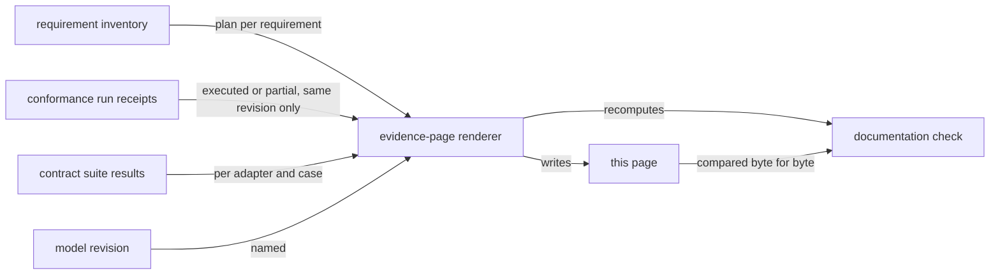

# Conformance evidence

As an integrator deciding whether to build on Singular, I read which of the consumer requirements a run of one named code revision demonstrated, which it did not, and how every backend adapter answered the shared contract — and I can check that nothing on this page was typed by hand.

This page is generated by `conformance evidence-page` from the requirement inventory `conformance/rows.json`, the application model revision in `conformance/model-revision`, and the receipts and contract results the CI runs named in the appendix produced for the code revision below. The documentation check regenerates it from those committed files and fails on any difference.

## What this evidence is bound to

| | |
| --- | --- |
| Code revision the runs checked out | `c17309ee607368615b96f23ea4f96401467195f5` |
| Application model revision | `de34300540223ccedf1ca85216b131fd09a148b4` |
| Requirements in the inventory | 46 (1 out of scope) |
| Demonstrated by a run | 22 |
| Partly demonstrated by a run | 0 |
| Run, result not a pass | 4 |
| Bound to evidence elsewhere | 5 |
| Uncovered | 14 |
| Backend adapters in the contract runs | 6 |

## Requirements a run demonstrated

| Name | Requirement | Expected outcome | State |
| --- | --- | --- | --- |
| CA01 | The canonical registry token name is SHA-256 of the canonical seed's outRef; a consumer recomputes it from the published seed and matches the on-chain state UTxO. | accept | demonstrated |
| CA02 | A rival registry initialized from a second seed exists and is accepted by the ledger; canonical authentication rejects it on name. | rival accepted on chain; authentication rejects | demonstrated |
| CA03 | Negative control: an authenticator that checks only policy+address, not the derived name, accepts the rival. | control must fail | demonstrated |
| CA04 | Applied and unapplied validator identity layers stay distinct and derived: applied address = apply(pinned unapplied hash, declared parameters); parameter count published. | accept | demonstrated |
| CA05 | A forged output at the canonical address carrying no registry token is not a registry: creating an output does not execute the receiving script. | authentication rejects; no script ran | demonstrated |
| CG02 | Generic Update (OpUpdate old new) on an existing key folds; the root advances and the new value reads back from chain. | accept | demonstrated |
| CG03 | Generic Delete (OpDelete old) on an existing key folds; the key returns to absence, proved by a read from chain. | accept | demonstrated |
| CG04 | After deleting a key, re-Insert the same key (reincarnation). | accept | demonstrated |
| CG05 | Insert on a key that is already present. | refuse, attributed to the script that refused | demonstrated |
| CG07 | Retract outside phase 2. | refuse the owner-signed retraction before phase 2 and after phase 2, with model reason not-phase2 and request-script attribution, beside the accepted owner-signed retraction inside phase 2 | demonstrated |
| CG10 | Stale fold against a superseded root. | refuse | demonstrated |
| CG21 | One `insertActive` request folds on the open registry and places exactly one `(activePolicy, key)` token in the output at the address and inline datum the request named. A second `insertActive` at the same known key is refused `key-exists`. A two-request batch at two DISTINCT keys whose claimed mint agrees per kind but disagrees per `(kind, key)` is refused `net-mint-mismatch`. | accept the fold; refuse the same-key duplicate `key-exists`; refuse the two-key wrong-distribution batch `net-mint-mismatch`; both refusals carry an accepting control | demonstrated |
| CG22 | On a real devnet, `insertActive` then `updateTerminal` at one key: the active witness the insert delivered is the exact input the retirement burns, exactly one `(activePolicy, key)` is destroyed, no output carries it afterwards, and the committed trie leaf becomes Terminal. `updateTerminal` on an Unknown key and on an Absent key are refused with their own named reasons, each against an accepting control. | accept the insert and the retirement; the active quantity goes 1 -> 0 with the exact keyed `-1` mint burned from its token-bearing source input and the committed leaf reading `Terminal`; refuse `updateTerminal` on an Unknown key `key-unknown` and on an Absent key `not-booked`, each with an accepting control | demonstrated |
| CG23 | On a real devnet, a request that is never folded leaves the queue by a reject or a retract. A reject must refund its owner the deposit; a retract by its owner must return everything the request held, through an output whose inline datum is the retracted request's own output reference. Each refund or return one lovelace short or to another key, a return bound to another request, and a retract spending the registry state beside it are refused by the chain and by the model, each beside the untampered exit of the same request, which both accept. The live consumer for the rule that only a retract returns the tip is the reject that keeps the tip beside the retract that returns it; fold consumers are in the fold rows. The guarantee that retract obligations depend only on the request remains a named gap: Lean proves this for every request and registry state, while this live run covers one registry state and no executable consumer varies it. | refuse a reject refunding the owner one lovelace short and to another key, `deposit-returned`, beside the accepted untampered reject; refuse a retraction returning one lovelace short, to another key and bound to another output reference, `deposit-returned`, and one spending the registry state beside it, `retract-state-spent`, beside the accepted untampered retraction | demonstrated |
| CG24 | On a real devnet, a folder may reject a pending request before its owner's retraction deadline. A reject while the request can still be folded, and one while its owner can still retract it, are each accepted by the chain and by the model, refund the owner the deposit and leave the registry state as it was. In each window a reject refunding the owner one lovelace short or to another key is refused by the chain and by the model. | accept a reject while the request can still be folded and one while its owner can still retract it, each refunding the owner the deposit and leaving the registry state as it was; refuse, in each window, a reject refunding the owner one lovelace short and one refunding another key, `deposit-returned` | demonstrated |
| CL01 | Execution units (mem, cpu) and transaction size measured for every accepting row, against the devnet's Conway protocol maxima, with headroom stated. | recorded | demonstrated |
| CS01 | Every ToData/FromData instance in Singular.Registry.Types round-trips, and its constructor index and field order match the compiled blueprint's declared schema, not merely itself. | accept, byte-exact against the blueprint | demonstrated |
| CS02 | Datum bytes constructed in Haskell and submitted are read back from the chain identical. | accept, byte-compare submitted vs chain-observed | demonstrated |
| CS04 | A redeemer at a wrong constructor index is refused by the compiled validator. | refuse, attributed to the script | demonstrated |
| CS06 | Script parameter application: parameter count and encoding published, applied hash derived in Haskell equals the on-chain address for every parameterized script. | accept | demonstrated |
| CS07 | Each ProofStep variant (Branch 0, Fork 1, Leaf 2) and Neighbor exercised by a fold the validator accepted. | accept | demonstrated |
| CS08 | OnChainTokenState's six fields (root, maxFee, processTime, retractTime, repPolicy, consumerPin) survive a chain round trip with the representative policy varied Base versus AltRepPolicy. | accept | demonstrated |

## Requirements a run did not pass

| Name | Requirement | Expected outcome | State |
| --- | --- | --- | --- |
| CG09 | Rejected when not rejectable. | refuse | unmet by a ruling: the registry deliberately does not do what the consumer requirement states (operator ruling 2026-10-01; lambdasistemi/cardano-keri#468) |
| CG11 | Empty fold (Modify []). | observe and report | held: the chain sided with Singular's model against the consumer's theorem, pending a ruling |
| CG12 | Surplus actions beyond the matched request inputs. | observe and report | held: the chain sided with Singular's model against the consumer's theorem, pending a ruling |
| CG19 | Refund routing follows the request: processed value routes to the request's destination minus the folder's tip; refunds go to the refund address recorded in custody; a crossed allocation is refused by the state script (interface, registry mode: no hook). Rejected produces refund owners at the recorded floor. | observe and report — refused, with the consumer-model conflict unresolved (crossed allocation enforced by the state script); rejected-action refund-floor control separate | held: the chain sided with Singular's model against the consumer's theorem, pending a ruling |

## Requirements not demonstrated

Every requirement without a receipt for this code revision is listed with the plan the inventory declares for it.

### Uncovered

| Name | Requirement | Expected outcome | State |
| --- | --- | --- | --- |
| CG14 | stake_script hook set: a fold carrying the matching withdrawal. | could-not-execute — superseded imported-partition material | uncovered |
| CG15 | stake_script hook set, withdrawal absent. | could-not-execute — superseded imported-partition material | uncovered |
| CG16 | Sweep of a non-legitimate UTxO, owner-signed. | superseded — observation preserved, conformance claim withdrawn (registry has no owner role; owner-signed sweep asserted authority that does not exist) | uncovered |
| CG17 | Sweep by a non-owner. | SUPERSEDED by operator ruling (registry has no owner role): observation preserved, claim withdrawn | uncovered |
| CG18 | End burns the state token and closes the cage. | superseded — claim withdrawn (the registry has no termination: End is refused for every party) | uncovered |
| CK01 | Present: resolve the active registration's application UTxO from the authenticated canonical registry. | accept | uncovered |
| CK02 | The token: exact policy, quantity one, derived asset name. | accept | uncovered |
| CK03 | Zero candidates resolves to reject. | reject, fail closed | uncovered |
| CK04 | Several candidates impossible: a second live representative for one registered key cannot be created. | refuse | uncovered |
| CK05 | Resolve while the representative sits in a pending terminal request: report pending, not a usable output. | pending | uncovered |
| CL02 | The fold batch-size boundary: the largest Modify batch that succeeds and the smallest that fails, with the failure reason. | an actual observed boundary, N accepted and N+1 refused | uncovered |
| CL03 | Exact environment: cardano-node version, GHC, Aiken toolchain, blueprint hashes, and the environments explicitly not supported. | recorded from the running node and the pinned flakes | uncovered |
| CS03 | Each UpdateRedeemer constructor (End 0, Contribute 1, Modify 2, Retract 3, Sweep 4) is exercised by an accepting witness or an action-attributed phase-2 refusal witness with a sound index discriminator. | partial: accept (Contribute 1, Modify 2, Retract 3 with executing witnesses); End 0 and Sweep 4 unexercised named residuals (no accepting path yet, issue #18 tracks completion) | uncovered |
| CS05 | Each RequestAction (Update 0, Rejected 1) and MintRedeemer (Minting 0, Burning 2) constructor is exercised by an accepting witness or an action-attributed phase-2 refusal witness with a sound index discriminator; Migrating 1 unconditional refusal recorded with wire constructor retained. | partial: accept (Update 0, Rejected 1, Minting 0 with executing witnesses); Burning 2 unexercised named residual; Migrating 1 explicit gap | uncovered |

### Bound to evidence elsewhere

| Name | Requirement | Expected outcome | State |
| --- | --- | --- | --- |
| CG01 | Generic Insert: request, fold, leaf present, root advances, read back from chain. | accept | bound elsewhere: offchain/e2e-test/Singular/Registry/E2E/CageSpec.hs: boots state and applies a request update |
| CG06 | Retract in phase 2 returns bond+tip, registry untouched. | accept; root unchanged | bound elsewhere: offchain/e2e-test/Singular/Registry/E2E/CageSpec.hs: retracts a phase-2 request |
| CG08 | Rejected when rejectable. | accept | bound elsewhere: offchain/e2e-test/Singular/Registry/E2E/CageSpec.hs: rejects a phase-3 request |
| CG13 | Owner/hook pinning: a Modify that changes the state owner. | superseded — observation preserved, conformance claim withdrawn (registry has no owner role; owner-pin transfer asserted authority that does not exist) | bound elsewhere |
| CG20 | Hold a valid fold constant and remove only the state-owner required signer; the observation (accept or refuse) is recorded with its transaction — the regression property the independent verification specified. | superseded — observation preserved, conformance claim withdrawn (registry has no owner role; the no-owner-signer property is recorded history, not a live gate) | bound elsewhere |

### Out of scope

| Name | Requirement | Expected outcome | State |
| --- | --- | --- | --- |
| CK06 | Bonds, poison, the juvenility window W and the signature threshold: the checkpoint machine's and the treasury's policy, not Singular's. | out of scope — recorded, never claimed | out of scope |

## Backend contract across adapters

One case list runs against every adapter. A case an adapter cannot exercise is reported for it as not supported, with the reason; it is never counted as passed.

| Adapter | Evidence class | Passed | Failed | Not supported |
| --- | --- | --- | --- | --- |
| node (external devnet) | devnet | 5 | 0 | 6 |
| indexer (external devnet) | devnet | 5 | 0 | 6 |
| in-memory | test-adapter | 7 | 0 | 4 |
| indexer (in-memory node) | test-adapter | 11 | 0 | 0 |
| node (generated devnet) | devnet | 7 | 0 | 4 |
| indexer (generated devnet) | devnet | 6 | 0 | 5 |

### node (external devnet) adapter

Evidence class: devnet.

| Contract case | Kind | Result |
| --- | --- | --- |
| a view names the network, era, slot and block hash it was acquired at | success | passed |
| a view answers its reads: outputs at an address, script registration, time to slot | success | passed |
| every read inside one view is answered at the view's chain point (slot and block hash) while the chain moves on | consistency | passed |
| a chain change between two reads is not observed inside the view; a fresh view sees it | consistency | passed |
| a view used after its scope fails as ViewOutOfScope | refusal | passed |
| a connection lost inside a view fails its next read and the next acquisition as ViewConnectionLost | refusal | not supported: the node was started outside the suite, which does not stop it |
| acquiring at the chain origin fails as AcquiredAtOrigin | refusal | not supported: the node was handed over past its origin |
| an index behind the node's point refuses the view as lag | refusal | not supported: the node adapter reads the node's own state; it has no index |
| an index holding another block at the node's slot refuses the view as fork | refusal | not supported: the node adapter reads the node's own state; it has no index |
| an index still restoring refuses the view as restoring | refusal | not supported: the node adapter reads the node's own state; it has no index |
| an index whose upstream is disconnected refuses the view as disconnected | refusal | not supported: the node adapter reads the node's own state; it has no index |

### indexer (external devnet) adapter

Evidence class: devnet.

| Contract case | Kind | Result |
| --- | --- | --- |
| a view names the network, era, slot and block hash it was acquired at | success | passed |
| a view answers its reads: outputs at an address, script registration, time to slot | success | passed |
| every read inside one view is answered at the view's chain point (slot and block hash) while the chain moves on | consistency | passed |
| a chain change between two reads is not observed inside the view; a fresh view sees it | consistency | passed |
| a view used after its scope fails as ViewOutOfScope | refusal | passed |
| a connection lost inside a view fails its next read and the next acquisition as ViewConnectionLost | refusal | not supported: the node was started outside the suite, which does not stop it |
| acquiring at the chain origin fails as AcquiredAtOrigin | refusal | not supported: the node was handed over past its origin |
| an index behind the node's point refuses the view as lag | refusal | not supported: a live follower cannot be held behind, forked, restoring or disconnected from outside its session; provoked on the indexer adapter over the in-memory node |
| an index holding another block at the node's slot refuses the view as fork | refusal | not supported: a live follower cannot be held behind, forked, restoring or disconnected from outside its session; provoked on the indexer adapter over the in-memory node |
| an index still restoring refuses the view as restoring | refusal | not supported: a live follower cannot be held behind, forked, restoring or disconnected from outside its session; provoked on the indexer adapter over the in-memory node |
| an index whose upstream is disconnected refuses the view as disconnected | refusal | not supported: a live follower cannot be held behind, forked, restoring or disconnected from outside its session; provoked on the indexer adapter over the in-memory node |

### in-memory adapter

Evidence class: test-adapter.

| Contract case | Kind | Result |
| --- | --- | --- |
| a view names the network, era, slot and block hash it was acquired at | success | passed |
| a view answers its reads: outputs at an address, script registration, time to slot | success | passed |
| every read inside one view is answered at the view's chain point (slot and block hash) while the chain moves on | consistency | passed |
| a chain change between two reads is not observed inside the view; a fresh view sees it | consistency | passed |
| a view used after its scope fails as ViewOutOfScope | refusal | passed |
| a connection lost inside a view fails its next read and the next acquisition as ViewConnectionLost | refusal | passed |
| acquiring at the chain origin fails as AcquiredAtOrigin | refusal | passed |
| an index behind the node's point refuses the view as lag | refusal | not supported: it reads a chain value, not an index |
| an index holding another block at the node's slot refuses the view as fork | refusal | not supported: it reads a chain value, not an index |
| an index still restoring refuses the view as restoring | refusal | not supported: it reads a chain value, not an index |
| an index whose upstream is disconnected refuses the view as disconnected | refusal | not supported: it reads a chain value, not an index |

### indexer (in-memory node) adapter

Evidence class: test-adapter.

| Contract case | Kind | Result |
| --- | --- | --- |
| a view names the network, era, slot and block hash it was acquired at | success | passed |
| a view answers its reads: outputs at an address, script registration, time to slot | success | passed |
| every read inside one view is answered at the view's chain point (slot and block hash) while the chain moves on | consistency | passed |
| a chain change between two reads is not observed inside the view; a fresh view sees it | consistency | passed |
| a view used after its scope fails as ViewOutOfScope | refusal | passed |
| a connection lost inside a view fails its next read and the next acquisition as ViewConnectionLost | refusal | passed |
| acquiring at the chain origin fails as AcquiredAtOrigin | refusal | passed |
| an index behind the node's point refuses the view as lag | refusal | passed |
| an index holding another block at the node's slot refuses the view as fork | refusal | passed |
| an index still restoring refuses the view as restoring | refusal | passed |
| an index whose upstream is disconnected refuses the view as disconnected | refusal | passed |

### node (generated devnet) adapter

Evidence class: devnet.

| Contract case | Kind | Result |
| --- | --- | --- |
| a view names the network, era, slot and block hash it was acquired at | success | passed |
| a view answers its reads: outputs at an address, script registration, time to slot | success | passed |
| every read inside one view is answered at the view's chain point (slot and block hash) while the chain moves on | consistency | passed |
| a chain change between two reads is not observed inside the view; a fresh view sees it | consistency | passed |
| a view used after its scope fails as ViewOutOfScope | refusal | passed |
| a connection lost inside a view fails its next read and the next acquisition as ViewConnectionLost | refusal | passed |
| acquiring at the chain origin fails as AcquiredAtOrigin | refusal | passed |
| an index behind the node's point refuses the view as lag | refusal | not supported: the node adapter reads the node's own state; it has no index |
| an index holding another block at the node's slot refuses the view as fork | refusal | not supported: the node adapter reads the node's own state; it has no index |
| an index still restoring refuses the view as restoring | refusal | not supported: the node adapter reads the node's own state; it has no index |
| an index whose upstream is disconnected refuses the view as disconnected | refusal | not supported: the node adapter reads the node's own state; it has no index |

### indexer (generated devnet) adapter

Evidence class: devnet.

| Contract case | Kind | Result |
| --- | --- | --- |
| a view names the network, era, slot and block hash it was acquired at | success | passed |
| a view answers its reads: outputs at an address, script registration, time to slot | success | passed |
| every read inside one view is answered at the view's chain point (slot and block hash) while the chain moves on | consistency | passed |
| a chain change between two reads is not observed inside the view; a fresh view sees it | consistency | passed |
| a view used after its scope fails as ViewOutOfScope | refusal | passed |
| a connection lost inside a view fails its next read and the next acquisition as ViewConnectionLost | refusal | passed |
| acquiring at the chain origin fails as AcquiredAtOrigin | refusal | not supported: the indexer session waits a chain out of its origin before its first view; the node adapter's origin refusal is the one the index rests on |
| an index behind the node's point refuses the view as lag | refusal | not supported: a live follower cannot be held behind, forked, restoring or disconnected from outside its session; provoked on the indexer adapter over the in-memory node |
| an index holding another block at the node's slot refuses the view as fork | refusal | not supported: a live follower cannot be held behind, forked, restoring or disconnected from outside its session; provoked on the indexer adapter over the in-memory node |
| an index still restoring refuses the view as restoring | refusal | not supported: a live follower cannot be held behind, forked, restoring or disconnected from outside its session; provoked on the indexer adapter over the in-memory node |
| an index whose upstream is disconnected refuses the view as disconnected | refusal | not supported: a live follower cannot be held behind, forked, restoring or disconnected from outside its session; provoked on the indexer adapter over the in-memory node |

## Appendix: how this page was produced

This appendix is harness evidence: where the files behind this page came from. It says nothing more about the product.

| Workflow | Run | Artifact |
| --- | --- | --- |
| Conformance | https://github.com/lambdasistemi/singular/actions/runs/36943937230 | conformance-receipts |
| Conformance | https://github.com/lambdasistemi/singular/actions/runs/36943937230 | conformance-story-receipts |
| Registry | https://github.com/lambdasistemi/singular/actions/runs/36943937231 | contract-results |

The committed snapshot is `conformance/evidence/page/`: 27 files of the receipt artifacts under `receipts/`, of which 26 are receipts, and 2 contract results files under `contract/` holding 66 results.

Regenerate the page with `nix run ./conformance#conformance -- evidence-page --write`; check it with the same command without `--write`.

