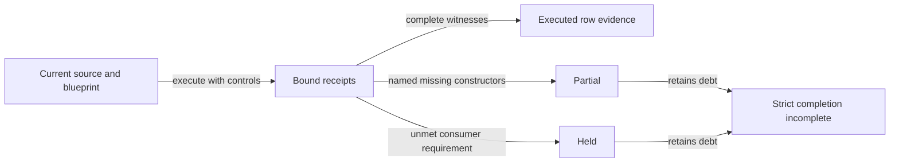

# Consumer conformance (epic 18, issues #63, #69 and #68)

As a Singular integrator, I can replay the current conformance interface,
distinguish partial evidence from completed coverage, and trace older
observations to the candidate that produced them. The connected naming
release journey is documented separately in [recovery and permanent retirement](recovery-retirement.md).

## The contract and its binding

The rows answer to the consumer contract source-bound to
`lambdasistemi/cardano-keri@14a64a4681d3e429fab5877062b5c476c2a4bfe2`:
`docs/design/registry-as-mpfs.md` (eleven operator rulings and fourteen registry theorems) and
`docs/user/consumer-checklist.md`. cardano-keri consumes the
**generic** registry — Insert, Update, Delete — not the naming
application, whose restriction refuses Delete and reuse by design.
No naming evidence can establish any row here, and none is claimed.

The canonical identity rows (#69) carry the correction epic 16
executed: cardano-keri's ruling is that the registry provides
identity uniqueness, but a permissionless ledger **cannot prohibit a
rival registry** — a consistent initialization from a second seed
passes every frozen check and the node accepts it
(`offchain/naming-correspondence.md`, "What t50 settled"). Canonical
identity is therefore **a derivation the consumer authenticates**,
not a refusal the chain performs: the canonical registry token's
name is SHA-256 of the canonical seed's outRef, that seed can never
be spent twice, and a rival from another seed can never carry that
name.

## The denominator

`conformance/rows.json` carries **42 rows, 41 owned**: CA01–CA05,
CG01–CG20, CS01–CS08, CK01–CK05, CL01–CL03, plus CK06 (bonds, poison,
the juvenility window `W`, the signature threshold) recorded as
**out of scope** — it belongs to cardano-keri's checkpoint machine
and treasury, explicitly never claimed by Singular. `list` prints the
owned denominator separately so the boundary stays visible. Superseded
and held rows stay in the denominator and visible to completeness
accounting: relabelling a row pays no coverage and shrinks no board.

`rows.json` never carries `executed`: the declared field is the
coverage plan and the parser rejects the string. A row prints as
executed only when a run receipt for it exists and matches the
current base (`--receipts DIR` or `CONFORMANCE_RECEIPTS`).

## Current ownerless integration

The released interface follows the ownerless six-field state contract.
The historical reports below retain their original transaction identities,
measurements and limitations; they are not current execution claims.
Coverage requires fresh receipts bound to the source and blueprint being
replayed. A build or a green check of expected debt grants no coverage.

| Surface | Current contract and remaining limit |
|---|---|
| State codec, CS01/CS02/CS08 | The six fields are root, maxFee, processTime, retractTime, repPolicy and consumerPin. CS08 exercises Base and AltRepPolicy with the real consumer pin. Historical owner/stake_script receipts do not establish this codec. |
| Blueprint encodings, CS01 | Fourteen live types: thirteen encoder/decoder pairs plus the Hook encoder. Hook has no Haskell FromData instance; no Hook decoder round trip is claimed. |
| Parameters, CS06 | State, consumer and staking declare zero parameters. Request retains two ordered parameters, statePolicyId and cageTokenName, and order discrimination. The former state allowlist is absent. |
| Address derivation, CA04 | State uses the production derivation compared with the actual chain address. The same comparison rejects an erroneous extra application with every other input fixed. Its receipt records addresses, arity, decisions and the off-chain identity venue; it is not a phase-2 rejection. Request retains applied-versus-unapplied address discrimination. |
| Generic observations, CG11/CG12/CG19 | All three require observe-and-report and remain held-q002. Current refusals need structural phase/script attribution and an accepting control; a missing named failure branch remains an explicit limit. An observation does not fulfill the consumer requirement. |
| Superseded authority rows | CG13 and CG20 join the superseded owner-role claims. Their identities and historical evidence remain in the inventory alongside CG16/CG17. No row is removed or credited by this disposition. |
| Spending constructors, CS03 | Contribute 1, Modify 2 and Retract 3 have accepting routes. End 0 and Sweep 4 remain explicit residuals inside the partial receipt. Every constructor still owes an accepting witness or an action-attributed refusal with a structured index discriminator. |
| Request and mint constructors, CS05 | Update 0, Rejected 1 and Minting 0 retain accepting routes. Burning 2 and Migrating 1 remain residuals inside the partial receipt. Migrating currently refuses unconditionally; the missing attributed witness and index discriminator remain owed. The old allowlist explanation is historical. |
| Fork correspondence, CS07 | E17's product repair and its released journey do not close this conformance row. Issue #81 stays open under E18 for fresh correspondence evidence. |

Partial is a distinct state in receipts and inventory output. A legacy
CS03/CS05 receipt without constructor accounting is incomplete, never
covered. Unstructured refusal text cannot earn constructor credit. A
receipt claiming success with a residual, or omitting a constructor, is
rejected. The full constructor obligation remains above the partial
observation.

The generic session registers the actual consumer script reward account
before any Hook withdrawal. Registration is setup evidence; a ledger
setup refusal cannot establish a validator property. The same real Hook
withdrawal and redeemer remain in the fold builders.



The protected coverage population stays **196**, with both required
implementation layers. Strict completion remains incomplete at
196 mapping issues, 196 layer issues, zero findings, 83 unclassified
obligations and zero stale mappings. The bounded E17 release does not
waive this E18 debt or the separate #87 Blaster work.

## Historical execution reports

**Historical scope:** every report from here through “Historical limits”
describes the earlier source revisions named in its provenance. Present-tense
wording in those retained reports belongs to those revisions. The current
contract above supersedes their owner fields, state arity, accepting-path
expectations and pending-E17 descriptions. Do not use their measurements or
receipts as evidence for the current candidate.

Devnet sessions run in order, each on an isolated node with its own
published world: the generic registry rows first — the four issue-#63
rows plus the issue-#70 rows below — then the canonical identity rows,
then the serialization boundary rows. Two further checks, CS01 and
CS06, never start a node at all: they compare Haskell values against
the compiled blueprint read at run time, so a reader totalling "rows
executed on a real devnet" counts the thirteen generic, five
canonical-identity and five serialization rows below — never the local
checks. The counts are kept visibly separate for exactly that reason.

### The generic registry rows

Against a real devnet, one cage, one key, in order:

| row | outcome | evidence |
|---|---|---|
| CG02 generic Update v1→v2 | accept | inclusion proof for v2 implies the chain-read root; forged-value proof does not (control) |
| CG03 generic Delete | accept | exclusion proof verifies against the chain-read root (empty trie); pre-delete proof bound to the deleted value does not (control) |
| CG04 re-Insert v3 | accept | inclusion proof for v3 implies the chain-read root; forged-value proof does not (control) |
| CG05 Insert on occupied key | **refuse** | hand-built fold submitted; node refuses in phase 2, attributed to the state script (`874e476d…`, `CekError`); fresh cage accepts a valid insert (control) |

CG05's refusal is a node verdict on a submitted transaction, the
li-refusals bar: the fold is hand-built (the library builder cannot
emit a transaction whose scripts do not evaluate) and calibrated
against the library builder on every valid fold — same inputs,
state output, refund destinations and Modify proofs — so the refused
shape differs from a library fold only in the operation under test.
The eval-time refusal the builder reports first is kept as a log
line, never as the verdict. Each receipt records where its refusal
was observed (`venue`: `node-submit` for every row here), and
refusal reasons are trimmed to their attribution (failure class,
script hash, machine error) — receipts stay under a run-enforced
16KB bound, because a receipt nobody can open is weak evidence.

Had the chain accepted the occupied insert, that would be a
**finding** reported with the accepted transaction — never relabelled
as a refusal.

### The issue-70 generic rows

The issue-#70 slice extends the generic session with eleven rows over
the same devnet shape: nine executed with receipts, two superseded
with could-not-execute history. Refusals are hand-built phase-1-valid
transactions attributed to the script that failed; every row carries a
deliberately wrong variant the same run requires to fail.

| row | outcome | evidence |
|---|---|---|
| CG07 retract inside the phase-2 window | **refuse** | node refuses in phase 2, attributed to the request script (`146332de…`, `CekError`); the same retract made phase-2-valid is accepted in-run (control) |
| CG09 stale request | **refuse** | node refuses in phase 2, attributed to the state script (`ce7615f6…`); the same request rejected by the library in phase 3 is accepted in-run (control) |
| CG10 fold with stale proofs | **refuse** | stale proofs against a superseded root refused, attributed to the state script; the same shape folded against the live root is accepted in-run (control) — the refusal is the staleness, not the shape |
| CG11 empty fold | accept — **held-q002** | the chain accepts a fold carrying no actions (tx `b670c28e…`); with one live request waiting, empty actions are refused in-run (control) — the acceptance is specific to the empty fold |
| CG12 surplus action | accept — **held-q002** | two actions over one request, the second garbage, accepted (tx `facebfe6…`); one action FEWER than there are requests is refused in-run (control) — the surplus is unchecked, the deficit is fatal, exactly the audit's asymmetry |
| CG13 owner change via Modify | accept — **defect evidence** | the chain accepted a Modify changing the state owner to `0xab…ab`, signed by the previous owner (tx `78e49eea…`); resolved-by-ruling: the registry has no owner role at all, so the transfer is a privilege that must not exist — retained as defect evidence of the outstanding owner gate |
| CG17 sweep by a non-owner | **refuse** — superseded claim | the sweep is refused, attributed to the request script (`7f32c3e7…`); the same sweep signed as the owner is accepted in-run (control). SUPERSEDED: it asserted registry-owner authority, which does not exist — observation preserved, conformance claim withdrawn |
| CG19 crossed refunds | accept — **held-q002** | bonds of 5 and 3 ada refunded crossed (4 and 2 ada, aggregate exactly the validator's ceiling), accepted (tx `566ddc80…`); refunds totalling below the aggregate floor are refused in-run (control) — the range is real, and it is still not the requirement |
| CG20 permissionless fold | accept | after the #79 repair the fold with NO owner signer is accepted (tx `4142f7d6…`, mem 717070 / cpu 231585673 / size 11442); the same fold WITH the owner signer is accepted in-run (control) — see F-002 below |
| CG14 / CG15 stake_script hook | **could-not-execute — superseded** | the pinned staking credential cannot register: `MissingScriptWitnessesUTXOW` without the witness, cert-purpose `CekError` with it — the staking validator has only a withdraw handler. Superseded inherited-hook expectations, not pending work (below) |

**Three dispositions, never to be mistaken for one another.**
**Held** (`held-q002`; CG11, CG12, CG19): executed, with the consumer
requirements still unmet. CG11 recorded a conflict with the pre-revision
Singular model; rejecting empty batches is now approved. CG12's
representation mapping remains under review. CG19 requires the
operation-specific value-routing repair. The rows move only after the
required implementation and execution evidence is accepted.
**Resolved-by-ruling** (CG13): a ruling settled the row's question;
the observation is retained as defect evidence of the outstanding
owner gate — never a pass, never an owner-semantics claim.
**Superseded** (CG14, CG15, CG16, CG17): the expectation asserted
authority or a schema that does not exist at this commit; observations
are preserved, claims are withdrawn, and no execution credit attaches.

**Evidence provenance.** The receipts cited in this section are the
generic session's ship run, taken fresh at clean tip `1d98d51` after
the receipt-overwrite repair (blueprint
`state:ce7615f6… request:8970c286…`, cardano-node 10.7.0, every
receipt `dirty: false`, every held row carrying its acceptance with
transaction id and measurements). CG20's first post-repair execution
was at clean tip `748c4a9` (txid `fe54d3a6…`); its ship-run repetition
at `1d98d51` is `4142f7d6…`. The overwritten pre-repair receipts are
retained only as evidence of that defect.

**Held rows (Q-002, story 2).** CG11, CG12 and CG19 are executed
holds, never passes. Only CG11 was established as a direct conflict
between the two model results. In the pinned pre-revision contract,
Singular's Lean permits the empty fold (`foldItems`, `| s, [] => .ok` — `Model.lean`
188–189) and pairs each request with exactly one action in its
`FoldItem`, so a surplus tail is unmodelled; `State` carries no owner
field and `Action.fold` routes no refunds. `Singular.Statements.fold_iff`
(`Model.lean` 250–256) makes its five conjuncts sufficient — native
spend, fold items, net-mint match, representative-mint and
application-mint witnesses — and no owner is among them: folding is
permissionless. The consumer's theorems require the empty batch refused
(`R8_empty_fold_refused`) and the 1:1 accounting. Its fold value
routing is not `R11_contribute_value` — that states the deposit
amount, and `R11_retract_value` states bond+tip on retract; fold
routing lives in the consumer's `Registry.processBody`, `Registry.stepFn`
and the `Cage.delegated_is_registry` equality, and it is
**operation-specific**: register/revive lock the deposit into a
checkpoint, goDormant/goConvicted/convict refund to the recorded owner,
rejection returns the operation bond — guarded by `rejectable` **and**
`userPostable`, not on demand — and the fold tip goes to the
folder. A blanket exact-refund repair would preserve the wrong value
mode and prevent checkpoint funding. Upstream cardano-mpfs-onchain
`#100`/`#101` are referenced proposals, **not a delivered partition fix**: `#101` is open, and **Singular owns the required local repair**. `R5_plugin_pinned` needs a distinction this page
previously collapsed. It is about **the plugin, not a registry owner**:
the bound `Registry.Sys` carries `plugin`, and the consumer's fold checks
`pl = s.plugin`. So **registry-owner privileges and fields are
superseded** — the operator ruled Singular has no registry-owner role,
and there is no owner to pin — but the **application/plugin identity
correspondence is not waived by that**. The required application and
native-witness bindings and the policy bindings **remain required**, and
must be established through the actual ownerless representation; this is
not a reason to reintroduce `stake_script` or to assert its old mechanism
is the required one. The remaining requirements stay unmet; the receipts carry
verdict `held-q002` and the session ends non-zero while anything is
held — a hold can never read as a pass, and a verdict moves only by
execution. CG13 is resolved-by-ruling, not a fourth unresolved hold:
its receipt carries `resolved-by-ruling`, its acceptance stays defect
evidence, and it is outside the held-set.

A repair this slice had to make to keep that sentence true: a refused
control used to submit through the same path as a refusal ROW and
wrote its refusal under the row's id, so CG11/CG12/CG19's held
receipts were being replaced by their controls' refusals in every
earlier receipts directory — receipts asserting the opposite of the
executed finding (CG13's survived only because its control was
retired, which is what isolated the cause). The control now writes
nothing: its outcome is run-log evidence under its own identity, it
cannot silently pass (an accepted control fails the run as a FINDING;
a refusal that does not attribute fails the run naming the mismatch),
and the receipt policy is unit-tested to discriminate — a control
never overwrites a held receipt, a refusal row always writes, a
non-attributing refusal writes nothing. The overwritten historical
receipts in `/tmp/t70-receipts*` are kept untouched as evidence of
the defect, never relabelled as fresh proof; the receipts cited by
this page are the ones taken fresh at the clean tip after the repair.

**CG20 and F-002, both halves by execution.** An independent audit
found that the runner itself always supplied the state owner's
signature, so no fold row in the suite could have observed the owner
gate; CG20 was built as the exact regression property. Executed
against the pre-#79 candidate it was REFUSED, attributed to the state
script, and recorded `diverges-from-lean` (receipt retained as
history). After epic 17's #79 repair it was executed again: the fold
with no owner signer is accepted (`agrees-with-model`, txid
`4142f7d6…` at the ship run, `fe54d3a6…` at the first post-repair
execution, blueprint `state:ce7615f6… request:8970c286…` both times),
and the same fold with the owner signer is accepted in-run. Both
acceptances are the post-repair evidence, not a weakened test: the two
transactions differ in the signer set alone, so the acceptance is
attributable to the removed gate. The expectation was always accept;
what moved is the candidate, and the verdict moved by execution only —
never by editing a row or flipping a stored receipt.

**The owner-dependency extent.** Before #79, every fold-based row
flowed through `validateOwnership`: CG02–CG05, CG09–CG15, CG17 and
CG19 depended on the state owner's signature, while CG07's retract
never did (it depends only on the request owner). #79 removed the gate
from Modify folding, and the 2026-09-12 operator ruling settles more:
the registry has **no owner role whatsoever** — not latent, not
transferable, not gating `End` or migration. `state.ak`'s `End` and
`validateMigration` still call `validateOwnership`; those calls are
outstanding conformance defects owned by epic 17, and CG13's accepted
owner change is their executed evidence.

**Superseded rows, observations preserved.** CG13 is
resolved-by-ruling: the owner-pinning question has no premise left to
be pending on, the acceptance is defect evidence, and the retired
control (previous-owner `End` refused, new-owner accepted) tested
behaviour that must not exist — it was never landed. CG17's refusal
and its owner-signed control stay in the record with the conformance
claim withdrawn: a gate that tests authority that does not exist
discriminates nothing Singular owes. CG16 (`bound-elsewhere`) is
superseded the same way, its epic-16 observation preserved as history;
`list` prints it `bound-elsewhere`, and only a receipt bound to the
current base can print `executed`, so no release path can credit it as
current conformance. **CG14/CG15 are superseded inherited-hook
expectations with could-not-execute history — not pending work.** The
imported partition's `State.stake_script` hook supplies registry-owner
authority by another name, which is exactly why epic 17 removes the
field; the pinned staking credential cannot register anyway (the
cause above), so the hook never reached a ledger. Preserved history
stays unchanged, and changing applicability earns no execution credit.

**No CL01 for this session**: the issue-#70 accepting-fold CL01
requires a receipt for every accepting row of its partition (CG11,
CG12, CG13, CG14, CG19), and the superseded CG14 will never carry one.
The session's worst cases live in the row receipts below.

### The canonical identity rows

A designation split publishes the canonical seed; CA01 boots the
canonical registry from it; CA02 initializes a rival from a second
seed through the same bootstrap path; a second split publishes the
rival seed, so no boot can ever consume the wrong UTxO as its
funder.

| row | outcome | evidence |
|---|---|---|
| CA01 derived name recomputed and matched | accept | the state UTxO carries exactly the SHA-256 of the published seed's outRef, quantity 1; a fabricated outRef's derivation does not match (control) |
| CA02 rival registry from a second seed | **rival accepted on chain; authentication rejects** | the node accepts the rival's bootstrap tx; both token names read back from the chain differ (each SHA-256 of its own seed's outRef); the canonical registry is unaffected — same UTxO, value and datum bytes as the CA01 snapshot; the derived name accepts the canonical and rejects the rival |
| CA03 policy+address-only authenticator | control must fail the run | the weak authenticator accepts the rival read back from the chain while the full authenticator rejects the same value — the name is the only discriminator; armed (`naive-authenticator`), the run fails naming the accepted rival |
| CA04 applied-address derivation | accept | the manifest pins unapplied `d42860fa97…` with 1 declared parameter; applied in Haskell to `ce7615f6ba4…`; the derived address equals the address the chain reports and the library's; the unapplied address does not pass (control; armed run fails) |
| CA05 forged output at the canonical address | authentication rejects; no script ran | a forged output carrying the canonical address and datum but no token is accepted by the ledger with **no script executed** — no witness, no redeemer, no mint, empty node evaluation — and the same detector fires on the boot tx (control); authentication rejects it on the missing token |

CA02 asserts an **acceptance**: the ledger takes the rival, and the
consumer's authentication is what excludes it. The receipt records
the ledger's verdict (accepted, with the rival's txid and
measurements); the rejection is asserted on chain-read assets and
named in the run — never relabelled as a refusal, never skipped
because the outcome reads oddly. The acceptance is the finding, and
it is the accepted design. CA03 is what makes CA02 worth anything:
a check that cannot fail proves nothing, so the weak authenticator's
acceptance of the rival is itself executed and required.

### The serialization boundary rows (devnet session)

One fresh cage per row (two where a row needs two phases), each cage
booted, exercised and — except where the row says otherwise — closed
on the same isolated node, in canonical order:

| row | outcome | evidence |
|---|---|---|
| CS02 datum bytes submitted and read back | accept | boot `StateDatum` plus one request `RequestDatum`, byte-compared submitted `Datum` versus chain-observed `Datum` for both; units from the boot minting, size the larger of the two transactions; corrupted comparison fails the run (control) |
| CS03 every `UpdateRedeemer` constructor executed | accept | one executing witness per constructor — `End` 0, `Contribute` 1, `Modify` 2, `Retract` 3, `Sweep` 4 — each read back from the redeemer of a submitted transaction the validator executed (the `Modify` fold carries `Modify` and `Contribute` together); four witness transactions named; a skipped witness fails the run (control) |
| CS04 redeemer at a wrong constructor index | **refuse** | valid fold retargeted to `Constr` 5 keeping its fields (same CBOR size, so fee and collateral stay sufficient and any refusal attributes to the script); node refuses in phase 2 with `CekError`, attributed to **both** cage scripts (`state+request`, ledger order, unstable — the tamper breaks fold consistency the request script also checks); fresh cage accepts a valid fold (control); impossible marker fails the run (control) |
| CS05 `RequestAction` and `MintRedeemer` coverage | accept, with one recorded gap | `Update`, `Rejected` (phase-3 reject), `Minting` (boot), `Burning` (end) each executed and read back from its redeemer; `Migrating` is unreachable on the imported partition (`previousPolicies=[]`, so `has(previousPolicies, oldPolicy)` fails at `state.ak` `validateMigration` FR1) and is recorded as a gap with that reason in `gap-CS05-Migrating.txt` — never a pass, never omitted; a skipped witness fails the run (control) |
| CS08 `OnChainTokenState` six fields round trip | accept, schema pending | two boots, `stake_script` `None` and `Some` (staking hash), all six fields byte-identical submitted versus chain-observed; corrupted comparison fails the run (control). The six fields include the owner field epic 17 is removing: the schema repair is pending, this expectation is superseded at that repair, and the row will be re-executed against the repaired blueprint |

### The serialization checks that need no node

No transaction, no node, no execution units — hence `mem`/`cpu` zero
and no transactions named. What is measured is stated per row, and
these rows never appear in a devnet-executed count.

| row | outcome | evidence |
|---|---|---|
| CS01 Haskell encodings against the blueprint schema | accept (`blueprint-check`), schema pending | all thirteen `ToData` types round-trip **and** each constructor index and field order matches the compiled blueprint's declared schema read at run time (`MPFS_BLUEPRINT`), including field-title order; no type needed a gap; `Constr` 99 validates against nothing and index 99 demanded for `End` fails the run (control); `txSize` is the blueprint file size in bytes, 92048. The checked schema is the six-field owner-bearing state: superseded at epic 17's pending repair, re-executed against the repaired blueprint |
| CS06 parameter application derived in Haskell | accept (`param-check`) | parameter counts and encodings published from the blueprint — state 1 (`previousPolicies`), request 2 (`statePolicyId`, `cageTokenName`, in source order), staking 0 — unapplied hashes match the pinned blueprint hashes, the applied state hash is `874e476d…`, non-empty allowlists and swapped request params discriminate; 2 demanded for state fails the run (control); `txSize` is the largest applied script size in bytes, 7805 |

### CS07: unmarked and escalated

CS07 carries no receipt and prints `uncovered`: `Branch` and `Leaf`
are witnessed on chain across many accepted folds, but no accepted
fold has ever carried a `Fork`, and two independently ground
lone-`Fork` absence proofs — each verified by the mts Haskell stack
against its own root — are refused by the compiled validator with a
bare `CekError` at build-time evaluation. The full bundle (keys, trie
shape, both verdicts, the refusal bytes, what could not be
determined, and the bounded consumer consequence) is filed as a user
story escalation; the offline oracle (`find-fork-keys`,
`check-fork-exclusion`) and shape probes (`show-nibbles`,
`show-d-proof`, `show-all-proofs`) reproduce every offline claim.
This is a finding held open, not a gap and not a pass.

### Measurements

Ship run: base `b3f4b5a`, clean tree, cardano-node 10.7.0. The
issue-#70 generic session's ship run: base `1d98d51`, clean tree,
cardano-node 10.7.0 — every generic receipt below names that base
with `dirty: false`, and the held rows carry their acceptances with
transaction ids and measurements because their controls write none.

Serialization ship run: base `b2201c3`, clean tree, cardano-node
10.7.0 — every receipt below names that base with `dirty: false`.
Each invocation observes the tree before creating its output, and
ships from a fresh output directory, so no run ever measures the
previous run's receipts. The defect this guards against reported
`dirty: true` on clean trees; its direction is conservative — it can
block a valid ship, it can never let a dirty tree pass as clean — and
no merged receipt ever claimed clean while dirty.

Maxima queried from the running node, never hardcoded:
`maxTxExUnits` 140000000 mem / 10000000000 cpu,
`maxTxSize` 16384 bytes.

| fold | mem (headroom) | cpu (headroom) | size (headroom) |
|---|---|---|---|
| CG02 Update | 649162 (139350838) | 217096102 (9782903898) | 11451 (4933) |
| CG03 Delete | 638564 (139361436) | 213717823 (9786282177) | 11451 (4933) |
| CG04 re-Insert | 616554 (139383446) | 200156393 (9799843607) | 11451 (4933) |
| CG11 empty fold (held) | 273449 (139726551) | 87149465 (9912850535) | 8388 (7996) |
| CG12 surplus action (held) | 905068 (139094932) | 295812293 (9704187707) | 11555 (4829) |
| CG13 owner change (defect) | 628372 (139371628) | 207905393 (9792094607) | 11403 (4981) |
| CG19 crossed refunds (held) | 1122369 (138877631) | 376904236 (9623095764) | 11613 (4771) |
| CG20 permissionless fold | 717070 (139282930) | 231585673 (9768414327) | 11442 (4942) |
| CA01 canonical boot | 143440 (139856560) | 46848478 (9953151522) | 8502 (7882) |
| CA02 rival boot | 143440 (139856560) | 46848478 (9953151522) | 8502 (7882) |
| CA05 forged payment | 0 (140000000) | 0 (10000000000) | 333 (16051) |
| CS02 datum round trip | 143440 (139856560) | 46848478 (9953151522) | 8466 (7918) |
| CS03 five witnesses | 629296 (139370704) | 204228993 (9795771007) | 11423 (4961) |
| CS05 four witnesses | 649502 (139350498) | 217245659 (9782754341) | 11423 (4961) |
| CS08 state None+Some | 147634 (139852366) | 49473955 (9950526045) | 8497 (7887) |

Execution units stay under 3.8% of the maxima for every row (worst:
CG19's crossed-refunds fold at 3.77% cpu, still ~26× headroom; CA05
reports zeros honestly: no script purpose exists to evaluate).
Serialized size is the tight dimension at ~71% of `maxTxSize` for
folds and ~52% for boots; larger batches (CL02) may press against it
first. The canonical session's worst case is recorded in its CL01
receipt; the issue-#70 session's CL01 cannot close while the
superseded CG14 carries no receipt, so its worst cases live in the row
receipts; the CS rows carry theirs in the row receipts, and no CS CL01
is claimed yet. Refusal reasons keep every failing script hash in ledger
order — a tampered fold can fail two scripts, and trimming volume
never trims identities — under the same run-enforced 16KB bound.

## Historical limits

- **Bound, not re-executed**: CG01, CG06, CG08 and CG18 rest on
  epic 16's `CageSpec` runs, cited per row. CG16 sits there too
  (`bound-elsewhere`) and is **superseded**: its owner-signed sweep
  asserted registry-owner authority, which the 2026-09-12 ruling
  removes entirely — the epic-16 observation is preserved as history
  and earns no conformance credit. Nothing else in the inventory has
  ledger evidence without a receipt.
- **Executed holds, not passes**: CG11, CG12 and CG19 remain held by
  execution. CG11 records the pre-revision empty-fold conflict with
  R8_empty_fold_refused; CG12 still needs a faithful representation
  mapping; CG19 violates the consumer's required operation-specific fold
  value routing (`Registry.processBody`, `Registry.stepFn`,
  `Cage.delegated_is_registry`). `R11_contribute_value` states the
  deposit amount and is not that fold requirement. Upstream
  `#100`/`#101` are referenced proposals, **not a delivered partition fix**:
  `#101` is open, and **Singular owns the required local repair**.
  `R5_plugin_pinned` concerns the plugin, not a registry owner. The
  consumer requirements stay unmet; a held row is
  never a pass, and the verdicts move only by execution. CG13's owner
  change is retained as **defect evidence** of the outstanding owner
  gate, resolved-by-ruling, with its defect owned by epic 17.
- **Superseded, never pending**: CG16 and CG17 asserted registry-owner
  authority that does not exist — observations preserved, claims
  withdrawn, no execution credit for changed applicability. CG14/CG15
  are superseded inherited-hook expectations with could-not-execute
  history; epic 17 removing `stake_script` creates no work behind them.
- **Uncovered**: CS07, CK(01–05) and CL02–CL03 print `uncovered` (as
  do CG14/CG15 — superseded expectations, no receipts). CS07 is not
  merely uncovered: its `Fork` finding is filed for a user story and
  the row stays unmarked until that story resolves — an unmarked row
  with a finding, never a gap and never a pass. CS05's `Migrating` gap
  is of the recorded kind, with its validator-read reason beside the
  receipts.
- **Schema pending (epic 17)**: CS01, CS02 and CS08 describe the
  six-field owner-bearing `OnChainTokenState`. The ownerless schema
  repair is pending; their expectations are superseded at that repair,
  their receipts stay valid as history, and the rows will be
  re-executed with fresh receipts against the repaired blueprint —
  coverage is not inherited across a wire-format change. Epic 17's
  antecedent ownerless repair exists locally (`f3a68b1`) but is **not
  accepted and not merged**; nothing here cherry-picks it, and the
  affected runtime checks follow the definitive schema artifacts when
  the explicit handoff arrives — integration stays serialized behind
  it.
- **Green expected-debt CI grants no conformance credit**: the
  workflow's generic-rows step asserts declared debt — exact receipt
  set, exact verdict per receipt, held set exactly CG11 CG12 CG19,
  nothing failing — and nothing more. It pays neither the held rows
  nor a full CL01, and strict completion and release stay RED on that
  debt.
- **Out of scope**: CK06 (cardano-keri), the naming rows (epic 16
  demonstration, not consumer evidence), LR/LT rows (epic 17).
- The CA rows authenticate the canonical registry as the consumer
  derives it from the published seed. They do not evidence the
  serialization boundary (CS), the constructor coverage (CS03–CS05)
  or the batch limits (CL02).
- The measurements above are devnet folds of single requests. They
  say nothing about batch limits (CL02) or any other environment
  (CL03 records the observed one below).

## Current replay commands

Run from the repository or extracted source root with Nix available.
Use a fresh directory outside the tracked tree for each family. The
generic session runs ten rows and may also emit its CL01 measurement
receipt; the serialization session runs five devnet rows and two local
checks. Superseded rows remain listed and are not runtime commands.

```sh
nix run ./conformance#conformance -- list
mpfs="$(nix build --quiet --no-link --print-out-paths ./onchain#plutus-blueprint)"
receipts="$(mktemp -d /tmp/singular-conformance.XXXXXX)"

# Expected exit 1: exact held set CG11, CG12, CG19; no failed rows.
MPFS_BLUEPRINT="$mpfs" nix run ./conformance#conformance -- run CG02 CG03 CG04 CG05 CG07 CG09 CG10 CG11 CG12 CG19 --receipts-dir "$receipts/generic"

# Expected exit 0 after all five identity rows and their controls.
MPFS_BLUEPRINT="$mpfs" nix run ./conformance#conformance -- run CA01 CA02 CA03 CA04 CA05 --receipts-dir "$receipts/identity"

# Expected exit 1: CS03 and CS05 are partial; the other five agree.
MPFS_BLUEPRINT="$mpfs" nix run ./conformance#conformance -- run CS01 CS02 CS03 CS04 CS05 CS06 CS08 --receipts-dir "$receipts/serialization"

nix run ./conformance#conformance -- list --receipts "$receipts/generic"
nix run ./conformance#conformance -- list --receipts "$receipts/identity"
nix run ./conformance#conformance -- list --receipts "$receipts/serialization"
```

These are expected result contracts, not claims that an arbitrary
nonzero exit is acceptable. Check the terminal row counts, exact receipt
IDs, source/blueprint binding, per-row verdicts and named residuals. A
crash, missing receipt or failed control fails the replay. The CI workflow
checks those details against the actual output; partial and held rows
remain debt even when that regression check is green.

Armed controls use a separate fresh receipt directory. Their nonzero
exit must name the intended failed assertion: the wrong refusal reason,
forged value or datum, weak authenticator, corrupted state derivation
(legacy flag `unapplied-address`), wrong constructor index, wrong
parameter count or deliberately missing witness. The normal partial
exit alone does not prove an armed control fired. See
`conformance.yml` for the executable session and receipt checks.

The Fork oracle and its probes remain available without a node or
blueprint; their output is local proof evidence, not CS07 completion:

```sh
nix run ./conformance#conformance -- find-fork-keys
nix run ./conformance#conformance -- check-fork-exclusion
nix run ./conformance#conformance -- show-all-proofs
```

The runner gives each node a unique temporary directory. Receipts are
written under the selected output directory and are never inherited as
current merely because an older run succeeded.

## Historical observed environment

cardano-node 10.7.0, GHC 9.12.3, Aiken compiler v1.1.21
(blueprint `hal/mpf 0.0.0`), unapplied state script pinned
`d42860fa972c8a325daae773adc372795c48cf365d0a72b137c749d3` with one
declared parameter, applied state script
`ce7615f6ba4de80dfa9b9c6aef680666472ba4ed7e640ff55aad7c6e`,
unapplied request script hash `8970c286…` (re-pinned from
`64d1afbfe585…`/`874e476d7408…`/`6b5ce7…` by the issue-#79
imported-validator repair; `onchain/REPAIR.patch` records the change,
`PROVENANCE.md` the authority). The issue-#70 rows were executed
against blueprint `state:ce7615f6ba4de80dfa9b9c6aef680666472ba4ed7e640ff55aad7c6e
request:8970c286…`; the pre-#79 executions (CG20's refusal, the first
CG07/CG09/CG10 refusals) are history at the earlier hashes. Environments other than
this devnet shape are explicitly not covered.
