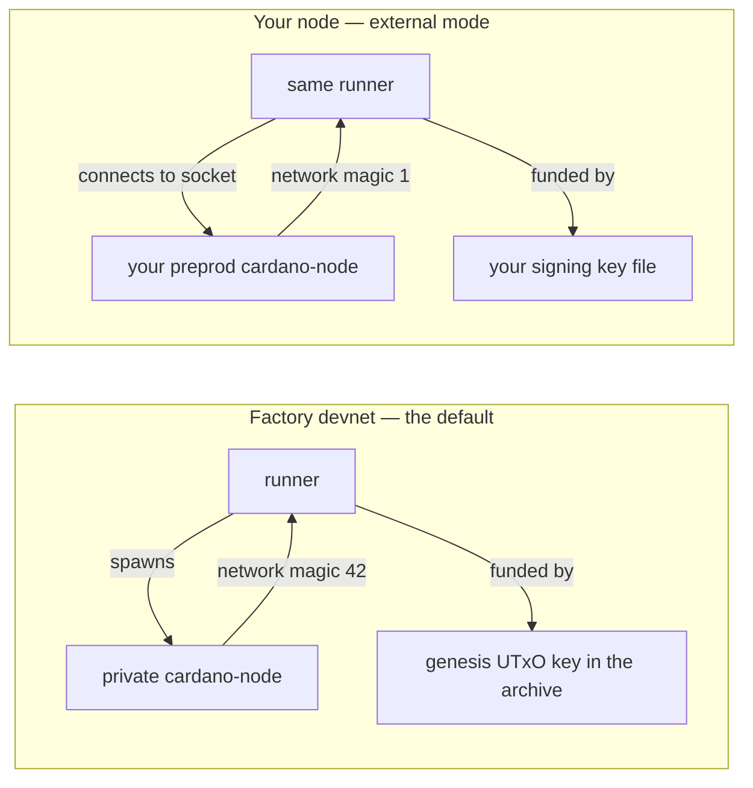
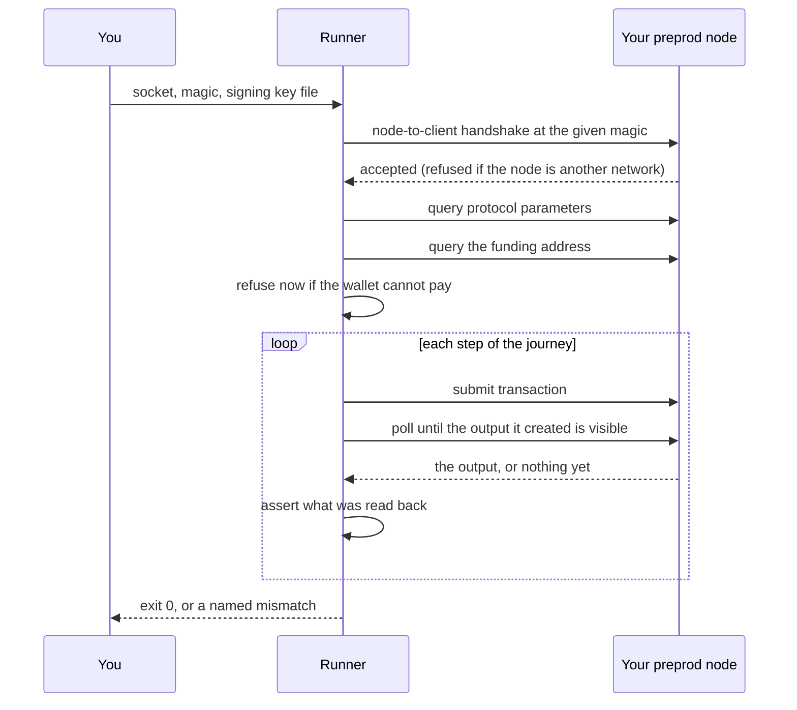
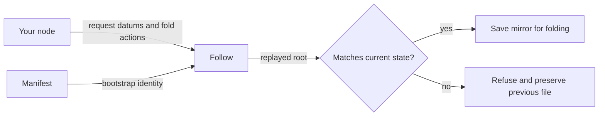

# Run Singular against your own preprod node

As a cardano-keri integrator, I want to take a published Singular release,
point it at the preprod node I already run, fund it with a wallet whose key
never leaves my machine, and watch a name be claimed, recovered, retired and
completed to Over on a public test network — without reconstructing the
factory's devnet, its genesis keys or its worktrees.

That is what this page walks through. Everything on it runs from a downloaded
release archive; nothing needs a checkout of this repository.

## What changes when you bring your own node

Every runner in the release can work two ways, and the difference is entirely
configuration.



The runner is the same program on both sides. External mode is not a second
implementation: it hands the shared entry point a socket path, a network magic
and a signing key file instead of letting it spawn a devnet, and everything
downstream — the transaction builders, the validators, the proofs, the
read-backs — is the code the factory devnet exercises on every run.

Three things you supply, and nothing else:

| you supply | as a flag | or as an environment variable |
|---|---|---|
| the node's node-to-client socket | `--node-socket PATH` | `SINGULAR_NODE_SOCKET` |
| the network the node runs | `--network-magic N` | `SINGULAR_NETWORK_MAGIC` |
| the wallet that pays | `--wallet-skey FILE` | `SINGULAR_WALLET_SKEY` |

Flags win over environment variables. Give none of the three and you get the
factory devnet, exactly as before. Give one or two and the runner refuses,
naming the one it is missing — a half-configured run would otherwise submit
devnet transactions to a public network.

## Step 1 — download the release and check it

Take the archive and its checksum manifest from the release page, extract it,
and verify both the bytes and the compiled validator identities:

```sh
tar xzf singular-onchain-release-<tag>.tar.gz
cd singular-onchain-release-<tag>
sha256sum --check SHA256SUMS
bash verify-identities.sh
```

`verify-identities.sh` re-derives every validator hash from the compiled
blueprints the archive carries and compares them with the pinned manifest. It
needs only `bash` and `jq`. If it exits non-zero, stop: the archive does not
carry the validators the release claims, and nothing below is meaningful.

The [release archive guide](https://github.com/lambdasistemi/singular/blob/main/onchain-release/README.md) describes what else
the archive contains and how to replay evidence from it.

## Step 2 — point at your preprod node

You need a `cardano-node` synced to preprod and its node-to-client socket
path. The socket is the one the node's own configuration names — typically
something like `/run/cardano-node/node.socket` or
`~/cardano/preprod/node.socket`.

Two facts the runners check for you, so you do not have to:

- **The network magic must be the one the node runs.** Preprod is `1`. The
  node-to-client handshake negotiates it, and a node on another network
  refuses the connection; the runner turns that refusal into a message naming
  the socket and the magic you asked for rather than a bare protocol error.
- **Protocol parameters come from the node.** Fees, execution-unit prices and
  size limits are queried from the running node on every session, never taken
  from a devnet constant. A preprod parameter change is picked up on the next
  run with no code change.

Mainnet's magic is refused outright. These runners submit live transactions to
demonstrate a lifecycle; they are for test networks.

## Step 3 — create and fund a wallet

The wallet is yours. Its key is read from a file on your machine, used to sign,
and never printed, logged or transmitted anywhere but into a transaction
witness.

```sh
cardano-cli address key-gen \
  --verification-key-file joiner.vkey \
  --signing-key-file joiner.skey

cardano-cli address build \
  --payment-verification-key-file joiner.vkey \
  --testnet-magic 1 \
  --out-file joiner.addr
cat joiner.addr
```

The runners accept the `cardano-cli` signing-key file as written — the JSON
text envelope with its `cborHex` field. A file holding the same key as bare
hex, or as the 32 raw bytes, works too. The address the runner uses is derived
from the key in that file, so there is no way for the address you fund and the
address that pays to disagree.

Fund the address from the preprod faucet at
https://docs.cardano.org/cardano-testnets/tools/faucet — then send one
self-payment of a few ada back to the same address. The faucet pays a single
output; the second payment leaves the wallet holding a small ada-only output,
which is what a Plutus transaction spends as collateral.

## Step 4 — run a journey

Build the two compiled blueprints from the archive's own flakes and export
them the way the [release archive guide](https://github.com/lambdasistemi/singular/blob/main/onchain-release/README.md)
describes, then run each runner from the archive's `offchain/` directory.

Start with the canonical initialization, the shortest run that touches the
chain:

```sh
cd offchain
nix run .#li01 -- \
  --node-socket /run/cardano-node/node.socket \
  --network-magic 1 \
  --wallet-skey ./joiner.skey
```

The naming journey the demo is about is three more runners, in this order:

```sh
nix run .#register-rows   -- --node-socket … --network-magic 1 --wallet-skey ./joiner.skey
nix run .#recovery-rows   -- --node-socket … --network-magic 1 --wallet-skey ./joiner.skey
nix run .#retirement-rows -- --node-socket … --network-magic 1 --wallet-skey ./joiner.skey
```

Together they claim a name, fold it with its real representative, rotate its
control through the committed next controller, retire it into completion-only
custody, and complete the retirement permissionlessly so the name reads Over
and can never be claimed again.

## What a run looks like

Each runner narrates what it did and what it then observed on chain. The first
line names the chain and the wallet:

```
node: external socket=/run/cardano-node/node.socket magic=1 funder=addr_test1v…
```

Then one line per step, each stating the observation rather than the intent —
the transaction identifier, the datum read back, the hash that matched. A zero
exit is the claim: every runner exits non-zero on any mismatch, and it checks
by reading state back from the node, never by assuming its own submission
worked.



## Waiting for confirmations

A public test network makes a block about every twenty seconds; the factory
devnet makes one about every second. The runners do not assume either. After a
submission they poll the node for an output the transaction actually created
and continue the moment it appears, giving up after five minutes with a message
naming the transaction that never landed.

So a preprod run is slower than a devnet run — minutes rather than seconds per
journey — and it is slow in proportion to the network, not to a constant
someone guessed.

## When the wallet cannot pay

The funding check runs before the first transaction is built, so a wallet
problem is a message and not a balance exception in the middle of a lifecycle:

```
the funding wallet cannot pay for this run.
  address            : addr_test1vq7…
  lovelace held      : 0 lovelace (0.000000 ada) across 0 UTxO(s)
  lovelace required  : 100000000 lovelace (100.000000 ada)
  ada-only UTxO held : 0 lovelace (0.000000 ada) (the collateral input)
  collateral required: 5000000 lovelace (5.000000 ada)
  Fund this address, then rerun. On preprod the faucet is
    https://docs.cardano.org/cardano-testnets/tools/faucet
  It pays a single output; send one self-payment afterwards so the
  wallet also holds an ada-only output to spend as collateral.
```

It names the address to fund, what is required, what is there, and the step
that fixes it. The two numbers are a floor rather than a promise: they catch
the empty and the nearly-empty wallet at the start of a run, and a journey that
runs long can still exhaust a thinly funded wallet later.

## Other refusals you may see

| what you see | what it means |
|---|---|
| `the node at … did not accept a node-to-client connection for network magic N` | the node runs a different network, or the socket path is not a node-to-client socket |
| `external-node mode is partially configured` | one or two of the three settings were given; all three are required together |
| `external-node mode refuses network magic 764824073` | that is mainnet; these runners are for test networks |
| `wallet signing key …: expected 32 key bytes, found …` | the file is not a payment signing key — a verification key or a stake key will produce this |
| `transaction … was accepted by the node but has not appeared in a block` | the node accepted the transaction and no block carried it within five minutes; check that the node is synced and the network is producing blocks |

## Running it again

Without `--deployment`, each run boots its own registry from a seed it
designates out of your wallet's own outputs, so a
second run does not collide with the first and does not depend on it having
finished. Nothing in the archive holds state between runs; what persists lives
on chain, under identities each run derives and prints.

In this fresh-registry mode, if a run fails part way, rerun it. Its on-chain leftovers are
inert: they belong to that run's own registry token and no later run reads
them.

## Attaching to a deployment, and what has to travel with it

Everything above stands up a registry of its own for the run. A
deployment is the other way round: the registry and the reference scripts
are created once, recorded in a manifest, and used by every run
afterwards.

```sh
nix run .#deployment -- deploy \
  --node-socket /run/cardano-node/node.socket \
  --network-magic 1 --wallet-skey ./joiner.skey \
  --out ./preprod.json --release v0.4.1

nix run .#register-rows -- --node-socket … --network-magic 1 \
  --wallet-skey ./joiner.skey --deployment ./preprod.json
```

The register runner claims the exact UTF-8 spelling supplied with
`--spelling`, defaulting to `alice`. It never appends a run suffix. On an
attached rerun where that spelling is already held, it submits the duplicate,
checks the state-validator refusal and unchanged registry root, reports that
the spelling is already held, and finishes without rerunning the other
fixture rows. Recovery and retirement retain their explicit fixture spellings.

`deploy` runs once. Given a manifest the node still agrees with it names
the registry that already exists and stops, rather than making a second
one nobody recorded. `nix run .#deployment -- verify --deployment
./preprod.json` asks the node whether it still agrees, claim by claim.

**On a second machine, rebuild the mirror from your node.** Copy the
manifest and run from `offchain/`:

```bash
nix run .#deployment -- follow --deployment ./preprod.json \
  --node-socket "$SINGULAR_NODE_SOCKET"
```

The manifest supplies the network and bootstrap identity. No wallet or
external indexer is needed for replay. The follower reads request datums
and fold actions from chain-sync, rebuilds the trie, checks its root
against the current registry state, and atomically writes
`preprod.mirror.json` only when they agree. A named refusal leaves the
previous file intact. If another writer folds during verification,
rerun the command against the new tip.

The mirror records the last replayed block and outstanding requests.
Later `follow` runs resume there; a rolled-back point restarts replay.
A journey that writes the mirror invalidates that checkpoint so the next
follow rebuilds from the bootstrap. Add `--rebuild` to a journey using
`--deployment` to rebuild automatically when its mirror is absent or
its root differs from the chain.



Reading is unaffected. Proving a name is alive and finding where its
application state lives needs the registry entry and the NFT, and no trie
at all — a resolver needs nothing from the mirror.

## What this page does not cover

The canonical deployment on preprod — a published registry identity with its
seed reference, applied script hashes, policy identifiers and bootstrap
transactions — is recorded separately once it exists, from real values. Nothing
here publishes or claims a canonical identity; each run stands up its own.
