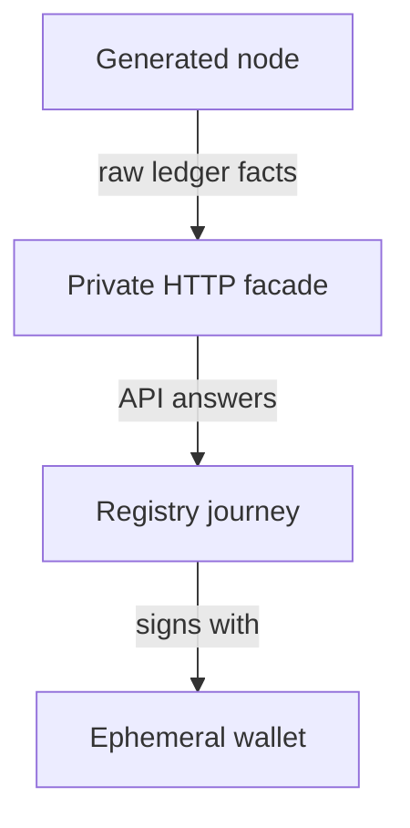
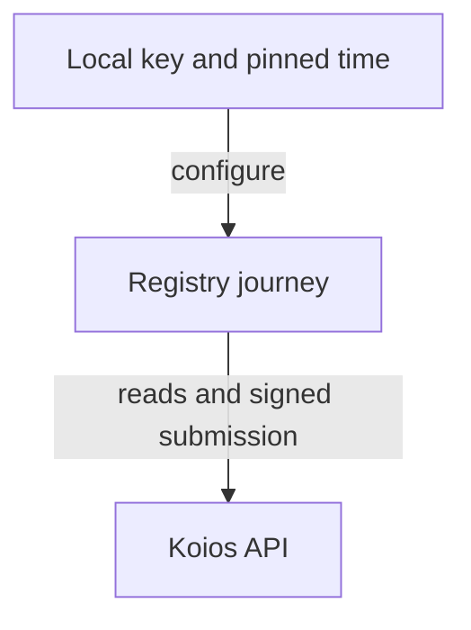
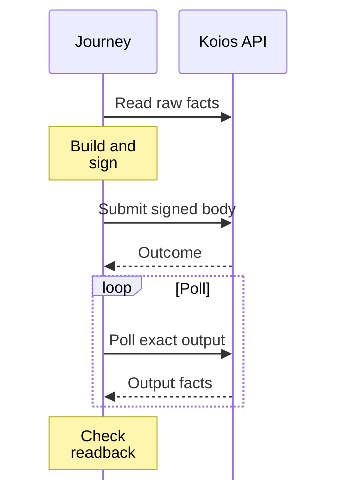

# Run the registry journey with your own provider and wallet

As a Cardano KERI integrator, you want to run the bounded Singular registry
journey on a test network using an API you choose and a wallet whose signing
key stays on your machine. The current ordinary path uses Koios for raw reads
and signed submission, pinned genesis/history for time, and local construction
and evaluation. It does not require an ordinary node socket.

This page describes the current source's configuration. A candidate's local
checks, hosted gates, release archive and public-network results are separate
receipts; these instructions do not claim that a new release or connected
preprod run has been accepted.

## Choose the network and API

The packaged `journey` defaults to a private generated development chain behind
the project's HTTP facade. Supplying external settings runs the same registry
steps through the requested API with your wallet. The launcher checks those
settings before starting a private fixture.


```mermaid
flowchart TB
    N[Generated node] -->|raw ledger facts| F[Private HTTP facade]
    F -->|API answers| J[Registry journey]
    J -->|signs with| K[Ephemeral wallet]
```

The private fixture exposes its node through the facade; the journey uses the
API and an ephemeral fixture wallet. Your external configuration supplies your
own API, local payment key and pinned time instead:


```mermaid
flowchart TB
    C[Local key and pinned time] -->|configure| J[Registry journey]
    J -->|reads and signed submission| P[Koios API]
```

| You supply | Flag | Environment variable |
| --- | --- | --- |
| API base URL | `--koios-url URL` | `SINGULAR_KOIOS_URL` |
| Network magic | `--network-magic N` | `SINGULAR_NETWORK_MAGIC` |
| Payment signing-key file | `--wallet-skey FILE` | `SINGULAR_WALLET_SKEY` |
| Pinned time directory, when needed | `--network-time DIR` | `SINGULAR_NETWORK_TIME` |
| Optional API token file | `--koios-token-file FILE` | `SINGULAR_KOIOS_TOKEN_FILE` |

Flags override the matching environment variable. An external run requires
URL, magic and signing-key file together; a missing setting refuses by name.
Preprod magic is `1`, and the reviewed packaged preprod recording is the default
time source there. The generated network's magic is `42`, and its launcher
supplies its exact published time directory. A supplied directory contains
`time-manifest.json`, `shelley-genesis.json` and `era-history.cbor`; their raw
identities, network, system start and protocol-major pin are validated.
Unsupported time networks refuse rather than borrowing another recording.
These submitting runners refuse mainnet.

The old `--backend`, `--node-socket` and `SINGULAR_NODE_SOCKET` settings refuse
before wallet or provider access. A socket accepted by a separate private
probe is a test-harness setting, not an ordinary provider route.

## Check the archive and build its commands

For an existing published archive, verify the bytes and validator identities
before using it:

```sh
tar xzf singular-onchain-release-<tag>.tar.gz
cd singular-onchain-release-<tag>
sha256sum --check SHA256SUMS
bash verify-identities.sh
```

The archive's command interface depends on its revision. An older node-backed
archive does not acquire this interface from reading this page. The
[archive guide](https://github.com/lambdasistemi/singular/blob/main/onchain-release/README.md)
records its runnable components and unverified legacy surfaces. Build the
registry and naming blueprints from that tree and export `REGISTRY_BLUEPRINT`
and `NAMING_BLUEPRINT` as the guide specifies.

## Fund a wallet you control

Create a payment key and derive its preprod address locally:

```sh
cardano-cli address key-gen \
  --verification-key-file joiner.vkey --signing-key-file joiner.skey
cardano-cli address build \
  --payment-verification-key-file joiner.vkey --testnet-magic 1 \
  --out-file joiner.addr
cat joiner.addr
```

Fund the address from the preprod faucet, then make a self-payment that leaves
several ordinary outputs, including an ada-only collateral output. The runner
loads the key from its local file and derives the paying address from it. A
key's bytes do not belong in command output or receipts. A funded balance alone
is insufficient when the transaction needs distinct seed, funding and
collateral outputs.

The retained funding checks name the wallet address, available outputs and
required amount. They catch an empty or inadequately funded wallet; their
initial floor does not guarantee that a long run can finish with that balance.

## Run the bounded registry journey

From `offchain`, supply your chosen API URL, test-network magic and wallet:

```sh
nix run .#journey -- \
  --koios-url "$koios_url" --network-magic 1 --wallet-skey ./joiner.skey
```

For an explicitly supplied time recording, add `--network-time "$time_dir"`.
The journey publishes the needed reference, boots a registry, books and folds
an insertion, checks exclusion and inclusion proofs against the state read
back, and attempts the retained forged-identity, changed-output and missing-
witness controls. It reports the pinned and actually applied script identities.
These are registry protocol steps; they do not claim a naming lifecycle.


```mermaid
%%{init: {'sequence': {'actorMargin': 20, 'width': 110, 'wrap': true, 'mirrorActors': false}}}%%
sequenceDiagram
    participant J as Journey
    participant P as Koios API
    J->>P: Read raw facts
    Note over J: Build and sign
    J->>P: Submit signed body
    P-->>J: Outcome
    loop Poll
        J->>P: Poll exact output
        P-->>J: Output facts
    end
    Note over J: Check readback
```

A successful submission answer alone is not confirmation. Confirmation requires
the exact output. With a validity upper bound the provider deadline is that
slot's POSIX start plus 120 seconds; without one it is now plus 300 seconds.
Latest-block observation can establish expiry. A refusal, unavailable answer,
timeout or mismatching proof stops the run; it is never counted as its intended
accepting step.

## Understand the provider boundary

The logical session is `Unbound`. Its multiple reads may observe different
chain states. Facts are `Unverified` with no configured witness. Raw-source
receipts identify what was consumed, but they do not prove the API answered
honestly or that all reads were a coherent snapshot. Ledger acceptance remains
an independent boundary.

Before construction, the builder selects an interval with at least ten seconds
of usable slots at its observed tip. The moving ledger horizon can shorten the
upper bound. An empty interval refuses `WindowPastLedgerHorizon`; a nonempty
registry-limited short interval refuses `WindowTooShort`. Only a horizon-limited
otherwise longer window permits one wait for a later horizon, bounded by slots
and 20 seconds of wall time. A stalled wait refuses `HorizonWaitTimedOut` before
signing. Build duration can consume the selected interval; this rule is not a
guarantee of eventual ledger acceptance.

## Deployment and naming availability

The `deployment` tool uses the same provider/wallet configuration. From
`offchain`, these are its current command forms:

```sh
nix run .#deployment -- deploy \
  --koios-url "$koios_url" --network-magic 1 --wallet-skey ./joiner.skey \
  --out ./preprod.json --release "$release"
nix run .#deployment -- verify \
  --koios-url "$koios_url" --network-magic 1 --wallet-skey ./joiner.skey \
  --deployment ./preprod.json
```

No required hosted workflow currently exercises the legacy deployment-attach
script. A compiler or scoped deployment pass does not establish that attached
naming is runnable. The retained `register-rows`, `recovery-rows` and
`retirement-rows` commands remain unverified under
[#172](https://github.com/lambdasistemi/singular/issues/172) and
[#283](https://github.com/lambdasistemi/singular/issues/283). The
[recovery and retirement guide](recovery-retirement.md) documents that design,
and the [preprod record](preprod.md) preserves its historical executed values.
This page does not present those naming commands as a current accepted runbook.

Demo 1 has two users, Alice and Bob, starting with empty homes and registry
directories. Neither creates the registry or receives its creation files; each
reads the registry's web page generated from the chain and Koios. Joining by
state token is pending under [issue #437](https://github.com/lambdasistemi/singular/issues/437),
which owns deriving the seed, pins, windows, tip and reference outputs from the
state token, state datum and release. Joining by a copied identity file is
superseded. Public replay reconstructs the trie; missing history or a root that
does not chain remains a named refusal. Historical deployment and naming
receipts remain evidence of their recorded revision and public chain, not a
pass for this provider candidate.
