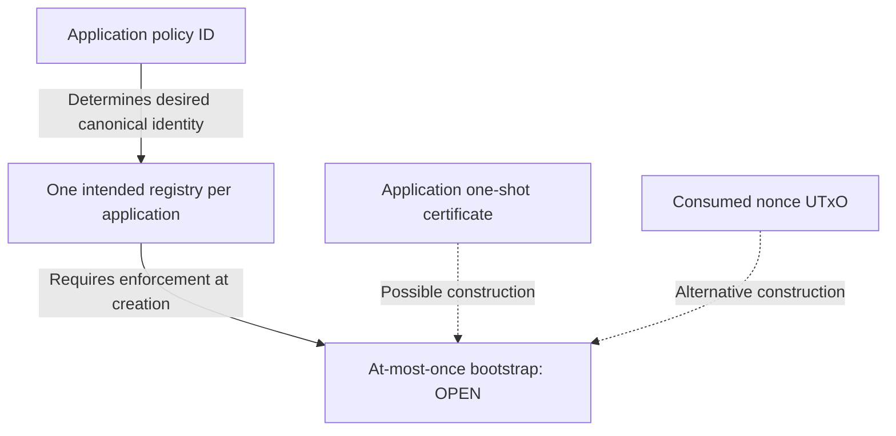

# Decisions and executable abstractions

As an application designer, use these decisions to distinguish behavior you can explore from construction choices you still need to settle. A successful modeled transition satisfies the selected logical checks; a refusal exposes a failed obligation. Neither result chooses your deployed scripts or proves your application policy.

The reviewed behavioral baseline is the [protocol specification](../specs/protocol/spec.md), [responsibilities](overview.md), [lifecycle](lifecycle.md), [certification boundary](certification.md) and [illustrative naming profile](naming-demo.md) merged in commit `fac38e643aa5d93f5bb6bb88acd9b9dd5b78e66f`. The current main presentation changes (`40aa6fc`) do not constitute a new source review or change this candidate’s frozen formal identities. The executable candidate adds an executable interpretation for review. It does not close the construction decisions below.

## Adopted behavior

| Story | Binding requirement |
| --- | --- |
| Register, retire or delete a key | Insert is Absent → Active with representative creation; Update is Active → Over with burn; Delete is Active → Absent with burn. Over is terminal. |
| Authorize insertion and cancellation separately | The configured application policy directly issues separate Insert and Withdraw action assets with exact, domain-separated action commitments. An additional mandatory native request policy is not selected for those actions. |
| Certify the initial application output | Insert approval exists at action minting and binds the initial application output. Approval is not a key reservation. Native recognition does not prove arbitrary application semantics. |
| Cancel an exact pending Insert | Withdraw targets the exact pending Insert and declared refund effects, creates no representative and changes no registry entry. Original Insert approval is insufficient. |
| Release into terminal custody | The releasing application validator authorizes the exact Update/Delete request. That request retains the existing representative until valid completion; no ordinary cancellation or sweep releases it. |
| Evolve the application while active | Applications may evolve their own state while preserving their representative, without a registry Update. Active describes an outstanding representative, including request custody. |
| Submit a batch without native privilege | Folds use successive registry states, have no native privileged folder gate, and require executing witnesses for transitions and custody even when per-asset mint quantities net to zero. |

These requirements incorporate the later action-asset and executing-witness corrections. Earlier alternatives requiring a second native Insert/Withdraw request policy are superseded. Policy identity and application spending-script identity remain distinct semantic roles even when an implementation shares a script hash.

## Choices and alternatives

| Chosen behavior or abstraction | Alternative not selected | Why |
| --- | --- | --- |
| One canonical registry per application policy ID | Arbitrary independent registry instance parameter | Gives the application one intended registry identity; at-most-once bootstrap enforcement still needs construction. |
| Direct application-issued, domain-separated Insert and Withdraw assets | Second mandatory native request policy for these actions | Keeps application approval at issuance and requires distinct cancellation authority. |
| Representative retained in a terminal request until valid completion | Ordinary cancellation or custody sweep | Preserves the intended release-to-completion custody obligation; its general whole-transition theorem is still missing. |
| Logical authenticated map, commitments and witnesses | Selecting concrete ledger scripts and encoding in this candidate | Enables executable inspection while keeping deployment decisions explicit. |
| Sequential atomic selected batch | Automatically skip failing selected items | Makes each selected transition depend on the preceding result and refuses the batch on failure. |

## Proposed abstraction boundary

An executable logical map may stand for authenticated MPF state, a tagged structured value may stand for an unambiguous action commitment, and an explicit witness or contract parameter may stand for a ledger validator's authenticated result. These abstractions make the intended transition law inspectable without choosing a serialization, hash function, script deployment or application policy. Their exact use and limitations are recorded beside the Lean definitions and in the [model ledger](model-ledger.md).

Required native output parameters remain explicit fields such as representative identity and quantity, datum, destination and supported value requirements. The model is not authority to introduce a universal transaction-predicate language. Example names, addresses and policy identities are illustrative values, not production schemas or a global allowlist.

The desired identity is **one canonical registry per application policy ID**, without an arbitrary independent instance parameter. The policy can serve as a downstream trust anchor, conditional on its issuance invariants, but parameterizing by that reusable ID does not prevent duplicate creation of the same registry asset and state. Bootstrap must enforce an at-most-once invariant. An asset is identified by policy ID and asset name; a policy ID alone identifies a distinguished singleton only when its issuance rules enforce that distinction. An application-supplied one-shot bootstrap certificate could avoid a separate Singular nonce parameter; consuming a nonce UTxO is another construction option. The bootstrap mechanism remains open as part of configuration and registry identity construction. The current model starts with a supplied `Config` and contains no registry-creation transition, so it establishes neither bootstrap enforcement nor deployed registry uniqueness.

The diagram separates the desired identity from the unresolved enforcement mechanism. The current executable model supplies configuration after this boundary; it does not model either bootstrap option.

## Open construction decisions

| Construction topic | Still requires a ruling or construction | Boundary for this candidate |
| --- | --- | --- |
| Configuration and canonical identity | Configuration authentication, registry/policy identity and hash dependencies | Logical authenticated configuration; no chosen script-hash-cycle solution. |
| Action encoding and lifecycle | Canonical encoding/hash, action-asset reuse/disposal, optional terminal-request token and burn branch | Explicit action commitments and logical witness/scope checks; no selected binary schema or token economy. |
| Withdrawal and refunds | Withdrawal approval conditions, refund economics and disposal | Exact cancellation target and declared refund requirements; application approval remains conditional. |
| Identity across reinsertion | Representative identity and approval scope across Delete/reinsert | Scoped logical authorization and explicit representative identity; no universal incarnation allocation scheme selected. |
| Batch construction | Batch selection, limits and failure presentation | Sequential transition semantics; executable examples do not establish capacity, fairness or a skip policy. |
| Ledger execution | Ledger transaction shapes, allocation of checks to concrete scripts and shared libraries | Executing logical witness obligations, including net minting; no proof of Cardano execution or imported MPFS guarantees. |
| Naming application | Naming normalization, authorization, datum schema, resolver authentication and economics | Illustrative register/resolve/change-address stories under explicit model assumptions. |

## Evidence and next stage

The candidate's Lean build with its compiled axiom gate, exact proof inventory, exported finite corpus and browser checks are creator evidence. Every theorem is **PROVED** from the standard axioms. Independent audit, accepted statements and production conformance have not been commissioned as part of this delivery.
