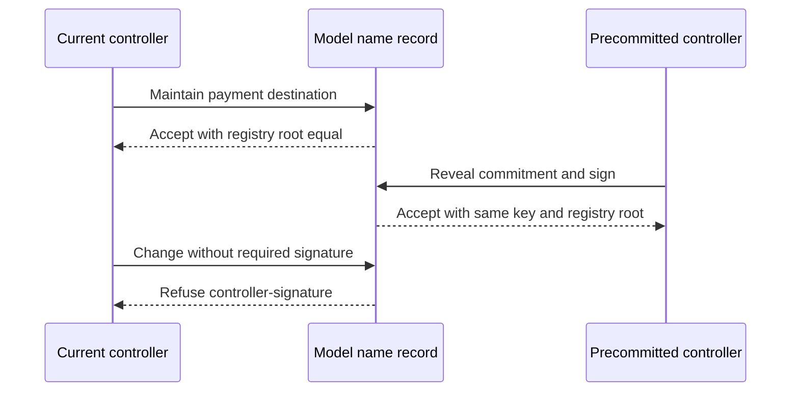

# Maintain and recover a name — 23 October target

As a name holder, I want to keep the same name while changing its payment destination and recovering control with my precommitted key, so that a payer can use my current destination. This page rehearses that story in the accepted Lean model. The [dated project card](https://github.com/orgs/lambdasistemi/projects/4/views/5) requires a separate connected devnet run before its target is accepted.

## Model and fictional inputs

The source is Singular commit `a6e5edbc2dafa82eb34116a1de2b6503f87c6692`: [naming lifecycle](https://raw.githubusercontent.com/lambdasistemi/singular/a6e5edbc2dafa82eb34116a1de2b6503f87c6692/lean/Singular/NamingLifecycle.lean), SHA-256 `ac2c5ef33d34084c32c37b701e8ec9c4ab5b088cab75190e675b1f1686fb5f56`, with the [naming fixture](https://raw.githubusercontent.com/lambdasistemi/singular/a6e5edbc2dafa82eb34116a1de2b6503f87c6692/lean/Singular/Naming.lean) and [Lean execution rows](https://raw.githubusercontent.com/lambdasistemi/singular/a6e5edbc2dafa82eb34116a1de2b6503f87c6692/lean/LifecycleMain.lean). The demo spelling **alice** means model key `42`. The fixture's address bytes, policy numbers and commitments are synthetic model inputs. They are not real Cardano assets, a payment address to use, or signatures seen by a node.

The recorder executes `lean/LifecycleMain.lean`, asserts its returned maintenance and recovery rows, then shows those model results. It does not replay a Cardano transaction. The two root-equality rows report what the Lean computed; no independent validator or devnet check is inferred from them.

## Presenter path: 10–15 minutes

| Time | Action | Ask the audience to observe |
| --- | --- | --- |
| 0–2 min | State the name holder's goal and identify key `42` as fictional. | The registry key identifies the name; the fixture carries the destination. |
| 2–5 min | Play maintenance and root-equality frames. | Lean rows `LM01` and `LM04` hold; maintenance leaves the registry root equal. |
| 5–7 min | Play the unauthorized frame. | Missing controller signature yields `controller-signature`. |
| 7–10 min | Play recovery and root-equality frames. | The committed key is accepted; the registry root remains equal. |
| 10–12 min | Play wrong reveal and missing signer frames. | `recovery-commitment` and `recovery-required-signer` are refused. |
| 12–15 min | Review the devnet gate below. | No transaction, policy identity or fresh record readback was shown. |

## Play the Lean rehearsal

[Download the 80-column asciicast](assets/video/d02-naming-model.cast). From a checkout, run `node demo/naming-lifecycle-demo.mjs --fast` for the asserted Lean rows, or `bash demo/record-naming-lifecycle-demo.sh` to record and validate the cast. The recording is SHA-256 `84a2457d5f444825024baa37901798ffb3558c54f8a556ec9e52498ef81d9424`.

## What the dated card still needs

The [Singular naming epic](https://github.com/lambdasistemi/singular/issues/174) must supply a released registry handoff and a connected devnet naming run: register a name, maintain the destination, recover with the committed controller, read the fresh record, and refuse unauthorized maintenance. The evidence must bind the release, policy identities, transaction IDs and node readbacks. Until those exist, this is a **model rehearsal candidate**, not a playable devnet or preprod acceptance result.
