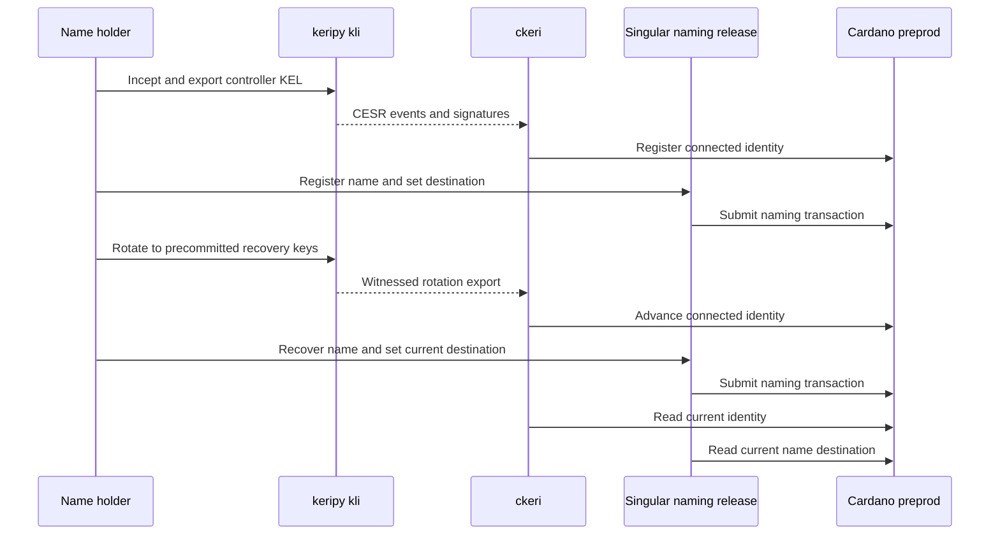

# Maintain and recover a name — 23 October preprod target

As a name holder, I want to keep the same name while changing its payment destination and recovering control with my precommitted key, so that a payer can use my current destination.

**Planned release tag:** Singular `v2.0.0` (naming and escrow milestone). This is a milestone target; the tag waits for the 30 October release gate, a built archive and connected preprod receipts. Candidate plays do not publish it.

This is a **Cardano preprod target**, not a completed demonstration. The presenter will use keripy `kli` to create and rotate the controller's KERI identity and a released `ckeri` command to submit and read back each connected Cardano action. The Singular naming commands and preprod release needed to join that journey are still missing. The [dated project card](https://github.com/orgs/lambdasistemi/projects/4/views/5) remains a review target.

## Preprod play to record

The accepted [naming lifecycle model](https://raw.githubusercontent.com/lambdasistemi/singular/a6e5edbc2dafa82eb34116a1de2b6503f87c6692/lean/Singular/NamingLifecycle.lean) at `a6e5edbc2dafa82eb34116a1de2b6503f87c6692` defines maintenance, recovery and refusals. Its synthetic address bytes and key `42` are model fixtures. They are not preprod assets, keys or transactions. The Cardano KERI to Singular registry mapping remains open in [KERI #435](https://github.com/lambdasistemi/cardano-keri/issues/435), so the preprod sequence above cannot yet be claimed as a connected implementation.

## Presenter path: 10–15 minutes when connected

| Time | Action | Required observation |
| --- | --- | --- |
| 0–2 min | Identify the preprod manifest, released `ckeri`, keripy version and fresh demo wallet. | Release and policy identities are pinned. |
| 2–5 min | Use `kli` to incept and export a fresh AID, then register it through `ckeri`. | CESR digest, transaction ID and fresh AID readback agree. |
| 5–8 min | Register the name and set its payment destination using the released Singular interface. | Name policy, transaction ID and destination readback agree. |
| 8–11 min | Rotate through `kli`, advance through `ckeri`, then recover the name. | Same name identifier, new controller and current destination are read from preprod. |
| 11–15 min | Attempt unauthorized maintenance and wrong recovery evidence. | Each refusal is attributed to its actual validator or client boundary. |

## Recording gate

The asciicast must record the real `kli`, `ckeri` and Singular commands and their preprod readbacks. Invented identities may be generated for the demo, but their actual AID, asset IDs, transaction IDs and refusals must come from that run. No preprod cast is attached yet. The earlier Lean and Node recording is model evidence and does not demonstrate this user story.

The [Singular naming epic](https://github.com/lambdasistemi/singular/issues/174) must supply the released naming interface and transaction path. The Cardano KERI registry mapping must bind the two accepted models before connected acceptance. Until then, the page is a play plan, with no claim of naming preprod acceptance.
