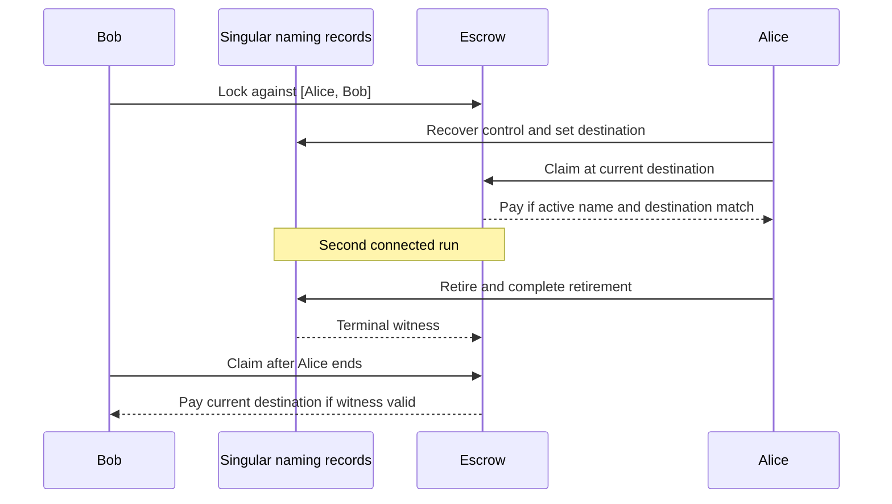

# Name Your Address preprod stretch — 30 October target

As Bob, I want to lock funds against the ordered names Alice then Bob, so Alice can claim at her current destination after recovery and I can claim only after Alice's name ends permanently. This [dated project card](https://github.com/orgs/lambdasistemi/projects/4/views/5) is **not yet playable as a connected preprod journey**.

## Planned play

The accepted Singular model at `a6e5edbc2dafa82eb34116a1de2b6503f87c6692` supplies the [registry edges](https://raw.githubusercontent.com/lambdasistemi/singular/a6e5edbc2dafa82eb34116a1de2b6503f87c6692/lean/Singular/Model.lean) and [naming lifecycle](https://raw.githubusercontent.com/lambdasistemi/singular/a6e5edbc2dafa82eb34116a1de2b6503f87c6692/lean/Singular/NamingLifecycle.lean). The latter has synthetic model address bytes, not a preprod wallet. The cast for the [23 October naming rehearsal](d02-naming.md) covers only maintenance and recovery Lean rows. It does not execute this escrow journey. There is no cast of an accepted preprod payment here.

## Presenter path: 10–15 minutes when runnable

| Time | Action | Required observation |
| --- | --- | --- |
| 0–2 min | Identify Alice, Bob and the ordered names as synthetic demo identities. | Release archive hash, installed CLI and preprod manifest are visible. |
| 2–5 min | Lock and run Alice's recovery then claim. | Confirmed lock and claim transactions; destination read at claim time. |
| 5–8 min | Start a second lock, retire Alice and complete retirement. | The terminal witness is minted after completion. |
| 8–10 min | Bob claims at his current destination. | Confirmed payment and fresh node readback. |
| 10–13 min | Attempt Bob's early claim, wrong destination and missing witness. | Each refusal is attributed to its actual script boundary. |
| 13–15 min | Review the evidence package. | Script and policy IDs, archive hash, transaction IDs and gaps are explicit. |

## Missing interface and evidence

The [escrow validator ticket](https://github.com/lambdasistemi/singular/issues/152), [CLI ticket](https://github.com/lambdasistemi/singular/issues/139), [preprod journey](https://github.com/lambdasistemi/singular/issues/153) and [completion repair](https://github.com/lambdasistemi/singular/issues/130) must yield one connected runnable script from a downloaded release. This page has no release or preprod receipt, and the two claims and three refusals have not been observed here. No timeout, refund route or payer privilege is inferred.
