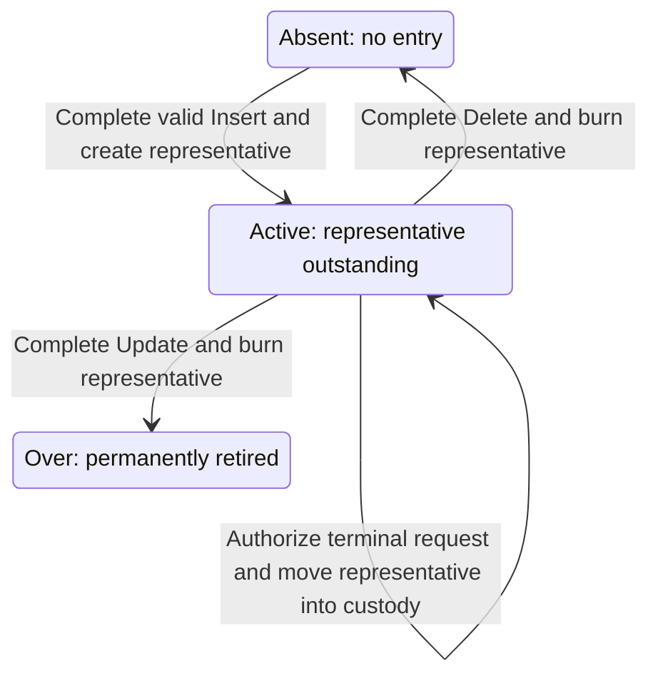
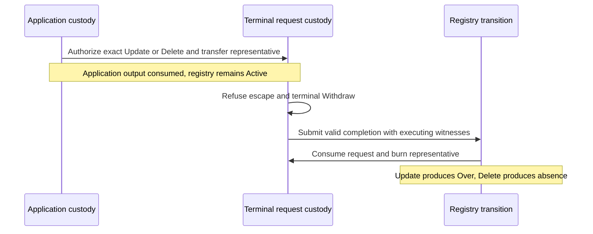
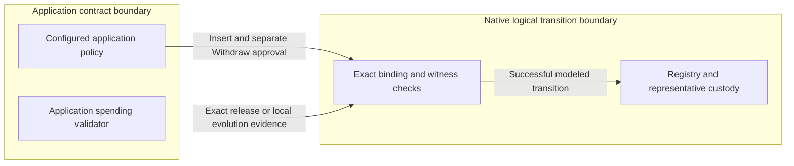

# Executable design candidate

As an application designer, follow a registration from an approved request into a live application output, then explore address changes, retirement and deletion. The simulator shows successful transitions and exact refusals so you can inspect the proposed behavior before choosing a ledger construction.

<a href="../../simulator/">Open the playable Singular simulator</a> or follow the [simulation walkthrough](simulation.md).

This is a **creation candidate**: the logical Lean model and separately authored browser simulation make the design executable. All 41 theorem and inversion declarations are **PROVED** from the standard axioms, and the build refuses any statement that is admitted again. Proofs establish properties of the model; they do not by themselves accept the design.

## Story: register and use an application output

A requester stages a certified Insert whose approval binds the initial application output. Staging reserves no key and creates no representative. At fold time, the key must be absent and the exact output and approval scope must match. A valid Insert creates the representative and makes the entry `Active`; a competing Insert at an occupied key is refused.

The diagram shows registry states. Staging a pending Insert does not change whether the key is absent. An application can evolve its own state while preserving its representative; changing an address is such an evolution. Registry Update means retirement, and `Over` has no outgoing transition. Delete makes the key absent again; any reinsert still needs a valid certified output and approval scope for its incarnation.

## Story: cancel a proposal or finish a terminal request

A requester can cancel a pending Insert only with a separately authorized Withdraw action bound to that exact request and declared refund requirements. The original Insert approval is insufficient. Withdrawal creates no representative and changes no registry entry; refund commitments do not establish a wallet payment.

For retirement or deletion, the application validator authorizes the exact terminal request and releases its existing representative into request custody. The registry stays `Active`, but the representative is unavailable to the application. No ordinary cancellation or sweep releases it. Valid completion consumes the request, burns the representative and changes the map.

These are executable behaviors and proved obligations. A general whole-transition theorem that terminal custody leaves only through completion is still missing. Escape-refusal and supply statements, or a finite terminal-Withdraw refusal, do not close that gap.

## Story: fold a selected batch

Any submitter can select an ordered batch. Each item sees the registry produced by the previous item; a failure refuses the selected batch atomically. There is no native privileged folder gate, automatic skipping, capacity guarantee or fairness claim. Executing witnesses remain required even when mint and burn quantities for the same asset net to zero; distinct identities do not cancel each other.

The [model ledger](model-ledger.md) maps requirements and finite scenarios to modeled behavior, conditions, abstractions and omissions. The [theorem inventory](theorems.md) records the exact statements, each proved. The [mutation proposals](mutants.md) describe candidate fault coverage; no mutation campaign or independent audit result is claimed.

## Reading the application trust boundary

The model uses logical identities and authenticated state instead of Cardano bytes and MPF proofs. Application authorization is an explicit contract boundary: recognizing the configured issuer does not establish that an arbitrary application's policy implements the semantics it claims.

The model supplies authenticated application evidence; the browser does not execute those validators. The [decisions and executable abstractions](decisions.md) distinguish adopted behavior from unresolved construction choices.

| Choice for this candidate | Alternative not selected | Reason and limit |
| --- | --- | --- |
| Logical map, tagged commitments and explicit witness evidence | Concrete MPF proofs, binary encoding and deployed scripts | Makes the transition law inspectable while ledger construction remains open. |
| Direct application-issued Insert and Withdraw action assets | Additional mandatory native request policy for those actions | Preserves the adopted application certification boundary and separate action authorization. |
| Sequential, atomic selected batches | Implicit skipping or a privileged folder | Exposes each successive state and refuses a failed selected batch without adding native privileges. |

The simulation is a separate author's transcription of the frozen Lean interface. Its [clarity record](LEAN-CLARITY.md) preserves what the formal artifacts did and did not communicate. Finite trace agreement and interactive checks provide bounded creator evidence. They cannot establish universal correspondence, an independent statement audit, proof completeness or ledger deployment conformance.

## Candidate status

The same published candidate includes the [executable Lean source](../model/Singular/Model.lean), [proved statements](../model/Singular/Statements.lean), their [supporting lemmas](../model/Singular/Lemmas.lean) and [exported finite corpus](../model/corpus.json). Their identity belongs to this candidate; the proofs were completed without changing any statement.

The repository carries no deployed Singular validator, accepted statement audit or production release. The proofs are complete and individually inventoried, with a compiled axiom gate on every build. The requested review surface is the draft PR and its exact candidate preview; independent audit stages remain separate work.

Two blind source reviews preceded simulator authoring and both recommended proceeding. Their source reasoning did not execute an audit or prove the model. The resulting corpus refinements preserve the reviewed model and statement definitions. The general whole-transition terminal-custody theorem remains an explicit statement-coverage gap in the model ledger.

The original [protocol specification](../specs/protocol/spec.md) remains the behavioral authority. Its statements about unexecuted obligations describe the adopted specification baseline; executable coverage introduced in this candidate is tracked in the model ledger rather than inferred from a successful documentation build.
