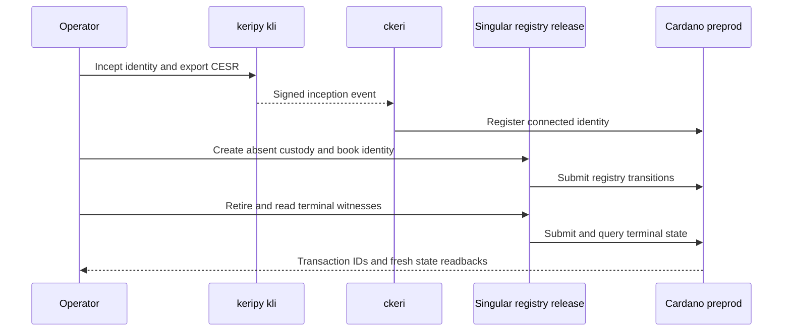

# First demo: registry handoff on preprod

As a Cardano KERI integrator, I want to see a released Singular registry handle a real identity's registration, retirement and custody, so that I can evaluate the interface that Cardano KERI will consume.

**Planned release tag:** Singular `v1.0.0` (registry handoff milestone). This is the first demo release target, conditional on the built archive and connected preprod replay; no future tag is published by this plan.

**8 October 2026 is a target, not an observed result.** The [project story](https://github.com/orgs/lambdasistemi/projects/4/views/5?pane=issue&itemId=252955454) requires a connected Cardano preprod play. The accepted [Singular Lean model](../lean/Singular/Model.lean) defines expected transitions; the deployed script, released operator command and fresh node readbacks must establish each claimed outcome.

The planned identity read path is the Cardano KERI follower store: use `ckeri` writes with `--store PATH` and status with explicit `--backend local --store PATH`, recording its chain point and freshness. The Singular registry readback needs the persistent indexed proof path tracked by [#107](https://github.com/lambdasistemi/singular/issues/107); the current preprod session follower confirms new transactions, while a node provider handles older outputs. The older Koios-backed V1 cast is a checkpoint baseline only; it cannot stand in for this joined result.

## Preprod play to record

| Time | Presenter action | Evidence to inspect |
| --- | --- | --- |
| 0–2 min | Pin the Singular and Cardano KERI releases, manifests, scripts and accepted model revisions. | Exact artifact, policy and model identities. |
| 2–4 min | Use `kli` to incept a fresh AID and export its signed CESR stream. | Actual AID, event digest and signatures. |
| 4–6 min | Use `ckeri` to register the identity on preprod. | Confirmed checkpoint transaction and fresh `ckeri status` readback. |
| 6–9 min | Create absent custody, book the identity, then retire it through the released Singular interface. | Registry transaction IDs, token and custody effects, refund destination and node readbacks. |
| 9–11 min | Read two terminal witnesses. | Both witness outputs and the same terminal root. |
| 11–15 min | Attempt an illegal transition and token delta. | Refusals attributed to their actual client or validator boundary; list uncovered rows. |

The registry operation names above describe the user story. They are not asserted to be commands available in the current release. The [registry epic #154](https://github.com/lambdasistemi/singular/issues/154) must supply the released Singular interface and connected preprod receipts. The [Cardano KERI consumer mapping #324](https://github.com/lambdasistemi/cardano-keri/issues/324) must bind the two accepted models before the joined sequence is an accepted integration.

## Recording gate

Record an asciicast only after the exact `kli`, `ckeri` and Singular preprod commands complete. The cast must show their real output, transaction IDs, script and policy identities and fresh readbacks. A fictional name may label a freshly generated identity or asset, but its actual identifiers and ledger effects must come from the run. No preprod cast is attached yet.
