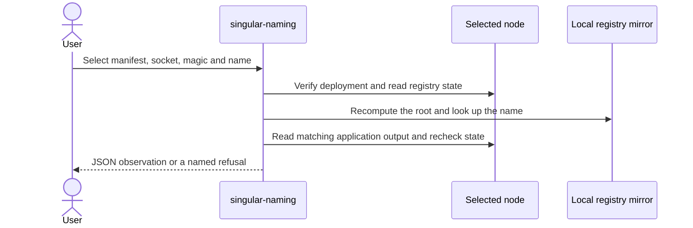

# Manage a naming registry

As a name holder, you can select an existing registry, inspect a name, change
its payment destination, or recover control using your committed successor.
Each invocation performs the action you selected and reports JSON. Refused
actions exit nonzero and explain the failure on standard error.

This draft currently provides `attach`, `inspect`, `maintain` (also `update`)
and `recover`. Registration, connected cancellation, retirement, folding and
following are still being integrated; this page does not claim full lifecycle
delivery.

## Install the executable

After extracting the on-chain release archive and verifying its `SHA256SUMS`,
install from its root directory:

```sh
nix profile install ./offchain#singular-naming
singular-naming --help
singular-naming maintain --help
```

The release package carries its compiled registry and naming scripts. Keep
the deployment manifest issued for those scripts. Attachment refuses a manifest
whose policy identities disagree with the installed release.

For a source checkout, build the scripts and supply their paths explicitly:

```sh
export REGISTRY_BLUEPRINT="$(nix build --no-link --print-out-paths ./onchain#plutus-blueprint)"
export NAMING_BLUEPRINT="$(nix build --no-link --print-out-paths ./naming-onchain#plutus-blueprint)"
nix run ./offchain#singular-naming -- --help
```

## Select the registry and inspect a name

Supply the manifest, your node's socket, and its network magic on each call.
These examples use a development network with magic 42. Use the magic your
deployment actually records.

```sh
singular-naming --deployment registry.json --node-socket /run/node.socket \
  --network-magic 42 attach
singular-naming --deployment registry.json --node-socket /run/node.socket \
  --network-magic 42 inspect --name alice
```

Read commands require no wallet. Attachment checks the live state and reference
scripts. Inspection checks the local registry mirror against the live root
before reporting absence or resolving the representative. A stale or missing
mirror for a nonempty registry produces `mirror-unavailable`; it cannot prove
that a name is free. Name spelling is exact UTF-8, without normalization.



An authenticated active result includes the representative, record input and
current datum. Pending request references are reported separately. The draft
refuses occupied values without a matching authenticated live representative;
final Active/Over support awaits the representative identity integration. If
the registry state moves during observation, repeat the command against the
new state.

## Change the payment destination

The fee wallet pays transaction fees, supplies collateral, and funds any
minimum-ADA increase required by the updated datum. The controller
key authorizes the record change. They may be the same file, but both roles
must be supplied explicitly. Use existing payment signing-key files in the
Cardano CLI text-envelope format.

```sh
singular-naming --deployment registry.json --node-socket /run/node.socket \
  --network-magic 42 maintain --name alice \
  --wallet-skey fees.skey --control-skey controller.skey \
  --payment-destination "$PAYMENT_ADDRESS"
```

Use `--clear-payment-destination` instead of `--payment-destination` to remove
the destination. The command preserves the controller, next-control commitment,
retirement quorum and representative tokens. The node evaluates authorization
and the existing naming rules before submission; a wrong key cannot authorize
the change. A confirmed result reports the new record input after reading back
the exact expected datum.

## Recover with the committed next controller

Reveal the address whose commitment the record carries, sign with that address's
payment key, and supply a fresh commitment for the next recovery.

```sh
singular-naming --deployment registry.json --node-socket /run/node.socket \
  --network-magic 42 recover --name alice \
  --wallet-skey fees.skey --control-skey next-controller.skey \
  --next-control-address "$NEXT_CONTROL_ADDRESS" \
  --fresh-next-control-commitment "$FRESH_COMMITMENT_HEX"
```

The payment destination, retirement quorum and representative remain unchanged.
The fresh commitment must be 32 bytes encoded as hex. An incorrect reveal,
missing authorization or invalid successor datum is refused. Fees and script
budgets are derived from the connected node for the transaction being built.
