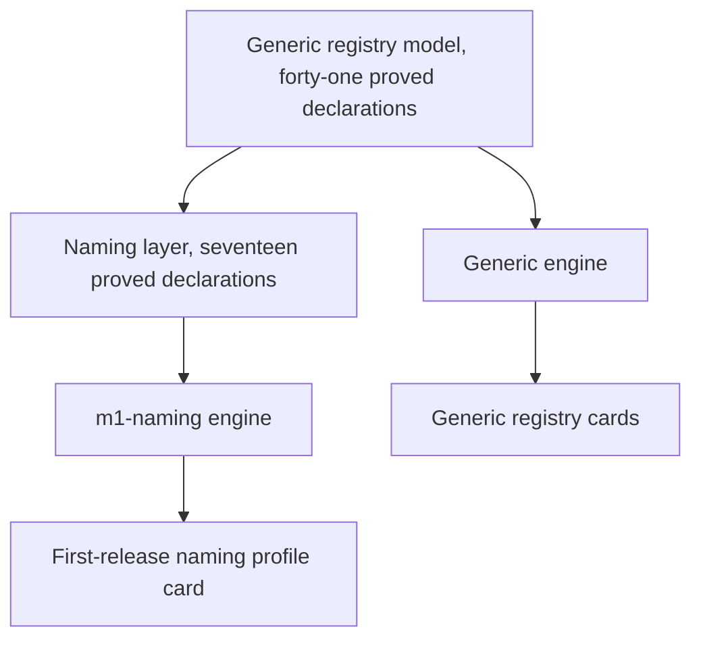

# First-release naming: claim, fold, resolve

## Who this is for

A reviewer who wants to play a naming claim in the docs rather than read a proposed walkthrough. This page is the entry point for the first-release naming profile — an explicit, labelled, **unaccepted candidate**. It is not the generic registry demo, and no on-chain acceptance is claimed anywhere on this page or in the simulator.

<a href="https://lambdasistemi.github.io/singular/simulator/">Open the playable simulator and choose the m1-naming profile</a>.

## What you can do

Open the simulator, select **m1-naming** under *First-release naming profile*, then:

1. **Queue the first claim** for the demo spelling `alice`. The claim waits with an application approval; the key stays absent, because approval reserves nothing.
2. **Queue a competing claim** for the same spelling. Two claims for `alice` may both sit pending.
3. **Fold the first pending claim.** The first valid absent-key fold succeeds: `alice` becomes Active, the representative is minted, and the active record carries the four certified fixture fields unchanged.
4. **Fold the second pending claim.** It is refused with `occupied-key` — uniqueness is decided only when a certified Insert folds.
5. **Resolve alice** with an authenticated view. The observation is `active` carrying the payment destination, control address, next-control commitment, and retirement quorum from the certified claim.
6. **Submit a crafted Delete.** The naming transition accepts the generic action shape, so a crafted generic Delete is parsed and then refused by name: `naming-no-delete`.

```mermaid
sequenceDiagram
  participant Reviewer
  participant Naming as m1-naming profile
  participant Registry
  Reviewer->>Naming: queue claim alice (first)
  Note over Naming: approval reserves nothing; alice stays absent
  Reviewer->>Naming: queue claim alice (competing)
  Reviewer->>Naming: fold the first claim
  Naming->>Registry: Insert on absent key
  Registry-->>Naming: Active, representative minted
  Reviewer->>Naming: fold the competing claim
  Naming-->>Reviewer: refused occupied-key
  Reviewer->>Naming: resolve alice (authenticated)
  Naming-->>Reviewer: active with certified fixture fields
```

## What you see when it is refused

Every refusal names its intended condition. A generic exception is a defect.

| Attempt | Refusal you should see |
| --- | --- |
| Fold the duplicate after the first Insert committed | `occupied-key` |
| Craft a Delete (or name-release, or reuse) straight at the naming transition | `naming-no-delete` |
| Queue an Insert with the application approval rejected | `application-approval` |
| Certified initial representative does not match the registry | `representative-identity` |
| Proposal bound to the wrong registry or policy | `insert-binding` |
| Resolve without an authenticated view | `unauthenticated` |

## How the pieces relate



The generic foundation stays upstream. The naming layer adds fixtures, queueing, folding, and observation on top; the m1-naming engine transcribes that layer and never drives Lean from the browser. Choosing the profile is an explicit act: until **m1-naming** is selected its controls stay inert, and switching back to **generic** leaves the naming engine explicitly. Neither engine silently becomes the other.

## What is proved and what is checked here

The naming layer carries seventeen theorem declarations, every one PROVED in Lean from the standard axioms alone, in a separate inventory from the generic forty-one. Seven record the user-facing contract: Delete refusal, no reservation on approval, absent-key activation, occupied-key duplicate refusal, fixture preservation through the fold, unauthenticated resolve, and payment-destination distinctness. Ten more pin the transition, queue-validation, and resolution equations that expose the full public boundary. The simulator replays a Lean-authored naming corpus of thirty-four rows — spelling, queue, fold, transition, resolution, and replay cases — and requires byte-identical verdicts from the transcription. The page's own self-test replays the same corpus in the browser.

Finite checks are finite: the corpus replays measure the transcription on its rows; they do not prove the quantified statements, and they do not make the candidate accepted.

## Fixture fields and finite-model limits

| Field | Shape in this slice |
| --- | --- |
| Payment destination | zero or one canonical binary base or enterprise address; when present, distinct from the control address |
| Control address | canonical binary base or enterprise address with a payment-key credential |
| Next-control commitment | 32-byte domain-separated BLAKE2b digest — the commitment, not a revealed next address |
| Retirement quorum | payment-key-hash members and a threshold, present as structure |

Values are finite-model fixtures, not product or economic policy, and no fee, bond, price, expiry, or refund rule is invented anywhere in the profile. `alice` maps to one frozen demo key. Continue to the [playable lifecycle](naming-lifecycle.md) for destination maintenance, committed-controller recovery, and split retirement through either the controller or published quorum. Naming-claim cancellation remains on hold and has no button; retirement-request withdrawal is a distinct refusal case. The naming proposal's generic output payload stays the generic demo constants; fixtures are first-class fields beside it, never packed into it.

## Status of this candidate

The claim/fold/resolve naming profile is an unaccepted candidate: proven in Lean, replayed in the simulator, and playable in the browser. The Nix-built documentation archive packages its raw model, corpus, replay inputs, and exact identities for review; building that bundle is not release publication or on-chain acceptance. The live preview is bound to the pull-request head, and the served page states the candidate is unaccepted.
