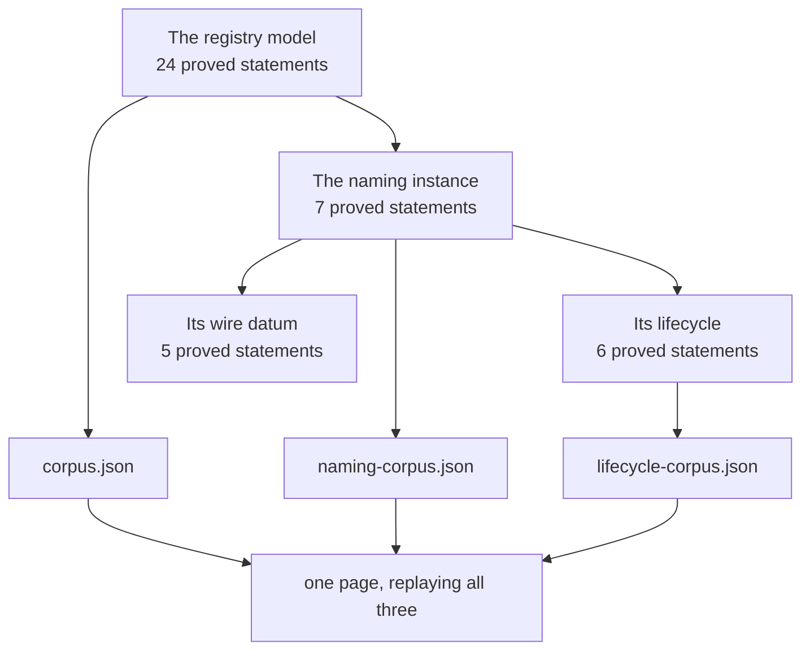

# Naming: book a name, retire it, attest it

## Who this is for

A reviewer who wants to play the naming profile in the docs rather than read a
proposed walkthrough. Naming is an **instance** of the registry, not a second
model: the same seven edges, the same tokens, the same refusals, with naming's
own rule about who may certify what.

<a href="https://lambdasistemi.github.io/singular/simulator/">Open the simulator</a>
and switch the profile picker to *Naming — the Over witness*.

## How a name moves in the registry

Naming is an instance of the registry, not a layer bolted beside it. A name is
one key in the registry's authenticated map, and the value of that key is a
single byte:

| state | byte | what it says |
| --- | --- | --- |
| Absent | `0x00` | somebody has witnessed that this name is free, and put up a deposit to say so |
| Active | `0x01` | the name is booked and live |
| Terminal | `0x02` | the name is over, forever |

Seven requests move a key, and nothing else does. Each one moves a witness
token, and the witness is what a reader looks at — never the root:

| request | before | after | witness moved |
| --- | --- | --- | --- |
| insert absent | no key | Absent | one absent witness minted into the cage's own custody |
| insert active | no key | Active | one active witness minted to the booker |
| update absent to active | Absent | Active | the absent witness burned, an active witness minted |
| update active to terminal | Active | Terminal | the active witness burned |
| delete absent | Absent | no key | the absent witness burned, the deposit returned |
| delete active | Active | no key | the active witness burned |
| read terminal | Terminal | Terminal | one terminal witness minted, the key untouched |

Every other shape is refused before any proof is checked, and each refusal
carries one trace label naming its own reason.

The witnesses obey four laws:

1. **A witness moves only inside a fold.** A mint or a burn under the absent,
   active or terminal policy is accepted only in a transaction that spends the
   registry's state token and folds it.
2. **The fold decides how many, and where.** It sums the witness column of the
   requests it consumed, and the transaction's mint under the three policies
   must equal that sum exactly — asset by asset, quantity by quantity. Nothing
   else may move under them.
3. **A terminal witness is its holder's to destroy.** It says a name is over,
   forever; burning your own copy costs the registry nothing, so that burn
   alone needs no fold.
4. **The asset name is the registry key.** Identity is the pair of policy and
   key, so a name recreated after a delete carries the same identity again.

One edge carries a rule of its own: ending a name needs the committed recovery key or the retirement quorum, and never the current control key alone.

**No application script at fold time.** The naming validator is not
executed by a fold at all. What it does instead is certify an edge in advance:
it mints one approval whose asset name binds the edge, the key, the owner and
the destination, the requester attaches that approval to their request, and the
cage recomputes the name from the request itself and refuses anything that does
not match. A folder is permissionless and can therefore be anyone, which is
exactly why the destination is bound: without it a folder could route your name
to itself.

## What you can do

**Watch the journey.** Five steps, played rather than asserted:

1. **The controller books `alice`.** One `insertActive`, certified by the
   controller's signature. The active token goes to the record.
2. **A quorum retires it.** One `updateTerminal`. The active token is burned and
   the leaf can never move again. The control key alone cannot do this — the
   rule is the committed recovery key revealed and signing, or a distinct-member
   quorum, and the control key on its own is neither.
3. **A folded read mints the Over witness.** `witnessTerminal` needs no approval
   at all: anyone may attest a retired name.
4. **And another.** The terminal witness is **plural**, because the attestation
   is a read. Both copies are true.
5. **Burn them both.** The leaf is still terminal. An attestation says something
   that stays true whether or not you keep the token.

**Read the replay below it.** Twenty-four naming rows across six sections —
spellings, queues, folds, transitions, resolutions and replays — each one a
verdict the Lean computed, recomputed in your browser. The two that carry the
amended retirement rule are `NS04-control-key-alone-never-retires` and
`NS05-quorum-retires`; `NF06-retirement-by-recovery-key` is the other route.

**Then the lifecycle.** Twenty-one more rows: seeding the consumer with its
pinned policies, moving a payment destination while the registry root stays put,
revealing the committed recovery key, and both retirement routes with the
refusals that guard them.

## Finding alice

The asset name IS the registry key. Given the registry's active policy id,
alice's witness is that policy plus the raw bytes of `alice` — no hash, no
controller, no registry token, no prefix and no incarnation enters it:

```sh
printf %s alice | xxd -p
# 616c696365
```

To find the live UTxO on preprod, substitute the published active policy id and query [Koios Asset UTxOs](https://api.koios.rest/#post-/asset_utxos):

```sh
policy_id='<published active policy id>'
asset_name=$(printf %s alice | xxd -p)
jq -n --arg p "$policy_id" --arg n "$asset_name" \
  '{_asset_list:[[$p,$n]],_extended:true}' |
  curl --fail-with-body -sS https://preprod.koios.rest/api/v1/asset_utxos \
    -H 'Content-Type: application/json' --data-binary @-
```

The holding address and inline datum identify the live record or the
completion-only custody a pending ending put it in. No trie lookup and no
creation-controller lookup is needed to locate a live witness.

The three policies share that one convention, so the same query answers three
different questions about the same name. A witness under the absent policy says
somebody has staked a deposit on the name being free. A witness under the active
policy says the name is booked, and its holding output is the record. A witness
under the terminal policy says the name is over — anyone may ask for one by
folding a read, and nobody can ever make the name live again.

```sh
# the same asset name, asked of each policy in turn
for policy in "$absent_policy" "$active_policy" "$terminal_policy"; do
  jq -n --arg p "$policy" --arg n "$asset_name" \
    '{_asset_list:[[$p,$n]],_extended:true}' |
    curl --fail-with-body -sS https://preprod.koios.rest/api/v1/asset_utxos \
      -H 'Content-Type: application/json' --data-binary @-
done
```

This is the whole reader protocol: presence of a token, never the root and
never a history walk.

## What you see when it is refused

Every refusal names its intended condition. A generic exception is a defect.

| Attempt | Refusal you should see |
| --- | --- |
| Book a name that is already booked | `already-booked` |
| Book a key whose leaf is unknown, without first witnessing it | `key-unknown` |
| Move a retired name, by any edge at all | `terminal-immutable` |
| Attest a name that is not retired | `read-active`, `read-absent`, `read-unknown` |
| Retract a witnessed absence whose custody entry is gone | `custody-missing` |
| Retire with a control-key signature alone, or below quorum | `naming-retirement-uncertified` |
| Delete an active name through the naming profile | `naming-no-delete` |
| Present an approval under the right policy for a different request | `approval-mismatch` |
| Present no approval on any edge but the read | `no-approval` |

The last two are the ones worth trying by hand in the generic profile's free
play. The retirement row and the delete row are deliberately **different**
names: naming defines no delete, and a retirement that met neither authorization
route is a different failure that must not wear delete's name.

## How the pieces relate



Naming does not re-implement the registry and the page does not re-implement
naming. The previous simulator did re-implement it, in about nine hundred lines
of JavaScript, and when the Lean moved those lines went on describing a model
that no longer existed while still reporting green. What the page transcribes is
the replay: every row is a verdict the Lean computed, and the page recomputes or
re-checks it in front of you.

## What is proved and what is checked here

The naming instance carries seven theorem declarations, its lifecycle six and its
wire encoding five — eighteen in all, each **PROVED** in Lean from the standard
axioms alone and each in its own manifest with its own compiled gate, separate
from the registry's twenty-four. The naming statements are stated as
characterisations rather than one-way implications: the retirement rule says
exactly when retirement is certified, so a model that certified *more* than the
rule allows fails them as surely as one that certified less.

The page replays twenty-four naming rows and twenty-one lifecycle rows, and
requires the verdict it computes to be the verdict the Lean exported.

Finite checks are finite: the corpus replays measure the transcription on its rows; they do not prove the quantified statements, and they do not make the candidate accepted.

## Fixture fields and finite-model limits

| Field | Shape in this slice |
| --- | --- |
| Payment destination | zero or one canonical binary base or enterprise address; when present, distinct from the control address |
| Control address | canonical binary base or enterprise address with a payment-key credential |
| Next-control commitment | 32-byte domain-separated BLAKE2b digest — the commitment, not a revealed next address |
| Retirement quorum | payment-key-hash members and a threshold, present as structure |

Values are finite-model fixtures, not product or economic policy, and no fee, bond, price, expiry, deposit, or refund-value rule is invented anywhere in the profile. `alice` maps to one frozen demo key. The request stores a refund address inside its Insert commitment, and cancellation can only copy that address. Continue to the [lifecycle page](naming-lifecycle.md) for destination maintenance, committed-controller recovery, and split retirement through either the controller or published quorum. Retirement-request withdrawal is a distinct refusal case. The naming proposal's generic output payload stays the generic demo constants; fixtures are first-class fields beside it, never packed into it.

## Status of this candidate

The naming profile is an unaccepted candidate: proven in Lean, replayed in the simulator, and playable in the browser. The Nix-built documentation archive packages its raw model, corpus, replay inputs, and exact identities for review; building that bundle is not release publication or on-chain acceptance. The live preview is bound to the pull-request head, and the served page states the candidate is unaccepted.
