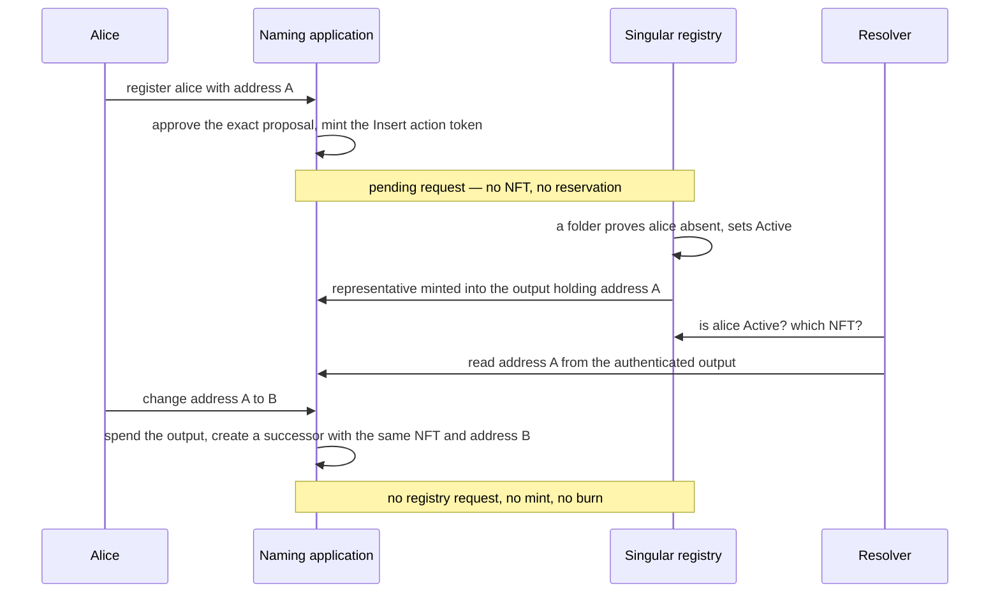

# Naming walkthrough: register, resolve, change address

A small naming application makes Singular's separation visible: register `alice`, resolve it to a Cardano address, then change that address. This is an illustrative proposed demo, not a running application or a naming standard.

The profile below uses a name as registry key and an address in the application datum. Name normalization, who may authorize changes, initial deposits and withdrawal conditions are application decisions still to select. They are not Singular rules.

## The three actions at a glance

## Register

Alice asks the application to approve an Insert proposal for `alice`, with an initial datum containing address A and the required application script destination. The configured application policy mints the action token committing to that proposal and enforces the required request construction. The pending request has no representative NFT.

A folder later includes it with an absence proof. Successful folding sets the key to `Active` and mints its representative into the certified application output containing address A. A competing Insert for the same occupied key cannot succeed. Prior approval never reserved Alice's place in the ordering.

## Resolve

A resolver establishes that the key is `Active`, authenticates its representative and finds the current application UTxO carrying it. It reads address A from that output's datum according to the application's schema. Merely finding text `alice` or an unauthenticated datum is insufficient.

A pending Update/Delete request can still have an `Active` registry entry, but its NFT is in request custody. The resolver must distinguish that pending state instead of returning it as a live application address. Absent and `Over` keys likewise provide no current application address. How the resolver locates and authenticates these ledger facts is an implementation decision, not an assumed trustworthy indexer.

## Change address

The application's authorization rules approve changing address A to B. Its spending validator consumes the current application UTxO and requires a successor containing the same representative and the new datum. The registry remains `Active`; there is no registry Update and no representative mint or burn.

| User action | Registry operation | Representative movement |
| --- | --- | --- |
| Register `alice` | Insert, when folded | Mint into the application UTxO |
| Resolve `alice` | Read only | None |
| Change address A to B | None | Move to the successor application UTxO |

A later name release or permanent retirement could illustrate Delete or Update separately. Canceling a still-pending Insert requires its own application-approved Withdraw token bound to the exact request and refund effects. Those are protocol examples, not extra features needed for this minimal demo.

The demo must eventually show these outcomes and rejection cases; none has been implemented or tested here. See the [draft protocol requirements](../specs/protocol/spec.md) and [certification boundary](certification.md).
