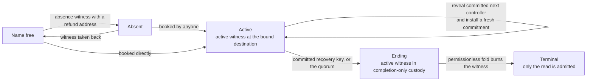
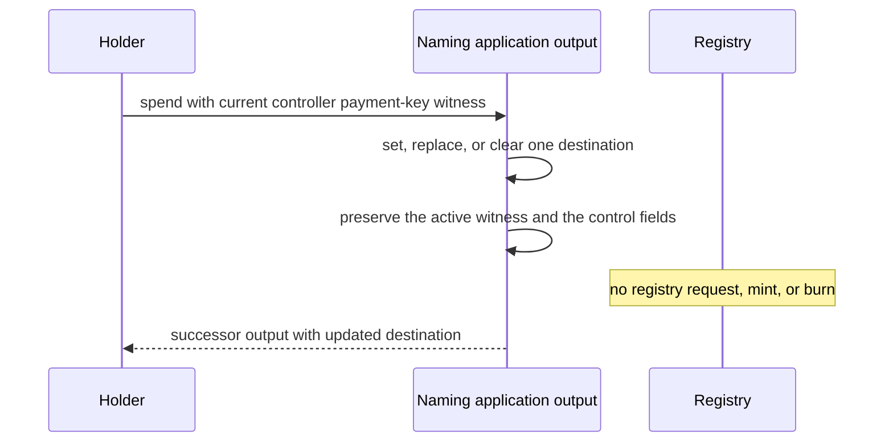
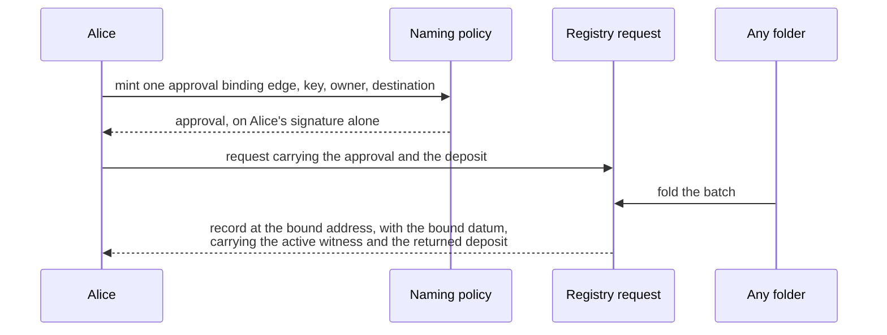
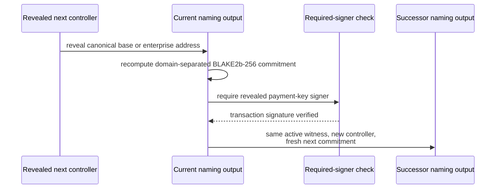
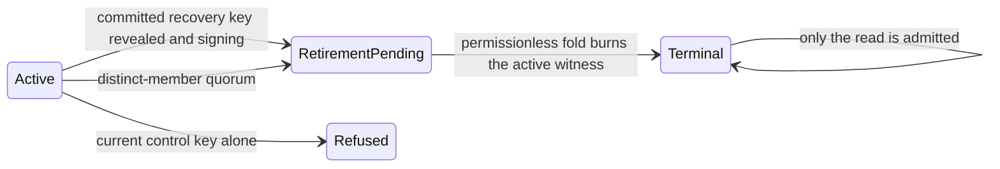
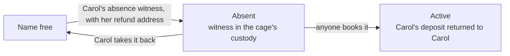

# Keep control of a name through its lifecycle

## Who this is for

Somebody who wants to witness that a name is free and get their deposit back,
somebody who wants to book one, and somebody holding a live name who wants to
change where it receives payments, recover after losing the current control key,
or end it permanently. Ending a name needs the committed recovery key or the
retirement quorum, and the active witness moves into completion-only custody
before it burns.

This page accompanies the executable candidate. <a href="https://lambdasistemi.github.io/singular/simulator/">Open the simulator</a> and switch the profile to *Naming — the Over witness*: the last panel replays the lifecycle, row by row, as the Lean computed it — moving a payment destination while the registry root stays put, revealing the committed recovery key, and ending a name through either authorization route with the refusals that guard them. It remains a design-time model, not an observed ledger execution.

## How a name moves in the registry

Naming is an instance of the registry, not a layer bolted beside it. A name is
one key in the registry's authenticated map, and the value of that key is a
single byte:

| state | byte | what it says |
| --- | --- | --- |
| Absent | `0x00` | somebody has witnessed that this name is free, and put up a deposit to say so |
| Active | `0x01` | the name is booked and live |
| Terminal | `0x02` | the name is over, forever |

Seven requests move a key, and nothing else does. Each one moves a witness
token, and the witness is what a reader looks at — never the root:

| request | before | after | witness moved |
| --- | --- | --- | --- |
| insert absent | no key | Absent | one absent witness minted into the cage's own custody |
| insert active | no key | Active | one active witness minted to the booker |
| update absent to active | Absent | Active | the absent witness burned, an active witness minted |
| update active to terminal | Active | Terminal | the active witness burned |
| delete absent | Absent | no key | the absent witness burned, the deposit returned |
| delete active | Active | no key | the active witness burned |
| read terminal | Terminal | Terminal | one terminal witness minted, the key untouched |

Every other shape is refused before any proof is checked, and each refusal
carries one trace label naming its own reason.

The witnesses obey four laws:

1. **A witness moves only inside a fold.** A mint or a burn under the absent,
   active or terminal policy is accepted only in a transaction that spends the
   registry's state token and folds it.
2. **The fold decides how many, and where.** It sums the witness column of the
   requests it consumed, and the transaction's mint under the three policies
   must equal that sum exactly — asset by asset, quantity by quantity. Nothing
   else may move under them.
3. **A terminal witness is its holder's to destroy.** It says a name is over,
   forever; burning your own copy costs the registry nothing, so that burn
   alone needs no fold.
4. **The asset name is the registry key.** Identity is the pair of policy and
   key, so a name recreated after a delete carries the same identity again.

One edge carries a rule of its own: ending a name needs the committed recovery key or the retirement quorum, and never the current control key alone.

**No application script at fold time.** The naming validator is not
executed by a fold at all. What it does instead is certify an edge in advance:
it mints one approval whose asset name binds the edge, the key, the owner and
the destination, the requester attaches that approval to their request, and the
cage recomputes the name from the request itself and refuses anything that does
not match. A folder is permissionless and can therefore be anyone, which is
exactly why the destination is bound: without it a folder could route your name
to itself.

## Change the payment destination

The active controller may set, replace, or clear the single optional payment destination. The destination is routing data, not an authority credential: it need not belong to the controller. A successful change preserves the registry identity, registry key, active witness, controller, next-control commitment, and retirement quorum.

The transition refuses a missing or wrong controller witness, more than one destination, and any attempt to alter the controller, committed next controller, quorum, registry binding, or active witness while presenting the action as destination maintenance.

## Book a name

There is no pending claim any more, and so nothing to fold and nothing to
cancel. A booking is two things: an approval and a request.

Alice mints one approval under the naming policy. Its asset name binds the edge
she is taking, the key she is taking it on, herself as the owner, and the
destination — the application's own address together with the hash of the record
datum her record will carry. Minting it needs her signature, and that signature
is the only one anybody ever checks for this booking.

She attaches the approval to a registry request and lets go. Whoever folds the
batch next creates her record: the fold mints the active witness, puts it in the
one output her approval named, gives that output the datum whose hash she bound,
and returns the deposit her request carried, less the folder's tip. The folder
never had a choice about any of it.

An approval minted for a different edge, key, owner or destination has a
different asset name, so the fold recomputes it and refuses. An approval under
any other policy is not an approval at all. A request that changes the key and
carries no approval is never folded.

## Recover with the committed next controller

Recovery reveals the complete next controller address, proves that its canonical binary encoding matches the stored commitment, and requires the transaction signer for that address's payment-key credential. The current controller does not need to sign. The successor keeps the active witness, installs the revealed address as controller, and stores a fresh next commitment. The consumed commitment cannot be replayed, and the old controller is no longer authoritative.

The commitment is `BLAKE2b-256("singular/naming/next-control/v1" || 0x00 || canonical-address-bytes)`. It covers the whole binary Cardano address, including its header and network, rather than bech32 text or only a key digest. Only canonical base and enterprise addresses with payment-key credentials are supported; script payment credentials cannot authorize recovery. Positive, wrong-domain, wrong-address, and wrong-payment-key vectors belong to the executable contract.

## Retire permanently

Ending a name needs the committed recovery key or the retirement quorum — never
the current control key alone.

That is a deliberate change, and it is worth saying why. A thief who has taken
Alice's everyday control key and Alice herself look identical to the chain: both
hold the key, both can sign. If the current key could end the name, the thief
could end it, and Alice's only remedy — recovering with the key she committed to
in advance — would arrive too late, because there would be nothing left to
recover. The recovery key is the one thing the thief does not have. So the
thief can change where the name pays until Alice recovers, and that is all.

The authorized transaction moves the active witness into completion-only
custody, mints the terminating approval on the same proof, and creates the
completion request beside it. Anyone may then fold that request: the custody is
spent, the witness it holds is exactly the burn the fold's own arithmetic
demands, and the name's byte becomes Terminal, forever.

A terminal name is not a deleted name. Its key stays in the map at `0x02`, and
the one request it still admits is the read — which leaves the byte exactly
where it is and mints a terminal witness the reader can keep. Every request that
would move the key refuses.

Retirement prevents name-based resolution. It cannot prevent someone from
sending directly to a previously saved raw Cardano address: the protocol cannot
retract an address another person already knows.

## Witness that a name is free

Carol does not want a name; she wants to say that nobody has one. She mints an
absence approval — this edge needs no signature from anyone, because saying a
name is unclaimed asserts no authority — names her own address as the refund,
and submits a request with a deposit.

The fold puts the absent witness into the cage's own custody, with the key it
witnesses and Carol's refund address recorded beside it. Whoever books the name
afterwards spends that custody as part of their booking, and the fold pays
Carol's deposit back to the address she named. If nobody books it, Carol takes
her own witness back: the deletion edge is certified by the refund address the
custody recorded, and by nobody else.

Carol's deposit comes back to Carol either way. It is recorded on chain, beside
the token, at the moment she puts it up — not promised by whoever folds later.

## Consumer and ledger boundary

The design-time consumer contract is source-bound to `lambdasistemi/cardano-keri` commit `14a64a4681d3e429fab5877062b5c476c2a4bfe2`. It uses Conway inline-datum and required-signer precedents without importing KERI schemas or claiming compiled-script interoperability. Singular publishes explicit constructor indices and field order for its own datums, binds one canonical registry identity to an application, and must reject a second valid seed that tries to initialize a rival registry for the same application.

| Boundary | Existing tooling constrains | Singular publishes | Still outside this candidate |
| --- | --- | --- | --- |
| Datum transport | Conway `Data`; inline extraction helpers | inline datums, declared constructor indices and frozen field order | compiled-script and ledger interoperability |
| Controller authorization | transaction required signers / payment-key witnesses | canonical payment-key address and signer binding | wallet or SDK transaction construction |
| Registry initialization | one mint per chosen seed precedent | one canonical registry identity per application | downstream application integration |
|  Witness supply | registry transition and witness custody model | one active witness for a live name | deployed validator measurements |

The historical Cage types are evidence about encodings and precedents, not an assumed integration. KERI pre-rotation commits to key digests; naming recovery deliberately commits to an entire canonical address.

## Evidence and release status

The page replays maintenance, recovery and both ending routes, including their refusal cases, and each row carries the reason that caused it — an ending that met neither the recovery-key nor the quorum route is refused under the reason reserved for an uncertified retirement, not under the one reserved for delete. The downloadable documentation archive carries the model, contract, scenarios, replay code and instructions, pinned toolchain inputs, and exact identity ledgers under `artifacts/` with a SHA-256 manifest.

This remains an unaccepted executable design candidate. Lean proof, finite replay, source-bound contract evidence, a built archive, and a live preview are distinct from a compiled Cardano validator or observed ledger execution.
