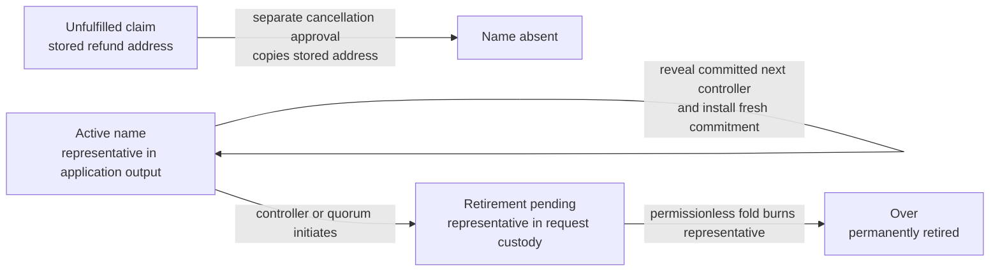
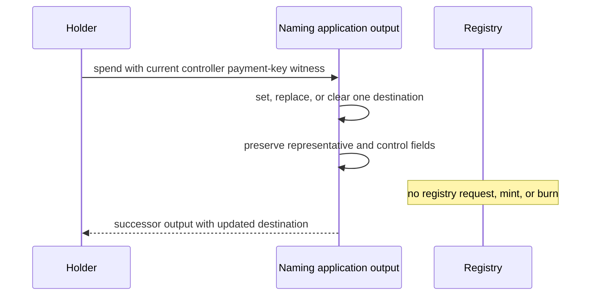
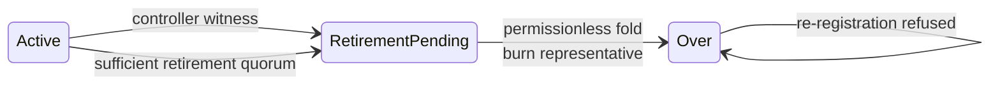

# Keep control of a name through its lifecycle

## Who this is for

A claimant wants to cancel before a name is folded, or a holder of an active name wants to change where it receives payments, recover after losing the current control key, or retire the name permanently. Cancellation consumes only an unfulfilled claim and copies its stored refund address. The representative NFT stays with the application state while maintenance or recovery is in progress; retirement alone moves it into completion-only custody before burning it.

This page accompanies the integrated executable candidate. [Open the complete playable lifecycle](https://lambdasistemi.github.io/singular/simulator/lifecycle-view.html) to follow claim cancellation into the naming profile, set, replace, or clear a destination, recover a lost controller, and retire through either authorization route. The browser surfaces replay the exact 43-row Lean-derived corpus, then drive the same public transitions. It remains a design-time model, not an observed ledger execution.



## Change the payment destination

The active controller may set, replace, or clear the single optional payment destination. The destination is routing data, not an authority credential: it need not belong to the controller. A successful change preserves the registry identity, registry key, representative NFT, controller, next-control commitment, and retirement quorum.



The transition refuses a missing or wrong controller witness, more than one destination, and any attempt to alter the controller, committed next controller, quorum, registry binding, or representative while presenting the action as destination maintenance.

## Recover with the committed next controller

Recovery reveals the complete next controller address, proves that its canonical binary encoding matches the stored commitment, and requires the transaction signer for that address's payment-key credential. The current controller does not need to sign. The successor keeps the representative, installs the revealed address as controller, and stores a fresh next commitment. The consumed commitment cannot be replayed, and the old controller is no longer authoritative.


The commitment is `BLAKE2b-256("singular/naming/next-control/v1" || 0x00 || canonical-address-bytes)`. It covers the whole binary Cardano address, including its header and network, rather than bech32 text or only a key digest. Only canonical base and enterprise addresses with payment-key credentials are supported; script payment credentials cannot authorize recovery. Positive, wrong-domain, wrong-address, and wrong-payment-key vectors belong to the executable contract.

## Retire permanently

Either the current controller or the configured retirement quorum may initiate retirement. Both routes create the same completion-only request: it holds the representative and cannot be withdrawn, redirected, released, or converted into Delete. Anyone may fold that request, burn the representative, and move the key to `Over`.



Pending retirement is observably different from `Over`. The transition refuses an insufficient quorum, a quorum attempt that changes payment routing or control fields, wrong representative custody, replay, Delete/release, retirement withdrawal, and registration after `Over`. The quorum is a retirement authorization selected by the application; it is not next-controller recovery and it is not a death oracle.

Retirement prevents name-based resolution. It cannot prevent someone from sending directly to a previously saved raw Cardano address: the protocol cannot retract an address another person already knows.

## Cancel a pending claim

The application records the refund address in the pending request and therefore inside the Insert commitment that names its action token. A separate cancellation approval can consume that exact pending claim only when its requested refund destination equals the stored address. The withdrawal copies the address rather than choosing it again, leaves the name absent, and creates no representative.

```mermaid
sequenceDiagram
  participant Claimant
  participant App as Application policy
  participant Request as Pending naming claim
  Claimant->>App: ask to cancel exact pending claim
  App->>Request: approve withdrawal bound to request<br/>and stored refund address
  Request->>Request: consume claim; copy stored address
  Request-->>Claimant: name remains absent
```

The transition refuses a different refund address, the original Insert certification without separate cancellation authority, a claim already folded into an active name, and replay of a consumed cancellation. No fee, deposit, price, bond, or refund-value schedule follows from the address ruling. Retirement-request withdrawal remains a different, required refusal.

## Consumer and ledger boundary

The design-time consumer contract is source-bound to `lambdasistemi/cardano-keri` commit `14a64a4681d3e429fab5877062b5c476c2a4bfe2`. It uses Conway inline-datum and required-signer precedents without importing KERI schemas or claiming compiled-script interoperability. Singular publishes explicit constructor indices and field order for its own datums, binds one canonical registry identity to an application, and must reject a second valid seed that tries to initialize a rival registry for the same application.

| Boundary | Existing tooling constrains | Singular publishes | Still outside this candidate |
| --- | --- | --- | --- |
| Datum transport | Conway `Data`; inline extraction helpers | inline datums, declared constructor indices and frozen field order | compiled-script and ledger interoperability |
| Controller authorization | transaction required signers / payment-key witnesses | canonical payment-key address and signer binding | wallet or SDK transaction construction |
| Registry initialization | one mint per chosen seed precedent | one canonical registry identity per application | downstream application integration |
| Representative supply | registry transition and NFT custody model | one representative for an active name | deployed validator measurements |

The historical Cage types are evidence about encodings and precedents, not an assumed integration. KERI pre-rotation commits to key digests; naming recovery deliberately commits to an entire canonical address.

## Evidence and release status

The browser surfaces drive pending-claim cancellation, integrated maintenance, recovery, and both retirement routes, including their refusal cases. They keep retirement initiation separate from the permissionless completion fold and show `pending` before `retired / Over`. The reconciliation binds each of the 43 model/corpus identities to a public control or assertion. The downloadable documentation archive carries the model, contract, scenarios, replay code and instructions, pinned toolchain inputs, and exact identity ledgers under `artifacts/` with a SHA-256 manifest.

This remains an unaccepted executable design candidate. Lean proof, finite replay, source-bound contract evidence, a built archive, and a live preview are distinct from a compiled Cardano validator or observed ledger execution.
