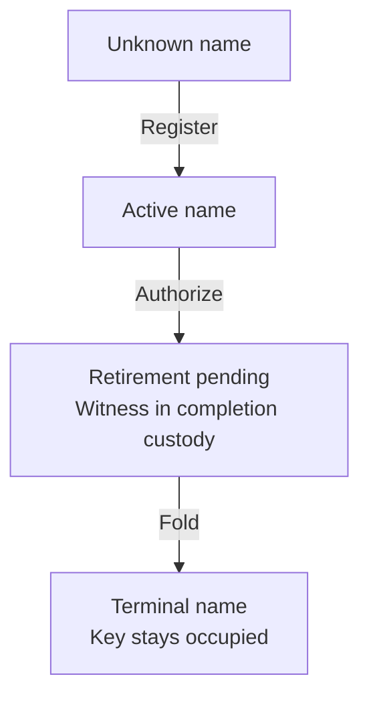
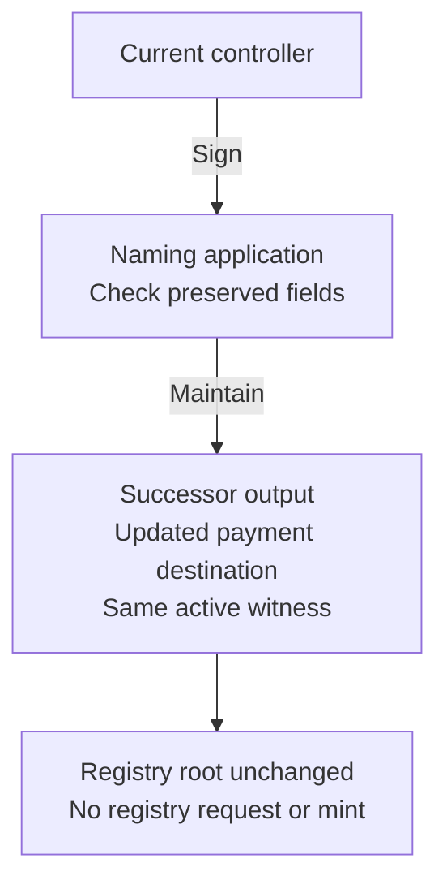
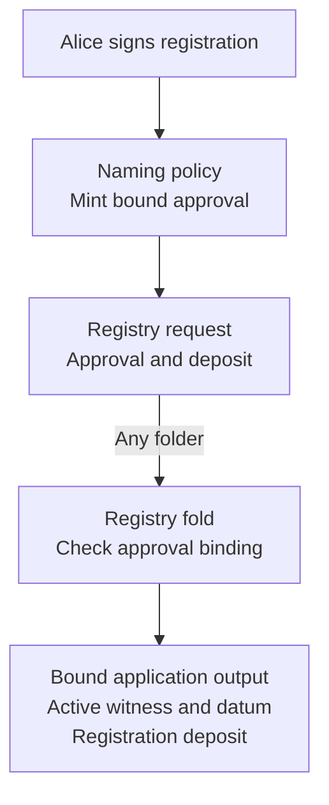
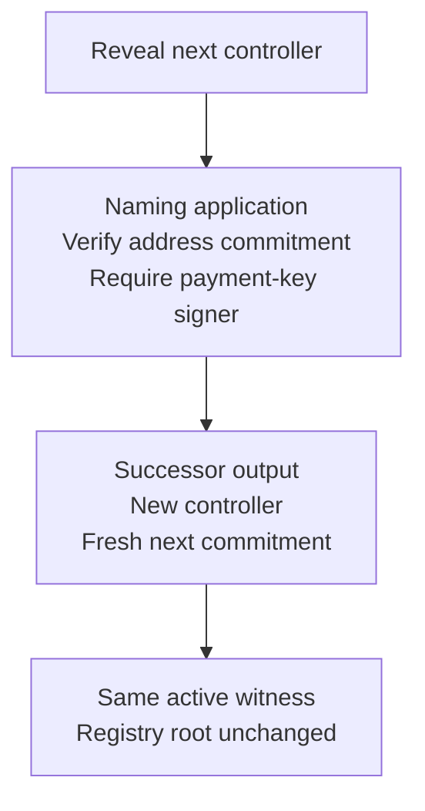
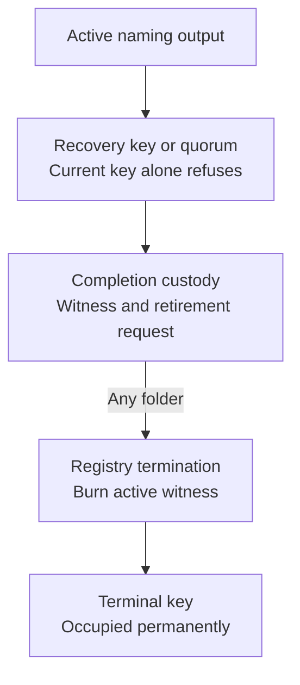
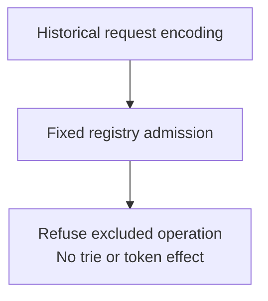

# Keep control of a name through its lifecycle

## Who this is for

A name holder wants to change where a live name receives payments, recover after
losing the current control key, or end the name permanently. A new participant
can register an unknown name. Registry transitions are registration and permanent
termination; application maintenance and recovery preserve the registry root.

[Open the simulator](https://lambdasistemi.github.io/singular/simulator/) and select
*Naming — permanent retirement*. Its lifecycle panel inspects the rows computed
by Lean. This is design-time evidence, not an observed ledger execution.

```mermaid
flowchart TD
  Free["Unknown name"] -->|Register| Active["Active name"]
  Active -->|Authorize| Pending["Retirement pending<br/>Witness in completion custody"]
  Pending -->|Fold| Terminal["Terminal name<br/>Key stays occupied"]
```

## How a name moves in the registry

A name is one key in the registry's authenticated map. Registration changes an
unknown key to Active and delivers an active witness to its bound destination.
Termination burns that witness and changes the key to Terminal permanently.
The legacy Absent byte remains a raw encoding for invalid-context controls;
registration cannot create it. The five excluded operations are refused.

The [current registry contract](onchain-validator-owners.md) has a fixed compiled
admission boundary. Naming certifies each supported edge in advance by minting an
approval binding the edge, key, owner and destination. The registry recomputes
that binding. Folding is permissionless; approval prevents the folder from
substituting another destination. Naming's separate application validator governs
maintenance, recovery and authorization to retire.

## Change the payment destination

The current controller may set, replace or clear one optional payment destination.
Routing data need not belong to the controller. The successor preserves the
registry identity, key, active witness, controller, next-control commitment and
retirement quorum. Missing or wrong controller authorization, multiple destinations
and altered control fields refuse.

```mermaid
flowchart TD
  Holder["Current controller"] -->|Sign| App["Naming application<br/>Check preserved fields"]
  App -->|Maintain| Next["Successor output<br/>Updated payment destination<br/>Same active witness"]
  Next --> Root["Registry root unchanged<br/>No registry request or mint"]
```

## Book a name

Alice signs the naming policy's approval mint for registration. Its asset name
binds the key, owner and the application's destination address and datum hash.
She places the approval and deposit in a registry request. Any folder can then
fold it. The fold delivers the active witness and booked datum to the approved
address. The registration deposit accompanies that carrier; it is not a separate
refund to Alice. A wrong tuple, policy or quantity refuses.

```mermaid
flowchart TD
  Alice["Alice signs registration"] --> Policy["Naming policy<br/>Mint bound approval"]
  Policy --> Request["Registry request<br/>Approval and deposit"]
  Request -->|Any folder| Fold["Registry fold<br/>Check approval binding"]
  Fold --> Output["Bound application output<br/>Active witness and datum<br/>Registration deposit"]
```

## Recover with the committed next controller

Recovery reveals the complete next controller address, verifies its stored
commitment and requires its payment-key signer. The current controller need not
sign. The successor retains the active witness, installs the revealed controller
and stores a fresh next commitment. The consumed commitment cannot be replayed.

```mermaid
flowchart TD
  Reveal["Reveal next controller"] --> Check["Naming application<br/>Verify address commitment<br/>Require payment-key signer"]
  Check --> Successor["Successor output<br/>New controller<br/>Fresh next commitment"]
  Successor --> Same["Same active witness<br/>Registry root unchanged"]
```

The commitment is `BLAKE2b-256("singular/naming/next-control/v1" || 0x00 || canonical-address-bytes)`.
It covers the complete binary Cardano address, including header and network.
Canonical base and enterprise addresses with payment-key credentials are supported;
script payment credentials cannot authorize recovery. Wrong-domain, wrong-address
and wrong-payment-key controls accompany the positive vectors.

## Retire permanently

Termination needs the committed recovery key or a distinct-member retirement
quorum. The current control key alone cannot authorize it. This preserves the
holder's recovery remedy if the everyday key is stolen.

Authorization moves the active witness into completion-only application custody,
mints a bound terminating approval and creates the completion request. Anyone may
fold that request: the application custody is spent, the witness is burned and
the key becomes Terminal. This completion custody is distinct from the removed
registry Absent-custody implementation.

```mermaid
flowchart TD
  Active["Active naming output"] --> Auth["Recovery key or quorum<br/>Current key alone refuses"]
  Auth --> Pending["Completion custody<br/>Witness and retirement request"]
  Pending -->|Any folder| Fold["Registry termination<br/>Burn active witness"]
  Fold --> Terminal["Terminal key<br/>Occupied permanently"]
```

Terminal witnessing is refused by this contract. A terminal name has no remaining
supported transition. Retirement prevents name-based resolution but cannot retract
a raw address someone already saved.

## Refused historical encodings

The wire format retains `insertAbsent`, `updateActive`, `deleteAbsent`,
`deleteActive` and `witnessTerminal` with their original tags. The current compiled
registry refuses all five, including mixed batches and caller-constructed contexts.
The [archived broader design](naming-demo.md) preserves earlier absence, deletion
and witnessing stories; they are not current supported operations.

```mermaid
flowchart TD
  Encoded["Historical request encoding"] --> Gate["Fixed registry admission"]
  Gate --> Refuse["Refuse excluded operation<br/>No trie or token effect"]
```

## Consumer and ledger boundary

The design-time consumer contract is bound to `lambdasistemi/cardano-keri` commit
`14a64a4681d3e429fab5877062b5c476c2a4bfe2`. It uses Conway inline-datum and
required-signer precedents without importing KERI schemas or claiming compiled
interoperability. Singular publishes its constructor indices and field order,
binds one registry identity to an application and refuses a rival registry seed.

| Boundary | Published contract | Remaining evidence gap |
| --- | --- | --- |
| Datum transport | Inline datums and frozen constructor order | Downstream compiled and ledger interoperability |
| Controller authorization | Canonical address and payment-key signer binding | Downstream wallet or SDK construction |
| Registry initialization | One registry identity per application | Downstream integration |
| Witness supply | One active witness for a live name | Deployed measurements |

The historical Cage types establish encodings and precedents. KERI pre-rotation
commits to key digests; naming recovery commits to a complete canonical address.

## Evidence and release status

The lifecycle panel inspects maintenance, recovery and both termination routes,
including their computed refusal reasons. The downloadable archive binds model,
scenarios, replay code, toolchain inputs and identity ledgers with a SHA-256 manifest.
[Candidate results](../specs/505-permanent-m1/RESULTS.md) distinguish the registry's
compiled and connected CLI checks from these naming design observations.

Lean proofs, finite model replay, inspected lifecycle rows, a built archive and
a live preview do not establish a deployed naming validator or downstream consumer
acceptance. Uncovered consumer requirements remain visible.
