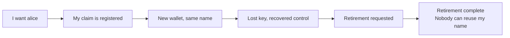

# A registry explained through naming

As a Cardano developer, follow Alice as she claims a name, changes her payment
address, recovers from key loss and retires the name. Ten visual user stories
put the explanations and evidence in your speaker notes.

## Watch the presentation

<!-- naming-presentation -->

Click inside the slides and use the arrow keys or the navigation controls.
The full-screen view also provides presenter mode with notes.

## Follow Alice's story

Alice keeps her name through changes of wallet and controller. After completed
retirement, that name stays occupied within the registry.

## The preprod demonstration

**preprod run pending (#78)**

The demo will follow an actual preprod transaction sequence: claim, fold with
the representative NFT, recover, retire, and complete to Over. The speaker
notes retain a transaction-ID placeholder for each step. They will be filled
from the connected run before the demonstration is presented as executed.

[The external-node work](https://github.com/lambdasistemi/singular/issues/78)
supports access to a shared network. Completion of that tooling alone does
not establish the naming application's preprod run.

## Evidence and limits

The slides bind their model and validator references to
[`d840559a04848675c70eae4febae51c48c619257`](https://github.com/lambdasistemi/singular/commit/d840559a04848675c70eae4febae51c48c619257).
The notes separate model propositions, validator source and finite ledger
execution. Existing devnet results remain supporting material in the notes;
they do not substitute for the preprod demo.

An authenticated resolver service, wallet integration and mainnet deployment
remain future work. The closing slide describes the planned
[programmable-value consumer](https://github.com/lambdasistemi/singular/issues/97),
without claiming completed KERI integration.
