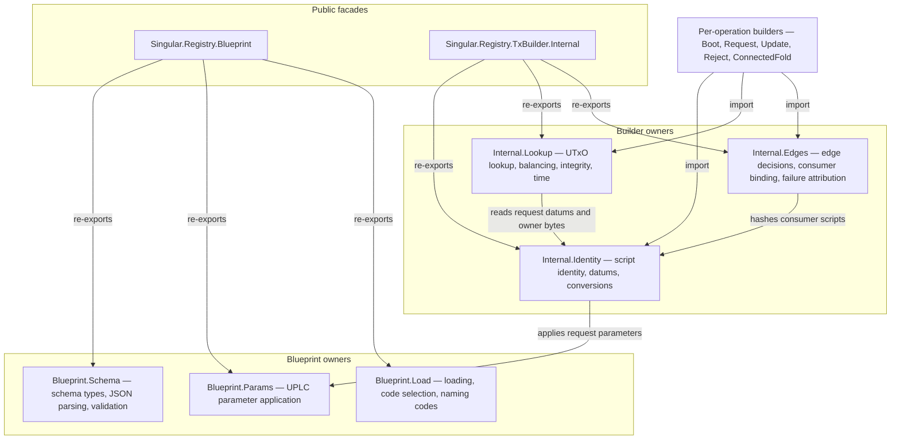

# Registry builder and blueprint modules

A contributor changing an off-chain builder or blueprint step wants one
obvious owner per concern, so a change to a script identity, a lookup or an
edge decision is reviewed in one place and cannot silently disagree with a
second copy somewhere else. This page maps the registry's transaction
builders and CIP-57 blueprint work to their modules: what each owner is
responsible for, where common changes land, and what the checks establish
about the move.

## One owner per concern

Every declaration lives in exactly one owner. The two public modules are
facades: they hold no implementations, they re-export the same names with
the same signatures as before the extraction, and an existing caller — a
test, a shipped command, a journey — keeps compiling unchanged. The
per-operation builders import the focused owners directly; the retract
builder is the one library module that still imports the facade, and the
facade keeps it compiling and behaving unchanged while that file stays
under a separate ticket's fence.

| Module | Responsible for |
| --- | --- |
| `Singular.Registry.Blueprint.Schema` | The CIP-57 schema model: `Blueprint`, `Validator`, `Schema`, `Constructor`, their JSON parsers, and `validateData`. |
| `Singular.Registry.Blueprint.Params` | Applying the registry's parameters to a validator's compiled code: raw data, integers, bytes, output references, the state validator's predecessor-policy allowlist, and the request validator's state-policy plus cage-token pair in source order. |
| `Singular.Registry.Blueprint.Load` | Reading a `plutus.json` from disk, selecting validators by title prefix, extracting compiled code and script hashes, and reading the registry partition's own naming codes. |
| `Singular.Registry.TxBuilder.Internal.Identity` | What a builder calls a thing: script construction and hashing from config bytes, cage and request addresses and policy ids, request datum encoding, and conversions between ledger and on-chain reference types. |
| `Singular.Registry.TxBuilder.Internal.Lookup` | Where a builder finds its inputs and closes its transaction: UTxO lookup by input, state and request; spending-index computation; script evaluation and balancing; script-integrity hashing; rejected-row refunds; POSIX-time to slot conversion. |
| `Singular.Registry.TxBuilder.Internal.Edges` | The decisions a builder shares with the cage: what each registry edge does to the trie, what an edge owes the mint, the approval asset name, the pinned consumer binding, and attribution of node and evaluation failures to a named script hash. |

## Where common changes land

- A request datum gains or changes a field: `TxBuilder.Internal.Identity`
  builds and decodes it; the on-chain `Request` type it encodes lives in
  `Singular.Registry.Types`.
- Balancing, fee or refund behavior changes: `TxBuilder.Internal.Lookup`.
- The mint owed by an edge, or the approval that certifies it, changes:
  `TxBuilder.Internal.Edges`, which is also the only place an edge and its
  leaf bytes are paired.
- The state validator's parameter list or the request validator's parameter
  order changes: `Blueprint.Params`, then the Aiken blueprint it applies.
- Blueprint parsing rejects (or wrongly accepts) a shape: `Blueprint.Schema`.
- A boot reads the wrong compiled code from the registry partition:
  `Blueprint.Load`.

## Decisions this extraction recorded

| Decision | Chosen | Considered and not taken |
| --- | --- | --- |
| How to split the two large modules | Three owners per facade, matching the responsibilities named in the module plan; owners may split further only when ownership stays evident and the graph stays acyclic. | Ten or more fine-grained owners: more indirection than a reviewer can hold for the same guarantee. |
| How existing callers keep working | Facades re-export the original explicit export lists byte-for-byte; bodies move verbatim apart from imports. | Rewriting every caller to the new owners in the same change: churn across tests and shipped commands with no behavioral benefit. |
| Who imports whom | Library builders import focused owners; tests, shipped commands and journeys keep importing the facades, which remain the compatibility surface. The retract builder keeps its facade import while its file is fenced to another ticket. | Migrating every consumer at once, which would bury the behavior-preservation evidence under import churn. |

The extraction is behavior-preserving by construction and by evidence: every
moved declaration's source text is compared against its previous home, the
facades' export lists are compared byte-for-byte, the blueprint parameter
reading, builder assertions and failure attribution keep their independent
assertions, and the fresh-blueprint end-to-end, bounded journey and archive
commands exercise the moved builders against a real devnet.

## What the checks do not establish

A green component build is a compile claim, not transaction correspondence.
The behavioral rows cover the asserted edges and refusal shapes they cover;
a change to an uncovered builder path still needs its own check. The
contributor guide for the check commands and their measured extents is
[Checking off-chain code](offchain-development.md). The generated,
revision-matched Haskell API reference for this library now ships with
this site: see the
[off-chain API reference](offchain-api-reference.md).

## Source

The facades and owners, linked on this site to the generated API
reference pages — module page and highlighted source — and, read from the
repository, to the source files themselves at the revision you are
viewing:

- Facades: <a href="../offchain/lib/Singular/Registry/Blueprint.hs" data-api="module">Singular.Registry.Blueprint</a>, <a href="../offchain/lib/Singular/Registry/TxBuilder/Internal.hs" data-api="module">Singular.Registry.TxBuilder.Internal</a>.
- Blueprint owners: <a href="../offchain/lib/Singular/Registry/Blueprint/Schema.hs" data-api="module">Singular.Registry.Blueprint.Schema</a>, <a href="../offchain/lib/Singular/Registry/Blueprint/Params.hs" data-api="module">Singular.Registry.Blueprint.Params</a>, <a href="../offchain/lib/Singular/Registry/Blueprint/Load.hs" data-api="module">Singular.Registry.Blueprint.Load</a>.
- Builder owners: <a href="../offchain/lib/Singular/Registry/TxBuilder/Internal/Identity.hs" data-api="module">Singular.Registry.TxBuilder.Internal.Identity</a>, <a href="../offchain/lib/Singular/Registry/TxBuilder/Internal/Lookup.hs" data-api="module">Singular.Registry.TxBuilder.Internal.Lookup</a>, <a href="../offchain/lib/Singular/Registry/TxBuilder/Internal/Edges.hs" data-api="module">Singular.Registry.TxBuilder.Internal.Edges</a>.

The complete generated reference — every module of the library stanza,
with its hyperlinked source — is the
[off-chain API reference](offchain-api-reference.md) page; each entry
there links both the generated module page and the highlighted source of
the module it names.
