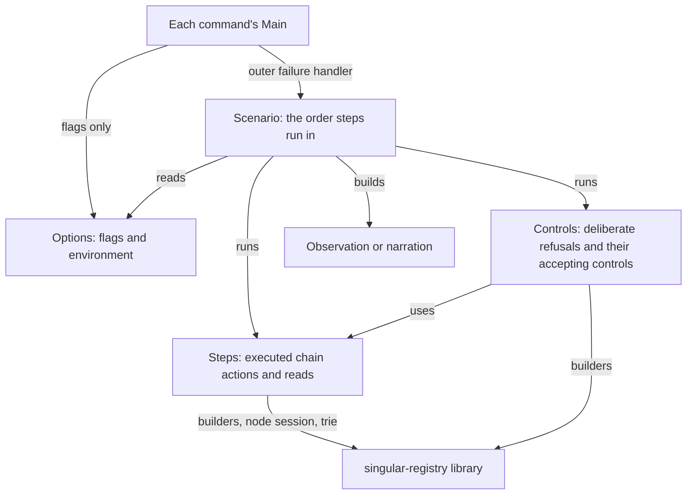
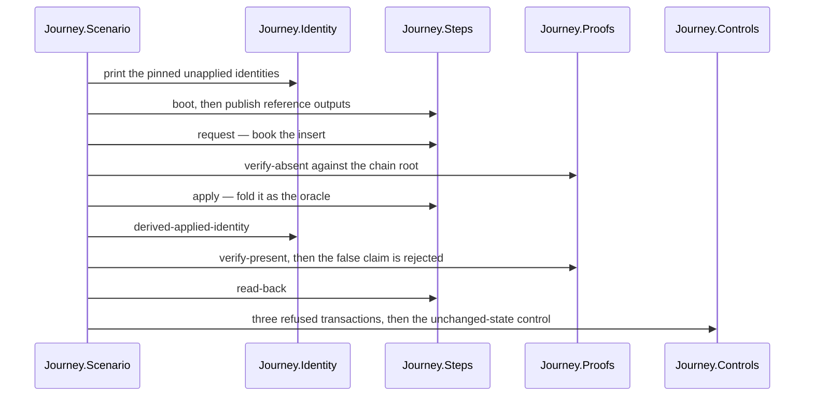
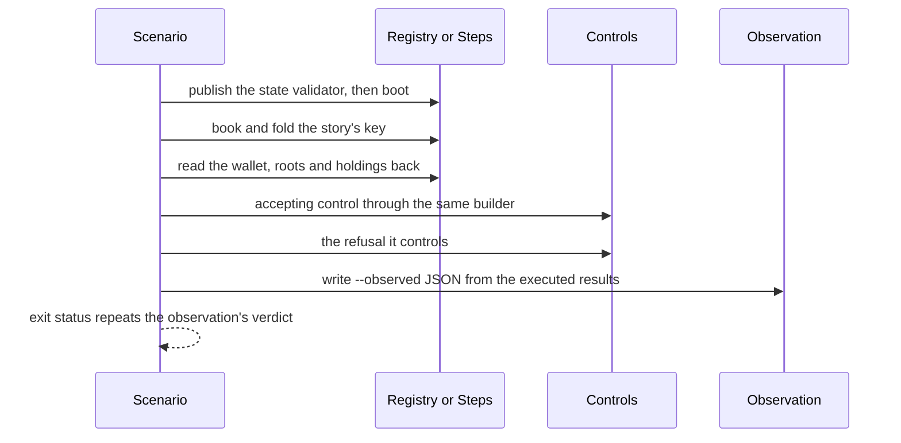
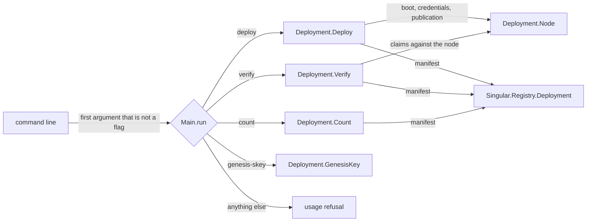

# Who owns a registry command

A contributor changing what one of the registry commands does — a flag,
a narrated step, a field of the observation JSON, a deliberate refusal —
wants to open the one module that owns that concern and have the review
ask one question. Before this division, each command was a single entry
file of up to 1417 lines, and a change to the journey's negative cases
was reviewed beside its identity manifest parser and its proof checks.
Now each command's `Main.hs` holds only its outer failure handler, and
named command-local modules own the options, the steps, the deliberate
controls and the observation. This page says which module to open, which
way the dependencies run, what may never change while the code moves,
who calls each command, and what the evidence does and does not show.

## The story this serves

As an operator, I run the registry journey from a checkout, the two
archive commands `insert-active` and `update-terminal` from an extracted
release archive, and `deployment` against a node. I need the same
options, the same narration in the same order, the same observation
JSON, the same refusals and the same exit status after their entry
files are divided into owners, so the CI steps and release pages that
read those outputs keep meaning what they meant.

As a contributor, I want one visible owner for each option, scenario
step and deliberate control, so I can change a command without
searching a thousand-line file or accidentally changing another
command's evidence.

## Who calls each command

| Command | Entry file | Real caller | What the caller reads |
| --- | --- | --- | --- |
| `journey` | [`offchain/journey/Main.hs`](https://github.com/lambdasistemi/singular/blob/main/offchain/journey/Main.hs) | the registry workflow's journey job: a fresh `plutus-blueprint` build, then `nix run .#journey` from the checkout | the `[journey]` narration and exit status |
| `insert-active` | [`offchain/insert-active/Main.hs`](https://github.com/lambdasistemi/singular/blob/main/offchain/insert-active/Main.hs) | the registry workflow's release-archive job, and the archive's `INSERT-ACTIVE.md` run page | `--observed` JSON asserted with `jq`, narration, exit status |
| `update-terminal` | [`offchain/update-terminal/Main.hs`](https://github.com/lambdasistemi/singular/blob/main/offchain/update-terminal/Main.hs) | the registry workflow's release-archive job, and the archive's `UPDATE-TERMINAL.md` run page | `--observed` JSON asserted with `jq`, narration, exit status |
| `deployment` | [`offchain/deployment/Main.hs`](https://github.com/lambdasistemi/singular/blob/main/offchain/deployment/Main.hs) | the supported identity check `offchain/deployment-identity-check.sh`, which CI runs; operators deploying and verifying a persistent registry | narration, the manifest file, a count on standard output, refusals |

The release check requires both archive commands' `Main.hs` paths in the
on-chain archive, and the archive carries every tracked file under
`offchain/`, so the new modules travel with the entry files they serve.
The executable names and entry paths are unchanged.

## Which way dependencies run

Every command follows this shape; no module imports its command's
`Main`, and no command imports another command's modules. Where two
commands carry the same small helper — the genesis submission, the
registry configuration for a seed, the wallet read — each keeps its own
copy: a shared owner across executables would be a library change,
which this division does not make. The library remains the owner of
every transaction the commands build, and its generated interface is
the [off-chain API reference](offchain-api-reference.md); the command
modules are executables, documented here with source links rather than
in that reference.

## The journey, step by step

| Module | Owns |
| --- | --- |
| [`Journey.Options`](https://github.com/lambdasistemi/singular/blob/main/offchain/journey/Journey/Options.hs) | `REGISTRY_BLUEPRINT` (required) and `REGISTRY_SCRIPT_IDENTITY` (default `../onchain/script-identity.json`) |
| [`Journey.Identity`](https://github.com/lambdasistemi/singular/blob/main/offchain/journey/Journey/Identity.hs) | the identity manifest, the identity header, and the derived-applied-identity check between pinned and carried scripts |
| [`Journey.Steps`](https://github.com/lambdasistemi/singular/blob/main/offchain/journey/Journey/Steps.hs) | boot; booking (narrated `request`) and folding (narrated `apply`) as separate steps; read-back |
| [`Journey.Proofs`](https://github.com/lambdasistemi/singular/blob/main/offchain/journey/Journey/Proofs.hs) | proofs built from the in-memory mirror and compared with roots read from chain; the false-claim rejection |
| [`Journey.Controls`](https://github.com/lambdasistemi/singular/blob/main/offchain/journey/Journey/Controls.hs) | the negative section: each single-defect transaction must be refused in phase 2 by the named validator, then the state must be unchanged |
| [`Journey.Malformations`](https://github.com/lambdasistemi/singular/blob/main/offchain/journey/Journey/Malformations.hs) | the pure rewrites: forged state reference, tampered state root, dropped proof witness |
| [`Journey.Chain`](https://github.com/lambdasistemi/singular/blob/main/offchain/journey/Journey/Chain.hs) and [`Journey.Narration`](https://github.com/lambdasistemi/singular/blob/main/offchain/journey/Journey/Narration.hs) | wallet, configuration, submission, the chain state read; the `[journey]` lines and the `journey:` failure prefix |

Booking and folding stay two narrated steps. This division introduces
no narration hook and does not move the journey onto the driver; that
decision belongs to issue #202 and remains open.

## The two archive commands

`insert-active` books and folds one `insertActive` at a wallet, reads
exactly one active token there, folds a fresh key as the accepting
control, then requires a second booking of the same key to be refused.
The control runs first because a refused request is never consumed and
would poison the fold after it. Its owners are
[`InsertActive.Options`](https://github.com/lambdasistemi/singular/blob/main/offchain/insert-active/InsertActive/Options.hs),
[`InsertActive.Steps`](https://github.com/lambdasistemi/singular/blob/main/offchain/insert-active/InsertActive/Steps.hs),
[`InsertActive.Controls`](https://github.com/lambdasistemi/singular/blob/main/offchain/insert-active/InsertActive/Controls.hs),
[`InsertActive.Observation`](https://github.com/lambdasistemi/singular/blob/main/offchain/insert-active/InsertActive/Observation.hs)
and
[`InsertActive.Scenario`](https://github.com/lambdasistemi/singular/blob/main/offchain/insert-active/InsertActive/Scenario.hs).

`update-terminal` boots two registries in one session before any fold.
In the first it inserts the story's key, retires it — burning the
witness from the wallet input that held it and committing a Terminal
leaf — and then requires a key bound absent to be refused retirement,
the story's retirement being that refusal's control. In the second it
retires an active control key, then requires a key the trie never bound
to be refused. Each refusal needs a registry of its own because a
refused fold leaves its request pending. Its owners are
[`UpdateTerminal.Registry`](https://github.com/lambdasistemi/singular/blob/main/offchain/update-terminal/UpdateTerminal/Registry.hs)
(session, boots, bookings, mirrored and deliberately inadmissible folds,
roots),
[`UpdateTerminal.Steps`](https://github.com/lambdasistemi/singular/blob/main/offchain/update-terminal/UpdateTerminal/Steps.hs),
[`UpdateTerminal.Controls`](https://github.com/lambdasistemi/singular/blob/main/offchain/update-terminal/UpdateTerminal/Controls.hs),
[`UpdateTerminal.Observation`](https://github.com/lambdasistemi/singular/blob/main/offchain/update-terminal/UpdateTerminal/Observation.hs),
[`UpdateTerminal.Scenario`](https://github.com/lambdasistemi/singular/blob/main/offchain/update-terminal/UpdateTerminal/Scenario.hs)
and the matching `Options` and `Narration`.

Every value in both observation documents is passed in from what the
steps and controls executed or read back; the observation modules type
no expected value.

## The deployment verbs

`Main` keeps the outer handler and the router. Every verb reads its
flags through
[`Deployment.Options`](https://github.com/lambdasistemi/singular/blob/main/offchain/deployment/Deployment/Options.hs),
which accepts `--name value` and `--name=value` alike and refuses each
verb's missing required flag by name. The release's compiled halves and
the one pin derivation are
[`Deployment.Compiled`](https://github.com/lambdasistemi/singular/blob/main/offchain/deployment/Deployment/Compiled.hs);
node operations are
[`Deployment.Node`](https://github.com/lambdasistemi/singular/blob/main/offchain/deployment/Deployment/Node.hs);
each verb is its own module under
[`offchain/deployment/Deployment/`](https://github.com/lambdasistemi/singular/blob/main/offchain/deployment/Deployment/Deploy.hs).
The usage text still names `deploy` and `verify` only, as it always
did; the router accepts all four verbs. The manifest itself stays with
the library facade described in
[Deployment record ownership](offchain-deployment-owners.md).

## What may not change

| Surface | Held unchanged |
| --- | --- |
| Executables | the names `journey`, `insert-active`, `update-terminal`, `deployment` and their `Main.hs` paths |
| Options | `--observed PATH` (first occurrence); `REGISTRY_BLUEPRINT`, `REGISTRY_SCRIPT_IDENTITY`, `NAMING_BLUEPRINT`; deployment's first-non-flag routing and both flag spellings; each refusal's text and order |
| Diagnostics | the `journey: FAILED: journey:`, `insert-active: FAILED:`, `update-terminal: FAILED:` and `deployment: FAILED: user error (…)` shapes, including the archive commands' second `FAILED: ExitFailure 1` line after a named refusal, and exit status 1 |
| Narration | every line, in order: booking before folding, the accepting control before the refusal it controls |
| Observation JSON | every key and every value's derivation, including `null` where a refusal name cannot be read from the ledger's text |
| Ledger effects | the same transactions, built by the same library builders, in the same order |

## Where to make a change

| To change | Open |
| --- | --- |
| a flag or environment variable | the command's `Options` module |
| what a step submits or reads back | the command's `Steps` (or `UpdateTerminal.Registry`) module |
| a deliberate refusal or its accepting control | the command's `Controls` module; the journey's transaction rewrites are in `Journey.Malformations` |
| a JSON field | the command's `Observation` module, with the value produced where it is executed |
| the order of steps | the command's `Scenario` module |
| a deployment verb | its own module; routing stays in `Main` |
| a transaction's shape or a model rule | the library, never a command module |

## Decisions

| Chosen | Rejected | Why |
| --- | --- | --- |
| Command-local modules under each executable's own source directory | one shared source directory for all four commands | sharing across executables is a new cross-command owner and a library-level change; the few duplicated helpers stay as they were |
| The journey's false claim as its own function beside the proof checks | moving it into the journey's controls | it is the proof verifier's own negative case and needs the proof it rejects; the controls module owns validator refusals |
| Deployment verbs receive the arguments the router read | each verb calling `getArgs` again | the arguments are the same process-wide list; passing them makes each verb's input explicit |
| `count` still judges `--what` and address bytes after the node session opens | moving those checks before the session | that would change when an unknown `--what` is refused |

## Evidence and limits

The checks that run on every pull request cover different claims. The
off-chain lint app formats every command module and runs HLint over
the `insert-active` and `deployment` directories; the `journey` and
`update-terminal` directories stay outside HLint under the debt
boundary described in [Checking off-chain code](offchain-development.md),
so their new modules' hint state is recorded in the change's evidence,
not by that green result. The component build compiles all four
commands. The registry workflow runs the journey from the checkout with
a freshly built blueprint, and runs each archive command from an
extracted release archive with its `jq` assertion over the observation.
The supported deployment identity check runs `genesis-skey`, `deploy`
and `verify` on a local devnet, refuses a manifest whose
representative policy was changed, and now also checks the verb
router's refusals without a node, that `--out=FILE` writes the same key
as `--out FILE`, and that `count` finds one registry output and exactly
the reference outputs the manifest records.

Named limits: the journey is exercised from the checkout only — running
it from an extracted archive is issue #214 and is not shown here. No
earlier observation of a successful `count` exists to compare against;
its first executed evidence is this change's. The commands' narration,
flags and JSON are command contracts that command runs establish; the
registry transitions they submit are governed by the accepted Lean model
through the library builders, and a green command run is not a proof of
any model theorem. A build or a fixture does not establish an archive
or live-chain claim.
