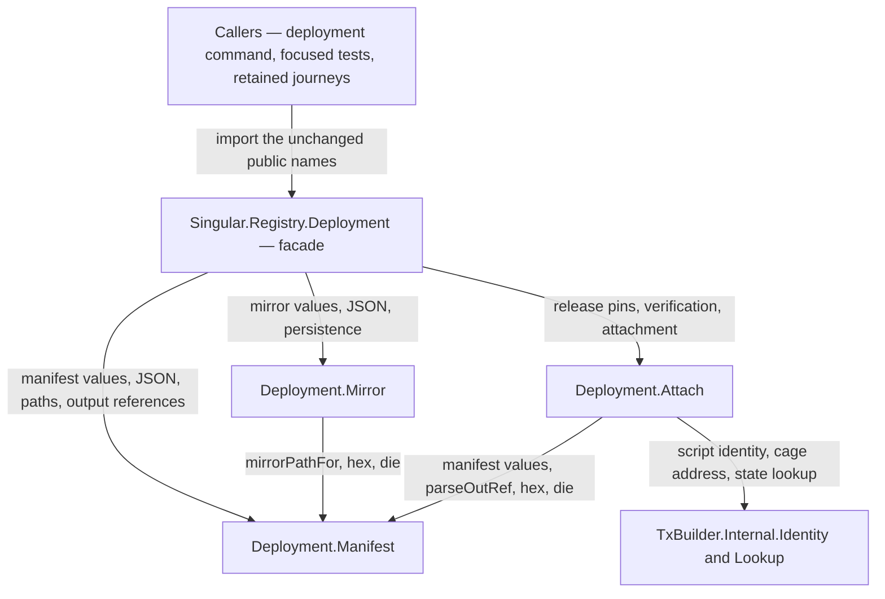

# Who owns a deployment record

A contributor changing what a deployment carries — a manifest field, a
mirror entry, the checks a run makes before it attaches to a recorded
registry — wants to edit one module beside the concern it owns, and
have the review ask one question. Before the extraction, all of it
lived in one 677-line `Deployment` module where a JSON key change, a
mirror persistence change and a node query change were reviewed side by
side with nothing between them. Now the record has three focused owners
behind the same public facade, and this page tells a contributor which
owner their change belongs to, which way the dependencies run, what the
record may never do while it moves, and where the evidence boundary
sits.

## The story this serves

As a registry operator, I record one deployment and attach a later run
to it; I want the same manifest bytes, the same mirror path and
contents, the same node checks, refusal messages and transaction
effects after the code is divided into owners, so the files I already
carry between machines keep working and a wrong registry is still
refused by name. A contributor refactoring the record's home owes me
that.

What the focused suite executes — finite fixture cases, named here
with their counts and limits: the manifest's JSON keys, its pretty
bytes and trailing newline, the strict read error that names the file,
every `--deployment` spelling and the environment fallback, the
`txid#index` round trip with four named refusals, the mirror's path
beside the manifest, its hex maps, its replacement write and its
absent-file empty map, and the attachment path itself — one row
resolving two recorded reference outputs and the state output in the
order the manifest records them, reading the provider's query record
back, and refusal rows observing the real named diagnostics for a
reference output whose live script hash differs from the pin, one that
is no longer live, one that carries no script at all, an unreadable
recorded address, a seed whose derived token contradicts the manifest,
a release whose state validator hash differs, a registry address with
no recorded token, and the two live-state refusals only verification
makes — the active policy and the process and retract windows. The
mutation evidence is equally finite: before the move, six single-site
source mutations on the unsplit module failed these counts — a
hash-acceptance bypass one row, a reference reorder two rows, the
mirror path one row, the manifest newline one row, a process-window-
only check one row, the mirror newline one row; after the move, a
field swap between the manifest's two address spellings failed eight
of two hundred fifty rows, and a hash-acceptance bypass failed the one
named refusal. Three branches have no focused row: the mirror's JSON
parse refusal, a process-window-only window mismatch, and the
representative-policy pin through attach itself — the devnet identity
step executes that pin through verify, not attach. The out-of-range
output index has no refusal row either: this toolchain's fixed-width
read accepts out-of-range and negative indices, so the suite pins the
four refusals the parse genuinely makes.

## One owner per record

The facade re-exports exactly the surface callers already import; the
three owners are package-internal modules of the same library, so the
generated API reference documents them for the contributor while a
caller keeps compiling against the facade. The mirror reads its path,
its hex rendering and its error helper from the manifest owner, so
`.mirror.json` has one definition; attachment reads manifest values and
the output-reference parse from the same owner, plus the focused
identity and lookup adapters the builders use, so a recorded address
and a built address are derived the same way.

## What each owner holds

| Owner | Holds | Refuses |
| --- | --- | --- |
| `Deployment.Manifest` | The manifest and reference-script values with their JSON instances, reading and writing one, choosing one from a command line or the environment, the `txid#index` spelling and its parse, an address as the exact hex bytes the ledger serialises, the mirror's path, and the shared byte and error helpers. | An unreadable manifest, naming the file; a malformed output reference, naming what was wrong with it. |
| `Deployment.Mirror` | The mirror and per-trie values with their JSON instances, reading the file beside a manifest and replacing it on write. | An unparsable mirror, naming the file; a value that is not hex, naming it. |
| `Deployment.Attach` | The compiled release halves a manifest pins only by hash, the cage configuration it describes, the registry token a seed determines, the recorded reference outputs and the state output as the node reports them, verification's claims, and the resolved outputs a run attaches with. | A release that compiles differently than the deployment was made with; a seed that determines another token; a reference output that is not live, carries no script, or carries a different hash than the pin; an unreadable recorded address; a registry address with no recorded token; and, for verification only, a live state whose active policy or process and retract windows disagree with the manifest. |

## The boundary the record cannot carry

Writing to a registry means proving a key against the registry's
current trie, and that proof needs the whole trie, not the root the
chain reports. The deployment carries it as the mirror file beside the
manifest, written by each run and read by the next — the record's one
non-chain dependency. That file is a hazard, so it is checked rather
than hoped away, and the check belongs to the caller that attaches,
not to the attach operation itself: after attaching, the retained
journey callers load the mirror and compare its root with the chain's
root, so a mirror that drifted — a run that died mid-fold, a copy
belonging to another deployment — fails by that comparison instead of
building proofs against a trie the chain does not have. The extraction
does not move that comparison; moving it without a behavior and
evidence contract would change the boundary.

Attachment and verification stay two operations, not one. Both resolve
the release pins, the token, the recorded reference outputs and the
state output; verification then reads the live state datum and refuses
a mismatched active policy or process and retract windows before
reporting its claims, while attachment returns the resolved outputs
without those additional checks. A run that attaches is not thereby
verified — the journey callers' mirror comparison and the deployment
command's verification are separate acts.

## Evidence and limits

The focused cage suite executes the rows above over files and a
provider stub serving finite UTxOs; the devnet identity step rides the
branch ruleset's required Build Gate status context — a normal,
unconditional step of that job, so a refusal or a setup failure fails
Build Gate itself — and boots a real devnet, deploys a registry,
verifies the intact manifest end to end, and observes the real refusal
and its diagnostic when the recorded representative policy is changed.
The row stays open until the pushed head's Build Gate run shows the
step executed and passed. Limits are named rather than implied: the focused rows exercise the library attachment path over a
fixture, not a public journey, and no mirror-root comparison is claimed
there; the retained register, recovery and retirement journeys are
excluded from the classified component build and are covered by
source-level caller mapping here, not by compilation in that carrier;
the devnet identity step establishes same-release agreement between
the manifest's pins and the release in hand, not cross-release
stability of the identity producers; and the focused suite has no row
for the mirror's JSON parse refusal, a process-window-only mismatch,
or the representative-policy pin through attach. The mirror-root
comparison itself remains executable only in the retained journeys,
whose three-runner check cannot complete today, so its status is a
named limit rather than a green row.
