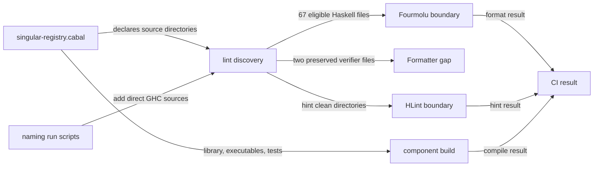

# Checking off-chain code

A contributor changing an off-chain component wants one repeatable way to find the source that CI checks and to see which declared components compile. A failed check should name the affected source or component. A passing check means only that its stated extent passed; the current maintenance work still has named lint and formatting gaps for the final epic integration.

## Run the checks

From the repository root, run the root build gate. Run the off-chain checks from `offchain/` so Nix selects that flake:

```sh
nix build --quiet .#build-gate
(cd offchain && nix run --quiet .#lint)
(cd offchain && nix build --quiet .#component-build)
```

The root build gate covers the root flake's model, site and other declared build checks. It does not build every off-chain Cabal component. The off-chain lint app runs Fourmolu and HLint on its stated source extents. The component build carrier compiles the library, every declared executable and every declared test suite without running those executables or tests. A failing member makes the carrier fail; the failure is not a successful build of the remaining package.

## Where the source list comes from



`offchain/nix/checks.nix` reads every `hs-source-dirs` declaration in `offchain/singular-registry.cabal` at lint run time and adds `naming/test` and `naming/drift`, whose scripts compile them directly with GHC. It deduplicates nested directories and fails if discovery finds no sources or a declared directory is absent. Adding a Cabal component or direct-GHC naming source must also update the declaration or script that makes it discoverable; check the resulting lint output rather than assuming a filename search proves coverage. The malformed-source control for this maintenance change places invalid Haskell in a newly included tracked directory, runs the actual lint app, and restores the file byte for byte.

`offchain/flake.nix` builds the Cabal library and every member of the executable and test component sets. Its component manifest can be compared with the Cabal stanzas. The flake's command is the same command used by the off-chain component CI job.

## Current boundaries

The source inventory, formatter extent, HLint extent and component build extent are different claims. The current ticket keeps the two independent verifier sources in the inventory and component build, while leaving their source bytes unchanged. Fourmolu omits those two files under that source fence. HLint omits the explicitly listed directories in `offchain/nix/checks.nix` that carry existing hints; its green result does not say those directories are hint free. The exact lists and measured hint counts live beside the executable checks in that file and in the ticket evidence.

The final integration work for epic #272, tracked as #278, must remove these temporary gaps and put every tracked code source under actual lint and format checks. It must also cover repository code beyond off-chain Haskell. Until that work is accepted, use each command's stated extent when interpreting a green result. Any source correction still has to preserve the Lean model's behavior and the dependent consumer guarantees.
