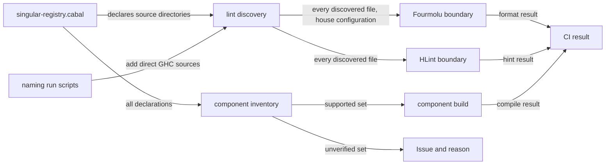

# Checking off-chain code

A contributor changing an off-chain component wants one repeatable way to find the source that CI checks and to see which supported components compile. A failed check should name the affected source or component. A passing check means only that its stated extent passed; the current maintenance work still has named lint and formatting gaps for the final epic integration.

## Run the checks

From the repository root, run the root build gate. Run the off-chain checks from `offchain/` so Nix selects that flake:

```sh
nix build --quiet .#build-gate
(cd offchain && nix run --quiet .#lint)
(cd offchain && nix build --quiet .#component-build)
```

The root build gate covers the root flake's model, site and other declared build checks. It does not build every off-chain Cabal component. The off-chain lint app runs Fourmolu and HLint on its stated source extents. The component build carrier compiles the library, its test components, and supported components used by current required workflows and shipped registry commands. It runs no executables or tests. Its inventory lists every Cabal declaration and explains which are built here, covered by another required job, or unbuildable or unverified. A failing included member makes the carrier fail; a green result does not mean that every Cabal component builds. The measured counts move with the tree — the provider retirement removed the node-internal declaration — so compare each claim with the carrier's next actual output rather than an earlier receipt.

## Where the source list comes from


```mermaid
flowchart LR
    C[singular-registry.cabal] -->|declares source directories| D[lint discovery]
    N[naming run scripts] -->|add direct GHC sources| D
    D -->|every discovered file, house configuration| F[Fourmolu boundary]
    D -->|every discovered file| H[HLint boundary]
    C -->|all declarations| I[component inventory]
    I -->|supported set| B[component build]
    I -->|unverified set| U[Issue and reason]
    F -->|format result| CI[CI result]
    H -->|hint result| CI
    B -->|compile result| CI
```

`offchain/nix/checks.nix` reads every `hs-source-dirs` declaration in `offchain/singular-registry.cabal` at lint run time and adds `naming/test` and `naming/drift`, whose scripts compile them directly with GHC. Every component — `lib`, `local-services`, `koios-http`, the commands and the test components — declares its own source root, so its modules are discovered like every other. It deduplicates nested directories and fails if discovery finds no sources or a declared directory is absent. The source-derived inventory at the #267 candidate measures 89 discovered Haskell files in 23 source directories: Fourmolu selects 87 after the two verifier exclusions, and HLint selects 76 within ten directories. The added end-to-end witness belongs to all three sets. At `ae4fe9a`, the lint app passed in the final acceptance checks off-chain lint row and pushed-head CI; that gate row reported 89 discovered files in 23 directories, Fourmolu over 87 files and HLint over ten directories with no hints. These green receipts cover only the selected extents. At the #270 candidate the same app reported 128 discovered files in 23 directories, Fourmolu over 126 and HLint over ten directories with no hints: the thirty command-local modules the registry commands gained sit inside already declared source directories, so discovery found them without a configuration change. Since the house configuration landed (#278) the formatter runs under the committed `fourmolu.yaml` at the repository root — passed explicitly to every entrypoint, so a missing configuration fails loudly instead of falling back to Fourmolu defaults — over every discovered offchain Haskell source with no exclusions: 128 files at this writing, the two formerly fenced verifier sources included. HLint runs over the same 128 files: the 13 directories #264 left outside it (`journey` and its sub-stanzas, `naming/test`, `naming/drift`, `update-terminal`) had their hints resolved at the source, and the exclusion list is gone. Adding a Cabal component or direct-GHC naming source must also update the declaration or script that makes it discoverable; compare the next actual lint output with this inventory rather than assuming a filename search proves coverage. The format controls run from the repository root (`just format-controls`): a source Fourmolu defaults accept but the house configuration rejects must fail the check, its formatter correction must pass it again, and a tree without the configuration must fail loudly rather than format with defaults.

`offchain/flake.nix` derives a supported build set from the current workflow and currently supported command closure. Its inventory must account for every Cabal library, executable, and test suite, and the gate must fail when a new declaration has no classification or an omitted classification drifts. Its component manifest can be compared with the Cabal stanzas. The flake's command is the same command used by the off-chain component CI job.

## Current boundaries

The source inventory, formatter extent, HLint extent and component build extent are different claims. The two independent verifier sources left the #264 source fence in #278: they are formatted and HLint-checked like every other Haskell source. `connected-verifier` remains declared and exported, but its build failure on record at an earlier revision is tracked by [#282](https://github.com/lambdasistemi/singular/issues/282). The retained journeys `recovery-rows`, `retirement-rows` and `repair-rows` are unverified under [#172](https://github.com/lambdasistemi/singular/issues/172), subject to a check that current commands do not depend on them. `register-rows` is outside that journey retirement record and remains separately unverified under [#283](https://github.com/lambdasistemi/singular/issues/283). All five Cabal components and flake apps remain declared; this ticket does not claim their commands work. Under the 2026-09-25 release-instruction correction, the archive README and consumer guides say the same thing to their readers: the verified journey and checks are presented as runnable, and all nine unverified declarations are disclosed as retained, not currently buildable or verified, with their owning issues. `offchain/deployment-attach-check.sh` is a local gate whose three row-runner dependencies are among the retained commands; no active workflow or carrier command consumes it, and its guide discloses that it cannot currently run. The carrier's earlier run directly failed at `recovery-rows`; the other retained commands have source-level missing-import evidence, not direct build results from that run. Neither Fourmolu nor HLint has directory exclusions. A retained journey that does not compile is still formatted and HLint-checked; those checks parse source and say nothing about whether it builds.

## Module ownership maps

The builder and blueprint modules, the runtime services, the registry
fold and the four registry commands now each have a contributor map:
which module owns a concern, where common edits land, and which
decisions the extraction recorded. They are
[Builder and blueprint modules](offchain-builder-blueprint.md),
[Runtime service ownership](offchain-node-ownership.md),
[Who owns a registry fold](offchain-fold-responsibilities.md) and
[Who owns a registry command](offchain-command-entrypoints.md).

The final integration work for epic #272, tracked as #278, must remove these temporary gaps and put every tracked code source under actual lint and format checks. It must also cover repository code beyond off-chain Haskell. Until that work is accepted, use each command's stated extent when interpreting a green result. Any source correction still has to preserve the Lean model's behavior and the dependent consumer guarantees.
