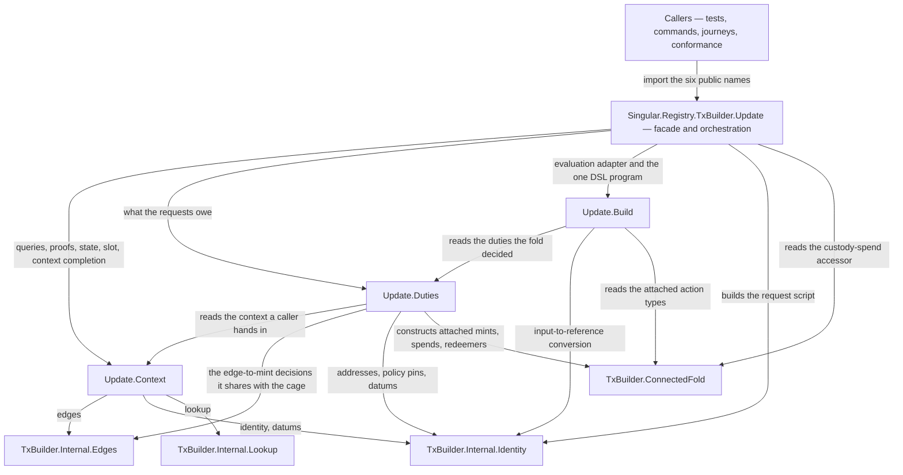
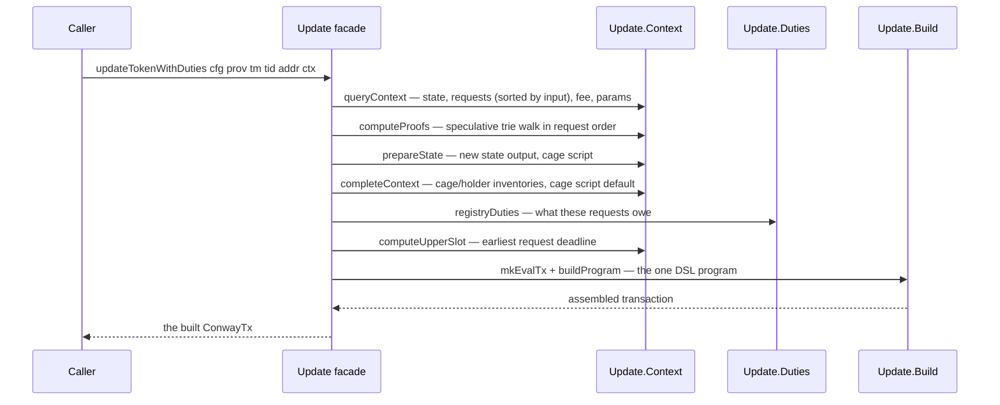

# Who owns a registry fold

A contributor changing how the registry folds pending requests — which
UTxO it spends, what an edge owes, how the transaction is assembled —
wants to change one module and have the review ask one question. Before
the extraction, all of that lived in one 890-line module; a change to a
custody refund and a change to a slot computation were reviewed in the
same file with no boundary between them. Now the fold path is three
focused owners behind the same public facade, and this page tells a
contributor which owner their change belongs to, what the flow through
them is, and what must never change while it moves.

## The story this serves

As a registry caller, I submit requests and fold them through the
existing `Singular.Registry.TxBuilder.Update` import; I want the same
request order, the same token effects, the same custody refunds and the
same destinations as before, so my callers and my conformance rows see
nothing move. A contributor refactoring the fold's internals owes me
that. The focused suite pins what its rows actually assert: the order
duties accumulate in for the request list a caller supplies; the
active witness burn's net `-1`, with the one input that holds it
consumed and no output carrying it; which holder input a burn selects
and which custody input a custody spend selects — exact policy, key
and quantity; the per-owner grouping of deposit returns and a
deletion's approval riding inside its deposit output; and the fold's
empty signer set, both in the duties it accumulates and in the
required-signer field of the transaction the public entry actually
builds.

What no focused row asserts: the query's input-order sorting (the rows
hand `registryDuties` already-ordered lists, and the built-body row
folds one request); the quantities of every mint except the active
burn; a custody refund's output address and amount; a delivering
edge's destination; and an approval returned by a delivering or
inadmissible edge. The fresh-blueprint `Criterion3Spec` tests the
accepted-edge portion of that gap. It books two real
requests and presents their real outputs in descending TxIn order to
one public fold, then runs connected stages for all seven admissible
edges. Its comparisons derive expected mints, approval assets, holder inputs,
destinations, custody refunds and signers from observed pre-state and
the accepted Lean row. They inspect the unsigned body and the landed
destination, refund and state outputs through the real provider. Each
of the seven named effect comparisons has a one-field mutant required
to fail in the same run. The local submitted devnet run passed 23 examples
with no failures. Its receipts record the two booked request TxIns, the
real and reversed provider orders, canonical TxIn order, fold transaction
IDs and roots across all connected stages. The terminal witness leaves
the root unchanged, as Lean requires; the other six edges change it.
This is finite representative devnet evidence, pending the exact-head
final gate, independent audit and pushed-head CI. It does not cover
arbitrary request sets, inadmissible-edge refusals, the delivering
approval's ADA minimum, or proof correctness beyond live cage
acceptance.

## One owner per fold concern

The facade holds no algorithm. It runs the fold's sequence — query,
proofs, state preparation, context completion, duties, upper slot,
program, build — and every decision in that sequence belongs to exactly
one of the three owners below it. The graph is acyclic and one-way
between the fold owners: Context knows nothing of duties or assembly,
Duties reads Context but no assembly, Build reads Duties but no
facade. Below the fold owners, both Duties and Build also read the
older Internal owners directly — the duty derivation shares its
edge-to-mint table with the cage through `Internal.Edges` — and both
the facade and the build owner read `ConnectedFold` for the attached
action types.

| Module | Responsible for |
| --- | --- |
| `Singular.Registry.TxBuilder.Update` | The six public exports and the two fold entry points; the sequence of preparation, decision and assembly. Nothing else. |
| `Singular.Registry.TxBuilder.Update.Context` | The `RegistryContext` a caller hands in and its empty value; finding the state, request and fee UTxOs; the ordered speculative proofs through the trie; the new state output and the cage script; the validity upper slot; completing a partly empty context from the provider. |
| `Singular.Registry.TxBuilder.Update.Duties` | `RegistryDuties` and `registryDuties`: the one derivation of what a fold's requests owe — mints under the three token policies, destinations, custody spends, burn sources, deposit and approval returns, and the (empty) signer set. |
| `Singular.Registry.TxBuilder.Update.Build` | `NoCtx`, the evaluation adapter over the provider, and the one transaction DSL program: spends, mints, outputs, signatures, attached or referenced scripts, collateral and validity. |

## The flow a fold runs

## What must not change

The extraction is a representation change, not a new registry rule.
The Lean model remains the authority: the fold's mint quantities, owner
deposits, custody refunds and approval returns are what
`Singular.obligations` says they are, and no fold requires a signer
(`Singular.Statements.fold_requires_no_signer`). What the focused tree
executes: the duties list in the order of the requests it was given —
not sorted, reversed or swept from the inventory — with outputs,
mints and burn sources each read back from what the builder produced;
the active burn's net `-1` with its held input and no carrier output;
the exact holder and custody input selections; the per-owner grouping
of deposit returns and a deletion's approval inside its deposit
output; and the built body's empty required-signer set through the
public entry. The new fresh-blueprint E2E case directly compares the
previously unpinned accepted-edge effects on finite connected stages,
with in-run mutants and real post-state observations. Its two-request
ordering witness controls the provider's enumeration of real outputs;
it does not claim every possible input order. Refused edges and the
delivering approval's ADA minimum remain outside these comparisons.
A contributor who needs any pinned
behavior to change is not refactoring; that is a behavior change and
belongs to the design flow, not to this structure.

## Independent evidence boundaries

Two neighbors deliberately do NOT share this code. The cage computes
its own duties from the requests it consumes (`dutiesOf`, `dutyOk`); a
builder that agreed with the validator by construction would not catch
a disagreement, so `registryDuties` stays a separate derivation. And
the Conformance suite's state is computed from run receipts — its rows
say what the chain did, not what this builder intended, and this
extraction touches none of it.

## Where common changes land

- A request gains or changes what it carries: `Update.Context` finds
  and decodes it (the datum shape itself lives in
  `Singular.Registry.Types`).
- An edge's obligations change — what it mints, where it delivers, what
  custody it spends or returns: `Update.Duties`, and only there.
- The transaction's shape changes — a new input kind, reference
  scripts, collateral or validity rules: `Update.Build`.
- What an omitted context field defaults to, or which queries the fold
  runs: `Update.Context`.
- The public surface and the fold's sequence: the facade, which must
  stay a coordinator.

## Decisions this extraction recorded

| Decision | Chosen | Considered and not taken |
| --- | --- | --- |
| How to split the fold | Three owners matching preparation, decision and assembly, behind the unchanged facade. | Finer owners per edge or per policy: more indirection, same guarantee. |
| How callers keep working | The facade re-exports its six names byte-for-byte; children are implementation modules of the same library. | Rewriting callers to the children: churn across tests, commands and conformance with no behavioral benefit. |
| Where the context completion lives | `Update.Context`, as `completeContext`, moved verbatim from the facade's inline block — queries are preparation, and the facade only sequences them. | Leaving the queries in the facade: the owner graph would say Context owns queries while the facade ran them. |
| The pre-existing `ConnectedFold` copies | Left untouched: it is the permissionless journey fold with its own documented lineage — its own header says its proof, upper-slot and refund rules are transcribed from the repair runner, pre-dating this extraction — so this slice neither creates nor unifies parallel logic there. | Unifying them: a different ticket's design question — the two builders serve different flows with different rules, and the parallel logic is recorded as a standing limit on "no duplicate algorithm" within this extraction's fence. |

## Source

The facade and owners, linked on this site to the generated API
reference and readable in the repository at the revision you are
viewing:

- Facade: <a href="../offchain/lib/Singular/Registry/TxBuilder/Update.hs" data-api="module">Singular.Registry.TxBuilder.Update</a>
- Owners: <a href="../offchain/lib/Singular/Registry/TxBuilder/Update/Context.hs" data-api="module">Singular.Registry.TxBuilder.Update.Context</a>, <a href="../offchain/lib/Singular/Registry/TxBuilder/Update/Duties.hs" data-api="module">Singular.Registry.TxBuilder.Update.Duties</a>, <a href="../offchain/lib/Singular/Registry/TxBuilder/Update/Build.hs" data-api="module">Singular.Registry.TxBuilder.Update.Build</a>

The wider builder map these owners sit in is
[Builder and blueprint modules](offchain-builder-blueprint.md); the
check commands and their extents are in
[Checking off-chain code](offchain-development.md).
