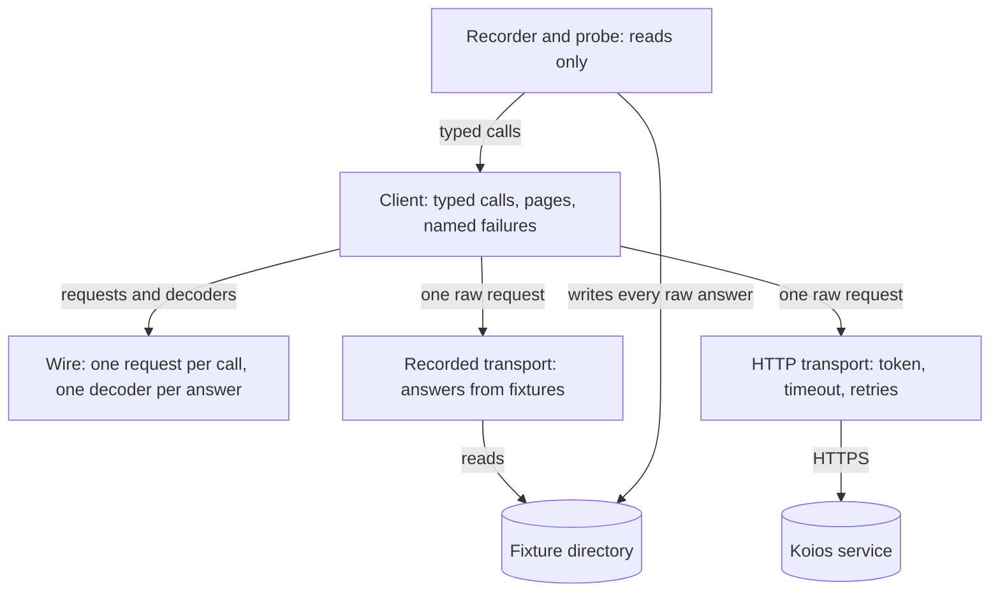
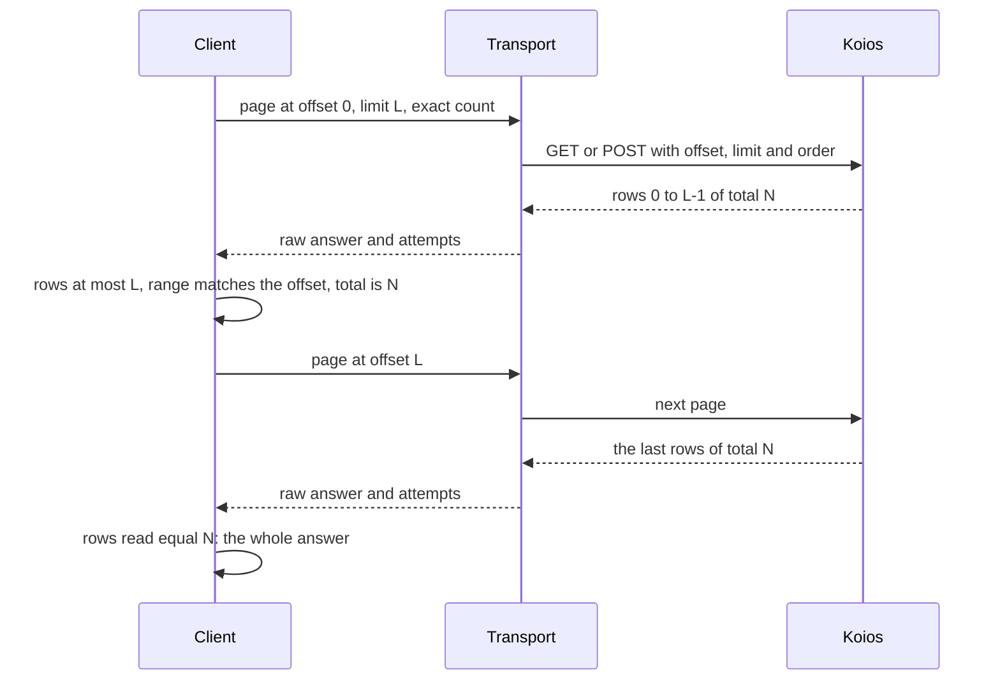

# The Koios client

A provider author building the Koios instance of the ledger provider wants
one Koios client that the recorded answers in continuous integration and
the live public service both go through, so that a test that passes on a
recording says something about the live service. A user on a busy public
endpoint wants every command to finish or to stop with a named reason,
never to continue on half an answer presented as a whole one. This page
shows how the client is put together, what each call returns, how pages
are read, why a call stops, and what the recorded evidence does and does
not establish.

## The story this serves

As a provider author, I import a Koios client that knows nothing of
registries or of the ledger-provider interface, and I choose its transport:
recorded answers for the test suite, or the live HTTP service. Both hand
the client the same raw answers — status, headers and body — so the same
code pages and decodes both, and a fixture and a live answer cannot be
read two different ways.

As a user with a Koios account, I give the client my bearer token in a
file. The token never appears on the command line, in a failure, in a log
or in a recorded fixture.

As a user on a busy endpoint, I see a call either answer or stop with one
named reason: unreachable, timed out, rate limited, server failing,
refused by the server, an incomplete page, an unknown fact, or an answer
that does not decode at a named position. An address with no outputs is
an empty answer, not a failure.

## The modules

The client is three modules of the public off-chain library and one
public sublibrary, `koios-http`, that holds everything touching the
network. The main library gains no network dependency.

- <a href="../offchain/lib/Singular/Provider/Koios/Wire.hs" data-api="module">Singular.Provider.Koios.Wire</a>
  describes one request per Koios call and decodes each answer into Conway
  ledger types. It performs no request.
- <a href="../offchain/lib/Singular/Provider/Koios/Client.hs" data-api="module">Singular.Provider.Koios.Client</a>
  defines the transport — one request in, one raw answer and its attempt
  count out — and builds every typed call on it: it pages, classifies the
  status and decodes, once, for every transport.
- <a href="../offchain/lib/Singular/Provider/Koios/Recorded.hs" data-api="module">Singular.Provider.Koios.Recorded</a>
  answers from a fixture directory. A request with no fixture is named as
  not recorded.
- The HTTP transport, `Singular.Provider.Koios.Http` in the `koios-http`
  sublibrary
  (<a href="https://github.com/lambdasistemi/singular/blob/main/offchain/koios-http/src/Singular/Provider/Koios/Http.hs">source</a>),
  sends requests to a base URL with an optional bearer token, a timeout on
  every attempt and bounded retries.
- The recorder and probe, `Singular.Provider.Koios.Recorder` in the same
  sublibrary
  (<a href="https://github.com/lambdasistemi/singular/blob/main/offchain/koios-http/src/Singular/Provider/Koios/Recorder.hs">source</a>),
  run read requests named on the command line and either print their
  decoded facts or write every raw answer as a fixture.

The two `koios-http` modules are documented here by their source, because
the generated reference covers the main library only.

## What each call returns

| Call | Answer | When the fact is absent |
| --- | --- | --- |
| tip | slot, block hash, block height, epoch | unknown tip |
| address_utxos, asset_utxos | each output reference with its complete Conway output: address, value with every policy and asset name, inline datum bytes or datum hash, reference script | an empty list: an honest empty answer |
| asset_txs | every transaction that included the asset, with its block height and epoch | an empty list |
| tx_info | the spent, referenced and created outputs of each named transaction, and whether it is valid | unknown transaction |
| tx_cbor | each named transaction's bytes, decoded as a Conway transaction whose id must be the one named, and its own validity flag | unknown transaction |
| epoch_params, cli_protocol_params | the Conway protocol parameters, cost models included | unknown epoch |
| submittx | the accepted transaction id, or the server's refusal text | — |
| tx_status | each named transaction's confirmations | not yet seen |
| account_info | registered or not registered, only when Koios says so | unknown registration |

Koios reports a datum hash for an output that carries an inline datum too;
the inline datum wins. A reference script must hash to the script hash
Koios names. A transaction that failed its scripts is returned with its
validity false, never dropped. The order of `asset_txs` makes pages
stable; it is not the order in which the asset was passed on, because
Koios gives no position within a block and a transaction that included an
asset need not have spent it.

## How pages are read

The listing calls are read page by page, each page asking for an exact row
total, in a stable order: output reference for the output listings, block
height then transaction id for the asset history.

The client stops when the rows read reach the total, or at the first page
shorter than the limit, and then requires the rows read to equal the
total. Each of these refuses the whole call as an incomplete page, and
never returns a shorter answer as a whole one: a body cut off or not one
JSON document, a page with more rows than the limit, a range that does not
name the rows at the offset asked for, an answer with no exact total, a
total that changes between pages, fewer rows than the total, and more
pages than the configured ceiling. The public preprod service answers an
exact total on every listing call when asked for one.

## Why a call stops

| Failure | Raised when | Retried first |
| --- | --- | --- |
| unreachable | connection, name or TLS failure | yes |
| timed out | no complete answer within the attempt timeout | yes |
| rate limited | 429 past the attempt bound, or a requested wait beyond the ceiling | yes, waiting as asked |
| server failing | 5xx past the attempt bound | yes |
| refused by the server | any other 4xx, a rejected token included | no |
| incomplete page | one of the page refusals above | a body cut off on the connection only |
| unknown fact | a requested transaction, registration, epoch or tip absent from the answer | no |
| undecodable | an answer that does not decode, with the JSON path that failed | no |
| token file unreadable | the token file is missing, unreadable or empty; no request is made | no |
| not recorded | the recorded transport holds no answer for the request | no |

Every failure names the call, the attempts the transport made and the
evidence. Retries live in the HTTP transport, so a recorded replay never
sleeps. A submission is retried only when no answer arrived — unreachable
or timed out — because resending the same signed bytes cannot apply them
twice; a 400 at submission is the server's refusal of that transaction and
is returned as its text after one attempt.

The HTTP transport's bounds are configuration values. Their defaults are a
20 second timeout per attempt, five attempts, delays doubling from a
quarter second up to eight seconds with jitter, a rate-limit wait honoured
up to 30 seconds, and 60 seconds for a whole request, retries included.

## Recorded answers and the recorder

`singular-koios probe` runs read requests against a Koios URL and prints
the decoded facts of each, or the named failure. `singular-koios record`
runs the same requests and writes every raw answer they take, page by
page, as one fixture file holding the request, the Koios schema revision,
the time and the SHA-256 of the body. Its requests name read calls only;
submission is not one of them, and the recording transport refuses one
without sending it. Headers are not recorded, so a token never reaches a
fixture.

The schema revision is the `info.version` of the `koiosapi.yaml` document
Koios serves at the origin of the base URL. Loading a fixture directory
refuses a fixture whose body does not match its hash, fixtures recorded
under different schema revisions, two fixtures for one request, and an
empty directory.

The preprod set under `offchain/test/fixtures/koios/preprod/` is recorded
by `just koios-fixtures` from `https://preprod.koios.rest/api/v1` with read
calls only. The tests replay it through the recorded transport and through
the HTTP transport pointed at a loopback server serving the same answers,
and both must decode identically. A loopback server in the test suite also
produces rate limiting, slow answers, cut-off and missing pages, server
errors, refused tokens and refused submissions on demand, and the tests
count the attempts it receives.

## What the evidence establishes, and what it does not

Each recorded output is compared with the output at the same index of its
producing transaction, decoded by the ledger from that transaction's
recorded bytes, and the set of output references is compared with the
producer's — the raw recorded rows for a listing, the transaction's own
inputs, reference inputs and outputs for `tx_info` — so a decoder that
changes, drops or adds an output fails. The protocol parameters decoded
from `epoch_params` must equal the ledger's own reading of the node-form
parameters Koios serves for the same epoch.

The recorded set is one day's snapshot of public preprod and covers the
shapes it holds: key and script addresses, ada-only and multi-asset
values, inline datums, datum hashes and Plutus V3 reference scripts.
Native and Plutus V1 or V2 reference scripts, Byron addresses and pointer
addresses are not in it. No transaction that failed its scripts was found
on preprod, so a recorded transaction with its validity flag cleared
stands in for one; its id hashes the body alone and is unchanged. The live
preprod service does not send the `valid_contract` field its published
schema lists for `tx_cbor` and `tx_info`; validity comes from the
transaction's own bytes and from the per-script flags Koios does send. A
body cut off on the connection is retried and named in code, but the
loopback server cannot produce one, so only the client's mapping of it is
tested.

## Decisions

| Chosen | Over | Why |
| --- | --- | --- |
| Ask for an exact total and require the rows read to equal it | Stopping at the first short page alone | Without the total, a missing middle page answered as short or empty is indistinguishable from the end. |
| Classify the status once, in the client | Classifying in each transport | Recorded and live answers then fail the same way for the same status. |
| A separate failure for an unrecorded request | Reporting it as unreachable | A missing fixture is never read as a network fault. |
| Check `epoch_params` against the ledger's reading of `cli_protocol_params` | Typed expected parameters | The expected side comes from an independent producer, not from the test's author. |
| Record one producing transaction per `tx_cbor` request | One request for every producer | Koios limits a public request body to one kilobyte. |
