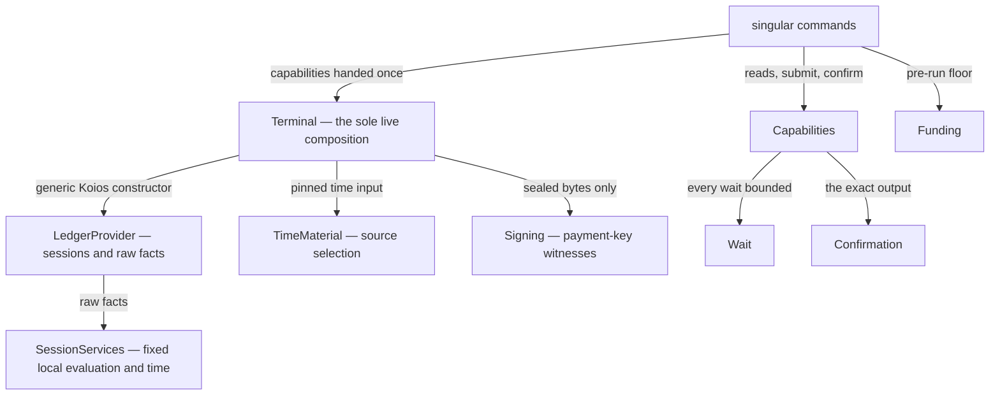

# Runtime service ownership

A contributor changing how the registry's off-chain commands obtain their
ledger facts — a different wallet, a longer confirmation window, a new
provider transport, a change to what a command reports about its reads —
wants one obvious owner per concern, so the change is reviewed in one
place and a fact or a wait can never quietly exist twice. This page maps
the provider-era runtime to its owners: what each module is responsible
for, where common changes land, and what the checks establish about the
split.

The node runtime this page once mapped is retired. The package-private
`node-internal` library — its read adapter, in-memory chain, session
runner and indexer — no longer exists, and with it the public
`Singular.Registry.Node` facade: no shipped command opens a node, holds a
socket or keeps a chain index. That retirement is the provider migration's
own record, with its operator rulings, in [the provider ticket's
decisions](../specs/383-provider-interfaces/decisions.md); this page
describes what replaced it.

## One owner per runtime concern

The runtime's owners are three public components. `local-services` owns
the generic session and the fixed services computed from it; the main
library owns the registry's application services and the bounds a
command runs under; and `koios-http` owns the one live terminal
composition and its transport. The generic ledger capabilities — the
session, its evidence, and the services computed from raw facts — know
nothing of a registry's application, and no shipped module names a
node.

| Owner | Responsible for |
| --- | --- |
| `Singular.Registry.LedgerProvider` | The generic capabilities every provider implements: acquiring a session for a network or refusing by name, composed address, asset and txin reads, protocol parameters, and submission — polymorphic in the witness and effect types, knowing nothing of a registry. |
| `Singular.Registry.Evidence` and `Singular.Registry.SessionEvidence` | The fact type with its optional ledger witness and its verdict; and observing the facts a consumer actually reads, refusals and history continuations included, in the caller's monad. |
| `Singular.Registry.SessionServices` | The fixed local computations over one acquired session's raw facts. It acquires no session, performs no transport operation, and selects no evaluation or time policy. |
| `Singular.Registry.LocalEvaluation` | Ledger execution from complete resolved input facts: script results from exact raw inputs, refusing missing or conflicting ones. |
| `Singular.Registry.NetworkTime`, `TimeSource` and `TimeMaterial` | Pure conversions over validated, pinned network data; which immutable source a network reads (the reviewed preprod package or the generated network's own bytes); and the horizon beyond which no conversion may authorize a fold or retraction. |
| `Singular.Registry.SessionIO` | The IO consumers of the generic raw session, including the bounded pre-signing horizon wait. It acquires no extra session and chooses no provider or evaluator. |
| `Singular.Registry.Wallet` | Explicit payment wallet loading and public address rendering. No process mode, generated wallet or connection belongs to it. |
| `Singular.Registry.Signing` | Payment-key witnesses and the signed-transaction capability: the one way a built transaction becomes sealed bytes. |
| `Singular.Registry.ProviderTrace`, `Trace` and `TraceRender` | Typed events at the provider boundary — every call a command makes, timed and typed — and their rendering. No module reads an environment variable to decide whether to log. |
| `Singular.Registry.ProviderSettings` | Explicit configuration of the sole shipping ledger provider: the parser carries paths; token and time files are read by terminal composition. |
| `Singular.Registry.WaitTypes` | The stable bounded-wait failure identity shared by the wait owner and the journals that name it. |
| `Singular.Registry.Ledger` | Cardano ledger type re-exports, owned here and re-exported by the main library under the original import path. |
| `Singular.Registry.Capabilities` | What a command or runner holds: the provider, the signed-only submission, the confirmation action, the facts and the trace of one scope. Later confirmation and prior funding scopes cannot enter a body's evidence. |
| `Singular.Registry.Wait` | What a bounded wait is: the wait stages, the named failure a bound raises, the bounded signed submission and the wait-aware catch. The common transaction waits — submission and confirmation — run under its bound; a transport's own per-request bound stays inside its adapter. |
| `Singular.Registry.Confirmation` | Exact-output confirmation from generic sessions and explicit clock effects; confirmation reads have their own acquisitions, after the body is prepared. |
| `Singular.Registry.Funding` | The pre-run funding floor: what the funding wallet must hold before the first transaction, the diagnostic naming the address and the shortfall, and lovelace rendering. |
| `Singular.Registry.Terminal` | The sole live terminal composition in `koios-http`: the shared HTTP client and wire, the generic Koios constructor, pinned time input and explicit receipt sinks. The signed raw Koios submitter is its allowlisted composition. |
| `Singular.Registry.Runner` | Retained runners in `koios-http`, which receive a provider and a wallet explicitly and open only the shipping provider and the caller's signing-key file. |
| `Singular.Provider.Koios.Http` and `Singular.Provider.Koios.Recorder` | The HTTP transport, and the read-only fixture recorder over it. |
| `Singular.CLI.Session` | The environment a write command runs with and its journalled submissions: every transaction prepared, answered, confirmed and observed in synchronized phases, so a process killed anywhere leaves the journal saying how far it got. |

The first twelve rows live in `local-services`, the next four in the main
library, the following three in `koios-http`, and the last in the command
line. The trie's own owners — `TrieState` and its instances — are a
separate capability documented with the library's modules in the
[off-chain API reference](offchain-api-reference.md); the main library's
re-exports of `Ledger`, `LedgerProvider`, `Evidence` and `Signing` keep
their stable import paths, and their generated pages come from
`local-services`' own Haddock tree.

## Where common changes land

- A provider transport, its HTTP behaviour or the terminal composition:
  `koios-http` — `Terminal`, `Provider.Koios.Http` — with
  `ProviderSettings` parsing what the operator supplies.
- A read, its evidence or its verdict: `LedgerProvider`, `Evidence` or
  `SessionEvidence` in `local-services`. The witness type stays a
  parameter; Demo 1 ships the uninhabited one and the unverified verifier.
- Local evaluation or time conversion: `SessionServices`,
  `LocalEvaluation`, `NetworkTime` or `TimeMaterial`. An adapter supplies
  facts and cannot select an evaluator or a time converter.
- A bounded wait, its failure or the submission bound: `Wait`, whose
  failure identity `WaitTypes` fixes. The common submission and
  confirmation bounds live here; a transport's per-request bound remains
  its adapter's concern, never an await of the chain.
- Confirmation of a submitted transaction: `Confirmation`, under the
  common bounded polling — never a provider-owned await.
- The pre-run funding floor or its diagnostic: `Funding`.
- Wallet loading, key handling or signing: `Wallet` and `Signing`. Key
  bytes are never logged.
- What the provider boundary reports: typed events into the tracer the
  caller hands it — `ProviderTrace`, `Trace` and `TraceRender`.
- How a command reaches its capabilities, or what its journal records:
  `Singular.CLI.Session` beside the terminal composition.

## What the checks establish

A source check confines every backend name: a module outside the
confinement allow list that names a node backend fails the build, and
each allow-list entry carries its reason. The commands never hold that
list. Submission is signed bytes only, every wait runs under the common
bound, and the development network's own machinery — the private
Koios-shaped facade, its raw-facts recorder and the generated devnet — is
test infrastructure that never ships with the terminal.

What is deliberately not claimed here: the live Koios HTTP transport's
production behaviour — its retries, rate limits and public URLs — is
outside the provider ticket's scope and belongs to the Koios client
ticket, [#389](https://github.com/lambdasistemi/singular/issues/389),
whose implementation main already carries in `Provider.Koios.Http` and
`Provider.Koios.Client`. This page records who owns what; it accepts
and verifies nothing of that transport's production behaviour.

## Decisions this ownership records

| Decision | Chosen | Considered and not taken |
| --- | --- | --- |
| Where the retired node runtime's survivors went | The generic services moved to public components — `local-services`, `koios-http` and the main library — each under its original import path where callers had one. | Keeping a node path beside the provider: the operator's October 2–4 rulings retire it, because a runnable terminal must not need a node or a socket. |
| Who composes the terminal | One live composition, `Terminal`, over the generic Koios constructor with pinned time input. | Adapter-selected evaluation or time hooks: evaluation and time conversion are fixed local services, so a provider cannot choose them. |
| What a command holds | One `Capabilities` record per scope, carrying the provider, the signed-only submission, confirmation, and that scope's facts and trace. | Handing commands raw transport handles, which would let a later scope's confirmation enter an earlier body's evidence. |
| How waiting is owned | One wait owner bounds the common submission and confirmation waits, with a stable failure identity shared with the journals. | Provider-owned confirmation awaits; a transport's per-request bound is its own concern, but never an await of the chain the model of confirmation does not give it. |
