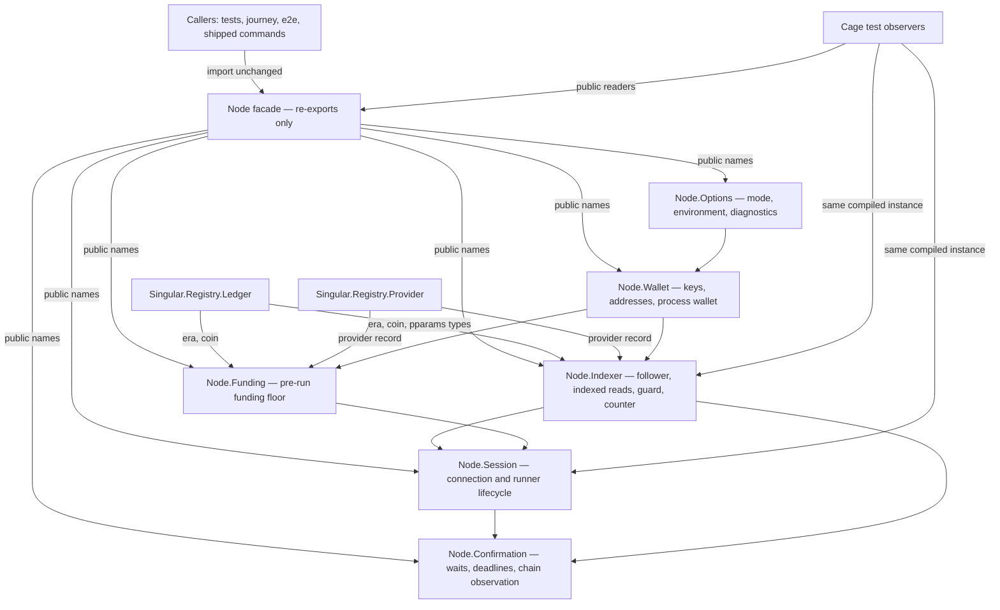
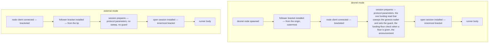
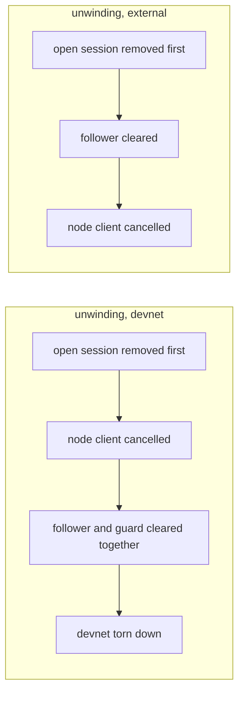

# Node module ownership

A contributor changing how the registry's off-chain runner talks to a
cardano node — a new mode, a different wallet, a longer confirmation
window, a change to what a runner may leave behind when it fails —
wants one obvious owner per concern, so the change is reviewed in one
place and process state can never quietly exist twice. This page maps
the node runtime to its owners: what each module is responsible for,
where common changes land, the lifetimes a runner's process state
keeps, and what the checks establish about the split.

## One owner per runtime concern

The six owners and the two chain-facing types they read live in one
package-private internal library. The public module
<a href="../offchain/lib/Singular/Registry/Node.hs" data-api="module">Singular.Registry.Node</a>
is a facade: it owns nothing, keeps the exact export list the library
always had, and every original caller — the focused node tests, the
journey runner, the end-to-end suite, the shipped commands — keeps
compiling against it unchanged.

The dependency direction is acyclic and downward: options depend on
nothing local, wallet reads options, the indexer and the funding check
read wallet and options, the session brackets the indexer and the
funding check, and confirmation reads the session and the indexer —
never the other way. Ledger and provider sit beside the owners in the
private library because the owners read them; the public library
re-exports both under their original import paths, so a module that
imported `Singular.Registry.Ledger` before the split still does.

| Owner | Responsible for |
| --- | --- |
| `Node.Options` | Parsing mode flags and environment into the process mode, the external-node shape, the external-mode echo diagnostic (a preprod Koios query; a no-op on the devnet), and the shared named-diagnostic helper. No dependency on any runtime module. |
| `Node.Wallet` | Loading and deriving the process wallet: signing keys, addresses, the funder identity the run pays from, network magic, and bech32 rendering. Key bytes are never logged. |
| `Node.Indexer` | The chain follower a session reads through: installing it for an action, sweeping the devnet's genesis funding into a block-carried output, answering address reads from the index, refusing node address reads once the funding sweep is done, and counting the node's address queries. |
| `Node.Funding` | The pre-run funding floor: what the funding wallet must hold before the first transaction, the address-naming diagnostic when it does not, and lovelace rendering. |
| `Node.Session` | The runner's connection lifecycle: connecting to the node socket, the bracketed session a body runs inside, announcing and awaiting the connection, and the session readers (tip, stake registration). |
| `Node.Confirmation` | Waiting for the chain to carry what a run submitted: transaction and window waits, deadlines, upper-bound slots, chain waits, and the confirmation delay the mode selects. |

Each owner is package-private — not importable from the public library —
and its implementation is one source file, pinned to the immutable
revision these links name and reachable from the generated public pages
through the owner entries below:

- **Options** — mode flags, environment
  precedence and the shared named-diagnostic helper —
  <a href="https://github.com/lambdasistemi/singular/blob/9a74eae15a3fe75abf7bbdf4969c2d11d7d8e69d/offchain/node-internal/Singular/Registry/Node/Options.hs">source</a>.
- **Wallet** — keys, addresses and the
  funding identity —
  <a href="https://github.com/lambdasistemi/singular/blob/9a74eae15a3fe75abf7bbdf4969c2d11d7d8e69d/offchain/node-internal/Singular/Registry/Node/Wallet.hs">source</a>.
- **Indexer** — the chain follower, the
  funding sweep, indexed reads, the node-read guard and the address-read
  counter —
  <a href="https://github.com/lambdasistemi/singular/blob/9a74eae15a3fe75abf7bbdf4969c2d11d7d8e69d/offchain/node-internal/Singular/Registry/Node/Indexer.hs">source</a>.
- **Funding** — the pre-run funding floor
  and its refusal diagnostic —
  <a href="https://github.com/lambdasistemi/singular/blob/9a74eae15a3fe75abf7bbdf4969c2d11d7d8e69d/offchain/node-internal/Singular/Registry/Node/Funding.hs">source</a>.
- **Session** — the connection lifecycle
  and the bracketed runner session —
  <a href="https://github.com/lambdasistemi/singular/blob/9a74eae15a3fe75abf7bbdf4969c2d11d7d8e69d/offchain/node-internal/Singular/Registry/Node/Session.hs">source</a>.
- **Confirmation** — confirmation
  waits, deadlines and windows —
  <a href="https://github.com/lambdasistemi/singular/blob/9a74eae15a3fe75abf7bbdf4969c2d11d7d8e69d/offchain/node-internal/Singular/Registry/Node/Confirmation.hs">source</a>.

## Where common changes land

- A mode flag, an environment variable or their precedence changes:
  `Node.Options`; the facade re-exports the result unchanged.
- Wallet derivation, key handling or the funding identity changes:
  `Node.Wallet`. Key secrecy rules live there and nowhere else.
- Connection setup, socket handling or the session bracket changes:
  `Node.Session`.
- Following a chain, the genesis funding sweep, indexed reads or the
  node-read guard changes: `Node.Indexer`.
- What a run must hold before it starts, or the refusal diagnostic when
  it cannot pay: `Node.Funding`.
- A confirmation wait, deadline or window rule changes:
  `Node.Confirmation`.
- A shared named failure the runner prints: the diagnostic helper in
  `Node.Options`, the one cross-owner utility, at the graph's root.

## Process state and its lifetimes

The runner keeps six pieces of process state. Each is created once per
process, owned by exactly one module, and installed and removed at the
same points as before the split. The nesting is what a contributor
must hold: the follower is the outer bracket and the open session the
inner one, and the funding-read guard is set only on the devnet.

On the devnet the follower bracket wraps the node client and the whole
session; externally the node client is outermost and the follower wraps
only the session. In both modes the session prepares before the open
session is installed — protocol parameters first, then (devnet only)
the one node address read that sweeps the funding wallet and sets the
guard, then the funding-floor check when a floor is given, then the
announcement — and the body runs inside the open-session bracket. When
the body returns or throws, the brackets unwind from the inside out
and the open session is removed first. What clears next depends on
the mode: on the devnet the node client is cancelled, then the
follower and guard clear together before the devnet itself is torn
down; externally the follower clears and then the node client is
cancelled. A later action never sees a torn-down runner.

| Process state | Owner | Installed | Removed |
| --- | --- | --- | --- |
| The process mode | `Node.Options` | lazily, once, from arguments and environment | never — constant for the process |
| The process wallet | `Node.Wallet` | lazily, once, from the mode | never — constant for the process |
| The open session | `Node.Session` | innermost, by the session's `withOpenSession`, after the sweep, the funding check and the announcement | first on unwind — restored to nothing at bracket exit, exceptions included |
| The chain follower | `Node.Indexer` | by the follower bracket: outermost around the node client on the devnet (from the origin), inside the node-client bracket externally (from the tip) | after the open session on unwind — cleared at bracket exit, exceptions included |
| The funding-read guard | `Node.Indexer` | only on the devnet: by `followedProvider` through `markFundingIndexed`, once the genesis sweep is indexed; never set on an external node | with the follower at bracket exit, exceptions included |
| The address-read counter | `Node.Indexer` | starts at zero, counts every node address query | never reset — the public read keeps the process total |

Because these live in the private library and nothing duplicates them,
the facade, the cleanup brackets and the cage test observers share one
compiled instance: a test that installs a session and a runner reader
that answers from it are talking about the same memory. The focused
cleanup suite proves each bracket both installs (the positive halves)
and removes (after normal and exceptional bodies) its state through the
public readers, and that the funding-read guard refuses node reads
while set and lets them through again after the body fails.

## The independent evidence boundary

On the devnet, the funding wallet's genesis outputs exist in the
ledger's initial state, not in any block, so the indexer cannot see
them. The follower therefore performs one node address read — the
funding wallet — moves everything the indexer does not know into one
block-carried output, and from then on address reads are answered by
the indexer while node address reads are refused. That refusal is what
keeps a run's evidence independent of a single filtered view. This
split changes none of it: the guard, the counter and the sweep live in
`Node.Indexer`, behavior-identical to before.

What is deliberately not claimed here: the external-node mode has no
executable public-network coverage in this work, and remains unverified
there, exactly as before the split.

## Facade, callers and the private boundary

The facade's export list is unchanged, token for token. Modules that
imported `Singular.Registry.Ledger` or `Singular.Registry.Provider`
keep their import paths through the public library's re-exports. The
six owners themselves are not importable from the public library: they
live in the package's private internal library. By Cabal's own rule a
named library without public visibility can be depended on only by
components of this same package. Two of them do: the public library,
whose facade re-exports the owners, and the cage test component, whose
own dependency binds its observers to the same compiled instance the
facade re-exports from — one build, one memory, no second copy.
Nothing outside the package can name the private library; a downstream
reader keeps the facade and the two re-exported modules, exactly as
before the split.

## Decisions this split recorded

| Decision | Chosen | Considered and not taken |
| --- | --- | --- |
| Where the new owners live | One package-private internal library holding the six owners plus the ledger and provider modules they read, re-exported by the public library under their original names. | Exposing the owners as public modules: it would publish writable session and follower seams the library never had. Compiling the owners' sources a second time inside the test component: a compiled trial showed it drags the whole library into the test unit and produces a second, non-production copy of every piece of process state. |
| How the cleanup tests reach the private seams | The cage test component depends on the private library explicitly, binding bracket, observer and facade to one compiled instance; the positive installation halves fail if that identity ever breaks. | A test-local duplicate of the state, which would be green while testing nothing a runner executes. |
| How existing callers keep working | The facade re-exports its exact original export list; ledger and provider keep their import paths by re-export; original callers compile unchanged. | Rewriting callers to import the owners directly: import churn with no behavioral benefit, and it would widen the surface the split is meant to keep closed. |

The split is behavior-preserving by construction and by receipt. Five
moved call sites now name the extracted helpers — the session installs
the open session through `withOpenSession`, `followChain` brackets the
follower and the guard through `withFollowing` (clearing the follower
before the guard), `confirmOutputZero` and `followedProvider` read the
follower through `currentFollower`, and `followedProvider` sets the
guard through `markFundingIndexed` — each helper's body equal to the
inline code it replaced; `indexFunding` reads the wallet through its
accessors instead of a record pattern, equivalent for the devnet
wallet it loads. Every other moved declaration's body is equal to its
base apart from whitespace. At candidate revision `7b4adf3` the repository's exact-head
checks passed — the full cage suite, the devnet end-to-end paths and
the bounded journey — and the focused cleanup brackets' installation,
exceptional-exit removal and guard controls are bound to the same code
by metered receipts. The external-node mode keeps its limit: nothing
here claims public-network behavior, before or after the split.
