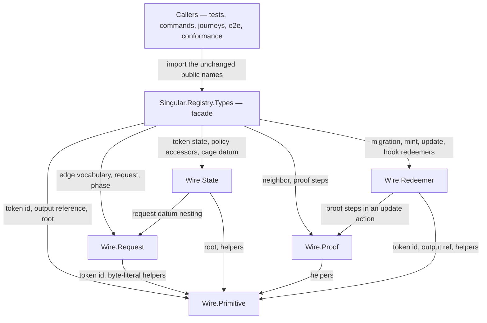

# Who owns the registry wire

A contributor changing what the registry puts on chain — a datum field, a
redeemer shape, a proof encoding — wants to edit one module beside the
codec that writes it, and have the review ask one question. Before the
extraction, every datum, redeemer and domain type lived in one
877-line `Types` module where a custody-encoding change and an edge-name
change were reviewed side by side with nothing between them. Now the wire
is five focused owners behind the same public facade, and this page tells
a contributor which owner their change belongs to, which way the
dependencies run, what the wire may never do while it moves, and where
the evidence boundary sits.

## The story this serves

As a registry integrator, I import `Singular.Registry.Types` and build
transactions with the constructors and selectors I already use; I want
the same encoded bytes, the same constructor indices, the same field
order and the same refund-only custody after the definitions move beside
their codecs, so my signed transactions, my Aiken vectors and my
conformance rows see nothing move. A contributor refactoring the wire's
home owes me that.

What the focused suite pins, both directions of every codec: a
hand-typed literal `Data` expectation for each encoding — typed from the
Aiken shapes, never produced by the codec it judges — and a hand-typed
wire read back through each unsafe decoder to its hand-typed value. The
retired two-field custody payload and the unused update-redeemer
encoding at constructor index five are refused by the decoders, which
support every constructor the wire carries — the sweep included, whose
refusal is the validator's, a separate layer from the wire. The seven
edge tags, their diagnostic names
with the out-of-table fallback, the request's edge and deposit
positions, the eight-field state order and the four policy accessors
are each pinned to their own field. Roundtrips run as supporting
checks: a symmetric field swap inside a codec keeps every roundtrip
green, which is exactly why the independent literals carry the wire.

## One owner per wire value

| Module | Responsible for |
| --- | --- |
| `Singular.Registry.Wire.Primitive` | The asset-name, output-reference and root values; the shared `Data` conversion helpers; the leaf of the family — depends on no sibling. |
| `Singular.Registry.Wire.Request` | The edge vocabulary and its seven tags with their names, the request datum with its codec, and the accept\/retract\/reject phase classification. Reads Primitive only. |
| `Singular.Registry.Wire.State` | The eight-field token state with its codec, the four policy-byte accessors, and the cage datum — request, state, and the refund-only custody of an absent token. Reads Primitive and Request. |
| `Singular.Registry.Wire.Proof` | The neighbor and the three proof steps of the MPF encoding. Reads Primitive only. |
| `Singular.Registry.Wire.Redeemer` | Migration parameters, the minting redeemer, per-request actions, the spending redeemer with its retained sweep constructor — decodable on the wire, refused by the validator — and the encode-only pinned-hook redeemer. Reads Primitive and Proof. |
| `Singular.Registry.Types` | The compatibility facade: the exact original export list, re-exported. Owns no data definition and no codec body. |

The five owners are package-internal implementation modules of the same
public library: callers keep importing the facade, and no owner imports
the facade or another owner outside the arrows above — the graph is
acyclic. Single ownership is a declared map, not a compiler guarantee:
each original declaration and instance appears in exactly one owner in
the before-and-after declaration map this extraction ships, the facade
re-exports those names and defines nothing, and the Cabal stanza and
the generated reference list each owner exactly once — a stray
duplicate body in some other module would neither be reachable through
the facade nor appear in that map. The owners'
pages appear in the generated reference for the contributor's navigation
while remaining non-importable by a caller.

## The flow a wire value travels

```mermaid
flowchart LR
    L[Accepted Lean behavior] -->|names the moves and their obligations| A[Aiken on-chain source]
    A -->|commits| G[Cross-language vector golden]
    G -->|shapes checked against| H[The five Haskell wire owners]
    H -->|re-exports the same names| T[Types facade]
    T -->|builds and reads datums and redeemers| C[Callers and executing consumers]
    C -->|transactions carry the bytes| CH[The chain]
    CH -->|observes decoded values back| C
```

A wire value is born on chain: the Aiken source defines the datum and
redeemer shapes, the committed vector golden freezes them across
languages, and each Haskell owner transcribes one family of them beside
its hand-written codecs. The facade changes nothing — it lends the five
owners its import path. Callers build transactions through it, the cage
reads the same bytes back through its own Aiken decoders, and executing
consumers observe the decoded values on the other side. A change to any
Aiken shape is therefore not a Haskell edit at all: it starts in the
design flow, moves the Aiken source and the golden vectors first, and
only then lands in the owning module.

## What must not change

The extraction is a representation change, not a new wire ruling. Every
`ToData`, `FromData` and `UnsafeFromData` body moved verbatim, and each
stock `Show` and `Eq` derivation moved with its type. The invariants a
contributor must not move while editing an owner:

- Constructor indices are part of the wire: the cage datum keeps request
  at zero, state at one and the refund-only custody at two — appended so
  the first two never move — and the update redeemer keeps its five
  constructors, including the sweep shape the validator refuses for
  every party but the wire still carries.
- Field order is part of the wire: the request encodes its seven fields
  in the order the cage reads them, with the destination as a
  two-element list exactly as Aiken encodes a tuple; the state encodes
  its eight fields root-first.
- The custody of an absent token is refund-only: one byte string naming
  the address the inserter chose. The retired shape that also carried
  the registry key is refused by the decoder, and no test regenerates
  the committed vectors.
- The pinned-hook redeemer is encode-only: it encodes as an empty
  constructor zero and has no decoder, because nothing caller-supplied
  in it is trusted.

A contributor who needs any of these to change is not refactoring; that
is a wire change, it belongs to the design flow and the ruling that
moves Aiken first.

## Independent evidence boundaries

Three neighbors deliberately do not share this code's confidence. The
Aiken validators decode with their own source, transcribed from the same
accepted model — a Haskell codec that agreed with the validator by
construction would catch nothing, so the cross-language vectors stay the
arbiter, regenerated only by an explicit developer recipe. The vector
generator exercises the encoders only. And the Conformance suite
is an unchanged consumer of the facade — the wire extraction touches
none of its files. Its rows are layered, not uniform: rows the chain
exercised are computed from run receipts; schema and serialization
observations are checked off-chain; and requirements nothing has
exercised are published as uncovered rather than silently covered.
The serialization row the frozen gate executes checks thirteen types
against the blueprint — a narrow compatibility observation, not the
full published requirement that every codec match the blueprint, which
stays uncovered. The rows say what was observed, never what these
codecs intended. The focused literal suite binds the wire; the
executing consumers bind the journeys; neither substitutes for the
other.

## Where common changes land

- A datum gains or loses a field, or its order changes: the owning wire
  module's type and codec — and never only one of the two — plus the
  Aiken source and the vector golden first.
- An edge is added or its tag renumbered: `Wire.Request`, and the cage's
  edge table with it.
- A redeemer's shape changes: `Wire.Redeemer`.
- A new wire primitive — another hash or identifier kind:
  `Wire.Primitive`, which everything else may then read.
- A helper for building `Data` by hand: `Wire.Primitive`, where the
  conversion helpers live; they are deliberately not on the public
  facade.
- The public surface itself — a name callers import: the facade's export
  list, which must stay a pure re-export.

## Decisions this extraction recorded

| Decision | Chosen | Considered and not taken |
| --- | --- | --- |
| How to split the wire | Five owners by what travels — primitives, requests, state and custody, proofs, redeemers — behind the unchanged facade. | One owner per type: fourteen modules for fourteen declarations, all indirection and no reading help. |
| How callers keep working | The facade re-exports the exact original export list from the five owners. | Rewriting every caller to the owners — churn across the fifty-seven modules importing the facade at this revision, the conformance suite among them — for no behavioral gain. |
| Where the shared `Data` helpers live | `Wire.Primitive`, exported to the owners only; the facade never re-exports them, as it never did. | Keeping them in the facade: every codec would read the facade, and the dependency arrows would point the wrong way. |
| The encode-only consumer redeemer | Stays encode-only in `Wire.Redeemer`, with its literal pinned. | Adding a decoder for symmetry: the hook carries nothing caller-supplied, and a decoder would suggest otherwise. |
| Owner visibility | Package-internal `other-modules` with generated reference pages, like the fold owners before them. | Exposing the owners: two import paths for the same names, and the facade's promise stops being checkable. |

## Source

The facade and the five owners, linked on this site to the generated
API reference and readable in the repository at the revision you are
viewing:

- Facade: <a href="../offchain/lib/Singular/Registry/Types.hs" data-api="module">Singular.Registry.Types</a>
- Owners: <a href="../offchain/lib/Singular/Registry/Wire/Primitive.hs" data-api="module">Singular.Registry.Wire.Primitive</a>, <a href="../offchain/lib/Singular/Registry/Wire/Request.hs" data-api="module">Singular.Registry.Wire.Request</a>, <a href="../offchain/lib/Singular/Registry/Wire/State.hs" data-api="module">Singular.Registry.Wire.State</a>, <a href="../offchain/lib/Singular/Registry/Wire/Proof.hs" data-api="module">Singular.Registry.Wire.Proof</a>, <a href="../offchain/lib/Singular/Registry/Wire/Redeemer.hs" data-api="module">Singular.Registry.Wire.Redeemer</a>

The fold owners behind their facade are described in
[Who owns a registry fold](offchain-fold-responsibilities.md); the wider
builder map is in
[Builder and blueprint modules](offchain-builder-blueprint.md); the
complete module list of this reference is in
[Off-chain API reference](offchain-api-reference.md).
