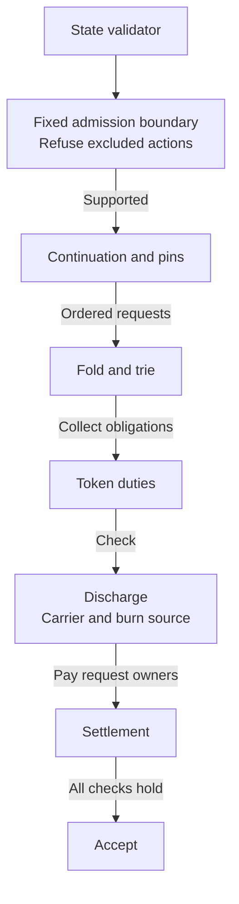

# Who owns a state validator rule

A contributor changing a registry rule wants one source owner beside the
behavior it enforces. The active contract has one admission boundary, one fold,
and one settlement path. This page maps those responsibilities and names the
verification each change needs.

## The current contract

A registry integrator can register an unknown key and retire an active key
permanently. The five other historical encodings are refused before approval or
trie effects. The original broader source is archived on
`preserve/m2/pre-m1-source-removal`; its custody and deletion paths are removed
from the active source. Old deployed identities are refused, without migration.

The boundary is fixed in the compiled state validator. Application approval
alone is insufficient: caller-constructed requests, mint paths and mixed batches
also pass through state admission. Witness policies require that state validator
in the same transaction. Request rejection and retraction retain their applicable
refund obligations; this carve does not settle the separate protected-rejection
model question.

| Rule | Source owner |
| --- | --- |
| Dispatch, state identity and named fold refusal | <a href="../onchain/validators/state.ak" data-api="module">state</a> |
| Two admitted tags and action well-formedness | <a href="../onchain/validators/registry/admission.ak" data-api="module">registry/admission</a> |
| State token genesis | <a href="../onchain/validators/registry/genesis.ak" data-api="module">registry/genesis</a> |
| Continuation, pins, batch checks and check order | <a href="../onchain/validators/registry/modify.ak" data-api="module">registry/modify</a> |
| Request carriage, phase, approval and supported trie move | <a href="../onchain/validators/registry/fold.ak" data-api="module">registry/fold</a> |
| Retirement leaf refusals | <a href="../onchain/validators/registry/trie.ak" data-api="module">registry/trie</a> |
| Active-token delivery, retirement burn and returned deposit | <a href="../onchain/validators/registry/duty.ak" data-api="module">registry/duty</a> |
| Named carrier and single burn-source checks | <a href="../onchain/validators/registry/discharge.ak" data-api="module">registry/discharge</a> |
| Positional reject refunds and per-payee deposit sums | <a href="../onchain/validators/registry/settlement.ak" data-api="module">registry/settlement</a> |
| One traced reason and false result | <a href="../onchain/validators/registry/refusal.ak" data-api="module">registry/refusal</a> |

## Evidence and limits

The [candidate results](../specs/505-permanent-m1/RESULTS.md) distinguish Lean
proofs, source tests, actual compiled-context evaluation and connected ledger
execution. Removing source changes compiled identities, so earlier comparisons
and receipts remain historical evidence. No source or build check establishes
ledger acceptance or a budget bound.

The pinned `aiken docs` reference is generated from the same source as the site.
Each owner documents responsibility, dependencies, assumptions and invariants.
The existing documentation checks reconcile public declarations with generated
members and plant missing-documentation and stale-link faults. They establish
presence and correspondence, not the truth of a behavioral claim. Read the
[validator API reference](onchain-api-reference.md) for every generated module.
