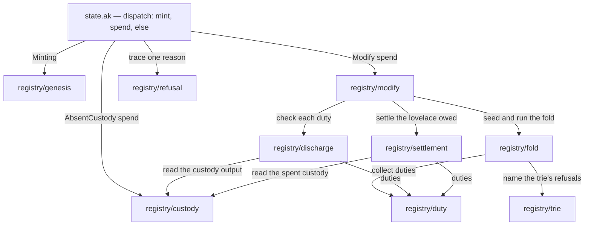
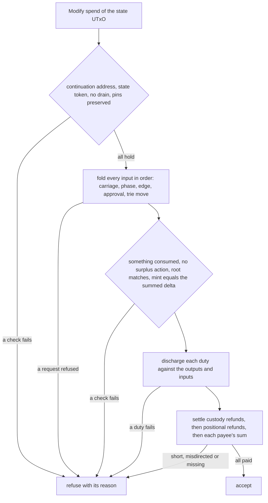
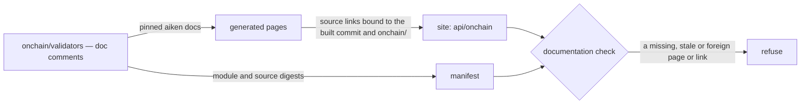

# Who owns a state validator rule

A contributor changing how the registry's state validator decides — a new
refusal in the fold, a different settlement of the lovelace a fold owes, a
tighter custody spend — wants to open one Aiken module beside the rule it
owns and have the review ask one question. Before this organization all of
it lived in one 1502-line `state.ak`, where the trie walk, the custody path
and the payee arithmetic sat side by side with nothing between them. Now the
validator's dispatch stays in `state.ak` and each rule has one owner under
`onchain/validators/registry/`. This page tells a contributor which owner a
change belongs to, which way the dependencies run, what the move was not
allowed to change, and where the evidence stops.

## The story this serves

As a registry integrator, I keep using the state validator I already
deployed; I want the same script hashes, the same acceptances, the same
refusals with the same trace reasons, and the same transaction effects after
its source is divided into owners, so nothing I pinned or built against moves.
A contributor reorganizing that source owes me an unchanged compiled script.

What that promise is checked against: every validator in the freshly built
blueprint — eleven entries — compared field by field with the blueprint of
the revision before the move (compiled code, hash, title, parameters, datum,
redeemer), and every Aiken test — three hundred sixty, three hundred forty of
which report an execution cost — compared on its status, its memory and CPU
cost, and its traces, under the same property-test seed. Both comparisons
were run after each of the four moves, and again on the final tree after
the documentation was corrected, and found no difference.

## One owner per rule

Dependencies run one way, from the dispatch down. No owner imports
`state.ak`, and `registry/refusal`, `registry/duty`, `registry/trie` and
`registry/genesis` import no other owner, so a change inside a lower owner
needs no edit above it to compile as long as the names and types it exports
stay the same. `registry/discharge`,
`registry/settlement` and `registry/custody` also import
`registry/refusal` for the reasons they share; the diagram leaves those edges
out to stay readable.

The move kept every declaration's body byte for byte: each owner imports the
names it uses unqualified, so a function reads exactly as it did in the
single file. Two Aiken test modules now read a refusal from its owner rather
than from `state` — the retirement refusals from `registry/trie` and
`registry/discharge`, the read refusals from `registry/trie` — and
`modifyRefusal`, which the suite uses to ask for the one reason a fold is
refused, stays in `state.ak`. Aiken has no re-export, so those callers were
pointed at the owners directly; every test's measured cost is unchanged. A
forwarding function in `state.ak` was not built or measured.

## How a fold is judged

`registry/modify` owns this order; the first failing check is the answer and
the spend handler traces exactly that one reason. The fold's accumulator
latches its first refusal and skips every later step, so a transaction that
breaks several rules still reports one. The order is part of the contract:
an integrator reading a trace relies on which rule is checked first, and the
Aiken tests assert the reason each of their refusal rows produces.

## What each owner holds

| Owner | Holds | Refuses |
| --- | --- | --- |
| <a href="../onchain/validators/state.ak" data-api="module">state.ak</a> | The validator: routing each purpose to its owner, identifying the state input's script and token, and `modifyRefusal` for the suite. | Every redeemer, datum or purpose no owner accepts; a missing datum or a malformed state input crashes. |
| <a href="../onchain/validators/registry/genesis.ak" data-api="module">registry/genesis</a> | Minting a registry's one state token from its seed into a state UTxO holding the empty trie's root. | A mint without the seed, with another quantity, or without that output — by crashing, with no reason. |
| <a href="../onchain/validators/registry/modify.ak" data-api="module">registry/modify</a> | The order above: continuation and pins, the fold, the batch-level checks, discharge, settlement. | `continuation-address`, `state-token`, `state-drain`, `pins-altered`, `empty-fold`, `surplus-actions`, `root`, `net-mint-mismatch` (named in `lib.ak`), and `refund` for a consumed custody that is not spent here or whose refund address decodes to nothing. |
| <a href="../onchain/validators/registry/fold.ak" data-api="module">registry/fold</a> | The per-input step: a request's carriage, a rejected row's refund, the phase, the edge tag, the approval, and the trie move with its mint delta and duties. | `tip-coverage`, `deposit-mismatch`, `missing-action`, `not-rejectable`, `not-phase1`, `edge-inadmissible`, `no-approval`, `approval-binding`, `read-root`, `key-exists` (named in `lib.ak`), and the trie's reasons. |
| <a href="../onchain/validators/registry/trie.ak" data-api="module">registry/trie</a> | Reading the leaf the trie actually binds for a retirement, a read, or a tree-changing edge on a terminal leaf, with the library's total checks. | `key-unknown`, `not-booked`, `terminal-immutable`, `read-absent`, `read-non-terminal`, `edge-from-terminal`. |
| <a href="../onchain/validators/registry/duty.ak" data-api="module">registry/duty</a> | What an admitted edge owes the transaction, and merging two deliveries of one token into one carrier. | Nothing; it only collects. |
| <a href="../onchain/validators/registry/discharge.ak" data-api="module">registry/discharge</a> | Checking each duty: a delivered token in its one named output, an absent token in the cage's custody, a burned token among the inputs. | `destination`, `absent-custody`, `burn-from-input`, `token-missing`, `deposit-returned`. |
| <a href="../onchain/validators/registry/settlement.ak" data-api="module">registry/settlement</a> | Custody refunds summed per address, rejected rows' refunds paid in order, and every obligation to one payee paid once on the summed outputs paying it. | `refund`, `deposit-returned`. |
| <a href="../onchain/validators/registry/custody.ak" data-api="module">registry/custody</a> | The absent-token custody spend, and reading a custody UTxO's key, refund address and lovelace. | `custody-spend`. |
| <a href="../onchain/validators/registry/refusal.ak" data-api="module">registry/refusal</a> | Reporting a refusal as one trace and `False`, and the reasons several owners share. | Nothing of its own. |

## Where a common change goes

| The change | The owner to edit | What else to read |
| --- | --- | --- |
| A new check on a request before it is folded | `registry/fold` | The fold's order section in its module documentation; the reason must be raised before any library call that would crash on the same fact. |
| A new edge or a different leaf move | `registry/fold` and `registry/duty` | The edge table in `lib.ak`; `registry/trie` if the edge needs a named leaf refusal. |
| Where a delivered token or its deposit must land | `registry/discharge` | `registry/duty` for how deliveries merge. |
| How lovelace owed to owners or refund addresses is paid | `registry/settlement` | Which outputs may settle is decided once, by `settlesOf`. |
| When an absent token's custody may be spent | `registry/custody` | The fold that consumes it is judged by `registry/modify` on the same transaction. |
| The order in which a fold's checks run | `registry/modify` | This page's fold diagram and the Aiken tests that pin the first reason. |
| How a registry is booted | `registry/genesis` | The deployment's script identity pins. |

Any change that moves a compiled script moves its hash; the committed script
identity manifest, the witness validator's pinned state hash and every
deployment built on the old hash move with it. That is a compatibility and
deployment decision, never a side effect of reorganizing source.

## Documentation in the Aiken source

Each owner documents itself in Aiken's own doc comments: a module
documentation with four sections — its responsibility, its dependencies in
both directions, the assumptions it makes of its callers, and the invariants
it keeps — and a description on every public declaration and on the
validator. The onchain flake check `aiken-docs` enforces their presence over
an extent it discovers at run time, `state.ak` plus every module under
`registry/`, twice: on the source, where it finds a public declaration at
any indentation the compiler accepts, and on the reference the pinned
`aiken docs` generates from it. On the generated reference it reads each
module's members off the page the compiler wrote and reconciles them with
the source inventory both ways, so a member the source reading missed still
fails if it has no description. The same check then plants each kind of gap
in a copy — a deleted module documentation, a deleted description, an
undocumented public function at the margin and indented, an undocumented
module, an empty extent — and requires each layer to refuse it for that
reason, accepts the indented function once it is documented, and shows the
reconciliation refusing a page member the source inventory lacks and a
source export the page lacks.

The check establishes presence, not truth. Whether a sentence is true of the
code is a review question; no doc comment is evidence of what the validator
does.

## The generated reference

The site publishes the reference the pinned `aiken docs` generates from
these doc comments: the
<a href="../onchain/" data-api="index">generated Aiken reference</a> for
the validators, built by the onchain flake's `aiken-reference` package
from the same revision as the rest of the site. Each owner's name in the
table above opens its generated page; each member's "view source" link
opens the lines it documents in the repository, at the commit the site
was built from.

The reference covers every module under `validators/` that declares a
public definition, the state validator and all its owners among them.
Test and property modules are not documented, and the three modules with
no public definition — the `open` approval policy, the `staking`
validator and the `cage_vectors` table — have no page; their sources
are the reference.

The documentation check refuses the published reference when it is
absent, when a page or the source it was generated from no longer
matches the digest its manifest records, when a module that declares a
public definition has no page, when a source link names another
repository, another revision or a line the source does not have, when a
page loads a script from off the site, or when this page stops linking
it. Each of those refusals is also planted in a scratch copy of the
built site on every check run, and the check must refuse each for that
reason.

## Evidence and limits

The compiled-identity and cost comparisons described in the story ran against
the revision before the move with the pinned compiler, after each of the four
moves and on the final tree, and found every validator field and every test's status, cost and
traces unchanged. The continuous-integration carriers keep that promise from
here on: the committed script-identity manifest compared with a fresh build,
the Aiken suite, the cross-language vectors, and the devnet journeys run
against a freshly built blueprint.

Limits are named rather than implied. Property tests report no execution
cost, so their evidence is their outcome, iteration count and counterexample
under the fixed seed, not a cost.
The comparison proves the move preserved behavior; it proves nothing about
whether that behavior is right, which remains the accepted Lean model's
question. The Aiken configuration that names the repository in the
reference's source links also sets the blueprint's description; correcting
it changed that description and no validator's compiled code or hash, which
the script-identity check confirms against the committed manifest. The
documentation check proves that each description exists, not that it is
accurate.
