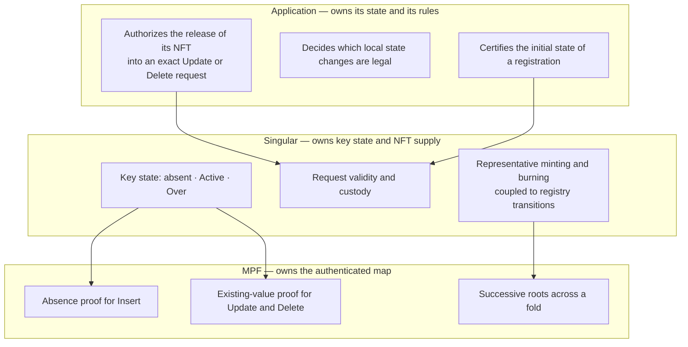
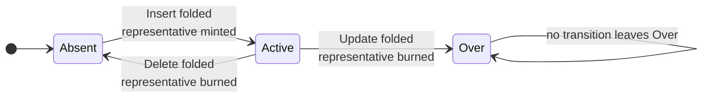

# Responsibilities and terminology

Singular maintains unique representative NFTs and the lifecycle of their registry keys. Applications maintain their own state and decide which application transitions are legal. MPF provides the authenticated registry data structure and proof mechanics.

## What each layer owns

| Layer | Responsibility |
| --- | --- |
| Singular registry | Key state, request validity and custody, coupled representative minting/burning and registry transitions |
| Application | Initial-state certification, legal local state changes, and authorization of transfer into an exact Update or Delete request |
| MPF mechanics | Authenticated map operations and proofs, including absence for Insert and existing-value checks for Update/Delete |

Singular has no native owner, privileged requester or privileged folder. Permissionless submission does not mean arbitrary requests are valid. Applications can impose their own validation conditions; they cannot authorize bypassing Singular's NFT supply or custody rules.

## Names that must stay distinct

| Term | Meaning |
| --- | --- |
| Registry identity | The particular registry a request and representative belong to |
| Registry key | The identifier indexed within that registry |
| Representative NFT | The unique token associated with an `Active` key; also called the identity NFT |
| Request token | An action token distinct from the representative; Insert/Withdraw use the configured application policy, while Update/Delete token construction remains open |
| Application certificate | An action token under the configured application policy whose asset name commits to the approved action and parameters |
| Application state | Datum and other application information carried by application UTxOs |
| Withdraw | Cancellation of a pending Insert; neither registry Delete nor a staking-reward withdrawal/plugin invocation |
| Registry Update | The sole retirement operation `Active → Over` |
| Application update | An application-defined transition that can move the existing NFT to a successor application UTxO without changing the registry |
| Fold | Apply a sequence of registry requests with the corresponding MPF proofs and native NFT effects in a transaction |

Creating a request UTxO, minting an application action token, and minting a representative NFT are different events. A transaction constructing an Update/Delete request moves the representative that already exists; it does not mint a replacement representative.

## Registry states

An absent key is available for Insert. `Active` means its representative NFT is outstanding, either in application custody or in a pending Update/Delete request. It does not mean the application is usable, unpaused or in any particular business state. `Over` permanently reserves the key with no live representative.

Both stored values are payload-free. Application history or checkpoints needed for later application behavior must remain authenticated outside these values. No mapping of KERI close, pause or conviction to Singular operations is selected here.

Continue with [the lifecycle](lifecycle.md) and [certification](certification.md).
