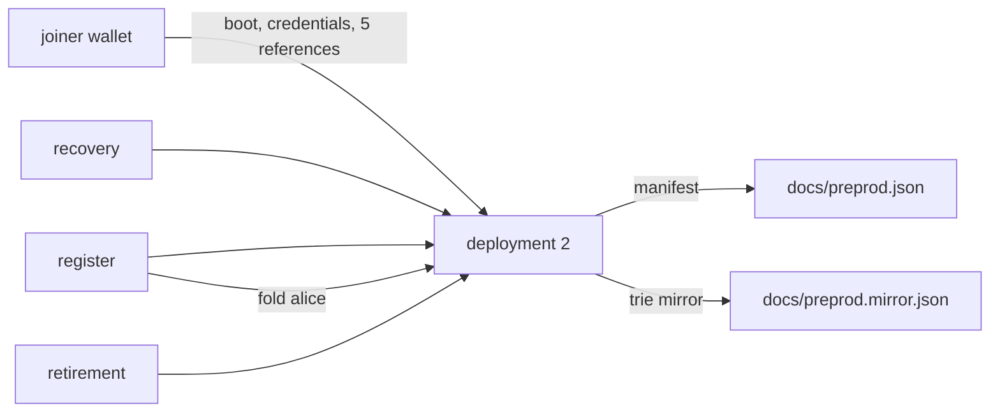

# The preprod record

As a reviewer who will never hold this repository's keys, I want one page
that names exactly what is deployed on the public preprod network, what a
verifier observes about it, and which transactions the acceptance journeys
submitted — so I can check every claim against the chain myself, and so
the deployment's limits are stated where the values are.

Everything on this page is read back from the live node or copied from the
files it produced. The manifest this page records is
[docs/preprod.json](preprod.json); the proof mirror that travels with it is
[docs/preprod.mirror.json](preprod.mirror.json).



## What is deployed

One registry on the **preprod** network (network magic `1`), booted from
the joiner wallet by `deployment deploy --process-time 600000
--retract-time 300000` — ten-minute processing and five-minute retract
windows, sized for a network that makes a block about every twenty
seconds. The registry token is
`0xbb41081f54d9c2cad883dbefe690affb0db49cff800e7574822fd1f57d76e778`,
booted in transaction
`6222eea4cbfc7b7a4882d13caba5d12a1963c32b08a2220b81526882ab1f1920`.

Applied script hashes, as compiled from release
`main-c27c3dd8ba5aac84732067deb996abd633c88202` and pinned by the
manifest:

| role | hash |
|---|---|
| state validator | `0x8ac9562f5fb6be9b9b913ae2ad2cc1d9e038f7f7039256f1ac9f7a62` |
| request validator | `0x67f907d5323b46eae9a6ee799bb0539ac482c869f957d046ff0cd7e6` |
| application validator | `0x89409890d5a89debf410d6d31695fc9030fcf2b754b06206d7291370` |
| representative policy (applied) | `0x64adbd9cd944738680f670cbd0456294951b20ac12eb1f3ebeb0dc88` |
| consumer pin | `0xbbe166ffb706d3f7e05b941ddc7615de39575af2ab2b3cca2a25bc70` |

Five reference scripts are published by the deployment and consumed by
reference in every journey transaction:

| role | output reference |
|---|---|
| state | `d4deba068fcbbf62f63f9032650e8f5f8c70ea09b461d239531baf767a2c039d#0` |
| request | `1e0b52844259025ea304daf3f0c784088ca67650acf42297cef78814be285a14#0` |
| application | `a3983772a65b3455166ec24442a99563cca081a2164b11d24ce555bdd6481a70#0` |
| representative | `d604ab0b1d2daa0fabd403fb5e7b83307664dc952f36bc7c5273c3d230a6aa35#0` |
| custody | `1fed8a48deafe88743c9cee64eb5e6b7ad6422a5b3a02dd132c1b6885a86377e#0` |

The boot sequence paid seven transactions in order — the token boot above,
then `97361e8c60a37465fc824c05742d4033e93e334b87b87b8eff49de40163ef6ae`,
`d4deba068fcbbf62f63f9032650e8f5f8c70ea09b461d239531baf767a2c039d`,
`1e0b52844259025ea304daf3f0c784088ca67650acf42297cef78814be285a14`,
`a3983772a65b3455166ec24442a99563cca081a2164b11d24ce555bdd6481a70`,
`d604ab0b1d2daa0fabd403fb5e7b83307664dc952f36bc7c5273c3d230a6aa35` and
`1fed8a48deafe88743c9cee64eb5e6b7ad6422a5b3a02dd132c1b6885a86377e`
(credential registrations and reference publications).

## What the verifier checks

`deployment verify` reconnects to the node and checks the manifest claim
by claim. On 2026-09-15 it printed, verbatim:

```
deployment verified: release main-c27c3dd8ba5aac84732067deb996abd633c88202 compiles the state validator to the recorded 0x8ac9562f5fb6be9b9b913ae2ad2cc1d9e038f7f7039256f1ac9f7a62
deployment verified: seed 2d7c011c7850386cc89be7923c2b91c9e1c368f747b381c218bca488b7a33a39#2 determines the recorded registry token 0xbb41081f54d9c2cad883dbefe690affb0db49cff800e7574822fd1f57d76e778
deployment verified: compiled representative policy agrees with the manifest and live registry configuration: 0x64adbd9cd944738680f670cbd0456294951b20ac12eb1f3ebeb0dc88
deployment verified: registry state carries the recorded request windows: process 600000 ms, retract 300000 ms
deployment verified: reference script state live at d4deba068fcbbf62f63f9032650e8f5f8c70ea09b461d239531baf767a2c039d#0 carrying 0x8ac9562f5fb6be9b9b913ae2ad2cc1d9e038f7f7039256f1ac9f7a62
deployment verified: reference script request live at 1e0b52844259025ea304daf3f0c784088ca67650acf42297cef78814be285a14#0 carrying 0x67f907d5323b46eae9a6ee799bb0539ac482c869f957d046ff0cd7e6
deployment verified: reference script application live at a3983772a65b3455166ec24442a99563cca081a2164b11d24ce555bdd6481a70#0 carrying 0x89409890d5a89debf410d6d31695fc9030fcf2b754b06206d7291370
deployment verified: reference script representative live at d604ab0b1d2daa0fabd403fb5e7b83307664dc952f36bc7c5273c3d230a6aa35#0 carrying 0x64adbd9cd944738680f670cbd0456294951b20ac12eb1f3ebeb0dc88
deployment verified: reference script custody live at 1fed8a48deafe88743c9cee64eb5e6b7ad6422a5b3a02dd132c1b6885a86377e#0 carrying 0x89ee4bffc93cb72213f8361b73348c4ec4581cc095cb10faabd4fc09
deployment verified: registry state output 6222eea4cbfc7b7a4882d13caba5d12a1963c32b08a2220b81526882ab1f1920#0 carries the recorded token
deployment verified: consumer stake credential is registered on this node
deployment verified: representative stake credential is registered on this node
deployment verified: custody stake credential is registered on this node
deployment verified: staking stake credential is registered on this node
deployment complete: 14 claim(s) hold against this node
```

The window claim is the one that matters for the story below: the
registry's `process_time` is 600000 ms and its `retract_time` 300000 ms,
and the verifier reads both back from the live state datum rather than
trusting the manifest.

## The three journeys

Every acceptance journey attached to this manifest and completed on
chain, in this order, with the journeys' own transaction identifiers:

**register** — claim `alice`, fold it to Active:
`2ec051f001ccce7dc0204e1c92cb3a1633406c5ba77febdd6bdba9f221784f7f`
(funding), `cf20e5bce5a994d92a1a3c66362117fe01653a56088381a3bf0bb4fc6869503a`
(insert request), `5b62a47fe8afab1e3b5e5c42f9e54f44fa5fadde304574c96c3424fad1713a4d`
(registry request), `03933597c0fd71f289af95320a0215e2594e12fc56223c1fde386749d39b8ecf`
(fold; alice Active, representative minted +1).

**recovery** — rotate control through the committed successor and
maintain under it: `b7c7e4cd9b0462013e436988bc97920a939876d73cf4023d9af5cb68a68d1809`
(funding), `f2864130aa7c42eaf777fc22ff112072df8775fa14862afcc1f8698d829ba250`
(setup claim), `c978a48652debfcf6de08739ba4beafae0bd979fa654d4f234e7cba3d67e459c`,
`d0f6723f0fb85dc7770c79c5a64008d5699d876adcbf57a09be1aab944f10ab5`,
`dde669805686ffd9d2d3c832f0320730edcff13b7ca77508bd372789a009cb0d` (setup
and recovery rows), `99afbefffb45499e07061b481a25486dad9373ad745e3ad9cb7fb52af982d909`
(maintenance under the recovered controller).

**retirement** — retire the recovered name into custody and complete it
to Over: `3034441fe32a07924c2b009317d1380d58663e2ce294423b8f97397843860976`
(funding), `a1f349ee77852ad5692edec1ee3cea93e9088bf90a61b63559329bf6c7b35a07`,
`f2a9b8a5321b7dc2e47106ca2479144678cef36c8f2f39e9c9d945f390e1ffc8`,
`33279a6d1268819b20991e251de2733c64db7aa9664ae38aea4ef9558a3400ad`,
`f843738ab5c6795f0d4a59eea429eef2deee0b71900b46432db7ba99d2b66289`,
`f6deaaae1d0e2d6debff7adf21a54547b3ecf059b04a4582630cca1ac1504af7`,
`801a215bd2f86d8a87d73f3819ea848f3666739a57b13d3af9bf30c5164b72c7`,
`c8c5be03023b828cffd1dc623b345c3ef061f73b0d7ddb1b8b4d924d2a1c57a3`
(completion: representative burned, `rt-over` recorded as Over).

## Finding alice

Given the registry's representative policy id
`64adbd9cd944738680f670cbd0456294951b20ac12eb1f3ebeb0dc88`, alice's NFT
is that policy plus `blake2b_256("alice")`:

```sh
printf %s alice | b2sum -l 256
# e11d814979372c883b50bdb0ffadb1eaf0898bf54fd4fbf298af126fbabbda4c
```

Find the live UTxO on preprod with the [Koios Asset
UTxOs](https://api.koios.rest/#post-/asset_utxos) query from the [naming
walkthrough](naming-demo.md#finding-alice):

```sh
policy_id='64adbd9cd944738680f670cbd0456294951b20ac12eb1f3ebeb0dc88'
asset_name=$(printf %s alice | b2sum -l 256 | cut -d ' ' -f1)
jq -n --arg p "$policy_id" --arg n "$asset_name" \
  '{_asset_list:[[$p,$n]],_extended:true}' |
  curl --fail-with-body -sS https://preprod.koios.rest/api/v1/asset_utxos \
    -H 'Content-Type: application/json' --data-binary @-
```

## Reproduce it yourself

From the release archive (or this repository), with your own node socket
and wallet as [the onboarding page](consumer-onboarding.md) describes,
you can point the two tools that produced this record at the deployment:

```sh
nix run .#deployment -- verify \
  --node-socket /run/cardano-node/node.socket --network-magic 1 \
  --wallet-skey ./joiner.skey \
  --deployment docs/preprod.json

nix run .#register-rows -- \
  --node-socket /run/cardano-node/node.socket --network-magic 1 \
  --wallet-skey ./joiner.skey \
  --deployment docs/preprod.json --spelling <your-name>
```

Two availability facts to read this reproduction with. The `deployment`
tool builds from the current source, but no required workflow exercises
it on every candidate — the verifier output above is a historical run of
2026-09-15 against release `main-c27c3dd8…`, and the manifest's own
claims are what you would re-check. The attached claim command names
`register-rows`, a retained legacy command that is not currently
buildable or verified against the released source, with its repair owned
by [#283](https://github.com/lambdasistemi/singular/issues/283); until
that repair lands the attached claim is this record's history, not a
runnable instruction.

`verify` re-runs the fourteen checks above against whatever node you
point it at. The attached run folds your own spelling instead of alice —
alice is already Active here, and an attached rerun that asks for a held
spelling is refused by design, naming the refusal. The mirror file
travels with the manifest: a fold needs the trie it records, and a run
whose mirror root disagrees with the chain stops and says so.

## The first deployment and its stranded name

This is the second deployment on preprod. The first (registry
`0xe82f5e34833d7a74ad0359788dfa31d7879d851d2af6c5d4f0f88518f11433b9`,
120-second process window, [manifest and mirror kept as
history](preprod-history/preprod-1.json)) stranded a name: its retirement
fixture `rt-over` reached custody, but the completion fold was built
after the 120-second request window had closed, and the validator
rejects an aged request instead of folding it — so `rt-over` sits at
custody with no way to complete. That reproduction is recorded as
[issue #130](https://github.com/lambdasistemi/singular/issues/130) and is
the evidence behind the deployment window parameters this deployment
boots with; the first registry is untouched and its remaining funds stay
where they are.

## What this record does not cover

The record is a photograph of one deployment, not a promise about the
next one: future deployments boot new registries with new tokens and
policies, and this page names only what exists today. Refusal behaviour,
the naming walkthrough and the operator onboarding stay on their own
pages; the raw run logs behind the transaction lists above live in the
milestone acceptance evidence, not in this repository.
