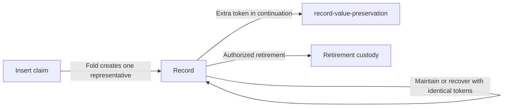

# Keep recovery and retirement available

## For a name's controller

An unrelated token in wallet change must not disable recovery or retirement.
Naming records created by an insert fold now contain exactly ADA and their
representative. Maintain and recover require identical non-ADA policies, asset
names and quantities in the continuation. ADA can increase, but cannot decrease.

## When a value is refused

`record-value-preservation` means a maintain or recover continuation changed its
non-ADA value, or reduced its ADA. Keep wallet change in a separate output.
`record-single-asset` means recovery or retirement encountered an input with
zero or multiple non-ADA assets, or an insert fold tried to create a record
without exactly its representative. These names are retained in compiled
validator traces. The recovery and retirement runners also inspect all asset
policies when reading a record, so they cannot hide an unrelated token.

An already polluted record can still be maintained if its entire non-ADA value
is preserved. It cannot be repaired, recovered or retired by this change.
An arbitrary transfer to the script address is not a genuine naming registration.

## Deployment compatibility

The application validator hash changes from
`89409890d5a89debf410d6d31695fc9030fcf2b754b06206d7291370` to
`1239f396899f80b7ec377fe181e2014b7bc54da0a4c4ab0d9df3fdc5`.
Its spend and mint purposes share that identity. The committed
`naming-onchain/script-identity.json` is regenerated from the pinned Aiken build,
which retains user-defined traces. Other unapplied validator hashes stay the same.

The next deployment must derive its addresses and applied policies from the new
blueprint. The representative policy's application-hash parameter changes with
that deployment. This repair does not migrate records at an old script address,
change an existing deployment manifest, or deploy to preprod.

## Checks and model boundary

Run `just record-value-test` from `offchain/` to execute the production blueprint
against an accepted maintain and named extra-asset refusals. The contexts are
component fixtures, not submitted ledger transactions or a connected lifecycle.
The same check runs in the naming validator CI job. The Aiken suite has the three
issue reproductions and controls for added, removed, replaced and increased
assets, ADA top-up, and insert-fold pollution.

Run `nix flake check` from `naming-onchain/` for the Aiken suite and compiled
identity checks. Root `nix develop --quiet -c just ci` covers the model,
simulator, browser and documentation; it does not execute the offchain suites.

Lean is unchanged at repository revision
`41861a66b72a840042f2e633ce33a607e817d6c6`. Its `Singular.Output` models one
representative plus scalar value. The implementation checks discharge that
representation boundary for genuine insert-fold records and their continuations;
the mapping is recorded in `offchain/naming-correspondence.md`.
