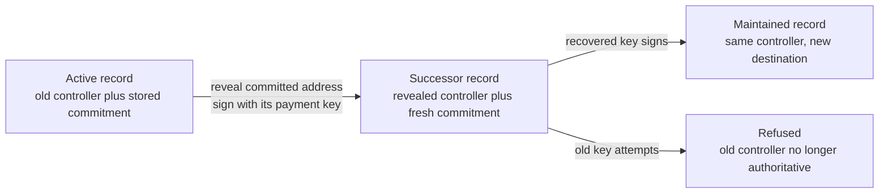
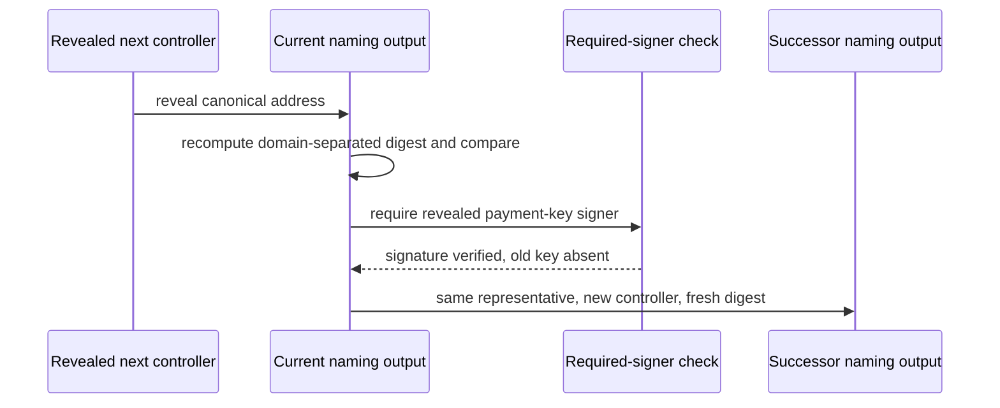
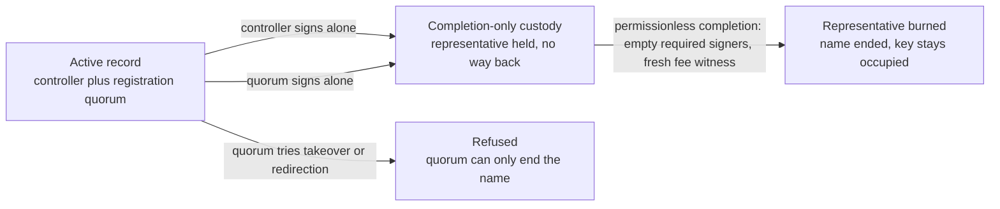

# Recover control and retire names on a real ledger

## Who this is for

A holder of an active name who has lost the everyday control key and planned ahead by committing to a next controller in advance. This page shows how that holder spends the record with the address committed to earlier, signs with that address's payment key alone, and sees the chain hand over control — then maintains the name normally under the new key while the old key stops working.

It is also for a holder who wants to end a name permanently, and for the quorum fixed at registration that can end it without the holder. Either route moves the representative into completion-only custody — a script with no withdrawal path — and neither route can be turned into a takeover or a payment redirection.

## What you can do

Run the eleven recovery rows against a real devnet node from `offchain/`:

```sh
cd offchain
blueprint="$(nix build --quiet --no-link --print-out-paths ../naming-onchain#plutus-blueprint)"
TMPDIR=/tmp/s62-devnet NAMING_BLUEPRINT="$blueprint" nix run --quiet .#recovery-rows
```

The private shallow `TMPDIR` keeps the devnet node database away from other work on the same host and keeps its socket inside the address length limit. The blueprint comes from the checked-out commit at run time; no store path is baked in and no dev shell is used.

Two failure controls ship with the same runner. Making a refused row actually valid must fail the run, and matching refusals against an impossible marker must fail naming what came back:

```sh
TMPDIR=/tmp/s62-devnet NAMING_BLUEPRINT="$blueprint" RECOVERY_CONTROL=valid nix run --quiet .#recovery-rows
TMPDIR=/tmp/s62-devnet NAMING_BLUEPRINT="$blueprint" RECOVERY_CONTROL=wrong-reason nix run --quiet .#recovery-rows
```

Both exit non-zero by design, after executing rows.



## What the run observes

The run creates three records at the application validator, each carrying the single representative token, then executes each row against the outcome its contract specifies. Every refusal is asserted as a phase-two script failure naming the application validator. One line per row begins with the full row name.

The accepted row installs the reveal with a fresh commitment and proves the handover from the chain: the successor is read back and its representative tokens, registry binding, payment destination and quorum are compared field by field against the pre-recovery values, its control address is compared against the reveal, and its commitment is shown fresh and different. Its required signers are exactly the revealed payment key.

The refusals are single-defect mutants of the accepted row. A different reveal signed by its own key, a replay of the consumed reveal against the genuine successor, and a stored digest computed without the domain separation are refused on the commitment. A correct reveal with no signer, and the same reveal signed by the old controller, are refused on the required signer. A successor that re-installs the consumed commitment is refused on the fresh commitment. A claim naming a different representative, a claim naming a different registry binding, and a successor altering the quorum are refused on the representative, the registry, and field preservation. Successors that change the payment destination or install a controller other than the reveal are refused on field preservation as further sub-cases of the same row. After a real accepted row, the old controller's ordinary maintenance is refused on the controller signature, and maintenance under the recovered controller succeeds, proving the name remains usable. After the refusals the records are read back unchanged.



The commitment is `BLAKE2b-256("singular/naming/next-control/v1" || 0x00 || canonical-address-bytes)` over the whole binary address including header and network. Only canonical base and enterprise addresses with payment-key credentials are supported.

## How retirement ends a name

Run the retirement rows against a real devnet node from `offchain/`:

```sh
cd offchain
blueprint="$(nix build --quiet --no-link --print-out-paths ../naming-onchain#plutus-blueprint)"
TMPDIR=/tmp/s66-devnet NAMING_BLUEPRINT="$blueprint" nix run --quiet .#retirement-rows
```

The private shallow `TMPDIR` keeps the devnet node database away from other work on the same host and keeps its socket inside the address length limit. The blueprint comes from the checked-out commit at run time; no store path is baked in and no dev shell is used.

Two failure controls ship with the same runner. Making a refused row actually valid must fail the run, and matching refusals against an impossible marker must fail naming what came back:

```sh
TMPDIR=/tmp/s66-devnet NAMING_BLUEPRINT="$blueprint" RETIREMENT_CONTROL=valid nix run --quiet .#retirement-rows
TMPDIR=/tmp/s66-devnet NAMING_BLUEPRINT="$blueprint" RETIREMENT_CONTROL=wrong-reason nix run --quiet .#retirement-rows
```

Both exit non-zero by design, after executing rows.



## What the retirement run observes

The run creates seven records at the application validator (two accepts, refusals, duplicates, two recovery subjects and the over record), each carrying the single representative token minted under the applied representative policy with a quorum of two distinct members at threshold two, then executes each row against the outcome its contract specifies. Every refusal is asserted as a phase-two script failure naming the application validator, except the replay, where the ledger itself refuses the consumed output. One line per row begins with the full row name.

The accepted rows prove custody from the chain: after each controller-alone, quorum-alone and recovery-then-retire retirement, the representative is observed at the custody script address in the accepting transaction's own outputs, and the consumed record is observed gone from the application validator. The over record additionally recovers (rotation preserving the representative), retires through its recovered controller with the creation hash, and completes permissionlessly: the pending registry update folds with the custody spend and the exact burn, empty required signers, one fresh fee witness outside every route. Every refusal is asserted on its reason — phase-two script failures naming the refusing script, phase-one ledger refusals for consumed outputs, builder-evaluation failures naming the refusing script at its purpose — and a budget exhaustion is never accepted as a semantic refusal. The controller-alone row carries no quorum signature and the quorum-alone row carries no controller signature, so each route is shown sufficient alone. The quorum-short row carries one distinct signature too few and is otherwise exactly the accepted shape. A sibling row stores a quorum that names one member twice and a second once at threshold two — well-formed by the existing rules — with only the duplicated member signing: counting signatures instead of distinct members would accept it, so the row binds the distinctness the model demands.

The bounded-quorum rows are ordinary maintenance carrying both quorum signatures and no controller signature: changing the control fields and changing the payment destination are both refused on the controller signature by the existing path, without any new check. The wrong-custody row is authorized by the controller but sends the representative anywhere but the custody script, and is refused on the retirement request. The replay replays a real accepted retirement against the record the chain no longer has, and the ledger itself refuses the spent output — recorded as exactly that, not dressed up as a validator refusal. After the refusals the surviving record is read back unchanged.

## Limits and next steps

The representative is a real NFT minted under the applied representative policy at fold time and burned exactly once at completion; the registry binding on ledger is the state policy and token read from the spent state. Retirement custody is created and filled by authorized retires and spent only by permissionless completion (exact burn plus genuine registry transition) — withdrawal without burn, burn without transition, mismatched request pairings and re-registration after Over all refuse, each attributed to its reason. No quorum rotation, no takeover, and no death oracle: the chain verifies authority, not death.
