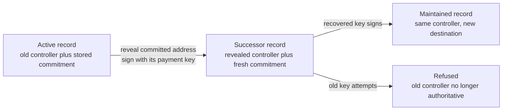
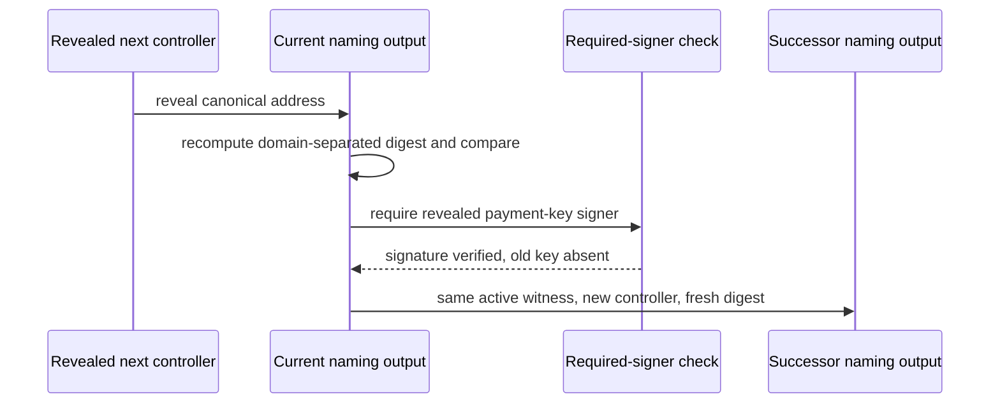
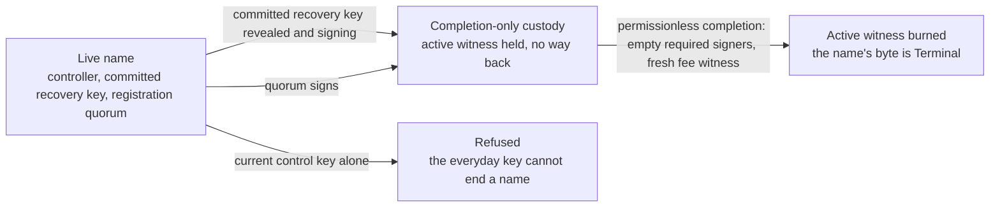

# Recover control and retire names on a real ledger

## Who this is for

A holder of an active name who has lost the everyday control key and planned ahead by committing to a next controller in advance. This page shows how that holder spends the record with the address committed to earlier, signs with that address's payment key alone, and sees the chain hand over control — then maintains the name normally under the new key while the old key stops working.

It is also for a holder who wants to end a name permanently, and for the quorum fixed at registration that can end it without the holder. Ending a name needs the committed recovery key or that quorum — the everyday control key alone cannot do it. Either route moves the active witness into completion-only custody, a script with no withdrawal path, and neither route can be turned into a takeover or a payment redirection.

## How a name moves in the registry

Naming is an instance of the registry, not a layer bolted beside it. A name is
one key in the registry's authenticated map, and the value of that key is a
single byte:

| state | byte | what it says |
| --- | --- | --- |
| Absent | `0x00` | somebody has witnessed that this name is free, and put up a deposit to say so |
| Active | `0x01` | the name is booked and live |
| Terminal | `0x02` | the name is over, forever |

Seven requests move a key, and nothing else does. Each one moves a witness
token, and the witness is what a reader looks at — never the root:

| request | before | after | witness moved |
| --- | --- | --- | --- |
| insert absent | no key | Absent | one absent witness minted into the cage's own custody |
| insert active | no key | Active | one active witness minted to the booker |
| update absent to active | Absent | Active | the absent witness burned, an active witness minted |
| update active to terminal | Active | Terminal | the active witness burned |
| delete absent | Absent | no key | the absent witness burned, the deposit returned |
| delete active | Active | no key | the active witness burned |
| read terminal | Terminal | Terminal | one terminal witness minted, the key untouched |

Every other shape is refused before any proof is checked, and each refusal
carries one trace label naming its own reason.

The witnesses obey four laws:

1. **A witness moves only inside a fold.** A mint or a burn under the absent,
   active or terminal policy is accepted only in a transaction that spends the
   registry's state token and folds it.
2. **The fold decides how many, and where.** It sums the witness column of the
   requests it consumed, and the transaction's mint under the three policies
   must equal that sum exactly — asset by asset, quantity by quantity. Nothing
   else may move under them.
3. **A terminal witness is its holder's to destroy.** It says a name is over,
   forever; burning your own copy costs the registry nothing, so that burn
   alone needs no fold.
4. **The asset name is the registry key.** Identity is the pair of policy and
   key, so a name recreated after a delete carries the same identity again.

One edge carries a rule of its own: ending a name needs the committed recovery key or the retirement quorum, and never the current control key alone.

**No application script at fold time.** The naming validator is not
executed by a fold at all. What it does instead is certify an edge in advance:
it mints one approval whose asset name binds the edge, the key, the owner and
the destination, the requester attaches that approval to their request, and the
cage recomputes the name from the request itself and refuses anything that does
not match. A folder is permissionless and can therefore be anyone, which is
exactly why the destination is bound: without it a folder could route your name
to itself.

## What you can do

Run the eleven recovery rows against a real devnet node from `offchain/`:

```sh
cd offchain
blueprint="$(nix build --quiet --no-link --print-out-paths ../naming-onchain#plutus-blueprint)"
TMPDIR=/tmp/s62-devnet NAMING_BLUEPRINT="$blueprint" nix run --quiet .#recovery-rows
```

The private shallow `TMPDIR` keeps the devnet node database away from other work on the same host and keeps its socket inside the address length limit. The blueprint comes from the checked-out commit at run time; no store path is baked in and no dev shell is used.

Two failure controls ship with the same runner. Making a refused row actually valid must fail the run, and matching refusals against an impossible marker must fail naming what came back:

```sh
TMPDIR=/tmp/s62-devnet NAMING_BLUEPRINT="$blueprint" RECOVERY_CONTROL=valid nix run --quiet .#recovery-rows
TMPDIR=/tmp/s62-devnet NAMING_BLUEPRINT="$blueprint" RECOVERY_CONTROL=wrong-reason nix run --quiet .#recovery-rows
```

Both exit non-zero by design, after executing rows.



## What the run observes

The run creates three records at the application validator, each carrying the single active witness, then executes each row against the outcome its contract specifies. Every refusal is asserted as a phase-two script failure naming the application validator. One line per row begins with the full row name.

The accepted row installs the reveal with a fresh commitment and proves the handover from the chain: the successor is read back and its active witnesses, registry binding, payment destination and quorum are compared field by field against the pre-recovery values, its control address is compared against the reveal, and its commitment is shown fresh and different. Its required signers are exactly the revealed payment key.

The refusals are single-defect mutants of the accepted row. A different reveal signed by its own key, a replay of the consumed reveal against the genuine successor, and a stored digest computed without the domain separation are refused on the commitment. A correct reveal with no signer, and the same reveal signed by the old controller, are refused on the required signer. A successor that re-installs the consumed commitment is refused on the fresh commitment. A record carrying anything but its single active witness, a claim naming a different registry binding, and a successor altering the quorum are refused on the record’s shape, the registry, and field preservation. Successors that change the payment destination or install a controller other than the reveal are refused on field preservation as further sub-cases of the same row. After a real accepted row, the old controller's ordinary maintenance is refused on the controller signature, and maintenance under the recovered controller succeeds, proving the name remains usable. After the refusals the records are read back unchanged.



The commitment is `BLAKE2b-256("singular/naming/next-control/v1" || 0x00 || canonical-address-bytes)` over the whole binary address including header and network. Only canonical base and enterprise addresses with payment-key credentials are supported.

## How retirement ends a name

Ending a name needs the committed recovery key or the retirement quorum — never
the current control key alone. A thief holding the everyday control key and the
holder themselves are indistinguishable to the chain, so if the current key
could end a name, the thief could end it and recovery would arrive too late.
The recovery route is the same proof recovery itself uses: reveal the preimage
of the stored commitment, and sign with that address's payment key.

Run the ending rows against a real devnet node from `offchain/`:

```sh
cd offchain
blueprint="$(nix build --quiet --no-link --print-out-paths ../naming-onchain#plutus-blueprint)"
TMPDIR=/tmp/s66-devnet NAMING_BLUEPRINT="$blueprint" nix run --quiet .#retirement-rows
```

The private shallow `TMPDIR` keeps the devnet node database away from other work on the same host and keeps its socket inside the address length limit. The blueprint comes from the checked-out commit at run time; no store path is baked in and no dev shell is used.

Two failure controls ship with the same runner. Making a refused row actually valid must fail the run, and matching refusals against an impossible marker must fail naming what came back:

```sh
TMPDIR=/tmp/s66-devnet NAMING_BLUEPRINT="$blueprint" RETIREMENT_CONTROL=valid nix run --quiet .#retirement-rows
TMPDIR=/tmp/s66-devnet NAMING_BLUEPRINT="$blueprint" RETIREMENT_CONTROL=wrong-reason nix run --quiet .#retirement-rows
```

Both exit non-zero by design, after executing rows.



## What the quorum cannot fix

Two weaknesses of the quorum are deliberate in this version, and stated here so
that anybody choosing one knows what they are choosing.

**The quorum is fixed for the life of the name.** No action rewrites it after
booking. A member who loses their key, disappears, or turns hostile is a
permanent member. The only route to a different quorum is to end the name and
book it again — which means the name itself does not survive the change.

**The quorum can end the name while the controller is present.** Nothing checks
that the holder is gone, unreachable or in trouble. A threshold of members can
end a live name at any moment, and the holder's own key cannot stop them. The
quorum is an ending authority, not a death oracle and not an inheritance
mechanism: choose its members as people you would accept that from.

Both are known, both are visible, and neither is a defect to be reported — they
are the shape of the version you are running.

## What the retirement run observes

The run creates records at the application validator, each carrying the single
active witness under the registry's pinned active policy with a quorum of two
distinct members at threshold two, then executes each row against the outcome
its contract specifies. Every refusal is asserted as a phase-two script failure
naming the application validator, except the replay, where the ledger itself
refuses the consumed output. One line per row begins with the full row name.

The accepted rows prove custody from the chain: after a recovery-key ending and
after a quorum ending, the active witness is observed at the custody script
address in the accepting transaction's own outputs, and the consumed record is
observed gone from the application validator. Completion is permissionless: the
pending registry update folds with the custody spend and the exact burn, empty
required signers, one fresh fee witness outside every route.

The refusals are single-defect mutants of those accepts. **A row authorized by
the current control key alone is refused** — the row that used to accept, and
the one this version deliberately retires. A row one distinct signature short of
the threshold is refused, and is otherwise exactly the accepted shape. A sibling
row stores a quorum that names one member twice and a second once at threshold
two — well-formed by the existing rules — with only the duplicated member
signing: counting signatures instead of distinct members would accept it, so the
row binds the distinctness the model demands. A reveal that is not the preimage
of the stored commitment is refused on the same authorization.

Ordinary maintenance carrying both quorum signatures and no controller signature
is refused on the controller signature by the existing path, without any new
check: the quorum can end a name and cannot steer it. A row authorized properly
but sending the active witness anywhere but the custody script is refused on the
ending request. The replay replays a real accepted ending against the record the
chain no longer has, and the ledger itself refuses the spent output — recorded
as exactly that, not dressed up as a validator refusal. After the refusals the
surviving record is read back unchanged.

## Limits and next steps

The active witness is a real token minted under the registry’s pinned active policy by the fold, and burned exactly once at completion; the registry binding on ledger is the state policy and token read from the spent state. Retirement custody is created and filled by authorized retires and spent only by permissionless completion (exact burn plus genuine registry transition) — withdrawal without burn, burn without transition, mismatched request pairings and re-registration after the name is Terminal all refuse, each attributed to its reason. No quorum rotation, no takeover, and no death oracle: the chain verifies authority, not death.
