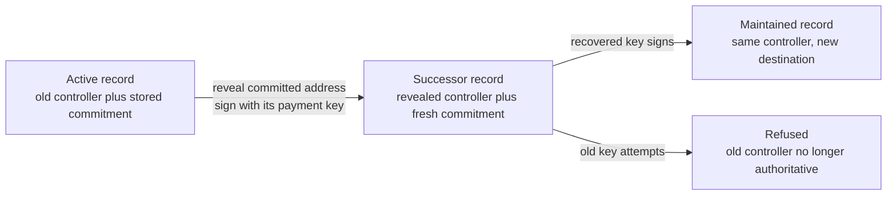
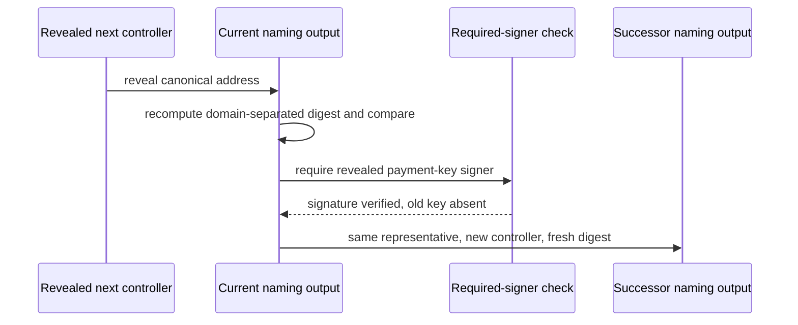

# Recover control on a real ledger

## Who this is for

A holder of an active name who has lost the everyday control key and planned ahead by committing to a next controller in advance. This page shows how that holder spends the record with the address committed to earlier, signs with that address's payment key alone, and sees the chain hand over control — then maintains the name normally under the new key while the old key stops working.

## What you can do

Run the eleven recovery rows against a real devnet node from `offchain/`:

```sh
cd offchain
blueprint="$(nix build --quiet --no-link --print-out-paths ../naming-onchain#plutus-blueprint)"
TMPDIR=/tmp/s62-devnet NAMING_BLUEPRINT="$blueprint" nix run --quiet .#recovery-rows
```

The private shallow `TMPDIR` keeps the devnet node database away from other work on the same host and keeps its socket inside the address length limit. The blueprint comes from the checked-out commit at run time; no store path is baked in and no dev shell is used.

Two failure controls ship with the same runner. Making a refused row actually valid must fail the run, and matching refusals against an impossible marker must fail naming what came back:

```sh
TMPDIR=/tmp/s62-devnet NAMING_BLUEPRINT="$blueprint" RECOVERY_CONTROL=valid nix run --quiet .#recovery-rows
TMPDIR=/tmp/s62-devnet NAMING_BLUEPRINT="$blueprint" RECOVERY_CONTROL=wrong-reason nix run --quiet .#recovery-rows
```

Both exit non-zero by design, after executing rows.



## What the run observes

The run creates three records at the application validator, each carrying the single representative token, then executes each row against the outcome its contract specifies. Every refusal is asserted as a phase-two script failure naming the application validator. One line per row begins with the full row name.

The accepted row installs the reveal with a fresh commitment and proves the handover from the chain: the successor is read back and its representative tokens, registry binding, payment destination and quorum are compared field by field against the pre-recovery values, its control address is compared against the reveal, and its commitment is shown fresh and different. Its required signers are exactly the revealed payment key.

The refusals are single-defect mutants of the accepted row. A different reveal signed by its own key, a replay of the consumed reveal against the genuine successor, and a stored digest computed without the domain separation are refused on the commitment. A correct reveal with no signer, and the same reveal signed by the old controller, are refused on the required signer. A successor that re-installs the consumed commitment is refused on the fresh commitment. A claim naming a different representative, a claim naming a different registry binding, and a successor altering the quorum are refused on the representative, the registry, and field preservation. Successors that change the payment destination or install a controller other than the reveal are refused on field preservation as further sub-cases of the same row. After a real accepted row, the old controller's ordinary maintenance is refused on the controller signature, and maintenance under the recovered controller succeeds, proving the name remains usable. After the refusals the records are read back unchanged.



The commitment is `BLAKE2b-256("singular/naming/next-control/v1" || 0x00 || canonical-address-bytes)` over the whole binary address including header and network. Only canonical base and enterprise addresses with payment-key credentials are supported. Retirement has no ledger rows in this slice; it arrives as a later step and is not runnable here.

## Limits and next steps

The representative for this slice is carried under the application policy as a stand-in that preserves the single-token shape; the full representative mint and burn flow stays as authored elsewhere and is not exercised here. The registry binding on ledger is the application validator hash read from the spent input. Retirement, including quorum initiation and the permissionless completion fold, is out of scope for this runner and will extend the same executable in a later step.
