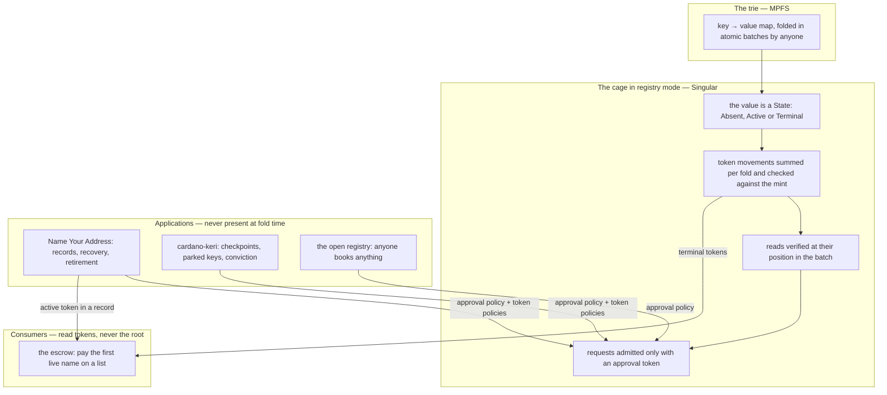
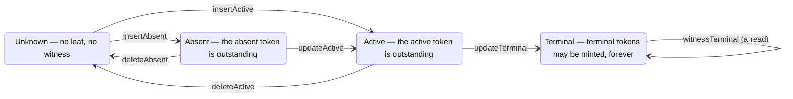

# The registry interface

This page is the design the registry is being brought to. It is the contract every
layer of Singular is written against, and it describes the target, not the tree as
it stands today; the last section says exactly what exists now and which changes
close the gap. The canonical text lives in a gist that this page mirrors:
<https://gist.github.com/paolino/2fb03c2e6182fb861bb1361b3977fdc2>.

## Who this is for

Bob wants to lock funds for Alice so that only Alice can ever take them, at whatever
address she is using the day she takes them — even after she has lost her key — and
so that, once her name has ended for good, the funds pass to the next name on a list
instead of being stranded. To do that, a contract has to know three things about a
name without ever reading the registry's map root: that the name is booked, by whom
it is currently controlled, and whether it has ended. This page is for the people
who build the registry that answers those questions with tokens rather than with
proofs — the implementers of the Lean model and of the cage — and for the authors
of applications on top of it, who need to know exactly how little they must supply
and how much they are guaranteed.

## What the registry is

A Merkle Patricia Forestry map is a key → value map. Singular takes the value slot
away from applications and fills it with a fixed lifecycle vocabulary. That is what
turns a map into a registry: the trie answers exactly two questions — is this key
unique, and where in its life is it — and nothing else can be asked of it.

Singular is that map run in registry mode: a local fork of the MPFS cage in which
the cage itself knows the state alphabet, refuses the illegal transitions, sums the
token movements and checks them against the mint, routes each token to where it
must go, verifies the read, and admits a request only if it carries an approval
under the pinned application policy. Nothing application-specific runs when a batch
is folded.



Two things are pinned when the registry's seed is spent and never change: the
application policy that certifies requests, and the three token policies — active,
absent, terminal. Nothing an application stores is in the trie. Application data —
a name's controller and destination, a KERI key state — lives in the application's
own outputs, authenticated by the active token they carry. The documentation has
said this from the start: both stored values are payload-free, and application
history must remain authenticated outside them.

## A key's life

Two levels, one per layer. The trie knows whether a key has a leaf; the registry
owns what a leaf may say.

```
Leaf  ::= Unknown | Known State        the trie's: is there a leaf?
State ::= Absent | Active | Terminal    the registry's: what does the leaf say?
```

An unknown key is one the trie has no leaf for: a non-membership proof. A known key
is one with a leaf: a membership proof whose value is the state. That is all MPFS
ever sees. The state is the value of every known leaf, and nothing else may go
there.



Every edge is an MPFS primitive applied to a state: `insertAbsent` is an insert of
`Absent`, `updateTerminal` is an update to `Terminal`, and so on. The state machine
is the list of combinations the cage refuses, and the missing edges carry as much
meaning as the present ones. Nothing is born terminal, so there is no insert of
`Terminal`. A booking is never undone into absence, so there is no update to
`Absent` — it is deleted and witnessed again. Nothing leaves `Terminal`, so there is
no update from it and no delete of it. Absent never goes straight to terminal, and
terminal goes nowhere but terminal.

Deleting an active key recreates it: the key is unknown again and may be inserted
again — the same key, not a new version. There is no incarnation counter. An
application that wants "never again" has the update to `Terminal`. Terminality is
registry vocabulary: a naming registry's *over* is one application's use of it, and
a KERI registry's *convicted* is another; the application chooses the edge, and the
cage enforces the consequence.

## Every edge moves a token

Three token kinds, named after the states they witness: absent, active (in the
naming application, the representative) and terminal (the Over witness). Every edge
is a movement over them, read off the edge and nothing else. The cage sums the
column for the edges it folded and refuses any mint under the pinned token policies
that differs from the sum.

| edge | primitive | from → to | tokens moved |
|---|---|---|---|
| `insertAbsent` | insert `Absent` | Unknown → Known Absent | +1 absent |
| `insertActive` | insert `Active` | Unknown → Known Active | +1 active |
| `updateActive` | update to `Active` | Known Absent → Known Active | −1 absent, +1 active |
| `updateTerminal` | update to `Terminal` | Known Active → Known Terminal | −1 active |
| `deleteAbsent` | delete | Known Absent → Unknown | −1 absent |
| `deleteActive` | delete | Known Active → Unknown | −1 active |
| `witnessTerminal` | read `Terminal` | Known Terminal, unchanged | +1 terminal |

Where a token may go is decided by who must be able to consume it later. An active
token is consumed by the update to `Terminal` or by the delete, both of which the
application certifies, so the application chooses its destination — a record, a
checkpoint — and owns the obligation that its own exits can spend it. An absent
token is consumed by the booking or the delete, either of which a stranger may
cause; if it sat in the witnesser's wallet no fold could book the key without that
signature, and "absent" would become a veto. So the absent token goes to the cage's
own custody, by registry rule, never to a wallet. A terminal token is consumed by
nobody, ever, and goes wherever the requester names.

There is no free-form update. With nothing to store there is nothing to change; the
only updates are the two state moves. The naming application never needed more —
maintaining a destination and rotating control spend the record output and never
touch the trie — and a leaf sits unchanged from its booking to its termination.

## Reads are folded

A read is a request like any other. It proves that a key holds a value against the
root the fold has reached at that request's position, it changes nothing, and — for
a terminal key — it entitles the requester to a terminal token.

```mermaid
sequenceDiagram
    participant Bob as Bob (requester)
    participant Q as request output
    participant F as folder (anyone)
    participant C as cage
    participant T as terminal-token policy
    Bob->>Q: read Terminal for alice, with a tip
    F->>C: Modify: [insert bob, read alice, ...] with proofs
    C->>C: apply insert bob — root moves
    C->>C: verify read alice against the root reached here
    C->>T: require +1 terminal for alice, to Bob's output
    T-->>Bob: terminal token for alice
    Note over C: the leaf for alice is unchanged; the batch is atomic
```

The read is a cage action and not a check by any other script, for a reason that
is structural rather than a matter of taste. The cage threads the root through the
actions of a batch, so the proof at position *k* is valid only against the
intermediate root after the first *k − 1* actions — a value never written anywhere.
Anything outside the cage that wanted to verify that proof would have to re-run the
fold to be right, and would be a second authority over the root whenever it
disagreed. That is also the argument against a fold-time hook of any kind: a script
that re-walks the batch to reinterpret the operations the cage just applied is a
second fold of the meaning, with none of the roots. The cage does both, once.

A read is ordered with the writes around it, so booking a key and reading it in the
same batch succeeds. It is permissionless to create, carries a tip for the folder,
is retractable when its window closes, and is refunded if its proof fails. A fold of
only reads is a fold: the empty-fold rule refuses zero requests, not an unchanged
root. The guard is structural: the cage admits a read of `Terminal` and requires
the terminal token; it refuses a read of `Active` or `Absent`, so no attestation of
a leaf that can still move is ever produced.

## Policing: who may change the tree

Removing the cage owner removes the only gate. In its place, every tree change —
the six edges, witnessing absence included — must be certified by the pinned
application policy. Certification is a token: the request carries an approval
minted under that policy, or it is an outsider and is never folded.

Policing happens when the request is created, not when it is folded. The
application's policy mints the approval when the request is contributed; the fold
stays permissionless and checks only that the approval is there. So an application
is a minting policy plus its own output validators, and no script of the
application's is ever co-present with the cage. The one read needs no
certification: attesting a fact needs nobody's consent, and the leaf guards it.
Witnessing absence is a tree change, so the application decides who may do it — the
naming registry, anyone; a reserved-spellings registry, its own rule — with the same
sentence that governs every other edge.

Policing and mechanics are orthogonal. Take the open application — a policy that
certifies everything — and every guarantee below still holds: one active token per
active key, one absent token per absent key, attestations only of terminal keys, a
terminal leaf that never moves. Nothing about uniqueness or token soundness comes
from the policy. The policy decides who may cause a tree change, and only that: it
is what stops a stranger from terminating Alice's name, not what makes her
representative unique.

## The laws of the witnesses

A witness's shape is derived from the exits of the state it witnesses, never
chosen. A state that can be left gets a witness that is created on entry and
consumed by every exit, in the fold itself, so it can never outlive the state — one
per key at a time. A state that cannot be left gets a witness that is never
consumed, because nothing could ever make it false — any number, freely burned.

| state | how it can be left | witness |
|---|---|---|
| `Absent` | booking, or delete | the absent token: one per key, consumed on exit |
| `Active` | update to `Terminal`, or delete | the active token: one per key, consumed on exit |
| `Terminal` | never | terminal tokens: any number, never consumed |

Four statements, and they are the whole witness system.

**The active witness is unique.** At most one active token per key; exactly one
if and only if the leaf is known and active.

**The absent witness is unique.** At most one absent token per key; exactly one if
and only if the leaf is known and absent.

**The terminal witness is plural.** Any number of terminal tokens per key, all
true, all freely burnable; any exists only if the leaf is known and terminal.

**The three kinds exclude each other.** For any key, at most one kind of witness
is ever outstanding: an active token, or an absent token, or terminal tokens. The
presence of even one terminal token excludes both the active and the absent token;
an active token excludes an absent token and every terminal token; an absent token
excludes an active token and every terminal token. A consumer that finds one kind
knows the other two do not exist, without reading the state.

## What an application supplies, and what it is guaranteed

An application supplies one thing: an approval-minting policy. A request carries
one of its tokens, or it is never folded. Which of the six edges the policy
certifies, for which keys, under whose signatures, is entirely the policy's
business. There is no value type, because the application stores nothing in the
trie; there is no script at fold time, because policing is a token checked at
request creation. The application proves nothing to the registry. What it proves is
about its own outputs — for the naming application, that only the controller or the
quorum can obtain an approval for termination, and that recovery goes only to the
precommitted address — and none of that is the registry's business.

In return the registry proves, once, for every application:

- No tree change happens without an approval under the pinned policy, and the pins
  never change across folds.
- A key is booked at most once at a time; a batch is atomic; a request is spent
  once.
- A terminal token for a key is minted only by a fold that accepted a read of
  `Terminal` for it, which holds only if the leaf was terminal; no attestation of an
  active, absent or unknown key exists.
- Every attestation holds in every later state, unconditionally, because a
  terminal leaf admits no edge that moves it.
- The supply of an absent or active token for a key is one exactly when the key is
  in that token's state, because occupancy bounds bookings and the cage's summed
  movements weld tokens to bookings. This is the model's existing well-formedness
  invariant, generalised; a recreated key carries the same token identity by
  design.
- "Taken" means the leaf is active or terminal, and a booking edge succeeds exactly
  when the key is not taken. No application has to define or prove what taken
  means.
- A terminal leaf is never moved, so the key stays terminated forever and is never
  re-booked. This is the naming application's *over is terminal* and *delete is
  refused*, generalised and moved into the registry.

A consumer reads tokens and never the root. An absent or active token's presence is
the state; a terminal token's presence implies it. Application data is read from
the output that carries the active token. The escrow that opened this page pays the
first entry on its list whose active token is live, at the destination its record
names now, skips an entry by its terminal token, and never reads the map.

## Instances

**Name Your Address.** The record — controller, destination, next-control
commitment, quorum — is the application output that holds the representative;
maintaining the destination and rotating control spend it and never touch the
trie. The approval policy mints a booking approval on the controller's signature
and a termination approval on the quorum's; retirement completion is the update to
`Terminal`; the application never certifies a delete.

**cardano-keri.** The key state rides the checkpoint that holds the active token.
A parked key is a custody output that keeps that token — which answers their open
question of where parking lives: not in the leaf. Conviction is the update to
`Terminal`. Their policy never certifies witnessing absence or deleting, because
their consumers fail closed on absence and an identifier has at most one
incarnation.

**A successor registry, and reserved spellings.** Approval policies that require a
reference to another registry's absent token, readable in that registry's custody
without spending it. Reserving a spelling in a governance registry books it there,
burns the absent token, and every later booking of that spelling elsewhere finds
nothing to reference; earlier bookings stand, because nothing is ever removed.

**The open registry.** An approval policy that mints for anyone: a
first-come-first-served namespace with unique representatives and permanent
retirement, and no application logic at all. Every guarantee holds for it; nobody
is protected from anyone, which is the point.

## Decisions, and what they replaced

| chosen | rejected | why |
|---|---|---|
| the cage in registry mode: alphabet, movements, read and admission native to the cage | a pinned fold-time hook or plugin that enforces the mechanics | a plugin must re-walk every batch to reinterpret the operations the cage just applied — a second fold of the meaning; every hazard around it (the pin, the swap, the proof contract) exists only because the mechanics live in a second script |
| the state as the value of every known leaf | a reserved marker inside an application-owned value space | reserving a value pattern breaks the freedom of a space that was supposed to be the application's; the registry already owns the leaf codec |
| a deleted key is recreated as the same key | an incarnation counter | the counter served only to make delete safe for identity binding, and delete *means* recreation; an application that wants "never again" terminates |
| the read verified by the cage at its batch position | a read verified outside the cage against the spent state's root | the proof is valid only against an intermediate root that exists nowhere but inside the fold |
| absent tokens in the cage's own custody | absent tokens in the witnesser's wallet | a token a stranger's fold must consume cannot sit behind a signature, or absence becomes a veto |
| policing by approval token at request creation | an application script present at fold time | certification of the request is all the fold needs; the application then runs nothing at fold time and no co-presence is required |
| terminality as registry vocabulary | terminality as an application claim in a redeemer | the cage can enforce "never again" by construction; a claim can only be promised |
| generalising upstream MPFS: parked | a registry mode or plugin contributed upstream now | it is a second project; the ask that survives — permissionless batching plus request policing — is recorded upstream, and witness minting needs a value vocabulary MPFS does not have |

## What exists today and what changes

The model in `lean/Singular/Model.lean` already carries most of this: its value is
`active | over`, its fold already refuses a mint that does not match the movements
it folded, and its well-formedness invariant is the active-token law. It also
carries what the interface removes — an incarnation counter, an asset scope, an
identity-reuse flag, and a pinned consumer script — and it lacks the absent state
and the read. On chain, `onchain/validators/consumer.ak` is the pinned script that
re-walks every batch to enforce tip coverage and mint binding, and the registry's
state datum has six fields; the interface deletes the script and pins three token
policies beside the application policy. The naming application's leaf bytes today
are the representative name and the *over* marker; the interface makes the leaf a
three-state codec, which is a change visible to every consumer that builds proofs
and is therefore stated as a contract change, not discovered.

Three tickets close the gap, in order: the Lean model in registry mode with the
naming application as its first instance; the cage in registry mode replacing the
consumer script, with the naming policies following; and a runner that mints
terminal tokens on a development network from the released archive. The escrow
binds to the token policies those tickets pin, and the retirement-completion defect
recorded on the preprod page is fixed on the completion path itself, independently
of all of this.
